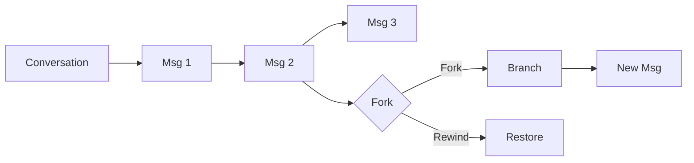
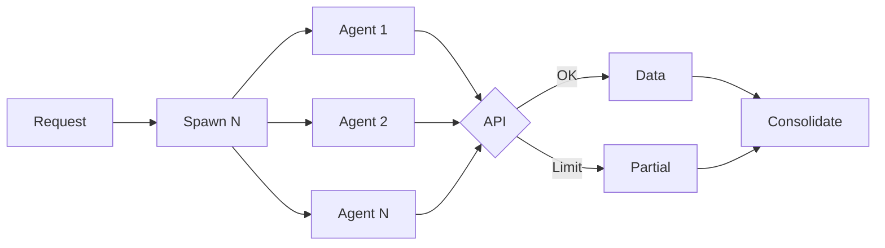

# Claude Code Features

This document covers key Claude Code features that enhance development workflows, including installation, conversation management, parallel processing, and code navigation.

---

## Getting Started with Cursor

The fastest way to start using Claude Code is through the Cursor IDE. No deployment, no infrastructure—just install and go.

### What is Cursor?

Cursor is an AI-first code editor built on VSCode. It provides native integration with AI models, including Claude, making it the simplest path to AI-assisted development.

### Installation Steps

| Step | Action |
|------|--------|
| 1 | Download Cursor from [cursor.com](https://cursor.com) |
| 2 | Install and open Cursor |
| 3 | Open the Extensions panel (`Cmd+Shift+X` on Mac, `Ctrl+Shift+X` on Windows) |
| 4 | Search for "Claude Code" |
| 5 | Click Install |

That's it. You're ready to use Claude Code.

### First Use

1. Open a project folder in Cursor
2. Open the Claude Code panel (look for the Claude icon in the sidebar)
3. Start a conversation with Claude about your codebase

### Why Cursor?

| Benefit | Description |
|---------|-------------|
| **Zero setup** | No API keys to configure, no servers to deploy |
| **VSCode compatible** | Familiar interface, all your VSCode extensions work |
| **Native AI integration** | Built for AI-first workflows |
| **Instant start** | Download, install, code |

### Alternative: VSCode Extension

If you prefer vanilla VSCode, the Claude Code extension is also available:

1. Open VSCode
2. Extensions panel → Search "Claude Code"
3. Install the extension
4. Configure your Anthropic API key in settings

The Cursor approach is simpler because it handles authentication automatically.

---

## Fork & Rewind

Claude Code provides conversation branching and code rewind capabilities for exploring alternatives or recovering from mistakes.

### Available Actions

| Action | Description |
|--------|-------------|
| **Fork conversation from here** | Branch the conversation at this point, preserving history |
| **Rewind code to here** | Restore codebase to the state at this message |
| **Fork conversation and rewind code** | Both: branch conversation AND restore code state |

### How It Works

### When to Use

| Scenario | Action |
|----------|--------|
| **Explore alternative approach** | Fork conversation from here |
| **Code change was wrong** | Rewind code to here |
| **Try different direction** | Fork conversation and rewind code |
| **Compare implementations** | Fork, implement both, compare |

### Access (VSCode Extension)

In the Claude Code VSCode extension, click the **⟲** (rewind) icon on any message to access these options:

| Icon | Action |
|------|--------|
| ⟲ | Opens Fork/Rewind menu |

The menu appears with three options:
- Fork conversation from here
- Rewind code to here
- Fork conversation and rewind code

---

## Parallel Subagents

For bulk research or multi-domain exploration, spawn multiple background agents simultaneously using the `Task` tool with `run_in_background: true`.

### When to Use

- Bulk research across multiple domains or topics
- Gathering context from external APIs (Fireflies, Jira, etc.)
- Parallel codebase exploration across different areas
- Any task where N independent queries can run simultaneously

### How It Works

1. Identify independent research tasks (e.g., 8 domains to research)
2. Spawn agents in parallel using `Task` with `run_in_background: true`
3. Each agent queries its target (MCP tools, codebase search, etc.)
4. Consolidate results when all agents complete
5. Use `TaskOutput` to retrieve results from completed agents

### Rate Limiting Considerations

- External APIs may throttle parallel requests
- Agents capture partial data before throttling kicks in
- Partial data is often sufficient for context gathering
- Consider batching if rate limits are strict

### Token Cost Tradeoff

| Approach | Tokens | Speed |
|----------|--------|-------|
| **Parallel agents** | Higher (each has context) | Fast |
| **Sequential agent** | Lower (shared context) | Slow |

Best for research/exploration where speed matters more than token cost.

---

## Code References

When Claude references specific files or code locations, use clickable markdown links:

| Reference Type | Format | Example |
|----------------|--------|---------|
| **File** | `[file.ts](path/file.ts)` | [Budget.php](domain/Budget/Models/Budget.php) |
| **Line** | `[file.ts:42](path/file.ts#L42)` | [Budget.php:127](domain/Budget/Models/Budget.php#L127) |
| **Range** | `[file.ts:42-51](path/file.ts#L42-L51)` | [Budget.php:127-145](domain/Budget/Models/Budget.php#L127-L145) |
| **Folder** | `[folder/](path/folder/)` | [domain/Budget/](domain/Budget/) |

---

## Tool Priority

Claude Code uses specialized tools over bash commands for better UX:

| Operation | Use | Avoid |
|-----------|-----|-------|
| **Read files** | `Read` tool | `cat`, `head`, `tail` |
| **Edit files** | `Edit` tool | `sed`, `awk` |
| **Create files** | `Write` tool | `echo` with heredoc |
| **Search files** | `Glob` tool | `find`, `ls` |
| **Search content** | `Grep` tool | `grep`, `rg` |
| **Complex search** | `Task` with Explore agent | Multiple grep calls |

---

## Notes

- Cursor is the fastest path to Claude Code—no deployment required
- Fork/Rewind is useful for exploratory development
- Parallel subagents trade tokens for speed
- Code references make navigation seamless in VSCode
- Last updated: 2026-02-01
