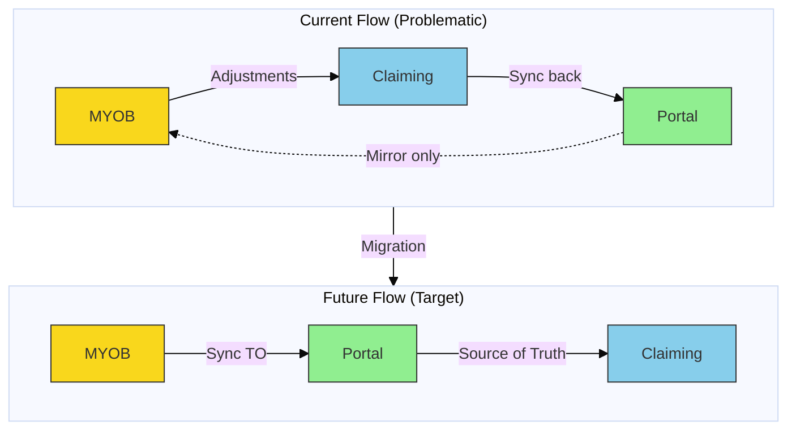
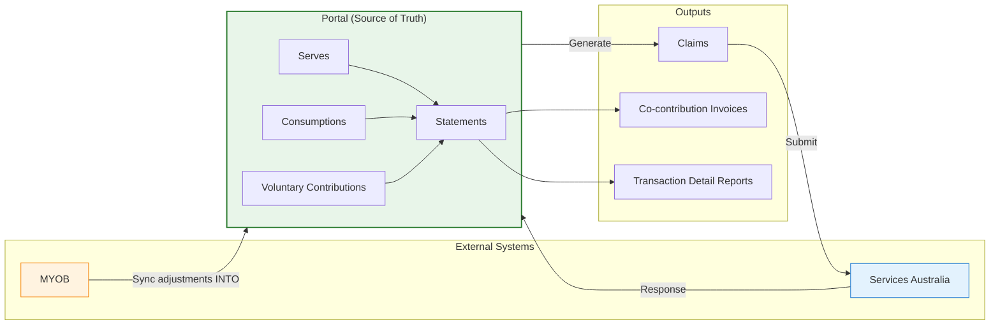

| Status | Date | Lead | Decision |
|--------|------|------|----------|
| **Accepted** | 2026-02-04 | William Whitelaw | Team |

---

## Context

Following [ADR-001](./ADR-001-statement-data-source.md), we identified that our MYOB server (account) codes don't align with budget IDs, making it impossible to reconcile statements at the budget level. This document captures the resolution approach for presenting statement data to recipients.

### The Core Problem

- **Server/Budget Mismatch:** MYOB servers (account codes) don't map 1:1 to Portal budget IDs
- **Reconciliation Gap:** Cannot match statement line items to specific budgets
- **Co-contribution Visibility:** Recipients need to see co-contribution amounts clearly for invoicing purposes

---

## Resolution

### Statement Presentation Approach

**Statements will display transactions grouped by Serve (service delivery record).**

Each statement will show:
1. **All transactions grouped by Serve** — The serve becomes the primary unit of reconciliation
2. **Co-contribution amounts** — Serves grouped by co-contribution category provide clear visibility
3. **Transaction Detail Report alignment** — The sum of consumption items by funding stream should match the total sum of all serves

### Why Serves?

| Aspect | Benefit |
|--------|---------|
| **Data Integrity** | Serves have 1:1 relationship with consumption records |
| **Co-contribution Clarity** | Serves can be grouped by co-contribution category |
| **Invoice Matching** | When invoicing for co-contribution, amounts should align |
| **User Understanding** | Recipients understand services delivered, not accounting codes |

### Expected Reconciliation

```
Transaction Detail Report (sum by funding stream)
    ↓ should equal ↓
Sum of all Serves on Statement
    ↓ can be broken down by ↓
Co-contribution Categories
```

---

## Data Synchronisation Status

### Current State (November 2025 onwards)

| Period | Data Source | Sync Status |
|--------|-------------|-------------|
| November 2025+ | Portal (Prota) | 1:1 sync with statements |
| December 2025+ | Portal (Prota) | 1:1 sync with statements |

**What this means:** Everything on the November statement forward has a corresponding record in Portal — serves, consumptions, and transactions are synchronised.

### Known Limitations

#### MYOB Adjustments

Finance adjustments made directly in MYOB do **not** automatically flow back to Portal:

| Adjustment Type | In MYOB | In Portal | Statement Impact |
|-----------------|---------|-----------|------------------|
| Claim corrections | Yes | No | Shows on statement, not in Portal |
| Voluntary contributions | Yes | No | Cannot be claimed, no Portal visibility |
| Manual journals | Yes | No | Included in statement only |

**Current workaround:** These items need to be either:
1. Claimed for (where applicable)
2. Manually extracted to Portal for visibility

---

## Future State Vision

### Portal as Source of Truth

The long-term intention is for **Portal to be the source of truth for everything**, including voluntary contributions.



### Target Architecture



### Key Changes Required

1. **MYOB → Portal Sync:** Adjustments flow INTO Portal, not around it
2. **Voluntary Contributions:** Captured in Portal, not just MYOB
3. **Single Source:** All statement data originates from Portal
4. **Claiming Source:** Claims generated from Portal, not MYOB

---

## Implementation Notes

### Immediate Actions (Current Statements)

- [x] November statement uses serves-based grouping
- [x] December statement follows same approach
- [ ] Co-contribution categories visible per serve grouping
- [ ] Transaction Detail Report totals align with serve sums

### Future Backlog

- [ ] Build MYOB → Portal adjustment sync
- [ ] Capture voluntary contributions in Portal
- [ ] Migrate claiming source from MYOB to Portal
- [ ] Backfill historical adjustments where needed

---

## Related Documents

- [ADR-001: Statement Data Source](./ADR-001-statement-data-source.md)
- Statements Epic: TP-3291

---

## Footnotes

1. **November/December Parity:** Data on statements from November 2025 onwards has 1:1 synchronisation with Portal (Prota)
2. **Voluntary Contributions:** Currently not observable in Portal as they cannot be claimed — this is a known gap for future resolution
3. **Adjustment Visibility:** MYOB-only adjustments require manual extraction to Portal until the sync is built
