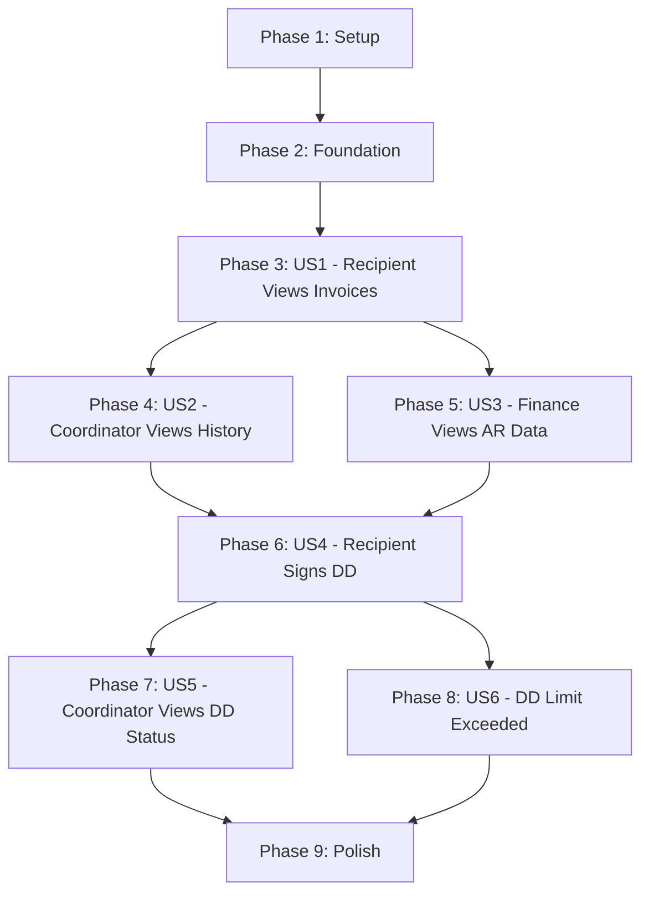

**Spec**: [spec.md](spec.md)
**Plan**: [plan.md](plan.md)
**Created**: 2025-12-23
**Epic**: TP-2329-COL | Budgets And Services Initiative

---

## Phase 1: Setup & Configuration

- [ ] T001 Create feature flag `HAS_COLLECTIONS` in config/features.php
- [ ] T002 Create domain folder structure at domain/Collections/
- [ ] T003 [P] Add VIEW_FINANCIALS permission constant to app/Enums/Permission.php (verify PERM-006)
- [ ] T004 [P] Verify MyOB API-014 can poll HCP-Contribution invoices

---

## Phase 2: Foundation - Data Models

- [ ] T005 Create migration for ar_invoices table in database/migrations/
- [ ] T006 Create migration for invoice_sync_logs table in database/migrations/
- [ ] T007 Create ArInvoice model in domain/Collections/Models/ArInvoice.php
- [ ] T008 [P] Create InvoiceSyncLog model in domain/Collections/Models/InvoiceSyncLog.php
- [ ] T009 Create InvoiceStatus enum in domain/Collections/Enums/InvoiceStatus.php (Current, New, Overdue, Paid)
- [ ] T010 [P] Create InvoiceSyncData DTO in domain/Collections/Data/InvoiceSyncData.php
- [ ] T011 [P] Create InvoiceSummaryData DTO in domain/Collections/Data/InvoiceSummaryData.php

---

## Phase 3: User Story 1 - Recipient Views Outstanding Invoices (P1)

**Goal**: Recipients can view outstanding and paid contribution invoices for their care package
**Test Criteria**: Recipient sees invoice list with status badges, summary cards show correct totals

### Backend Tasks
- [ ] T012 [US1] Create CalculateInvoiceStatusAction in domain/Collections/Actions/CalculateInvoiceStatusAction.php
- [ ] T013 [US1] Create CollectionsPolicy in domain/Collections/Policies/CollectionsPolicy.php (VIEW_FINANCIALS check)
- [ ] T014 [US1] Create InvoiceListResource in app/Http/Resources/Collections/InvoiceListResource.php
- [ ] T015 [P] [US1] Create InvoiceSummaryResource in app/Http/Resources/Collections/InvoiceSummaryResource.php
- [ ] T016 [US1] Create CollectionsController@index in app/Http/Controllers/Collections/CollectionsController.php
- [ ] T017 [US1] Add route GET /packages/{package}/collections in routes/web.php

### Frontend Tasks
- [ ] T018 [US1] Create InvoiceStatusBadge.vue in resources/js/Components/Collections/InvoiceStatusBadge.vue
- [ ] T019 [US1] Create InvoiceSummaryCards.vue in resources/js/Components/Collections/InvoiceSummaryCards.vue
- [ ] T020 [P] [US1] Create InvoiceTable.vue in resources/js/Components/Collections/InvoiceTable.vue
- [ ] T021 [P] [US1] Create EmptyState.vue in resources/js/Components/Collections/EmptyState.vue
- [ ] T022 [US1] Create Collections/Index.vue page in resources/js/Pages/Finances/Collections/Index.vue
- [ ] T023 [US1] Add Collections tab to package UI navigation

---

## Phase 4: User Story 2 - Coordinator Views Client Invoice History (P1)

**Goal**: Coordinators can view client invoice history with summary totals
**Test Criteria**: Coordinator sees same invoice data as recipient, summary shows total outstanding and total paid

### Backend Tasks
- [ ] T024 [US2] Extend CollectionsPolicy to allow coordinators with VIEW_FINANCIALS permission
- [ ] T025 [US2] Add summary aggregation to CollectionsController@index (total outstanding, total paid)

### Frontend Tasks
- [ ] T026 [US2] Ensure InvoiceSummaryCards.vue displays totals (Outstanding, Paid, Current, New)
- [ ] T027 [US2] Add coordinator-specific styling/permissions check to Index.vue

---

## Phase 5: User Story 3 - Finance User Views AR Data (P1)

**Goal**: Finance users can verify synced AR data and see sync status
**Test Criteria**: Finance user sees invoices matching MyOB, can see "last synced" timestamp

### Backend Tasks
- [ ] T028 [US3] Create SyncInvoicesFromMyobAction in domain/Collections/Actions/SyncInvoicesFromMyobAction.php
- [ ] T029 [US3] Create SyncMyobInvoicesJob in domain/Collections/Jobs/SyncMyobInvoicesJob.php
- [ ] T030 [US3] Create InvoicesSynced event in domain/Collections/Events/InvoicesSynced.php
- [ ] T031 [US3] Register hourly job schedule in app/Console/Kernel.php
- [ ] T032 [US3] Create CollectionsController@sync for manual sync trigger (finance only)
- [ ] T033 [US3] Add route POST /packages/{package}/collections/sync in routes/web.php

### Frontend Tasks
- [ ] T034 [US3] Create SyncStatusIndicator.vue in resources/js/Components/Collections/SyncStatusIndicator.vue
- [ ] T035 [US3] Add manual sync button to Index.vue (finance users only)

---

## Phase 6: User Story 4 - Recipient Signs Direct Debit Agreement (P2)

**Goal**: Recipients can set up Direct Debit with bank details and sign agreement
**Test Criteria**: Recipient completes 3-step modal, mandate saved with Pending status

### Backend Tasks
- [ ] T036 [US4] Create migration for direct_debit_mandates table in database/migrations/
- [ ] T037 [US4] Create DirectDebitMandate model in domain/Collections/Models/DirectDebitMandate.php (encrypted casts)
- [ ] T038 [US4] Create DDMandateStatus enum in domain/Collections/Enums/DDMandateStatus.php (Pending, Active, Cancelled)
- [ ] T039 [US4] Create CreateDDMandateData DTO in domain/Collections/Data/CreateDDMandateData.php (BSB validation)
- [ ] T040 [P] [US4] Create BsbLookupService in domain/Collections/Services/BsbLookupService.php
- [ ] T041 [US4] Create CreateDirectDebitMandateAction in domain/Collections/Actions/CreateDirectDebitMandateAction.php
- [ ] T042 [US4] Create DDMandateCreated event in domain/Collections/Events/DDMandateCreated.php
- [ ] T043 [US4] Create DDMandateResource in app/Http/Resources/Collections/DDMandateResource.php
- [ ] T044 [US4] Create DirectDebitController in app/Http/Controllers/Collections/DirectDebitController.php
- [ ] T045 [US4] Add routes GET/POST/DELETE /packages/{package}/direct-debit in routes/web.php
- [ ] T046 [US4] Add DD agreement terms content in config/collections.php or resources/

### Frontend Tasks
- [ ] T047 [US4] Create DDSetupBanner.vue in resources/js/Components/Collections/DirectDebit/DDSetupBanner.vue
- [ ] T048 [US4] Create DDActiveStatus.vue in resources/js/Components/Collections/DirectDebit/DDActiveStatus.vue
- [ ] T049 [US4] Create DDEnrollmentModal.vue in resources/js/Components/Collections/DirectDebit/DDEnrollmentModal.vue
- [ ] T050 [P] [US4] Create DDStep1BankDetails.vue in resources/js/Components/Collections/DirectDebit/DDStep1BankDetails.vue
- [ ] T051 [P] [US4] Create DDStep2MonthlyLimit.vue in resources/js/Components/Collections/DirectDebit/DDStep2MonthlyLimit.vue
- [ ] T052 [P] [US4] Create DDStep3Agreement.vue in resources/js/Components/Collections/DirectDebit/DDStep3Agreement.vue
- [ ] T053 [US4] Create DDSuccessConfirmation.vue in resources/js/Components/Collections/DirectDebit/DDSuccessConfirmation.vue
- [ ] T054 [US4] Integrate DD components into Collections/Index.vue

---

## Phase 7: User Story 5 - Coordinator Views Client DD Status (P2)

**Goal**: Coordinators can see client's Direct Debit mandate status
**Test Criteria**: Coordinator sees DD status (Active/Pending/None) with setup date if applicable

### Backend Tasks
- [ ] T055 [US5] Extend CollectionsController@index to include DD mandate in response
- [ ] T056 [US5] Extend CollectionsPolicy for DD visibility

### Frontend Tasks
- [ ] T057 [US5] Update Index.vue to show DDActiveStatus or DDSetupBanner based on mandate status

---

## Phase 8: User Story 6 - Recipient Invoice Exceeds DD Limit (P2)

**Goal**: When invoice exceeds DD limit, skip debit and notify user to pay manually
**Test Criteria**: Invoice > limit results in notification, no debit occurs

### Backend Tasks
- [ ] T058 [US6] Create ProcessDDLimitExceededAction in domain/Collections/Actions/ProcessDDLimitExceededAction.php
- [ ] T059 [US6] Create DDLimitExceeded notification in app/Notifications/Collections/DDLimitExceededNotification.php
- [ ] T060 [US6] Integrate limit check into DD processing workflow

### Frontend Tasks
- [ ] T061 [US6] Add limit exceeded state display to DDActiveStatus.vue

---

## Phase 9: Polish & Integration

- [ ] T062 Add error handling for MyOB sync failures in SyncInvoicesFromMyobAction
- [ ] T063 [P] Add retry logic for failed syncs in SyncMyobInvoicesJob
- [ ] T064 [P] Performance optimization: eager loading for invoice queries
- [ ] T065 Accessibility audit for Collections pages (WCAG 2.1 AA)
- [ ] T066 Run Laravel Pint for code style: `vendor/bin/pint --dirty`
- [ ] T067 Manual QA: Test all user flows end-to-end

---

## Dependencies

---

## Parallel Execution Summary

Tasks marked `[P]` can run in parallel within their phase:

| Phase | Parallel Tasks |
|-------|----------------|
| Phase 1 | T003, T004 |
| Phase 2 | T008, T010, T011 |
| Phase 3 | T015, T020, T021 |
| Phase 6 | T040, T050, T051, T052 |
| Phase 9 | T063, T064 |

---

## MVP Scope Recommendation

**MVP = Phases 1-5 (Setup + Foundation + US1 + US2 + US3)**

This delivers:
- Invoice visibility for recipients, coordinators, and finance
- MyOB sync (manual + scheduled)
- Summary cards and invoice table

Phase 2 stories (US4-US6) can follow after SAH launch validation.

---

## Task Counts

| Phase | Tasks | User Story |
|-------|-------|------------|
| Phase 1: Setup | 4 | - |
| Phase 2: Foundation | 7 | - |
| Phase 3: US1 | 12 | Recipient Views Invoices |
| Phase 4: US2 | 4 | Coordinator Views History |
| Phase 5: US3 | 8 | Finance Views AR Data |
| Phase 6: US4 | 19 | Recipient Signs DD |
| Phase 7: US5 | 3 | Coordinator Views DD Status |
| Phase 8: US6 | 4 | DD Limit Exceeded |
| Phase 9: Polish | 6 | - |
| **Total** | **67** | |
