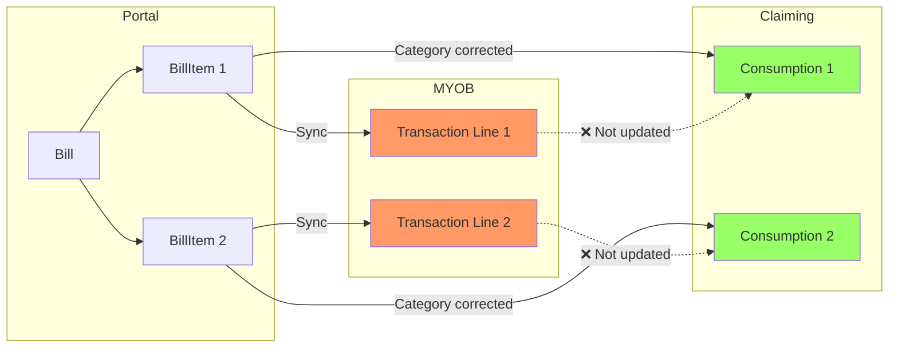
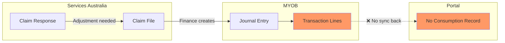
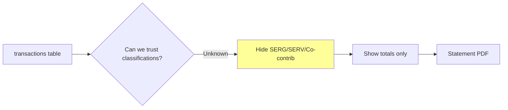
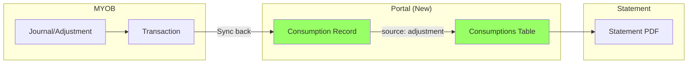
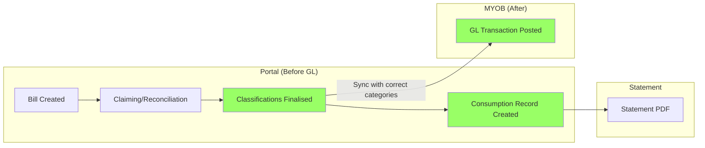
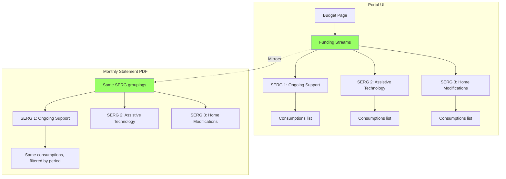
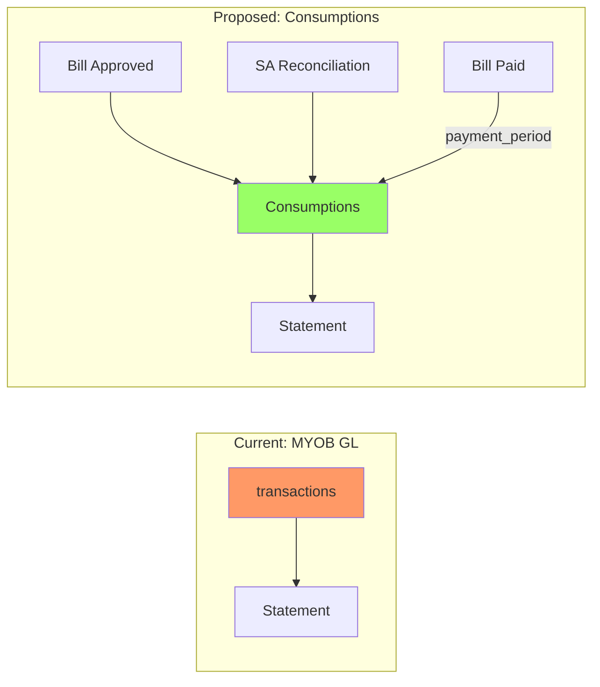
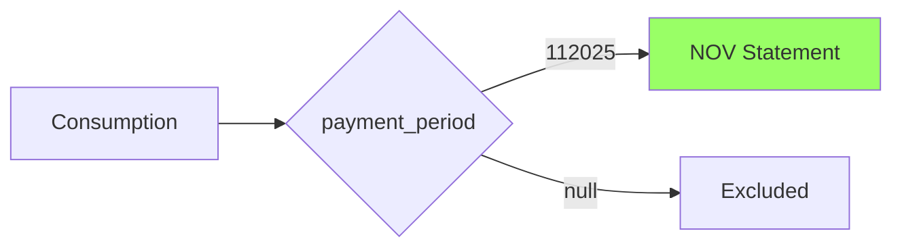

**Status**: Proposed | **Date**: 2026-01-23 | **Lead**: Lachlan Dennis | **Decision**: Will Whitelaw

---

## Current State of Affairs

### Timeline

| Month | Status |
|-------|--------|
| **Oct 2025** | ✅ Statements generated and available in Portal. Hard copies posted. |
| **Nov 2025** | ⏳ Delayed — waiting on SA claim receipt before generation |
| **Dec 2025** | ⏳ Blocked — pending decision on data source (this ADR) |
| **Jan 2026** | 🔴 **Now** — Design ready in code, blocked on "what data goes in" |

### What's Working
- Statement PDF generation infrastructure
- Portal delivery + email distribution
- Hard copy mailing process
- QR code statements ([TP-706](https://trilogycare.atlassian.net/browse/TP-706) in progress)

### What's Blocked
- **Nov/Dec/Jan statements** — Can't generate until data source decision made
- **Care Coordinator statements** — Hidden ([TP-3923](https://trilogycare.atlassian.net/browse/TP-3923)) due to incorrect fee calculations
- **SERG/SERV classifications** — Unreliable from GL data, recommended to hide

### Key Blocker (Jan 12-13, 2026)

> "What are we putting in the statements... for NOV statement how are we filtering down to the funding consumptions" — Lachlan Dennis

**Translation**: Code is ready, but we need to decide:
1. Data source: GL transactions or Portal consumptions?
2. Period filter: How do we determine which items belong to which statement month?

**This ADR answers both questions.**

### Related Tickets

| Ticket | Summary | Status |
|--------|---------|--------|
| [TP-1907](https://trilogycare.atlassian.net/browse/TP-1907) | Digital Statements Epic | In Progress |
| [TP-3923](https://trilogycare.atlassian.net/browse/TP-3923) | Hide CC Statements (fees wrong) | Peer Review |
| [TP-3836](https://trilogycare.atlassian.net/browse/TP-3836) | 2026 recipient design uplift | Backlog |
| [TP-706](https://trilogycare.atlassian.net/browse/TP-706) | QR Code Statements | In Progress |

---

# Part 1: Business Decision

## The Problem

### 1. Bill → Transaction Sync (1:1 but categories don't update)



**The sync problem**: When a Bill is created, each BillItem syncs 1:1 to a MYOB Transaction line. But when we correct the category during claiming (e.g., change SERG/co-contribution), **the MYOB transaction line is NOT updated**. The correction only exists in the Portal consumption record.

**Result**: Statement pulls from MYOB transactions → shows **original (wrong)** categories.

### 2. Finance Adjustments (MYOB-only, no Portal record)



**The adjustments problem**: Finance team creates journals/adjustments in MYOB based on:
- SA claim file responses (corrections, rejections)
- Manual period-end adjustments
- Other provider claims

These create MYOB transactions 1:1, but **never flow back to Portal**. Portal has no record of these adjustments.

**Result**:
- Statement (from MYOB) includes adjustments
- Portal budget/consumption views don't include them
- Can't reconcile Portal to Statement

### Summary

| Issue | Impact |
|-------|--------|
| **Bill sync doesn't update categories** | MYOB transactions have original values; Portal consumptions have corrected values |
| **Finance adjustments MYOB-only** | Journals created from claim file don't create Portal consumption records |
| **Government mismatch** | Statements don't match what SA has on record |

---

## Options

### Option A: Keep Transactions Table (Hide Classifications)

Continue using `transactions` table but **hide SERG/SERV/co-contribution breakdowns** on statements.

**Approach**:
- Keep current data source (`transactions` table)
- Hide funding stream classifications (SERG, SERV, co-contribution labels)
- Show only total amounts per line item
- Accept that we can't verify if bulk reconciliation correctly updated transaction categories

**Why this might work**:
- During bulk claim reconciliation, if SERG or SERV was changed, the funding stream *may* have been updated in transactions
- But we **can't easily verify** this happened correctly
- Safest approach: hide the classification data we're not confident in



| Pros | Cons |
|------|------|
| ✅ No migration needed | ❌ Can't show funding stream breakdown |
| ✅ Adjustments already in MYOB are included | ❌ Recipients see less detail |
| ✅ Quick to implement | ❌ Doesn't solve underlying data integrity issue |
| ✅ Finance workflow unchanged | ❌ Portal and Statement may still diverge |

---

### Option B: Consumptions Table + Sync Adjustments INTO Portal

Use `budget_plan_item_funding_consumptions` as data source, and **create consumption records for MYOB adjustments** so Portal is complete.

**Approach**:
- Switch to consumptions table for accurate SA-reconciled categories
- MYOB adjustments (journals from claim file) get synced INTO Portal as consumption records
- Add `source` field to track where consumption came from (bill_item, adjustment, etc.)
- Finance workflow stays similar but adjustments flow back to Portal



| Pros | Cons |
|------|------|
| ✅ Accurate funding stream breakdown | ❌ Need to build adjustment sync |
| ✅ Matches government records 1:1 | ❌ Schema change (add `source` field) |
| ✅ Existing MYOB adjustments can be captured | ❌ Backfill existing adjustments |
| ✅ Finance workflow mostly unchanged | ❌ Two-way sync complexity |
| ✅ Portal becomes complete source of truth | |

**New field on consumptions**:
```
source: 'bill_item' | 'myob_adjustment' | 'claim_correction' | 'manual'
```

---

### Option C: Get Classifications Right BEFORE Posting to GL

Use `budget_plan_item_funding_consumptions` as data source, and **ensure classifications are correct before invoice is posted to MYOB**.

**Key constraint**: Can't update GL transaction lines after posting — would require reversing entries. So we must get it right **before** the GL is recorded.

**Approach**:
- Claiming/reconciliation happens BEFORE bill is synced to MYOB
- Classifications are finalised in Portal first
- Only then does bill sync to MYOB with correct categories
- No reversals needed because GL is recorded correctly from the start



| Pros | Cons |
|------|------|
| ✅ GL is correct from the start | ❌ Requires process change (claim before post) |
| ✅ No reversal entries needed | ❌ Historical data still wrong |
| ✅ Both tables accurate going forward | ❌ May delay bill posting |
| ✅ Finance gets clean data | ❌ Need to handle timing of claims |
| ✅ Future-proof | |

**Process change required**: Currently bills may be posted to MYOB before claiming is complete. This option requires claiming/reconciliation to happen first.

---

## Recommendation

| Timeframe | Option | Rationale |
|-----------|--------|-----------|
| **Now** | **Option A** | Unblock Nov/Dec/Jan statements immediately |
| **Q1 2026** | **Option B** | Build adjustment sync, add source field |
| **Q2 2026** | **Option C** | Full two-way sync for long-term integrity |

### Why This Phased Approach

1. **Option A now**: Ship statements with totals only, hide unreliable classifications
2. **Option B next**: Consumptions become source of truth, adjustments sync back to Portal
3. **Option C later**: Full integrity where transactions and consumptions always match

---

## Statement Period (Both Options)

**Current**: MYOB `post_period` with 6-month offset calculation

**Proposed**: `payment_period` from daily payrun paid date

## Team Impact

| Team | Option A | Option B |
|------|----------|----------|
| **Finance** | No change | Must record adjustments in Portal |
| **Care Coordination** | No change | No change |
| **Recipients** | Less detail (totals only) | Full breakdown, matches Portal |

## Edge Cases

- **ATHM-only clients**: Generate statements, may be sparse
- **2026 requirements** (TP-3836): Include committed AT-HM funds + care management hours

## Proposed Statement Design

### Principle: Statement = Portal Funding Streams View (for a period)

The statement should be a **point-in-time snapshot** of what the recipient sees in Portal's funding streams UI. Same data, same groupings, same totals.



### What This Means

| Aspect | Portal Budget View | Statement PDF |
|--------|-------------------|---------------|
| **Data source** | `budget_plan_item_funding_consumptions` | Same |
| **Grouping** | By Funding Stream (SERG) | Same |
| **Line items** | All consumptions | Filtered by `payment_period` |
| **Totals** | Running totals | Period totals + running balance |

### Benefits of Mirroring

1. **Consistency**: Recipient sees same structure in Portal and on paper
2. **Trust**: "My statement matches what I see online"
3. **Support**: Care coordinators can reference Portal when explaining statements
4. **Single source**: No divergence between views

### Digital Statement as Portal Feature

Future consideration: Instead of just PDF generation, offer a **digital statement view** in Portal:

```
/packages/{package}/statements/{period}
```

This view would:
- Show the same data as the PDF
- Allow drill-down into line items
- Link directly to related bills/services
- Be the "live" version of the PDF snapshot

## Interim: Hide Classifications

Until implemented, hide SERG/SERV labels on statements (categories unreliable from GL data).

## Open Questions

1. Cutover date?
2. Regenerate historical statements?
3. Finance workflow for external adjustments?

---

# Part 2: Technical Implementation

## Flow Diagrams





## Key Changes

### Schema

```php
$table->string('payment_period', 6)->nullable()->index();
```

### Query Change

```php
// Current
TransactionRepository::getStatementTransactions($myob_sub_account, $postPeriod);

// Proposed
BudgetPlanItemFundingConsumption::query()
    ->where('package_id', $package->id)
    ->where('payment_period', $statementMonth)
    ->whereNull('deleted_at')
    ->get();
```

### Event Handler

```php
public function onBillMarkedAsPaidEvent(BillMarkedAsPaidEvent $event): void
{
    DB::table('budget_plan_item_funding_consumptions')
        ->where('bill_item_id', $event->billItemId)
        ->update(['payment_period' => $event->paymentPeriod]);
}
```

## Files to Change

| File | Change |
|------|--------|
| `GenerateStatementJob.php` | Query consumptions instead of transactions |
| `FundingConsumptionProjector.php` | Handle `BillMarkedAsPaidEvent` |
| `BudgetPlanItemFundingConsumption.php` | Add `payment_period` to fillable |
| `package-monthly-statement.blade.php` | Update template for consumption data |

## Migration Strategy

1. Add `payment_period` column + backfill
2. Update event handlers
3. Build new generation logic alongside existing
4. Validate totals match
5. Switch over

## Open Technical Questions

1. Backfill strategy for `payment_period`?
2. Statement trigger: Manual / Claim-based / Period close / Scheduled?
3. Balance continuity during transition?
