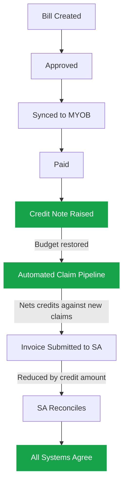

**Epic Code**: FRR | **Created**: 2026-02-11

---

## Where This Came From

This problem has been highlighted through numerous direct messages to Matthew, Rudy, and Tim. It is a systemic gap in Portal's billing architecture that is creating real operational friction for the finance team and blocking client service delivery.

---

## The Problem (Two Parts)

### Part 1: We Cannot Process Refunds or Partial Refunds on Paid Bills

Once a bill reaches "Paid" status in Portal, it is final. There is no mechanism to issue a full or partial refund against that bill.

The only reversal that exists is unapproving a bill item, but that is only possible *before* payment is made. After a bill is paid and synced to MYOB, Portal treats it as a closed, immutable record.

This means when the finance team processes a partial refund directly in MYOB (e.g., reversing incorrectly applied care coordination fees), Portal has no way to know about it or record it.

### Part 2: Even If a Refund Happens Externally, the Freed-Up Funds Don't Flow Back to the Client's Available Budget

When a bill is approved in Portal, the funding is consumed at that moment — not when payment is made. The system deducts the approved amount from the client's available funding balance and creates a consumption record against their budget. There is no reverse operation.

So even when MYOB shows money has been refunded, Portal still considers those funds as "spent."

This creates a mismatch: **MYOB says the client has available funds, but Portal says they don't**, blocking new bills from being processed because budget checks fail.

### Why the Existing SA Reconciliation Doesn't Fix This

The only way this currently self-corrects is through the Services Australia reconciliation cycle, where SA claim data is compared against Portal's consumption records and adjustments are made. But this process:

- Is not designed for internal refund scenarios
- Operates on Services Australia's timeline, not ours
- Only adjusts amounts when SA sends back claim data — it has no knowledge of MYOB refunds

There is also **no API exposed by Services Australia** that would allow us to directly adjust their used funding amounts. We cannot tell SA "we refunded $20."

**In short:** Portal's billing is a one-way street — approve, consume funding, pay, done. There is no return path. The system was built without refund, credit note, or spend-reversal workflows. Any refund processed outside Portal (in MYOB) creates a data mismatch that cannot be resolved within Portal today.

---

## What This Means Day-to-Day

- **Finance processes refunds in MYOB that Portal never sees** — the two systems drift apart with every refund
- **Client budgets show less available funding than they actually have** — money has been freed up but Portal doesn't know
- **New bills get blocked** — budget checks fail against stale consumed amounts, even though the client has funds
- **Manual workarounds for every refund** — staff have to track adjustments outside the system and communicate them verbally
- **Services Australia records don't reflect internal refunds** — we continue to over-report usage until the next reconciliation cycle catches up (if it does at all)

---

## Proposed Solution: Credit Notes + Automated Claim Netting

Since we cannot tell Services Australia about refunds directly, we solve this in two steps: record the refund internally (freeing up budget immediately), then **net the refund against the next SA claim** so all three systems naturally come back into alignment.

**The key idea:** Instead of trying to reverse a past claim with SA, we simply claim less on the next cycle. If there's a $20 refund outstanding and the next claim would be $100, we submit $80 to SA. SA reconciles at $80, Portal already accounted for the $20 credit — everyone agrees.

### Today's Flow (One-Way)

### Proposed Flow (With Refund Path)

---

## Worked Example: $20 Partial Refund

**Scenario:** Care coordination fee incorrectly applied, finance refunds $20 in MYOB

| # | What Happens | Portal | MYOB | Services Australia |
|---|---|---|---|---|
| 1 | Original bill for $100 approved, synced, paid | $100 consumed | $100 paid | $100 claimed |
| 2 | Finance discovers $20 CC fee was wrong, processes refund in MYOB | Still $100 consumed | $20 refunded | Still $100 claimed |
| 3 | **NEW:** Finance raises credit note in Portal for $20 against the bill | +$20 restored. Net: $80 consumed | $20 refunded | Still $100 claimed |
| 4 | Client's budget is immediately unblocked — new bills can be approved | Budget available again | Normal | No change yet |
| 5 | **NEW:** Next claim cycle. New services = $100. System deducts $20 credit. | $100 new consumption | Normal | **$80 claimed** ($100 - $20 offset) |
| 6 | SA reconciles the claim at $80. Credit marked as applied. | Reconciled | Reconciled | Reconciled |

> **Net effect:** SA paid $100 originally, we claimed $80 on the next cycle. Over the two cycles SA has paid $180 for $180 worth of actual services. All systems balanced.

---

## What We're Building

### Pillar 1: Credit Note & Refund System

**Purpose:** Give the finance team a way to record refunds inside Portal so that client budgets are immediately corrected.

- **Automatic debit note creation** — Portal will automatically detect refunds/credit notes processed in MYOB and create corresponding debit notes in Portal, validated against MYOB data. This removes the manual step and ensures Portal and MYOB stay in sync without relying on finance to remember to raise a credit note separately.
- **Credit notes** can be raised against any paid bill, for full or partial amounts, against specific bill items
- **Budget is restored immediately** — the client's available funding increases the moment a credit note is approved
- **MYOB link required** — a credit note in Portal must reference the corresponding MYOB refund, keeping the two systems tied together
- **Credits tracked per client per funding stream** — the system knows exactly how much is outstanding and where it needs to be applied
- **Full audit trail** — who raised it, who approved it, why, when, and which claim it was eventually netted against

### Pillar 2: Automated SA Claim Pipeline (With Netting)

**Purpose:** Automate the process of building and submitting claims to Services Australia from Portal's consumption records, with refund credits automatically deducted before submission.

- **Consumption records automatically become SA invoice items** — no more manual CSV assembly
- **Outstanding credits are netted** — before a claim is submitted, any pending credits for that client/funding stream are deducted from the claim amount
- **Review before submit** — a review screen shows the claim with all adjustments clearly visible before it goes to SA
- **Reconciliation works as normal** — when SA confirms the claim at the reduced amount, Portal's existing reconciliation process matches everything up
- **Credit tracking** — each credit is marked as "applied" with a reference to the claim it was netted against

---

## Process Changes Everyone Needs to Know

### Finance: Raising a Credit Note

1. Identify that a refund is needed (incorrect charge, service not delivered, partial overcharge)
2. Process the refund in MYOB as you do today
3. **NEW:** Open the original bill in Portal and raise a credit note — specify the amount, the bill item(s) affected, and the reason
4. **NEW:** Enter the MYOB refund reference so the two systems are linked
5. Credit note goes through approval (may require a second approver for large amounts)
6. Once approved, the client's budget is immediately updated — no waiting

### Finance: Claim Submission (New Automated Process)

1. The system automatically assembles invoice items from approved consumption records for the claim period
2. Any outstanding credits for each client/funding stream are automatically deducted from the claim amounts
3. A review screen shows the full claim with adjustments clearly flagged (e.g., "Service: $100, Credit Applied: -$20, Claiming: $80")
4. Finance reviews and approves the claim for submission
5. Claim is submitted to Services Australia with the net amounts
6. Once SA reconciles, credits are marked as fully applied

### Care Managers / Operations: What Changes for You

- **Client budgets become accurate after refunds** — no more seeing "insufficient funds" when the client actually has money available
- **Bills stop getting blocked unnecessarily** — when a refund restores budget, new bills can be approved immediately
- **No new process for you** — the refund workflow is handled by finance, and the claiming pipeline is automated. You just see correct budgets.

---

## Phased Delivery

### Phase 1: Credit Notes

Build the credit note system in Portal. Finance can record refunds, budgets are restored immediately. Credits are tracked and ready for the claim pipeline.

**Immediate value:** Budgets are unblocked. Finance has a formal process instead of workarounds. Audit trail exists.

*Can be delivered independently — credits are carried and manually tracked for SA claims until Phase 2 is ready.*

### Phase 2: Automated Claim Pipeline

Build the consumption-to-invoice automation with netting built in from day one. Replaces the manual claim process.

**Completes the loop:** Portal, MYOB, and Services Australia all stay in sync automatically. No manual tracking of credits against claims.

*Builds on Phase 1 — the credit records created in Phase 1 are what the netting logic consumes.*

---

## Open Questions

| Question | Options | Who Decides |
|---|---|---|
| Should credit notes require a second approver? | Single approval (faster) vs dual approval (safer for large amounts) | Finance / Ops |
| Should we allow credit notes on any paid bill or only within a time window? | Any time vs within 90 days vs current financial year only | Finance |
| How should partial credits be allocated across funding streams? | Finance chooses the stream vs proportional split vs reverse priority order | Finance / Dev |
| Should the claim pipeline auto-submit or require review before each submission? | Fully automated vs review-then-submit vs auto with exception review | Finance / Ops |
| What if credits exceed the next claim amount? | Carry forward remainder to subsequent claims vs cap at zero per claim | Finance |

---

## Risks & Mitigations

| Risk | Impact | Mitigation |
|---|---|---|
| SA rejects a claim with netted amounts | Credit doesn't get applied, mismatch persists | Credit rolls back to "pending" automatically and is re-applied on the next claim |
| Credit raised for wrong amount or wrong bill | Budget incorrectly adjusted | Approval workflow with mandatory reason codes. Credits can be voided before claim submission. |
| Other providers claimed the same funding via SA | We can't net against another provider's claim | System only nets against Trilogy Care's own claims. Other-provider scenarios flagged for manual handling. |
| Credit note raised in Portal but refund not done in MYOB | Portal and MYOB out of sync | Workflow requires MYOB refund reference before credit note can be approved |
| Large credit exceeds multiple claim cycles | Credit takes a long time to fully reconcile with SA | Dashboard visibility of outstanding credits with ageing. Escalation for credits not applied within X cycles. |

---

## Owner & Stakeholders

| Role | Person |
|------|--------|
| **R** | TBD (PO), TBD (BA), TBD (Dev) |
| **A** | TBD |
| **C** | Finance Team, Operations, Matthew, Rudy |
| **I** | Care Managers, Claiming Team |

---

## Assumptions, Dependencies & Risks

**Assumptions:**
- MYOB exposes sufficient data (credit notes / debit notes) via API for Portal to detect and validate refunds automatically
- Services Australia will accept invoices with reduced amounts (netting) without rejection
- The existing event sourcing architecture can support negative consumption adjustments without rework
- Finance team will adopt the new Portal workflow for credit notes alongside their existing MYOB process

**Dependencies:**
- MYOB API capability to read credit/debit notes programmatically
- SAH Claims Process (SCP / TP-900) — the automated claim pipeline in Phase 2 is related to or extends SCP
- Existing SA reconciliation system (`ReconcileServicesAustraliaFundings`) must remain stable
- Bill approval and funding consumption event sourcing (`BillAggregateRoot`, `FundingConsumptionProjector`) as the foundation for reversal events

**Risks:**
- MYOB API limitations — may not expose credit notes in a structured way (HIGH impact, MEDIUM probability) → Early API investigation spike
- SA claim rejection with netted amounts (MEDIUM impact, LOW probability) → Credit rolls back to pending automatically
- Data integrity during migration — existing untracked refunds need a one-time reconciliation (MEDIUM impact, MEDIUM probability) → Migration script with finance review

---

## Success Metrics

- Zero manual workarounds for refund tracking (credit notes handled in Portal)
- Client budget accuracy within 24 hours of MYOB refund (Phase 1)
- 100% of credits automatically netted against SA claims (Phase 2)
- Reduction in blocked bills due to stale budget data
- Full audit trail for every refund from MYOB through to SA reconciliation

---

## Estimated Effort

**L (Large) — 4-6 sprints across two phases**

- Phase 1: Credit Note & Refund System — 2-3 sprints
  - Sprint 1: Credit note model, event sourcing, funding reversal logic
  - Sprint 2: MYOB debit note detection and auto-creation
  - Sprint 3: UI, approval workflow, audit trail, testing
- Phase 2: Automated SA Claim Pipeline with Netting — 2-3 sprints
  - Sprint 4: Consumption-to-invoice-item pipeline
  - Sprint 5: Netting logic, credit application, review UI
  - Sprint 6: End-to-end testing, reconciliation validation, rollout

---

## Decision

- [ ] **Approved** — Proceed to specification
- [ ] **Needs More Information**
- [ ] **Declined**

---

## Next Steps (If Approved)

1. Investigate MYOB API for credit/debit note data availability
2. Validate SA invoice netting approach with a test claim in sandbox
3. `/speckit.specify` — Create detailed technical specification
4. Align with SAH Claims Process (SCP) team on shared pipeline work
