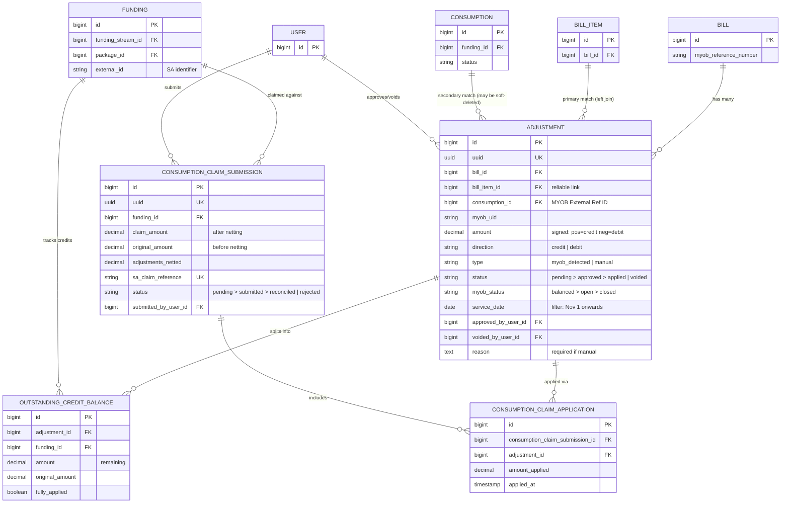

**Epic**: FRR | **Source**: [data-model.md](./data-model.md) (full field details)

> **Updated 2026-02-12**: Reflects MYOB Adjustments Discovery meeting — matching via consumption_id/bill_item_id, credit+debit directions, webhook sync, MYOB status lifecycle.

---

## Entity-Relationship Diagram



---

## Relationships

| Relationship | Type | FK Column | On Delete | Notes |
|---|---|---|---|---|
| Bill → Adjustment | 1:N | `adjustments.bill_id` | RESTRICT | Original bill being adjusted |
| BillItem → Adjustment | 1:N | `adjustments.bill_item_id` | SET NULL | **Primary match** — debit note line item left-joined to original bill item |
| Consumption → Adjustment | 1:N | `adjustments.consumption_id` | SET NULL | **Secondary match** — MYOB External Reference ID (may be soft-deleted post-split) |
| User → Adjustment (approve) | 1:N | `adjustments.approved_by_user_id` | SET NULL | Finance approver |
| User → Adjustment (void) | 1:N | `adjustments.voided_by_user_id` | SET NULL | Finance voider |
| Adjustment → OutstandingCreditBalance | 1:N | `outstanding_credit_balances.adjustment_id` | CASCADE | Per-funding credit split (debit adjustments only) |
| Funding → OutstandingCreditBalance | 1:N | `outstanding_credit_balances.funding_id` | CASCADE | Package-level funding |
| Funding → ConsumptionClaimSubmission | 1:N | `consumption_claim_submissions.funding_id` | RESTRICT | Claimed funding allocation |
| User → ConsumptionClaimSubmission | 1:N | `consumption_claim_submissions.submitted_by_user_id` | SET NULL | Submitter |
| ConsumptionClaimSubmission → ConsumptionClaimApplication | 1:N | `consumption_claim_applications.consumption_claim_submission_id` | CASCADE | Netting line items |
| Adjustment → ConsumptionClaimApplication | 1:N | `consumption_claim_applications.adjustment_id` | CASCADE | Partial application |

---

## Key Indexes

| Table | Columns | Purpose |
|---|---|---|
| `adjustments` | `status` | Filter pending/approved in workflow |
| `adjustments` | `direction` | Filter credits vs debits |
| `adjustments` | `type` | Filter MYOB-detected vs manual |
| `adjustments` | `myob_uid` | MYOB API cross-reference |
| `adjustments` | `myob_status` | Filter by MYOB lifecycle stage |
| `adjustments` | `consumption_id` | Match MYOB External Reference ID |
| `adjustments` | `bill_item_id` | Fallback matching key |
| `adjustments` | `service_date` | SAH date boundary filtering (Nov 1+) |
| `outstanding_credit_balances` | `fully_applied` | Find unapplied credits for netting |
| `consumption_claim_submissions` | `status` | Filter claims by workflow state |

---

## State Machines

### Adjustment Status

```
pending ──(approve)──→ approved ──(apply)──→ applied
   │                      │
   └──(void)──→ voided ←──┘
```

- `pending`: Detected from MYOB (at `closed` status) or manually created, awaiting Finance approval
- `approved`: Budget restored (for debits), credit balance created, available for SA netting
- `applied`: Fully netted against SA claim(s), lifecycle complete
- `voided`: Cancelled — budget reverted if was approved

### MYOB Status Lifecycle (on Adjustment)

```
balanced (draft) ──→ open (payment run batched) ──→ closed (paid)
                                                       ↑
                                                  Portal syncs here only
```

### ConsumptionClaimSubmission Status

```
pending ──(submit)──→ submitted ──(reconcile)──→ reconciled
                          │
                          └──(reject)──→ rejected
```

- `pending`: Batch assembled with netting, awaiting Finance review
- `submitted`: Sent to SA API (claim line amounts modified, not separate submissions)
- `reconciled`: SA confirmed claim at netted amount
- `rejected`: SA rejected — adjustments rolled back to `approved`

---

## Migrations

- [ ] `create_adjustments_table` — Core adjustment entity with bill/bill_item/consumption FKs, direction, myob_status, service_date
- [ ] `create_outstanding_credit_balances_table` — Per-funding credit tracking with remaining amount
- [ ] `create_consumption_claim_submissions_table` — SA claim batches with netting totals
- [ ] `create_consumption_claim_applications_table` — Join table linking adjustments to claims
- [ ] No existing table modifications required
