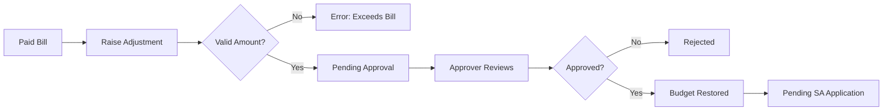
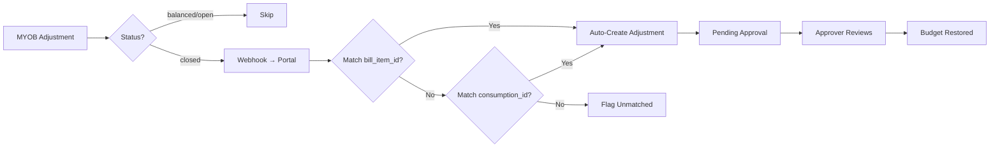
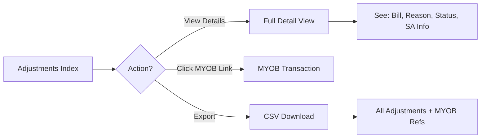
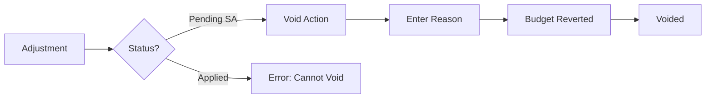
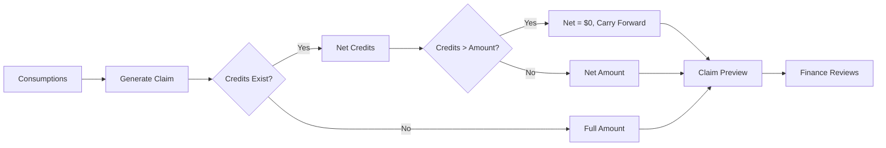

> **[View Mockup](/mockups/funding-reconciliation/index.html)**{.mockup-link}

**Feature Branch**: `FRR-funding-reconciliation-refunds`
**Created**: 2026-02-11
**Status**: Draft
**Epic**: FRR | Budgets And Finance Initiative
**Priority**: P0 - Critical (Resolves $500K overclaim issue)

---

## Overview

This specification covers two interdependent phases that together solve Portal's inability to process refunds and reconcile funding accurately across Portal, MYOB, and Services Australia.

**Phase 1**: Adjustments & Refund System — immediate budget restoration
**Phase 2**: Automated SA Claim Pipeline with Netting — consumption-based claims with credit netting

### Phase 2 Architecture Clarification

**Key Flow**: All consumption records live in Portal. Once a bill line item is CLEANSED (validated and corrected by AI or Finance), the system:

1. **Validates** the consumption against Services Australia API (pre-claim validation)
2. **Nets** any outstanding credits for that client/funding stream
3. **Claims** directly from Portal to SA API (consumption-by-consumption or batched)
4. **Reconciles** SA API response and updates consumption + credit status

This is a **consumption-driven, real-time claim flow**, not a periodic batch assembly. Credits are applied at the consumption level, ensuring immediate reconciliation.

---

## Clarifications

### Session 2026-02-11 (Updated 2026-02-12 per MYOB Discovery Meeting)

- **Q: Terminology - Should we use "credit notes" or "debit notes" or both?**
  → **A: "Adjustment"** - Single canonical term covering both MYOB-detected refunds and Portal-initiated credits. Both **credit** (same direction as bill) and **debit** (reversal/opposite) directions supported with signed amounts.

- **Q: MYOB sync mechanism - Polling, webhooks, or hybrid?**
  → **A: Webhook-based sync** *(updated from meeting 2026-02-12)* — MYOB sends webhook notifications on adjustment status changes. Only process at `closed` status (lifecycle: balanced → open → closed). Initial historical data via bulk import. Do NOT extend existing `SyncMyobTransactionsJob`.

- **Q: Unmatched MYOB adjustments - How to handle and notify Finance?**
  → **A: Log unmatched to admin dashboard** *(updated from meeting 2026-02-12)* — Debit notes have no clean direct link at the header level. Matching is via bill_item_id (left join to bill_items table) as primary path, with consumption_id (External Reference ID) as secondary. Unmatched adjustments flagged for manual Finance review.

- **Q: Adjustment sync latency SLA - How fast must adjustments appear in Portal?**
  → **A: <2 seconds per webhook event (P95)** *(updated from meeting 2026-02-12)* — Webhook-driven means near real-time. Only `closed` status adjustments are processed.

- **Q: Adjustment matching algorithm - How to match MYOB adjustments to Portal bills?**
  → **A: Bill Item ID (primary) + Consumption ID (secondary)** *(updated from meeting 2026-02-12)* — Each debit note line item has a Bill Item ID → left join to Portal `bill_items` table to create the association. External Reference ID maps to Portal `consumption_id` (secondary, may be soft-deleted after claim splits). Store both for traceability.

---

## User Scenarios & Testing

### PHASE 1: Adjustments & Refund System

---

### User Story 1 - Finance Raises Manual Adjustment for Partial Refund (Priority: P0)

A Finance team member discovers that a care coordination fee was incorrectly charged on a paid bill. They process a $20 refund in MYOB, then raise a matching manual adjustment (debit direction) in Portal to restore the client's budget immediately.

**Why this priority**: Immediate business blocker — clients have locked budgets and cannot receive new services despite having available funds. This is creating operational friction and blocking service delivery.

**Independent Test**: Can be fully tested by Finance raising a manual adjustment against a paid bill and verifying the client's available budget increases immediately.

**Acceptance Scenarios**:

1. **Given** a bill is in "Paid" status in Portal, **When** Finance views the bill details, **Then** they see a "Raise Adjustment" action available
2. **Given** Finance clicks "Raise Adjustment", **When** they select specific bill items, enter a refund amount, and choose direction (credit or debit), **Then** the system validates that the total does not exceed the original bill amount
3. **Given** Finance enters adjustment details (amount, direction, reason, optional MYOB reference), **When** they submit the adjustment, **Then** the adjustment enters "Pending" status
4. **Given** an adjustment is pending, **When** an authorized Finance approver reviews and approves it, **Then** the client's available budget for the affected funding allocation increases by the adjustment amount immediately (for debit adjustments)
5. **Given** an adjustment is approved, **When** Finance views the adjustment, **Then** they see status "Approved" with the amount tracked as an outstanding credit balance

**Flow:**

---

### User Story 2 - Finance Raises Full Refund Adjustment (Priority: P0)

A Finance team member identifies that an entire bill should not have been charged (e.g., service was never delivered). They process a full refund in MYOB and raise a matching full adjustment (debit direction) in Portal.

**Why this priority**: Full refunds are simpler than partial refunds and represent the most common refund scenario. Must be supported from day one.

**Independent Test**: Can be fully tested by Finance raising a full-bill adjustment and verifying all funding allocations are restored proportionally.

**Acceptance Scenarios**:

1. **Given** a paid bill has multiple bill items across different funding allocations, **When** Finance raises a full adjustment, **Then** the system calculates the refund amount per funding allocation proportionally
2. **Given** Finance confirms a full refund, **When** the adjustment is approved, **Then** each affected funding allocation's available budget increases by the corresponding amount
3. **Given** a full adjustment is approved, **When** Care Coordinators view the client's budget, **Then** they see the restored funding available for new bills immediately
4. **Given** a full refund has been processed, **When** Finance views the original bill, **Then** the bill shows "Fully Adjusted" status with a link to the adjustment

---

### User Story 3 - Portal Automatically Detects MYOB Adjustments via Webhook (Priority: P0)

Finance processes a refund in MYOB (as MYOB is the source of truth for payments). Portal automatically receives MYOB adjustment webhooks when the adjustment reaches `closed` status (after payment run) and creates a corresponding adjustment in Portal. Both credit and debit directions are supported. Matching is via bill_item_id (primary, left join to bill_items) and consumption_id (secondary, External Reference ID). This removes the manual step and ensures Portal and MYOB stay in sync.

**Why this priority**: Critical automation that eliminates manual data entry errors and ensures 100% sync between Portal and MYOB. Cannot ship without this — manual entry would create operational burden and sync gaps.

**Independent Test**: Can be fully tested by simulating an MYOB webhook for a closed adjustment and verifying Portal automatically creates a matching adjustment within seconds.

**Acceptance Scenarios**:

1. **Given** Finance processes an adjustment in MYOB and it reaches `closed` status, **When** MYOB sends a webhook notification to Portal, **Then** the system creates a matching adjustment (credit or debit) linked to the bill via bill_item_id
2. **Given** an MYOB adjustment webhook arrives, **When** the system matches bill_item_id to Portal's `bill_items` table via left join, **Then** Portal auto-creates the adjustment with bill_id resolved from the matched bill item
3. **Given** an adjustment is auto-created from MYOB webhook, **When** Finance views the adjustment in Portal, **Then** they see status "Pending" with MYOB UID, direction (credit/debit), myob_status (closed), service date, and bill item link
4. **Given** an MYOB adjustment cannot be matched via bill_item_id or consumption_id, **When** the webhook is processed, **Then** the system logs it as "Unmatched" to the admin dashboard and notifies Finance for manual review
5. **Given** an MYOB adjustment with the same myob_uid has already been imported, **When** a duplicate webhook arrives, **Then** the system skips it (idempotent via myob_uid unique check)
6. **Given** an MYOB adjustment has myob_status = `balanced` or `open`, **When** the webhook arrives, **Then** the system skips it (only process at `closed` status)

**Flow:**

---

### User Story 4 - Finance Views Adjustments Index with MYOB Links (Priority: P1)

A Finance team member needs to see an index of all adjustments (both auto-detected and manually created) with direct links to the corresponding MYOB transactions. This provides full visibility into adjustment history, status, and MYOB reconciliation.

**Why this priority**: Essential operational visibility for Finance team to audit adjustments, verify MYOB sync, and manage adjustment lifecycle including SA application tracking.

**Independent Test**: Can be fully tested by Finance viewing the Adjustments Index and clicking through to MYOB transactions.

**Acceptance Scenarios**:

1. **Given** multiple adjustments exist across different clients and funding streams, **When** Finance views the Adjustments Index, **Then** they see all adjustments with columns: Client, Amount, Funding Stream, Status, MYOB Link, Created Date, SA Status
2. **Given** Finance is viewing the Adjustments Index, **When** they want to see ageing for pending SA application, **Then** adjustments in "Pending SA Application" status are color-coded by age (<30 days green, 30-60 days yellow, >60 days red)
3. **Given** an adjustment is displayed in the index, **When** Finance clicks the MYOB Link, **Then** they are taken directly to the corresponding MYOB transaction (if MYOB deep linking is supported) or see the MYOB transaction ID
4. **Given** Finance clicks an adjustment row, **When** the detail view opens, **Then** they see full details including original bill, refund reason, MYOB reference, approval history, and current SA application status
5. **Given** Finance needs to report on adjustments, **When** they export the index, **Then** they receive a CSV with all adjustment details including MYOB references and ageing metrics

**Flow:**

---

### User Story 5 - Finance Voids Incorrect Adjustment (Priority: P1)

A Finance team member realizes an adjustment was raised in error (wrong amount, wrong bill, wrong funding allocation). They need to void the adjustment before it gets applied to a Services Australia claim.

**Why this priority**: Error correction is essential before credits get netted against SA claims. Must prevent incorrect SA submissions.

**Independent Test**: Can be fully tested by Finance voiding a pending or approved adjustment and verifying the client's budget reverts to the pre-adjustment state.

**Acceptance Scenarios**:

1. **Given** an adjustment has status "Pending" or "Approved", **When** Finance selects "Void Adjustment", **Then** the system prompts for a void reason
2. **Given** Finance confirms the void action, **When** the adjustment is voided, **Then** if it was approved, the client's budget is immediately reverted (available amount decreased, used amount increased) and outstanding credit balances are deleted
3. **Given** an adjustment is voided, **When** Finance views the adjustment, **Then** it shows status "Voided" with timestamp, voiding user, and reason
4. **Given** an adjustment has already been applied to an SA claim (status = "Applied"), **When** Finance attempts to void it, **Then** the system prevents the void action and displays an error message
5. **Given** a voided adjustment exists, **When** the Outstanding Credits Dashboard is viewed, **Then** voided adjustment credits are excluded from the outstanding credits list

**Flow:**

---

### User Story 6 - Care Coordinator Sees Budget Restored After Adjustment (Priority: P2)

A Care Coordinator is managing a client's budget and notices new funding has become available. They can see that an adjustment was applied, restoring funds that were previously consumed.

**Why this priority**: Transparency for Care Coordinators helps them understand budget changes and plan services accurately.

**Independent Test**: Can be fully tested by a Care Coordinator viewing a client's budget history and seeing adjustment transactions clearly labeled.

**Acceptance Scenarios**:

1. **Given** a debit adjustment has been approved for a client, **When** the Care Coordinator views the client's budget summary, **Then** they see the available budget has increased
2. **Given** a Care Coordinator views the budget transaction history, **When** they scroll through recent transactions, **Then** adjustments are displayed as distinct transaction types with labels like "Adjustment Applied: [Reason]"
3. **Given** an adjustment appears in the budget history, **When** the Care Coordinator clicks it, **Then** they see a summary (date, amount, funding allocation affected) without exposing Finance-only details like MYOB references

---

### PHASE 2: Automated SA Claim Pipeline with Netting

---

### User Story 7 - Finance Reviews Auto-Generated SA Claim with Adjustments Netted (Priority: P0)

The system automatically generates a Services Australia claim from approved consumption records. Outstanding adjustment credits for each client are automatically netted by **modifying original claim line amounts** (not separate submissions). Finance reviews the pre-calculated claim before submission to SA. The $36K already claimed was done this way.

**Why this priority**: Core automation that eliminates manual CSV assembly and ensures credits are netted accurately. Critical for SA reconciliation.

**Independent Test**: Can be fully tested by Finance viewing an auto-generated claim that includes both new consumption and netted adjustments, with clear line-item breakdown showing modified amounts.

**Acceptance Scenarios**:

1. **Given** approved consumption records exist for a claim period, **When** Finance initiates claim generation, **Then** the system aggregates all consumption by client and funding allocation
2. **Given** outstanding adjustment credits exist for clients in the claim, **When** the system generates the claim, **Then** original claim line amounts are modified (reduced) by the outstanding credit balance for the relevant funding allocation
3. **Given** a claim has been generated with netted adjustments, **When** Finance views the claim preview, **Then** they see: original amount, adjustments netted, and final claim amount (e.g., "Original: $100, Adjustments Netted: -$20, Claim: $80") plus per-line original vs claimed amounts
4. **Given** Finance is reviewing the claim preview, **When** they expand the netting breakdown, **Then** they see which specific adjustments were applied (adjustment UUIDs, directions, amounts, reasons, bill references)
5. **Given** a client's outstanding credits exceed their new consumption, **When** the claim is generated, **Then** the claim amount is $0 and the remaining credit balance carries forward to the next claim cycle

**Flow:**

---

### User Story 8 - Finance Submits SA Claim and Credits Are Marked Applied (Priority: P0)

After reviewing the auto-generated claim, Finance approves and submits it to Services Australia with modified claim line amounts. The system marks all netted adjustments as "Applied" for audit trail purposes.

**Why this priority**: Completes the adjustment lifecycle and ensures full audit trail for compliance and reconciliation.

**Independent Test**: Can be fully tested by Finance submitting a claim and verifying all netted credits update to "Applied" status with claim reference.

**Acceptance Scenarios**:

1. **Given** Finance has reviewed the claim preview, **When** they click "Submit to Services Australia", **Then** the system sends the claim with modified line amounts to SA via API (line amounts reduced to account for netting)
2. **Given** a claim has been successfully submitted to SA, **When** the submission is confirmed, **Then** all adjustments that were netted update to status "Applied" and ConsumptionClaimApplication records are created
3. **Given** adjustments are marked as applied, **When** Finance views the Outstanding Credits Dashboard, **Then** those credits are removed from the outstanding list (OutstandingCreditBalance.fully_applied = true)
4. **Given** a claim submission to SA fails, **When** the error is detected, **Then** all adjustments remain in "Approved" status and can be re-applied on the next claim attempt
5. **Given** an adjustment was partially applied (credit balance exceeded this claim's consumption), **When** the claim is submitted, **Then** the OutstandingCreditBalance shows remaining amount and the adjustment stays in "Approved" status until fully applied

---

### User Story 9 - Finance Handles SA Claim Rejection and Re-Applies Credits (Priority: P1)

Services Australia rejects a submitted claim due to validation errors unrelated to the credit netting. Finance fixes the underlying issue and regenerates the claim, ensuring the same credits are re-applied.

**Why this priority**: Handles the failure scenario for SA claim submissions. Must ensure credits don't get lost or double-applied.

**Independent Test**: Can be fully tested by simulating an SA claim rejection, fixing the issue, and regenerating the claim with credits intact.

**Acceptance Scenarios**:

1. **Given** an SA claim is rejected, **When** Finance views the rejection details, **Then** they see the rejection reason and a "Regenerate Claim" action
2. **Given** Finance clicks "Regenerate Claim" after fixing the issue, **When** the claim is regenerated, **Then** the same adjustments that were originally netted are re-applied to the new claim
3. **Given** a rejected claim had credits netted, **When** the claim is marked as rejected, **Then** all associated adjustments automatically revert from "Applied" to "Pending SA Application"
4. **Given** Finance regenerates a claim multiple times due to repeated rejections, **When** each regeneration occurs, **Then** the system prevents duplicate credit application and maintains consistency

---

### User Story 10 - Finance Manually Excludes Credit from SA Claim (Priority: P2)

In rare cases, Finance needs to exclude a specific adjustment from being automatically netted in the current claim cycle (e.g., pending external clarification). They manually defer the credit to the next claim cycle.

**Why this priority**: Edge case handling for exceptional scenarios. Not a common workflow but necessary for operational flexibility.

**Independent Test**: Can be fully tested by Finance excluding a credit from the claim preview and verifying it remains in "Pending SA Application" status.

**Acceptance Scenarios**:

1. **Given** Finance is reviewing a claim preview with netted credits, **When** they click "Exclude Credit" on a specific credit line item, **Then** the credit is removed from the current claim calculation
2. **Given** a credit has been excluded from the current claim, **When** Finance views the Outstanding Credits Dashboard, **Then** the excluded credit shows status "Deferred - Next Claim Cycle"
3. **Given** a credit was manually excluded, **When** the next claim cycle is generated, **Then** the excluded credit is automatically included unless manually excluded again
4. **Given** Finance excludes a credit, **When** they submit the claim, **Then** the excluded credit remains in "Pending SA Application" status and is not marked as applied

---

### User Story 11 - Finance Reconciles SA Claim Response (Priority: P1)

Services Australia confirms receipt and acceptance of a submitted claim. Portal reconciles the SA response against the submitted claim amounts, ensuring all netted credits were accepted and consumptions match.

**Why this priority**: Final reconciliation step ensures Portal, MYOB, and SA are all aligned. Critical for data integrity.

**Independent Test**: Can be fully tested by importing an SA claim response and verifying reconciliation results match expected outcomes.

**Acceptance Scenarios**:

1. **Given** SA sends a claim confirmation response, **When** Finance imports the response into Portal, **Then** the system matches each claim line item against the submitted claim
2. **Given** SA's accepted amounts match the submitted netted amounts, **When** reconciliation completes, **Then** the system marks the claim as "Reconciled - Approved"
3. **Given** SA's accepted amounts differ from submitted amounts, **When** reconciliation completes, **Then** the system flags discrepancies and shows a reconciliation report with line-by-line differences
4. **Given** SA confirms a netted claim amount, **When** reconciliation completes, **Then** Portal's consumption records and adjustment records remain consistent with the SA-approved amount
5. **Given** a reconciliation discrepancy is detected, **When** Finance reviews it, **Then** they can manually adjust consumption or raise new credits to resolve the mismatch

---

### User Story 12 - System Automatically Generates Weekly SA Claims (Priority: P2)

Portal automatically generates SA claims on a weekly schedule without manual Finance intervention. Credits are automatically netted, and the claim is queued for Finance review and approval before submission.

**Why this priority**: Full automation reduces manual workload and ensures timely SA claim submissions. Desired end state but not MVP-critical.

**Independent Test**: Can be fully tested by configuring a weekly schedule and verifying claims are auto-generated with credits netted correctly.

**Acceptance Scenarios**:

1. **Given** a weekly claim schedule is configured, **When** the scheduled time is reached, **Then** the system automatically aggregates approved consumption records from the past week
2. **Given** outstanding credits exist for clients in the scheduled claim, **When** the claim is auto-generated, **Then** credits are netted automatically following the same logic as manual claim generation
3. **Given** an auto-generated claim is ready, **When** Finance logs in, **Then** they see a notification "Weekly SA Claim Ready for Review" with a link to the claim preview
4. **Given** Finance reviews and approves the auto-generated claim, **When** they submit it, **Then** the same submission and credit application workflow applies as for manually generated claims
5. **Given** an auto-generated claim has validation errors, **When** the generation fails, **Then** Finance receives an error notification and the claim is saved as "Draft - Requires Attention"

---

### Edge Cases

#### Adjustment Edge Cases

- **What happens when an adjustment amount exceeds the original bill amount?**
  The system validates and prevents adjustments from exceeding the original bill total. Finance must void and re-raise if the amount is incorrect.

- **What happens when a bill has already been partially adjusted?**
  The system tracks cumulative adjustment amounts per bill. New adjustments validate that `sum(existing_adjustments) + new_adjustment ≤ original_bill_amount`.

- **What happens when MYOB webhook delivers an adjustment that can't be matched?**
  The system logs the unmatched adjustment to the admin dashboard and notifies Finance for manual review. Both bill_item_id (primary) and consumption_id (secondary) matching paths are attempted before flagging as unmatched.

- **What happens when consumption_id is soft-deleted after a claim split?**
  The system falls back to bill_item_id matching (left join to bill_items table). bill_item_id is the primary reliable path that survives consumption splits.

- **What happens when Finance raises an adjustment against a bill that was never claimed to SA?**
  The adjustment is created and budget is restored, but it is flagged as "No SA Impact" since there's no SA claim to net against. These credits do not appear in the SA claim netting process.

- **What happens when a client has credits in one funding allocation but new consumption in a different funding allocation?**
  Credits are funding-allocation-specific (tracked via `funding_id`, not `funding_stream_id`). Netting only applies when the client's new consumption is in the same funding allocation as the outstanding credit. Cross-allocation netting is not supported.

#### SA Claim Netting Edge Cases

- **What happens when a client's total outstanding credits exceed multiple claim cycles?**
  The system nets credits progressively across claim cycles until fully applied. The Outstanding Credits Dashboard shows remaining balance and tracks ageing.

- **What happens when SA partially accepts a claim?**
  The reconciliation process detects partial acceptance and flags affected line items. Finance manually reviews and determines if credits need to be re-applied or voided.

- **What happens when another provider (not Trilogy Care) has claimed the same client's funding via SA?**
  The system does not attempt to net Trilogy credits against other providers' claims. These scenarios are flagged as "External Provider Conflict" and require manual Finance intervention.

- **What happens when Finance regenerates a claim after submission but before SA response?**
  The system prevents regeneration of a claim that is in "Submitted - Awaiting Response" status. Finance must wait for SA response or manually mark the claim as "Cancelled" before regenerating.

---

## Requirements

### Functional Requirements - Phase 1: Adjustments

- **FR-001**: System MUST automatically detect MYOB adjustments via webhook notifications when adjustment status reaches `closed` (after payment run). Initial historical data via bulk import with service_date >= 2024-11-01
- **FR-002**: System MUST match MYOB adjustments to Portal bills using bill_item_id (primary — left join debit note line item to bill_items table) and consumption_id (secondary — MYOB External Reference ID, may be soft-deleted after claim splits)
- **FR-003**: System MUST use MYOB UID (`myob_uid`) as unique key to prevent duplicate adjustment creation (idempotent webhook processing)
- **FR-004**: System MUST process webhook events within <2 seconds (P95). Only process adjustments at `closed` MYOB status (skip `balanced` and `open`)
- **FR-005**: System MUST allow Finance users with "Adjustment Management" permission to manually create adjustments for edge cases not auto-detected
- **FR-006**: System MUST require adjustment approval by an authorized Finance approver before budget restoration occurs
- **FR-007**: System MUST restore the client's available budget for the affected funding stream(s) immediately upon adjustment approval
- **FR-008**: System MUST track adjustments with status lifecycle: `pending` → `approved` → `applied` (or `voided` from pending/approved). Both credit and debit directions with signed amounts (positive=credit, negative=debit)
- **FR-009**: System MUST allow Finance to void adjustments that have not yet been applied to an SA claim
- **FR-010**: System MUST revert budget restoration when an adjustment is voided
- **FR-011**: System MUST provide an Outstanding Adjustments Dashboard showing all adjustments in "Pending SA Application" status, grouped by client and funding stream
- **FR-012**: System MUST display adjustments in client budget transaction history with clear labeling (e.g., "Refund Applied: [Reason]")
- **FR-013**: System MUST support both full-bill adjustments and partial adjustments against specific bill items (based on MYOB adjustment line items)
- **FR-014**: System MUST calculate proportional funding stream allocation for full-bill adjustments
- **FR-015**: System MUST log all adjustment actions (auto-created, manually created, approved, voided, applied) with user, timestamp, MYOB reference, and reason for audit trail

### Functional Requirements - Phase 2: SA Claim Pipeline

**IMPORTANT ARCHITECTURE NOTE**: All consumptions are tracked in Portal. Once a bill line item has been CLEANSED (validated and corrected), the system validates the consumption against the Services Australia API, then claims directly from Portal. This creates a real-time, consumption-based claim flow rather than batch assembly.

- **FR-016**: System MUST track all consumption records in Portal with status: "Pending Cleanse", "Cleansed", "SA Validated", "Claimed", "Reconciled"
- **FR-017**: System MUST validate cleansed consumption records against Services Australia API before allowing claims
- **FR-018**: System MUST automatically identify outstanding adjustment credits for each consumption record's client and funding allocation
- **FR-019**: System MUST calculate net claim amounts by deducting applicable outstanding credits from the consumption amount
- **FR-020**: System MUST display claim preview showing: consumption amount, credits applied, and net claim amount
- **FR-021**: System MUST allow Finance to expand claim line items to view detailed breakdown of applied adjustments
- **FR-022**: System MUST handle cases where credits exceed consumption by setting net claim to $0 and carrying forward remaining credit balance
- **FR-023**: System MUST track carried-forward credit balances and apply them to subsequent consumption claims
- **FR-024**: System MUST allow Finance to manually exclude specific credits from being applied to a consumption claim
- **FR-025**: System MUST submit consumption claims to Services Australia API directly from Portal (consumption-by-consumption or in batches)
- **FR-026**: System MUST update adjustment status to "Applied to Consumption [Consumption ID]" upon successful SA claim submission
- **FR-027**: System MUST revert adjustments to "Pending SA Application" if consumption claim submission fails or is rejected by SA
- **FR-028**: System MUST receive SA API responses for each consumption claim and update consumption status accordingly
- **FR-029**: System MUST reconcile SA response amounts against submitted claim amounts and flag discrepancies
- **FR-030**: System MUST support scheduled automatic consumption claim batching (daily, weekly, or on-demand)
- **FR-031**: System MUST prevent duplicate claim submissions for the same consumption record
- **FR-032**: System MUST maintain full audit trail of consumption claims, credit applications, and SA API responses
- **FR-033**: System MUST support manual re-submission of failed consumption claims, ensuring credits are re-applied correctly
- **FR-034**: System MUST prevent cross-funding-allocation credit netting (credits only apply within the same funding allocation)
- **FR-035**: System MUST flag adjustment credits for consumptions that were never claimed to SA as "No SA Impact" and exclude them from claim netting
- **FR-036**: System MUST validate consumption records via SA API before marking them as "SA Validated" and eligible for claiming
- **FR-037**: System MUST link each consumption record to its source bill line item for full traceability

### Key Entities

> **Full details**: See [data-model.md](context/data-model.md) for complete field tables, validation rules, migration blueprints, and factory definitions.

- **Adjustment** (new table: `adjustments`)
  Tracks MYOB adjustments (credits and debits) against bills. Core entity for Phase 1. Supports both MYOB-detected (via webhook) and manual creation.
  - Key Fields: id, uuid, bill_id, bill_item_id (primary match), consumption_id (secondary match), myob_uid, amount (signed), direction (credit/debit), type (myob_detected/manual), status (pending/approved/voided/applied), myob_status (balanced/open/closed), service_date
  - Relationships: Belongs to Bill, BillItem, BudgetPlanItemFundingConsumption. Has many OutstandingCreditBalances, ConsumptionClaimApplications
  - State Machine: pending → approved → applied | voided

- **Outstanding Credit Balance** (new table: `outstanding_credit_balances`)
  Tracks unapplied adjustment amounts per funding allocation. Created when debit adjustments are approved. Consumed when netted against SA claims.
  - Key Fields: adjustment_id, funding_id (package-level, not funding_stream_id), amount (remaining), original_amount, fully_applied
  - Relationships: Belongs to Adjustment, Funding

- **Consumption Claim Submission** (new table: `consumption_claim_submissions`)
  Tracks SA claim submissions with netting applied via modified claim line amounts (not separate submissions). $36K already claimed this way.
  - Key Fields: uuid, funding_id, claim_amount (after netting), original_amount, adjustments_netted, sa_claim_reference, status (pending/submitted/reconciled/rejected)
  - Relationships: Belongs to Funding, User. Has many ConsumptionClaimApplications. BelongsToMany BudgetPlanItemFundingConsumptions

- **Consumption Claim Application** (new table: `consumption_claim_applications`)
  Join table linking adjustments to SA claims with amount applied. Supports partial application across multiple claim cycles.
  - Key Fields: consumption_claim_submission_id, adjustment_id, amount_applied, applied_at
  - Relationships: Belongs to ConsumptionClaimSubmission, Adjustment

---

## Success Criteria

### Measurable Outcomes - Phase 1: Adjustments

- **SC-001**: 100% of MYOB adjustments (credits + debits) synced to Portal via webhook within <2 seconds
- **SC-002**: Finance can raise a manual adjustment and restore client budget in under 3 minutes
- **SC-003**: Client available budgets reflect adjustment restorations within 5 seconds of approval
- **SC-004**: Zero bills blocked due to incorrect budget consumption after adjustments are implemented
- **SC-005**: Outstanding Credits Dashboard shows real-time status of all pending credits with ageing metrics
- **SC-006**: Audit trail captures 100% of adjustment actions (create, approve, void, apply) via event sourcing with user and timestamp

### Measurable Outcomes - Phase 2: SA Claim Pipeline

- **SC-007**: Finance can generate and review an SA claim with netted credits in under 10 minutes (vs 2+ hours manual CSV assembly)
- **SC-008**: 100% of outstanding credits are automatically netted against new consumption in the same funding stream
- **SC-009**: SA claim submission success rate exceeds 95% (with validation catching errors pre-submission)
- **SC-010**: $500K Services Australia overclaim resolved within 2 claim cycles after Phase 2 launch
- **SC-011**: Reconciliation process detects and flags SA response discrepancies with 100% accuracy
- **SC-012**: Finance team eliminates manual CSV claim assembly (zero manual CSV work post-automation)
- **SC-013**: Automated weekly claims generate and queue for review without manual intervention
- **SC-014**: Adjustment lifecycle from creation to SA application completes within 30 days on average (with ageing alerts for exceptions)

---

## Dependencies

### Phase 1 Dependencies

- **MYOB Webhook Integration**: Requires MYOB webhook endpoint for receiving adjustment status change notifications. Initial bulk import via MYOB API for historical data (service_date >= 2024-11-01)
- **Permission System**: Requires role-based permissions for "Adjustment Management" and "Adjustment Approval" (`finance_user` role)
- **Budget Calculation Engine**: Must integrate with existing budget module (Funding model) to restore funding allocation balances accurately
- **Digital Statements (DST)**: Adjustments should appear in client statements (not blocking but highly desirable)

### Phase 2 Dependencies

- **Consumption Records**: Requires clean, approved consumption data for claim aggregation
- **Services Australia API/Integration**: Requires documented SA claim submission format (API or file upload) and response format
- **Phase 1 Completion**: Adjustment system must be live and operational before claim netting can be implemented
- **SAH Claims Process (SCP)**: Builds on existing SA claims knowledge and may share infrastructure

---

## Open Questions

| Question | Options | Who Decides | Status |
|----------|---------|-------------|--------|
| Should adjustments require dual approval for amounts above a threshold? | Single approval for all vs dual approval for amounts >$1000 | Finance Leadership | Needs Decision |
| Time window restriction for raising adjustments? | No restriction vs 90 days vs current financial year only | Finance / Compliance | Needs Decision |
| How to allocate partial credits across multiple funding streams? | Finance chooses stream manually vs proportional split vs reverse priority order | Finance / Dev | Needs Decision |
| Should SA claim pipeline auto-submit after Finance review or require explicit submit action? | Auto-submit after approval vs manual submit button | Finance / Ops | Needs Decision |
| How to handle credits that exceed multiple claim cycles (>6 months)? | Carry forward indefinitely vs escalate after 90 days vs manual write-off option | Finance / Compliance | Needs Decision |
| Should clients see adjustments in their portal view? | Visible to clients vs Finance-only | Product / CX | Needs Decision |

---

## Rollout Plan

### Phase 1 Rollout: Adjustments

1. **Week 1-2**: UAT with Finance team (bulk import historical adjustments, test webhook in staging)
2. **Week 3**: Production deployment with `funding-adjustments` Pennant flag (25% rollout)
3. **Week 4**: Finance team processes first real adjustments, monitor webhook reliability
4. **Week 5**: Full rollout (100%), enable bulk import for historical data
5. **Week 6+**: Monitor Outstanding Credits Dashboard, gather feedback

### Phase 2 Rollout: SA Claim Pipeline

1. **Week 1-2**: UAT with Finance team (generate test claims with netted credits in staging)
2. **Week 3**: Parallel run — generate claims via automation alongside existing manual process, compare results
3. **Week 4**: First automated claim submission to SA (small batch, closely monitored)
4. **Week 5**: SA response reconciliation validation
5. **Week 6**: Full cutover to automated claim pipeline, deprecate manual CSV process
6. **Week 7+**: Enable scheduled automatic claim generation, monitor reconciliation accuracy

---

## Risk Mitigation

| Risk | Impact | Probability | Mitigation |
|------|--------|-------------|------------|
| SA rejects claims with netted amounts | HIGH | LOW | Adjustments auto-revert to "Pending" on rejection; Finance can regenerate claims |
| MYOB webhook unavailable during adjustment sync | MEDIUM | MEDIUM | Queue unprocessed webhooks; allow manual adjustment creation with "MYOB Validation Pending" flag; block approval until validated |
| Credits raised for wrong amount/bill | MEDIUM | MEDIUM | Approval workflow + void capability before SA application |
| Other providers claim same client funding | MEDIUM | LOW | Flag as "External Provider Conflict" for manual Finance handling |
| Large credits take >6 months to apply | LOW | MEDIUM | Outstanding Credits Dashboard with ageing alerts; manual escalation process |
| Duplicate adjustments for same MYOB refund | HIGH | LOW | myob_uid uniqueness validation prevents duplicate processing |
| Budget restoration fails due to funding stream errors | HIGH | LOW | Transactional budget updates with rollback on error |
| SA claim reconciliation discrepancies | MEDIUM | MEDIUM | Reconciliation report highlights differences; manual adjustment capability |

---

## Next Steps

1. ~~**MYOB Adjustments Discovery Meeting**~~ — ✅ Completed 2026-02-12. All matching, sync, and direction questions resolved.
2. ~~**Database Design Session**~~ — ✅ Completed. See [data-model.md](context/data-model.md) and [db-spec.md](context/db-spec.md)
3. ~~**API Contract Design**~~ — ✅ Completed. See [contracts/](context/contracts/)
4. ~~**Implementation Plan**~~ — ✅ Completed. See [plan.md](plan.md)
5. ~~**Task Generation**~~ — ✅ Completed. See [tasks.md](tasks.md)
6. **Mockups & Design Review** — create UI designs for Adjustments Index, adjustment detail, and SA claim review
7. **Phase 1 Development** — begin implementation per tasks.md

## Clarification Outcomes

### Q1: [Scope] What is the minimum viable scope for Phase 1? Can Phase 2 be deferred?
**Answer:** Yes, the phases are explicitly designed to be independently valuable. Phase 1 (Adjustments & Refund System, FR-001 through FR-015) delivers immediate budget restoration for clients with locked budgets — this is the $500K overclaim resolution. Phase 2 (SA Claim Pipeline, FR-016 through FR-037) adds automated claiming with credit netting. Phase 1 can ship and deliver value without Phase 2. The codebase already has partial Phase 1 infrastructure: `domain/MyobAdjustment/` contains `MyobAdjustment` model (STATUS_RECEIVED, STATUS_PROCESSED), `MyobAdjustmentItem` model, `SyncMyobAdjustment` action, `ProcessMyobAdjustmentAction`, and `OvernightGetMyobAdjustmentsAction`. The existing MyobAdjustment domain is aligned with Phase 1 requirements. Phase 2 depends on SA API documentation (currently blocked for SCP as well).

### Q2: [Dependency] Should FRR Phase 2 and SCP share SA API infrastructure?
**Answer:** Yes, they should share infrastructure. The SCP spec explicitly notes "SCP and FRR Phase 2 may share SA API infrastructure and claim submission patterns." The codebase already has claim infrastructure in `domain/Claim/` with `ClaimCsvSubmission`, `SubmitClaimInvoicesAction`, `NewClaimAction`, etc. FRR Phase 2's consumption-driven claims should build on this existing claim infrastructure rather than creating a parallel pipeline. Architecture recommendation: create a shared SA API adapter in a `domain/ServicesAustralia/` domain with versioned adapters (per SCP FR-015), consumable by both FRR and SCP. The existing `ClaimInvoiceSubmission` model and `ClaimCsvSubmissionJob` provide patterns to follow.

### Q3: [Data] How do the 4 new tables relate to existing billing/consumption models?
**Answer:** The 4 new tables (`adjustments`, `outstanding_credit_balances`, `consumption_claim_submissions`, `consumption_claim_applications`) extend the existing financial model without duplicating it. `adjustments` links to existing `bill_items` via `bill_item_id` and to `budget_plan_item_funding_consumptions` via `consumption_id`. `outstanding_credit_balances` links to the `fundings` table (package-level funding). `consumption_claim_submissions` links to `fundings` and references consumptions. The `Funding` model already has an `adjustment_amount` field — the new `adjustments` table provides the line-item detail behind this aggregate. No parallel record-keeping — these tables are complementary detail tables for the existing funding and billing models. DST reads from consumptions; FRR writes adjustments that create new consumption records (with `source: 'myob_adjustment'`).

### Q4: [Edge Case] The dual approval question for amounts >$1000 — timeline?
**Answer:** This must be decided before Phase 1 development because it affects the adjustment data model. If dual approval is required, the `adjustments` table needs `approved_by_user_id`, `second_approved_by_user_id`, and `approval_level` fields. Recommendation: implement single approval for MVP (all amounts) with the data model supporting future dual approval (include nullable `second_approved_by_user_id`). This is low-risk since adding a second approval step later is a workflow change, not a schema change, if the field exists.

### Q5: [Integration] Has MYOB confirmed webhook availability and reliability?
**Answer:** The spec states this was resolved in the "MYOB Discovery Meeting" on 2026-02-12. The codebase has `SyncMyobAdjustment` and webhook handling infrastructure. The `MyobAdjustmentMyobStatusEnum` enum exists in `domain/MyobAdjustment/Enums/MyobAdjustmentMyobStatusEnum.php`, confirming the status lifecycle is modeled. The `OvernightGetMyobAdjustmentsAction` provides a polling fallback. Webhook reliability SLA is an operational concern — the spec's <2 second P95 target is for Portal processing time, not MYOB delivery latency. Recommendation: implement both webhook receipt and polling as a fallback, consistent with the existing pattern.

### Q6: [Data] The matching algorithm uses bill_item_id (primary) and consumption_id (secondary). How reliable is bill_item_id matching?
**Answer:** The `MyobAdjustmentItem` model in `domain/MyobAdjustment/Models/MyobAdjustmentItem.php` already has matching infrastructure. The `ProcessMyobAdjustmentAction` handles linking adjustment items to Portal entities. The `MyobAdjustmentLinkedItemData` and `MyobAdjustmentSkippedItemData` in `domain/MyobAdjustment/Data/Processing/` show that the existing system already handles matched and unmatched scenarios. Bill_item_id matching via left join is the most reliable path since bill_items are persistent. Consumption_id is secondary because consumptions can be soft-deleted after claim splits.

### Q7: [Scope] The Outstanding Credits Dashboard — is this a new page or part of an existing view?
**Answer:** This should be a new page within the Finance section of the portal. The existing `MyobAdjustmentsTable` in `domain/MyobAdjustment/Tables/MyobAdjustmentsTable.php` provides a table pattern for the adjustments index. The Outstanding Credits Dashboard is a filtered view of adjustments in "Pending SA Application" status, grouped by client and funding stream, with ageing indicators. It can use the same table infrastructure.

### Q8: [Performance] Can the <2 second webhook processing target be met?
**Answer:** Yes. Webhook processing involves: (1) receive HTTP request, (2) validate payload, (3) match bill_item_id, (4) create adjustment record, (5) queue approval notification. Steps 1-4 are database reads/writes. With proper indexing on `myob_uid`, `bill_item_id`, and `consumption_id`, processing should complete in <500ms. The 2-second P95 target is generous for this workload.

### Q9: [Data] How does budget restoration (FR-007) work technically?
**Answer:** The `Funding` model has `adjustment_amount`, `used_services_amount`, and `used_fees_amount` fields. Budget restoration means adjusting these amounts to reflect the refund. When a debit adjustment is approved, the `Funding` record's available amount increases. The `FundingAggregateRoot` in `domain/Funding/EventSourcing/Aggregates/FundingAggregateRoot.php` manages funding state through event sourcing. Budget restoration should fire a funding event that the projector handles to update the Funding model's amounts. This ensures consistency with the event-sourced approach.

### Q10: [Compliance] Does the adjustment audit trail meet regulatory requirements?
**Answer:** FR-015 requires logging all adjustment actions with user, timestamp, MYOB reference, and reason. The existing event sourcing infrastructure captures all state changes. The `MyobAdjustmentCreatedEvent`, `MyobAdjustmentProcessedEvent`, and `MyobAdjustmentItemAddedEvent` in `domain/MyobAdjustment/EventSourcing/Events/` demonstrate the audit trail pattern. For compliance, the stored events are immutable and provide a complete history. Recommendation: ensure events include the MYOB reference number and void reason for complete traceability.

## Refined Requirements

- **FR-REFINED-001**: The `adjustments` table MUST include a nullable `second_approved_by_user_id` field to support future dual approval workflows without schema changes.
- **FR-REFINED-002**: FRR Phase 2 and SCP MUST share a common SA API adapter (recommended domain: `domain/ServicesAustralia/`) with versioned format adapters.
- **FR-REFINED-003**: Budget restoration (FR-007) MUST be implemented through the existing `FundingAggregateRoot` event sourcing pipeline to maintain consistency with the event-sourced funding model.
- **FR-REFINED-004**: Both webhook receipt and polling fallback MUST be implemented for MYOB adjustment sync, following the existing `OvernightGetMyobAdjustmentsAction` pattern as the fallback mechanism.
