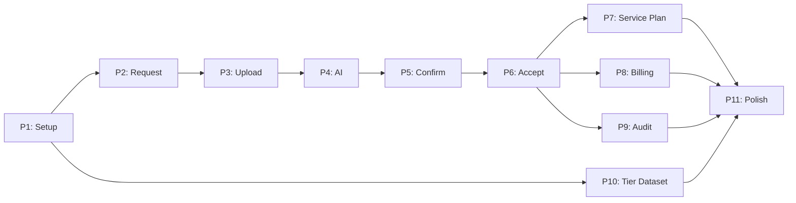

**Spec**: [spec.md](./spec.md)
**Plan**: [plan.md](./plan.md)
**Created**: 2025-12-04
**Epic**: TP-1904 | **Initiative**: TP-1859 Clinical & Care Plan

---

## Phase 1: Setup & Foundation (Week 1)

**Goal**: Database schema, core models, basic CRUD operations

### Database Migrations

- [ ] T001 Create migration for assessment_requests table in database/migrations/2025_12_01_100000_create_assessment_requests_table.php
- [ ] T002 Create migration for assessments table in database/migrations/2025_12_01_100001_create_assessments_table.php
- [ ] T003 Create migration for recommendations table in database/migrations/2025_12_01_100002_create_recommendations_table.php
- [ ] T004 Create migration for inclusion_seeds table in database/migrations/2025_12_01_100003_create_inclusion_seeds_table.php
- [ ] T005 Create migration for assessment_documents table in database/migrations/2025_12_01_100004_create_assessment_documents_table.php
- [ ] T006 Create migration for tier_classifications table in database/migrations/2025_12_01_100005_create_tier_classifications_table.php
- [ ] T007 Create migration for tier_dataset_versions table in database/migrations/2025_12_01_100006_create_tier_dataset_versions_table.php
- [ ] T008 Create migration for assessment_audit_logs table in database/migrations/2025_12_01_100007_create_assessment_audit_logs_table.php
- [ ] T009 Create migration to add tier fields to service_plan_items table in database/migrations/2025_12_01_100008_add_tier_fields_to_service_plan_items_table.php

### Models

- [ ] T010 [P] Create AssessmentRequest model in app/Models/Assessment/AssessmentRequest.php
- [ ] T011 [P] Create Assessment model in app/Models/Assessment/Assessment.php
- [ ] T012 [P] Create Recommendation model in app/Models/Assessment/Recommendation.php
- [ ] T013 [P] Create InclusionSeed model in app/Models/Assessment/InclusionSeed.php
- [ ] T014 [P] Create AssessmentDocument model in app/Models/Assessment/AssessmentDocument.php
- [ ] T015 [P] Create TierClassification model in app/Models/Tier/TierClassification.php
- [ ] T016 [P] Create TierDatasetVersion model in app/Models/Tier/TierDatasetVersion.php
- [ ] T017 [P] Create AssessmentAuditLog model in app/Models/Audit/AssessmentAuditLog.php

### Factories & Seeders

- [ ] T018 [P] Create AssessmentRequestFactory in database/factories/AssessmentRequestFactory.php
- [ ] T019 [P] Create AssessmentFactory in database/factories/AssessmentFactory.php
- [ ] T020 [P] Create RecommendationFactory in database/factories/RecommendationFactory.php
- [ ] T021 [P] Create AssessmentDocumentFactory in database/factories/AssessmentDocumentFactory.php
- [ ] T022 Create TierClassificationSeeder in database/seeders/TierClassificationSeeder.php

### Base Routes & Controllers

- [ ] T023 Create base routes for assessments in routes/web.php
- [ ] T024 [P] Create AssessmentRequestController in app/Http/Controllers/AssessmentRequestController.php
- [ ] T025 [P] Create AssessmentDocumentController in app/Http/Controllers/AssessmentDocumentController.php
- [ ] T026 [P] Create RecommendationController in app/Http/Controllers/RecommendationController.php
- [ ] T027 [P] Create RecommendationAcceptanceController in app/Http/Controllers/RecommendationAcceptanceController.php

### Verification

- [ ] T028 Run php artisan migrate:fresh --seed and verify all migrations execute successfully
- [ ] T029 Verify factories can create 100+ records in <5 seconds

---

## Phase 2: User Story 1 - CP Creates Assessment Request (Week 2, Priority: P1)

**Goal**: CP can create Assessment Requests with supplier selection and secure link generation

**Test Criteria**: CP can create request in <2 minutes (90% of users)

### Backend - Validation & Services

- [ ] T030 [US1] Create CreateAssessmentRequest form request in app/Http/Requests/CreateAssessmentRequest.php
- [ ] T031 [US1] Create SecureLinkGenerator service in app/Services/Assessment/SecureLinkGenerator.php
- [ ] T032 [US1] Create NotificationService in app/Services/Assessment/NotificationService.php
- [ ] T033 [US1] Create AssessmentRequestService in app/Services/Assessment/AssessmentRequestService.php

### Backend - Events & Listeners

- [ ] T034 [P] [US1] Create AssessmentRequestCreated event in app/Events/AssessmentRequestCreated.php
- [ ] T035 [P] [US1] Create CreateAuditLogEntry listener in app/Listeners/CreateAuditLogEntry.php
- [ ] T036 [US1] Create NotifyAssessorOfRequest job in app/Jobs/NotifyAssessorOfRequest.php

### Backend - Controller Implementation

- [ ] T037 [US1] Implement AssessmentRequestController@store method with secure token generation
- [ ] T038 [US1] Implement AssessmentRequestController@index method for dashboard

### Backend - Email Templates

- [ ] T039 [US1] Create assessor-invitation email template in resources/views/emails/assessor-invitation.blade.php

### Frontend - Vue Components

- [ ] T040 [P] [US1] Create AssessmentCreate.vue page in resources/js/Pages/Assessment/Create.vue
- [ ] T041 [P] [US1] Create useAssessmentRequest composable in resources/js/Composables/useAssessmentRequest.ts
- [ ] T042 [P] [US1] Create AssessmentStatusBadge component in resources/js/Components/Assessment/AssessmentStatusBadge.vue

### Frontend - API Resources

- [ ] T043 [US1] Create AssessmentRequestResource in app/Http/Resources/AssessmentRequestResource.php

### Verification

- [ ] T044 [US1] Verify CP can create requests via UI
- [ ] T045 [US1] Verify supplier receives email with secure link
- [ ] T046 [US1] Verify dashboard shows request status
- [ ] T047 [US1] Verify audit log records creation event

---

## Phase 3: User Story 2 - Assessor Uploads Documents (Week 3, Priority: P1)

**Goal**: Assessor authenticates via secure link and uploads documents

**Test Criteria**: Upload <30s for 10MB PDF

### Backend - Validation & Middleware

- [ ] T048 [US2] Create UploadAssessmentDocumentRequest form request in app/Http/Requests/UploadAssessmentDocumentRequest.php
- [ ] T049 [US2] Create secure link validation middleware in app/Http/Middleware/ValidateAssessmentSecureLink.php

### Backend - Events

- [ ] T050 [US2] Create DocumentUploaded event in app/Events/DocumentUploaded.php

### Backend - Controller Implementation

- [ ] T051 [US2] Implement AssessmentDocumentController@store method with file upload handling
- [ ] T052 [US2] Configure Laravel filesystem for document storage

### Frontend - Vue Components

- [ ] T053 [P] [US2] Create DocumentUpload.vue page in resources/js/Pages/Assessment/DocumentUpload.vue
- [ ] T054 [US2] Implement drag-and-drop file upload with progress indicators
- [ ] T055 [US2] Implement multi-file upload support
- [ ] T056 [US2] Implement document type selector with auto-classification

### Verification

- [ ] T057 [US2] Verify assessor can upload files via secure link
- [ ] T058 [US2] Verify files stored in Laravel filesystem
- [ ] T059 [US2] Verify metadata captured (uploader, timestamp, type)
- [ ] T060 [US2] Verify audit log records upload event

---

## Phase 4: User Story 3 - AI Extraction & Classification (Week 4, Priority: P1)

**Goal**: System extracts ATHM items and suggests Tier-5 codes

**Test Criteria**: AI extraction ≥80% Tier-5 accuracy at launch

### Backend - AI Services

- [ ] T061 [US3] Create DocumentExtractionService in app/Services/AI/DocumentExtractionService.php
- [ ] T062 [US3] Create TierClassificationService in app/Services/AI/TierClassificationService.php
- [ ] T063 [US3] Create PathwayClassificationService in app/Services/AI/PathwayClassificationService.php

### Backend - Jobs

- [ ] T064 [US3] Create ExtractDocumentContent job in app/Jobs/ExtractDocumentContent.php
- [ ] T065 [US3] Create ClassifyTierRecommendations job in app/Jobs/ClassifyTierRecommendations.php

### Backend - Listeners

- [ ] T066 [US3] Create TriggerAIExtraction listener in app/Listeners/TriggerAIExtraction.php
- [ ] T067 [US3] Register DocumentUploaded event listener in EventServiceProvider

### Backend - Graceful Degradation

- [ ] T068 [US3] Implement graceful degradation logic for Tier-5 dataset unavailable
- [ ] T069 [US3] Implement manual entry fallback with warning message

### Verification

- [ ] T070 [US3] Verify AI extraction runs automatically after upload
- [ ] T071 [US3] Verify recommendations created with tier suggestions
- [ ] T072 [US3] Verify confidence scores displayed in UI
- [ ] T073 [US3] Verify pathway classification complete
- [ ] T074 [US3] Verify raw extraction stored in audit trail

---

## Phase 5: User Story 4 - Assessor Review & Confirmation (Week 5, Priority: P1)

**Goal**: Assessor reviews AI extractions, edits Tier codes, confirms all recommendations

**Test Criteria**: 100% recommendations confirmed before submission; Review/confirm in <5 minutes per assessment

### Backend - Validation & Services

- [ ] T075 [US4] Create ConfirmRecommendationRequest form request in app/Http/Requests/ConfirmRecommendationRequest.php
- [ ] T076 [US4] Create RecommendationConfirmationService in app/Services/Recommendation/RecommendationConfirmationService.php
- [ ] T077 [US4] Create RecommendationSubmissionService in app/Services/Recommendation/RecommendationSubmissionService.php

### Backend - Events

- [ ] T078 [P] [US4] Create RecommendationConfirmed event in app/Events/RecommendationConfirmed.php
- [ ] T079 [P] [US4] Create RecommendationsSubmitted event in app/Events/RecommendationsSubmitted.php

### Backend - Email Templates

- [ ] T080 [US4] Create recommendations-submitted email template in resources/views/emails/recommendations-submitted.blade.php

### Backend - Controller Implementation

- [ ] T081 [US4] Implement RecommendationController@update method for editing tier_code
- [ ] T082 [US4] Implement RecommendationController@confirm method
- [ ] T083 [US4] Implement AssessmentRequestController@submit method with validation gating

### Frontend - Vue Components

- [ ] T084 [P] [US4] Create RecommendationReview.vue page in resources/js/Pages/Assessment/RecommendationReview.vue
- [ ] T085 [P] [US4] Create TierSearchDropdown component in resources/js/Components/Assessment/TierSearchDropdown.vue
- [ ] T086 [P] [US4] Create ConfidenceScoreIndicator component in resources/js/Components/Assessment/ConfidenceScoreIndicator.vue
- [ ] T087 [P] [US4] Create PathwayBadge component in resources/js/Components/Assessment/PathwayBadge.vue
- [ ] T088 [P] [US4] Create useRecommendations composable in resources/js/Composables/useRecommendations.ts
- [ ] T089 [P] [US4] Create useTierSearch composable in resources/js/Composables/useTierSearch.ts

### Frontend - Validation Gating

- [ ] T090 [US4] Implement confirmation checkboxes (all required before submit)
- [ ] T091 [US4] Implement submit button with validation gating (disabled until all confirmed)

### Frontend - API Resources

- [ ] T092 [US4] Create RecommendationResource in app/Http/Resources/RecommendationResource.php

### Verification

- [ ] T093 [US4] Verify assessor can edit and confirm recommendations
- [ ] T094 [US4] Verify validation prevents submission without 100% confirmation
- [ ] T095 [US4] Verify CP receives notification on submission
- [ ] T096 [US4] Verify submissions are immutable

---

## Phase 6: User Story 5 - CP Reviews and Accepts Recommendations (Week 6, Priority: P2)

**Goal**: CP reviews submitted recommendations and accepts them (triggers Inclusion Seed creation)

**Test Criteria**: 100% Inclusion Seeds created for accepted Advice/Prescribed recommendations

### Backend - Validation & Services

- [ ] T097 [US5] Create AcceptRecommendationRequest form request in app/Http/Requests/AcceptRecommendationRequest.php
- [ ] T098 [US5] Create RecommendationAcceptanceService in app/Services/Recommendation/RecommendationAcceptanceService.php

### Backend - Events & Listeners

- [ ] T099 [US5] Create RecommendationAccepted event in app/Events/RecommendationAccepted.php
- [ ] T100 [US5] Create CreateInclusionSeed listener in app/Listeners/CreateInclusionSeed.php

### Backend - Controller Implementation

- [ ] T101 [US5] Implement RecommendationAcceptanceController@accept method
- [ ] T102 [US5] Implement pathway-based Inclusion Seed logic (Advice/Prescribed only, not Low Risk)

### Frontend - Vue Components

- [ ] T103 [P] [US5] Create RecommendationList.vue page in resources/js/Pages/Assessment/RecommendationList.vue
- [ ] T104 [P] [US5] Create RecommendationCard component in resources/js/Components/Assessment/RecommendationCard.vue
- [ ] T105 [US5] Implement aggregated view of all Recommendations from all Assessments
- [ ] T106 [US5] Implement evidence links (click to view source documents)
- [ ] T107 [US5] Implement pathway filter (Low Risk, Advice, Prescribed)

### Verification

- [ ] T108 [US5] Verify CP can accept recommendations individually
- [ ] T109 [US5] Verify Inclusion Seeds created for Advice/Prescribed pathways
- [ ] T110 [US5] Verify NO Inclusion Seed created for Low Risk pathway
- [ ] T111 [US5] Verify recommendations remain visible after acceptance
- [ ] T112 [US5] Verify audit log records acceptance events

---

## Phase 7: User Story 6 - CP Adds to Service Plan (Week 7, Priority: P2)

**Goal**: CP adds accepted recommendations to Service Plan with tier_code prefilled

**Test Criteria**: 100% bidirectional links maintained for Service Plan items from recommendations

### Backend - Controller Implementation

- [ ] T113 [US6] Create ServicePlanItemController@createFromRecommendation method
- [ ] T114 [US6] Implement bidirectional link maintenance (Service Plan Item ↔ Assessment ↔ Recommendation)
- [ ] T115 [US6] Ensure Service Plan item edits/deletes do NOT cascade to recommendations

### Frontend - Vue Components

- [ ] T116 [US6] Create ServicePlanIntegration.vue page in resources/js/Pages/Assessment/ServicePlanIntegration.vue
- [ ] T117 [US6] Implement "Add Service" action on accepted recommendations
- [ ] T118 [US6] Prefill tier_code (terminal tier only) in Service Plan form
- [ ] T119 [US6] Implement bidirectional link indicator (show source assessment/recommendation)

### Verification

- [ ] T120 [US6] Verify CP can add recommendations to Service Plan
- [ ] T121 [US6] Verify terminal tier value prefilled (Tier-5 for products, Tier-3 for services)
- [ ] T122 [US6] Verify bidirectional links maintained
- [ ] T123 [US6] Verify source recommendations preserved when Service Plan item edited/removed

---

## Phase 8: User Story 7 - Billing Visibility (Week 8, Priority: P3)

**Goal**: Billing processors see Tier-5 context on Service Plan items and invoices

**Test Criteria**: Billing processors report 40% reduction in manual interpretation effort (survey-based)

### Backend - Integration

- [ ] T124 [US7] Integrate Invoice AI classification with existing Invoice AI service
- [ ] T125 [US7] Implement read-only access for billing processors

### Frontend - UI Updates

- [ ] T126 [US7] Update existing Service Plan UI to display tier_code
- [ ] T127 [US7] Update existing Invoice UI to display tier-coded line items
- [ ] T128 [US7] Ensure no new screens created (context only, per FR-055)

### Verification

- [ ] T129 [US7] Verify Tier-5/Tier-3 values visible on Service Plan items
- [ ] T130 [US7] Verify Invoice line items classified with tier codes
- [ ] T131 [US7] Verify read-only access for billing processors

---

## Phase 9: User Story 8 - Audit Logging (Week 9, Priority: P3)

**Goal**: Comprehensive immutable audit trail for all state changes

**Test Criteria**: Zero data loss incidents (99.99% uptime); Audit log export <30s for 1000 entries

### Backend - Services

- [ ] T132 [US8] Create AssessmentAuditService in app/Services/Audit/AssessmentAuditService.php
- [ ] T133 [US8] Create AuditExportService in app/Services/Audit/AuditExportService.php
- [ ] T134 [US8] Implement immutability enforcement (no updates/deletes)

### Backend - API Resources

- [ ] T135 [US8] Create AssessmentAuditLogResource in app/Http/Resources/AssessmentAuditLogResource.php

### Frontend - Vue Components

- [ ] T136 [P] [US8] Create audit log viewer with filtering (package, user, action, date range)
- [ ] T137 [P] [US8] Create export button (CSV/JSON)
- [ ] T138 [US8] Implement before/after state diff view

### Verification

- [ ] T139 [US8] Verify all actions logged (uploads, edits, confirmations, submissions, acceptance)
- [ ] T140 [US8] Verify audit log modification blocked
- [ ] T141 [US8] Verify export 1000 entries completes in <30s
- [ ] T142 [US8] Verify filtering by package returns correct entries

---

## Phase 10: User Story 9 - Tier-5 Dataset Management (Week 10, Priority: P3)

**Goal**: Versioned Tier-5 canonical dataset with graceful degradation

**Test Criteria**: Historical classifications remain valid after dataset updates; Dataset version tracked for each classification

### Backend - Services

- [ ] T143 [US9] Create dataset import service (CSV/JSON) for TierDatasetVersion
- [ ] T144 [US9] Implement version tracking (historical classifications unchanged per FR-060)

### Frontend - UI Updates

- [ ] T145 [US9] Add dataset version indicator in TierSearchDropdown
- [ ] T146 [US9] Add warning message when dataset unavailable
- [ ] T147 [US9] Add historical classification display (which version used)

### Verification

- [ ] T148 [US9] Verify import new dataset version preserves historical classifications
- [ ] T149 [US9] Verify dataset unavailable allows manual entry with warning
- [ ] T150 [US9] Verify multiple versions exist and correct version displayed

---

## Phase 11: Polish & Cross-Cutting Concerns

### Code Quality

- [ ] T151 Run vendor/bin/pint --dirty to format all PHP files
- [ ] T152 Run npm run build to compile frontend assets
- [ ] T153 Run php artisan test to execute all tests

### Documentation

- [ ] T154 Update API documentation with new endpoints
- [ ] T155 Update README with ASS1 feature overview

### Performance

- [ ] T156 Verify document upload <30s for 10MB PDF
- [ ] T157 Verify AI extraction <60s per document
- [ ] T158 Verify recommendation list page load <500ms
- [ ] T159 Verify audit log export <30s for 1000 entries

---

## Dependencies

## Parallel Execution Opportunities

Tasks marked **[P]** can run in parallel within their phase:

- **Phase 1**: T010-T017 (Models), T018-T021 (Factories), T024-T027 (Controllers)
- **Phase 2**: T034-T035 (Events/Listeners), T040-T042 (Vue Components)
- **Phase 3**: T053 and T056 can run in parallel after T051
- **Phase 5**: T084-T089 (All Vue components), T078-T079 (Events)
- **Phase 6**: T103-T104 (Vue components)
- **Phase 9**: T136-T137 (Audit viewer components)

## Summary

- **Total Tasks**: 159
- **User Stories**: 9 (US1-US9)
- **Priority Breakdown**:
  - P1: US1-US4 (Phases 2-5) - Critical path
  - P2: US5-US6 (Phases 6-7) - Core value
  - P3: US7-US9 (Phases 8-10) - Supporting features

**Suggested MVP Scope**: User Story 1 (Phase 2) - CP Creates Assessment Request

**Independent Test Criteria**:
- US1: CP can create request in <2 minutes
- US2: Upload <30s for 10MB PDF
- US3: AI extraction ≥80% accuracy
- US4: 100% confirmations required
- US5: 100% Inclusion Seeds created
- US6: 100% bidirectional links maintained
- US7: 40% reduction in billing effort
- US8: Audit export <30s for 1000 entries
- US9: Historical classifications preserved

---

**Next Steps**:
1. `/trilogy.jira-sync` - Sync stories and tasks to Jira (optional)
2. `/speckit.implement` - Start development with Phase 1
