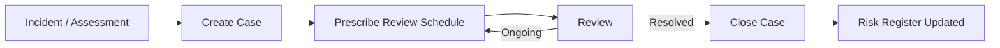

**Epic Code**: CLI | **Created**: 2026-02-02 | **Linear**: [CLI Clinical Portal Uplift](https://linear.app/trilogycare/project/cli-clinical-portal-uplift-e3016912d510)

---

## Problem Statement (What)

Management Plans (MPs) live in Zoho CRM while care partners work exclusively in Portal, causing visibility gaps, missed follow-ups, and manual relay of clinical instructions.

**Pain Points:**
- MPs sit in CRM — care partners miss follow-ups because they don't see them when viewing client records
- Clinicians write lengthy MP instructions (1000+ words) that care partners must manually relay
- No structured review cycles — MPs are created but not systematically followed up
- No distinction between mandatory clinical oversight and simple follow-ups
- Care partners were not consulted on original MP rollout — "just jumped on them"
- Only 4 CRM features actually needed in Portal: meals, cab charge, incidents, MPs

**Current State**: MPs hidden in CRM, no visibility in Portal, manual processes, no triage or review lifecycle.

---

## Possible Solution (How)

Migrate Management Plans from CRM to Portal, evolving them into **Clinical Pathways / Cases** — prescribed, ongoing clinical management pathways with structured review cycles and triage routing.

### Terminology Shift
- Management Plans reframed as **Clinical Pathways** or **Cases** (terminology TBD with Marianne)
- Cases are distinct from incidents: **incident = reactive response**, **case = prescribed ongoing care pathway**
- Marianne references the old internal term "clinical pathways" used before

### Case Types

| Type | Trigger | Mandatory? |
|------|---------|------------|
| **Mandatory Case** | Duty of care — elder abuse, high DOR/DOI, risk of death | Yes — "we are not comfortable, this is mandatory" |
| **Recommended Case** | Incident follow-up, clinical assessment flags ongoing need | No — prescribed but optional |
| **Self-Service Kit** | Low risk, client can self-manage | No — resource articles sent instead |

### Case Lifecycle



- Cases have a circular review loop (e.g., review weekly for 4 weeks)
- If client doesn't need ongoing management: "if you don't need us we'll step out"
- Cases can be triggered automatically from incidents (via [ICM](/initiatives/Clinical-And-Care-Plan/Incident-Management/)) or created manually

### Case Triage Routing

| Criteria | Handler |
|----------|---------|
| High risk assessment | Clinician |
| 5+ instructions | Clinician |
| Medication management | Clinician |
| Wound management | Clinician |
| Mandatory case (duty of care) | Clinician |
| Simple follow-up (e.g., fall check-in) | Care Partner / Coordinator |
| Self-service kit | Auto-send resources |

### Portal Visibility
- Surface case status, due dates, and review schedules on client records
- Care partners see active cases during calls — no CRM switching
- Case updates flow back to risk register automatically

### Before / After

```
// Before (Current)
1. MPs hidden in Zoho CRM
2. Care partners switch systems to find MP info
3. No review lifecycle — create and forget
4. No triage — clinicians handle everything
5. 1000+ word instructions manually relayed

// After (With CLI)
1. Cases visible on client records in Portal
2. Single system for care partners
3. Structured review cycles with reminders
4. Triage routes simple cases to care partners
5. Incident → case automation (via ICM)
```

---

## Benefits (Why)

**User/Client Experience:**
- Care partners see case status during client calls — no CRM switching
- Faster follow-up on clinical needs with structured review cycles
- Better clinical oversight through mandatory case tracking

**Operational Efficiency:**
- Automated routing — clinicians focus on complex cases, care partners handle simple follow-ups
- Review cycle reminders prevent missed follow-ups
- Incident → case automation reduces manual case creation

**Business Value:**
- Clinical Governance — mandatory cases enforce duty of care obligations
- Compliance — documented case lifecycle with audit trail
- Efficiency — reduced CRM dependency (one of only 4 remaining CRM features)

---

## Owner & Stakeholders

| Role | Person |
|------|--------|
| **R** | Romy Blacklaw (PO), David Henry (BA), Beth Poultney (Des), Khoa Duong (Dev) |
| **A** | Patrick Hawker |
| **C** | Marianne (Clinical Governance), Jennifer (OT), Care Partners, Coordinators |
| **I** | Ian (care partner + clinician), 3 new clinical governance roles |

---

## Assumptions, Dependencies & Risks

**Assumptions:**
- MP data can be migrated/synced from CRM to Portal
- Care partners will adopt Portal for clinical workflows (co-design required — previous rollout issues)
- Marianne's case type framework (mandatory/recommended/self-service) is fit for purpose
- Terminology (pathways vs cases) will be finalised during discovery

**Dependencies:**
- [ICM — Incident Management](/initiatives/Clinical-And-Care-Plan/Incident-Management/) for incident → case automation
- [RNC2 — Future State Care Planning](/initiatives/Clinical-And-Care-Plan/Future-State-Care-Planning/) for objective risk scores feeding case triage
- [ASS1 — Assessments/Prescriptions](/initiatives/Clinical-And-Care-Plan/Assessment-Prescriptions/) for assessment documents triggering cases
- [CCU — Care Circle Uplift](/initiatives/Clinical-And-Care-Plan/Care-Circle-Uplift/) for external providers tagged to cases
- CRM data access for MP migration

**Risks:**
- Data migration complexity from CRM (MEDIUM) -> Mitigation: Map CRM MP structure first, phased migration
- Adoption resistance if care partners not consulted (HIGH) -> Mitigation: Co-design workshops, survey before build
- Scope creep into incident management territory (MEDIUM) -> Mitigation: Clear boundary — ICM owns incidents, CLI owns cases/pathways
- Terminology confusion between cases and incidents (LOW) -> Mitigation: Clear definitions in training materials

---

## Success Metrics

- 100% of active cases visible in Portal (zero CRM switching for MPs)
- Reduction in missed case follow-ups by 50%
- Clinician time on simple cases reduced by 30% (triage routing)
- Care partner satisfaction with case visibility (survey baseline → post-launch)

---

## Estimated Effort

**M (Medium) — 3-4 sprints**

- **Sprint 1**: Discovery — Map CRM MP data, co-design with care partners + clinicians, finalise terminology
- **Sprint 2**: Case visibility — Surface cases on client records, basic CRUD, review schedule
- **Sprint 3**: Triage + lifecycle — Routing logic, review cycle reminders, case closure flow
- **Sprint 4**: Automation — Incident → case triggers (requires ICM), risk register integration

---

## Decision

- [x] **Approved** - High priority in Linear
- [ ] **Needs More Information**
- [ ] **Declined**

---

## Next Steps

1. [ ] Map current MP data structure in CRM
2. [ ] Marianne's care partner + clinician survey on MP pain points
3. [ ] Co-design workshops with care partners and clinicians
4. [ ] Finalise terminology (pathways vs cases) with Marianne
5. [ ] Create PRD (spec.md)
6. [ ] Break down into user stories

---

## Source Meetings

| Date | Meeting | Key Topics |
|------|---------|------------|
| Feb 2, 2026 | [Clinical Discussion (Marianne)](https://app.fireflies.ai/view/01KGEB7EWMN7Z6FWVVMJEWAWNP) | MP visibility in Portal, triage routing, CRM dependency |
| Feb 11, 2026 | [Clinical Product Requirements (Marianne)](https://app.fireflies.ai/view/Clinical-Product-Requirements::01KH7HSR11DJBCBJETN0J8W2R4) | Reframing MPs as Clinical Pathways/Cases, case types, duty of care, lifecycle, incident → case automation |

---

## Related Epics

| Epic | Relationship |
|------|-------------|
| **ICM** (Incident Management) | Incidents trigger case creation — CLI depends on ICM for incident → case automation |
| **RNC2** (Future State Care Planning) | Risk scores feed case triage — objective scoring replaces subjective ratings |
| **ASS1** (Assessments/Prescriptions) | Assessment documents trigger recommended cases |
| **CCU** (Care Circle Uplift) | External providers (GPs, hospices, allied health) tagged to cases |
| **DOC** (Documents) | Clinical documents as evidence source for case creation |
