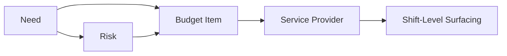

**Epic Code**: RNC2 | **Created**: 2026-01-14 | **Linear**: [RNC2 Future State Care Planning](https://linear.app/trilogycare/project/rnc2-future-state-care-planning-tp-2357-e08fb8938c2d)

---

## Problem Statement (What)

Care partners and clinical teams face significant friction creating, updating, and managing client care plans. The current system has four core problems:

### 1. Manual, Inconsistent Care Plan Drafting
- Care plans are drafted by copying/pasting from Word documents
- No standardisation in how risks, needs, and goals are documented
- Difficult to monitor progress and ensure high-risk issues are addressed promptly
- Plans aren't auditable — compliance teams can't trace decisions back to evidence

### 2. Subjective Risk Assessment
- Risk ratings are subjective high/medium/low — one clinician's "high" is another's "medium"
- No evidence trail explaining *why* something is high risk or what factors contribute
- Can't aggregate across risk types (how do you combine falls + dementia + medication risk?)
- Clinicians have different thresholds — no objective framework

### 3. Overwhelming Needs Capture
- Questionnaire (Zoho form) takes 20+ minutes
- Comprehensive Aged Care Assessment asked multiple times across systems
- Current needs module is "pretty wordy" — care partners find it overwhelming
- References to services in needs module confuse what should be about the person's actual needs

### 4. Disconnected Data
- Risk/needs data has generic "October" updated dates — nobody has actually reviewed
- No linkage between needs, risks, budget items, and service providers
- Care partners can't see which risks are relevant to their specific service (gardening vs showering)
- Annual reviews don't prompt re-validation of all needs and risks

**Current State**: Manual care plan drafting with inconsistencies, subjective risk ratings, compliance risks, and staff spending time on admin rather than client engagement.

---

## Possible Solution (How)

Deliver an **in-portal, evidence-based care planning system** built on three pillars:

### Pillar 1: Maslow-Based Needs Framework

Restructure needs around Maslow's hierarchy adapted for home care:

| Level | Examples |
|-------|----------|
| **Physiological** | Water, food, shelter, continence |
| **Safety & Security** | Falls prevention, medication management, home safety |
| **Belonging** | Social connection, family contact, community access |
| **Esteem** | Independence, dignity, choice |
| **Self-Actualisation** | Hobbies, goals, personal fulfilment |

Each need captures:
- **What** is the need? (simplified: describe it in plain language)
- **How** will it be met? (care plan response)
- **Funding source**: HCP, informal network, PHN, PBS, private health
- **Associated risks and budget items** (linked, not duplicated)

Marianne sees this as an audit differentiator: *"imagine the commission coming and saying this is cool"* — evidence-based practice positioning.

### Pillar 2: Evidence-Based Risk Scoring

Replace subjective ratings with quantified, aggregated risk scores:

```
Client Overall Score: 67/100
├── Falls: 42 (prevalence + medications + mobility)
├── Cognitive: 15 (dementia diagnosis + behavioural changes)
├── Medication: 7 (polypharmacy)
└── Weight: 3 (stable)
```

**Scoring model**: impact x likelihood from structured questions:
- "Have you had a fall in the last 2/6 months?"
- "Did those falls cause hospitalisation?"
- "How many medications are you on?"
- "What is your mobility level?"

Key properties:
- Client-friendly language — clients can self-assess where appropriate
- Drill-down: overall score -> factor breakdown
- Incident data feeds automatically (falls incidents update prevalence in real-time)
- Structured questions, not free text — ensures objectivity and comparability

**Marianne has already built the risk scoring methodology document** — ready for dev pickup.

### Pillar 3: Needs-Risk-Budget Integration

Link all three layers together and surface at the right moment:



- Associate needs to: funding source, budget items, service providers
- Surface risk warnings when logging shifts (e.g., showering -> pressure injury risk)
- **Scoped info sharing**: gardening care partner doesn't see anaphylaxis risk; showering care partner sees pressure injury risk
- In-text citation style: each need/risk traces back to source assessment document

### Supporting Capabilities

| Capability | Description |
|------------|-------------|
| **Clinical Risk Badge** | New badge on client profile showing overall risk score alongside HCP/package badges — quick visual for care partners during calls |
| **AI-Assisted Drafting** | Generate draft care plans from assessment data, medical summaries, and case notes with human-in-the-loop review |
| **IAT/ACAT Ingestion** | Import existing assessment data to decrease reliance on 20+ minute questionnaires |
| **Needs-to-Service Flow** | Add a need -> select specific services -> pre-populate service plan |
| **PDF Export** | Generate compliant PDF care plans for distribution and audit |
| **Clinician Population View** | Pod-level data: "I have 75 clients with chronic dementia" — enables clinical workload planning |
| **Annual Review Validation** | Prompt re-validation of all needs and risks — updated dates reflect actual review, not system timestamps |

### Before / After

```
// Before (Current)
1. Manual care plan drafting (copy/paste from Word)
2. Subjective high/medium/low risk ratings
3. 20+ minute Zoho questionnaires
4. Needs, risks, budget all disconnected
5. Care partners can't see relevant risk info

// After (With RNC2)
1. AI-assisted draft generation from assessments
2. Quantified risk scores with drill-down (67/100)
3. IAT/ACAT import replaces questionnaires
4. Need <-> Risk <-> Budget linked end-to-end
5. Scoped risk surfacing at shift level
```

---

## Benefits (Why)

**User/Client Experience**:
- Enhanced client outcomes — more accurate, timely care plans informed by data and human expertise
- Needs and risks visible on one page in Portal
- Clients can self-assess risk factors in their own language

**Operational Efficiency**:
- Less manual drafting — care partners focus on client engagement
- Simplified needs capture — "What is the need? How will we meet it?" replaces wordy module
- Clinicians plan monthly workflow by condition/risk type at population level

**Business Value**:
- Consistency & Compliance — standardised formats and automated validation reduce regulatory breaches
- Evidence-based practice — Maslow framework + quantified risk scores position TC as audit differentiator
- Auditable — complete audit trail from assessment document -> need/risk -> budget item -> service
- Better decision-making — automatic tagging and prioritisation ensures high-risk issues escalated quickly

---

## Owner & Stakeholders

| Role | Person |
|------|--------|
| **R** | Romy Blacklaw (PO), David Henry (BA), Beth Poultney (Des), Khoa Duong (Dev) |
| **A** | Patrick Hawker |
| **C** | Marianne (Clinical Governance), Erin Headley, Jennifer (OT) |
| **I** | Care Partners, Clinicians, Ian (care partner + clinician) |

---

## Assumptions & Dependencies, Risks

**Assumptions**:
- AI models can produce compliant draft care plans from existing client data
- Government will provide clear guidelines on required assessment types and prescription authority lists
- Marianne's risk scoring methodology document is fit for purpose (needs dev review)
- Care partners will adopt simplified needs module (must co-design — previous rollout "jumped on them")

**Dependencies**:
- Access to structured assessment data and historical case notes in Portal
- Note-taking enhancements and new "note type" classifications
- Clinical assessment and prescription workflows (ASS1/ASS2)
- Integration with risk and needs tagging automation
- Incident Management (ICM) — incidents feed risk factor data automatically
- Care Circle Uplift (CCU) — external providers tagged to needs/risks

**Key Artifacts from Marianne** (ready for pickup):
1. Risk scoring methodology document
2. Organisational risk pattern pack (non-clinical risk framework)
3. Supervision frameworks (clinical governance structure)
4. Redesigned incident management form (SIRS requirements)

**Risks**:
- AI-generated outputs may require significant human editing if data quality is poor (MEDIUM) -> Mitigation: Human-in-the-loop validation, data quality improvements
- Regulatory changes could alter required formats after launch (LOW) -> Mitigation: Flexible template system
- Staff adoption slow if workflows perceived as replacing professional judgement (MEDIUM) -> Mitigation: Co-design with care partners + clinicians, emphasize AI-assisted not AI-replaced
- Clinicians may resist objective risk scoring if they feel it undermines clinical judgement (MEDIUM) -> Mitigation: April Falls Month education campaign to socialize framework

---

## Estimated Effort

**3-5 sprints**

- **Sprint 1-2**: Discovery & Design — Maslow framework mapping, risk scoring methodology review, AI integration approach, UI/UX co-design with care partners
- **Sprint 3-4**: Backend — Risk scoring engine, needs-risk-budget integration, AI drafting pipeline, clinical risk badge
- **Sprint 5**: Frontend — Care plan UI, PDF generation, compliance validation, clinician population view

---

## Proceed to PRD?

**YES** — RNC2 delivers an in-portal, evidence-based care planning system with Maslow needs framework, quantified risk scoring, and needs-risk-budget integration. Marianne has methodology documents ready for dev pickup.

---

## Decision

- [x] **Approved** - Proceed to PRD
- [ ] **Needs More Information**
- [ ] **Declined**

---

## Next Steps

1. [ ] Pick up Marianne's risk scoring methodology document
2. [ ] Create PRD (spec.md)
3. [ ] Co-design workshops with care partners and clinicians
4. [ ] Break down into user stories
5. [ ] Review/update Jira epic (TP-2357)

---

## Source Meetings

| Date | Meeting | Key Topics |
|------|---------|------------|
| Feb 11, 2026 | [Clinical Product Requirements (Marianne)](https://app.fireflies.ai/view/Clinical-Product-Requirements::01KH7HSR11DJBCBJETN0J8W2R4) | Maslow needs, evidence-based risk scoring, clinical risk badge, needs-risk-budget integration, clinician workflow, needs simplification |
| Sep 29, 2025 | Clinical Meeting - Project Activate | Clinical governance, risk profiles, dignity of risk forms |

---

## Related Epics

| Epic | Relationship |
|------|-------------|
| **ASS1** (Assessments/Prescriptions) | Assessment documents feed risk/needs extraction |
| **CLI** (Clinical Portal Uplift) | Clinical Pathways/Cases reference risk scores and needs |
| **ICM** (Incident Management) | Incidents feed risk factor data automatically |
| **CCU** (Care Circle Uplift) | External providers tagged to needs/risks |
| **DOC** (Documents) | Clinical documents as source for AI extraction |
