> **[View Mockup](/mockups/incident-management/index.html)**{.mockup-link}

## Phasing Strategy

This specification covers the **full vision** for Portal-based incident management across two phases:

- **Phase 1 — Portal Intake + Viewer** (stories P1–P2): One-time migration of all CRM incidents into Portal. Incidents raisable and viewable from Portal with Marianne's V2 form. Clean cut from CRM — Portal becomes the sole system. Feature-flag controlled rollout. Public intake form for recipients/family/reps.
- **Phase 2 — Full IMS with Automation** (stories P3–P4): Auto-escalation, incident → case automation, risk auto-update, SIRS enforcement, analytics, and notifications.

Stories are prioritised as user journeys ordered by importance. Each Phase 1 story is independently deliverable.

---

## User Scenarios & Testing

### User Story 1 — Care Partner Raises an Incident from Portal (Priority: P1)

As a Care Partner, I can raise a new incident directly from a client's record in Portal so that I don't need to switch to Zoho CRM and the incident is immediately visible against the right client.

The form follows Marianne's V2 design with plain language suitable for all reporters. It captures: client identification, incident details (date, time, location, care context), what happened (free text), harm classification (4-tier), client outcomes (tick-all-that-apply), actions taken by reporter (structured checklist), escalation details, follow-up plan, and client notification status.

**Why this priority**: Care partners currently cannot create incidents where they work. This is the single biggest friction — removing it unblocks everything else. \~930 incidents/month are created exclusively in CRM, forcing context-switching.

**Independent Test**: Create an incident from a package's incidents tab and verify it appears in the global incidents list and the package incidents tab.

**Acceptance Scenarios**:

1. **Given** a Care Partner is viewing a client's package, **When** they click "Report Incident", **Then** they see the V2 incident form pre-filled with the client's name, DOB, and Support at Home ID
2. **Given** a Care Partner is filling in the form, **When** they select a harm classification tier, **Then** the form displays the corresponding timeframes for action (e.g., "Severe Harm — act within 24 hours")
3. **Given** a Care Partner submits the form, **When** all required fields are complete, **Then** the incident is created against the package and appears in both the global and package incident lists
4. **Given** a Care Partner is filling in outcomes, **When** they tick multiple outcomes (e.g., "Hospital admission" and "Police involvement"), **Then** all selected outcomes are saved against the incident
5. **Given** a Care Partner fills in "Has this happened before?" as Yes, **When** they submit, **Then** the trend details are saved and visible on the incident record
6. **Given** a Care Partner leaves required fields blank and attempts to submit, **When** validation runs, **Then** the system highlights each missing field and prevents submission

**Flow:**

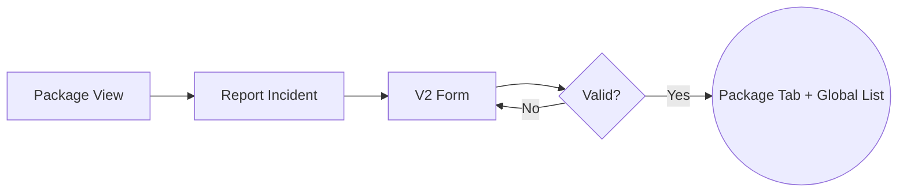

---

### User Story 2 — Care Partner Views Incident History During Client Calls (Priority: P1)

As a Care Partner calling a client, I can see their incident history on the client record so that I'm informed about recent events before speaking to them.

**Why this priority**: Care partners currently can't see incidents when they're on the phone with clients — the information is trapped in CRM. This directly impacts care quality. Marianne's primary motivation: "care partners can see incident history during client calls."

**Independent Test**: Navigate to a package's incidents tab and verify incidents display with key details visible at a glance.

**Acceptance Scenarios**:

1. **Given** a package has 3 incidents, **When** a Care Partner opens the package's incidents tab, **Then** they see all 3 incidents sorted most-recent-first with: date, harm classification, description summary, and resolution status
2. **Given** a Care Partner clicks on an incident, **When** the detail view opens, **Then** they see the full incident record including outcomes, actions taken, escalation details, follow-up plan, and trend history
3. **Given** a package has no incidents, **When** a Care Partner opens the incidents tab, **Then** they see an empty state with a "Report Incident" action
4. **Given** an incident has a Severe or Moderate harm classification, **When** it appears in the list, **Then** it shows a visual urgency indicator (colour-coded per harm tier) so the Care Partner immediately sees priority

**Flow:**

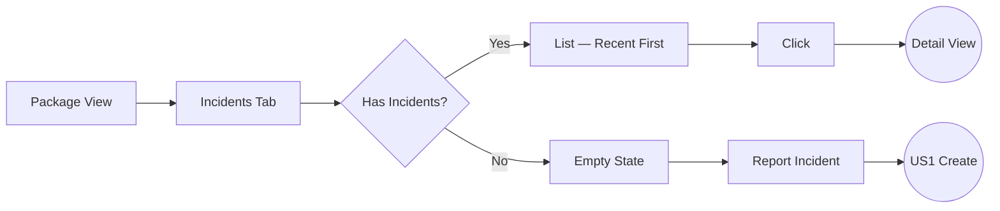

---

### User Story 3 — Harm Classification at Intake (Priority: P1)

As a reporter (Care Partner, family member, support worker, or clinician), I can classify the seriousness of an incident using the 4-tier harm scale so that the appropriate response timeframe is triggered immediately.

The 4-tier harm scale replaces the internal CAT 1–5 triage category for reporters. The existing Classification field (Clinical / Non-clinical / SIRS) remains as a separate field — when "SIRS" is selected, additional SIRS-specific fields appear (see US9).

- Severe Harm (red) — Call 000 & notify immediately; act within 24 hours
- Moderate Harm (orange) — Notify within 1 business day; act within 2 days
- Low Harm (yellow) — Notify within 2 business days; review within 5 days
- Clinical Notification Only (white) — Notify within 5 business days; record in care plan

**Why this priority**: The current form has no triage guidance for reporters. Harm classification drives response timeframes and is central to SIRS compliance.

**Independent Test**: Submit incidents at each harm tier and verify the correct timeframe guidance is displayed and stored.

**Acceptance Scenarios**:

1. **Given** a reporter is classifying an incident, **When** they select "Severe Harm", **Then** the form displays "Call 000 & notify provider immediately; act within 24 hours" with visual emphasis (red indicator)
2. **Given** a reporter selects "Clinical Notification Only", **When** they proceed, **Then** no urgency indicator is shown and the timeframe reads "Notify within 5 business days; record in care plan"
3. **Given** a reporter submits without selecting a harm classification, **When** they attempt to submit, **Then** the form prevents submission and highlights the required field

**Flow:**

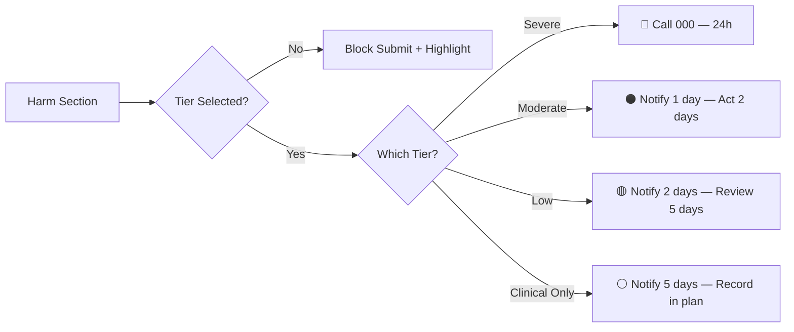

---

### User Story 4 — View and Edit Incidents in Portal (Priority: P1)

As a Care Partner, I can view the full details of any incident and edit it directly in Portal so that I can update incident information, add resolution details, and progress incidents through their lifecycle without opening CRM.

**Why this priority**: The Edit page is the most documented gap in the current system — the route and action exist but the page is missing. Without edit capability, Portal remains read-only and care partners must still use CRM for any changes.

**Independent Test**: Click on any incident in the list or package tab, view all its details, edit a field (e.g., adding a solution), and save. The changes persist.

**Acceptance Scenarios**:

1. **Given** a Care Partner clicks on an incident from the incidents list or package tab, **When** the detail page loads, **Then** they see all incident fields: dates, reporter, description, harm classification, outcomes, actions taken, escalation details, follow-up plan, client notification status, and resolution status
2. **Given** a Care Partner updates the incident's resolution and adds notes, **When** they save, **Then** the changes persist and an audit trail entry records the update with the acting user and timestamp
3. **Given** an incident was originally migrated from Zoho CRM, **When** the Care Partner views it, **Then** all migrated data is displayed and the incident is fully editable in Portal
4. **Given** a Care Partner progresses an incident through the lifecycle (Reported → Triaged → Escalated → Actioned → Disclosed → Resolved), **When** they advance to "Resolved", **Then** the resolution field becomes required before the save completes

**Flow:**

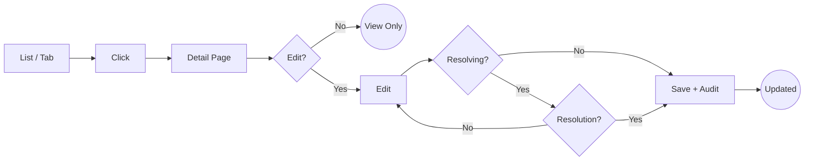

---

### User Story 5 — Trend Tracking on Incidents (Priority: P2)

As a Care Partner, I can flag whether an incident is a recurrence or part of a trend so that the clinical team can identify patterns and intervene proactively.

**Why this priority**: The current form has no "Has this happened before?" field. Trend analysis is a key gap identified in Marianne's documentation review and is critical for falls prevention and the April Falls Month initiative.

**Independent Test**: Create an incident with trend details and verify the trend information is saved and visible on the incident record.

**Acceptance Scenarios**:

1. **Given** a reporter is filling in the form, **When** they answer "Has this happened before?" as Yes, **Then** a details field appears asking for dates and frequency
2. **Given** a reporter answers "Part of a trend?" as Yes, **When** they provide details, **Then** the trend information is saved and visible on the incident detail view
3. **Given** a clinical team member views an incident marked as a trend, **When** they review the record, **Then** they see the trend flag prominently displayed alongside the incident details

**Flow:**

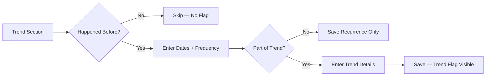

---

### User Story 6 — Actions Taken and Escalation Trail (Priority: P2)

As a reporter, I can record the actions I took in response to the incident and who I escalated to, so that there is a clear audit trail of the immediate response.

**Why this priority**: The current form has no structured actions checklist or escalation tracking. This is a regulatory gap — the Best Practice Guide requires documentation of all actions taken.

**Independent Test**: Submit an incident with multiple actions and escalation details, then verify they appear on the incident record.

**Acceptance Scenarios**:

1. **Given** a reporter is completing the form, **When** they select actions from the checklist (first aid, called 000, contacted registered supporter, removed hazard, etc.), **Then** all selected actions are saved against the incident
2. **Given** a reporter fills in escalation details (who contacted, date/time, outcome), **When** they submit, **Then** the escalation trail is visible on the incident record
3. **Given** a reporter fills in the follow-up plan (GP appointment, care plan update needed, monitoring requirements), **When** they submit, **Then** the follow-up plan is visible and any care plan update flag is recorded

**Flow:**

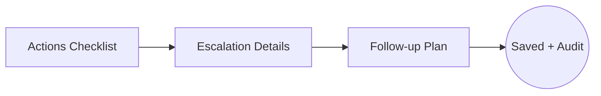

---

### User Story 7 — Open Disclosure and Client Notification (Priority: P2)

As a Care Partner, I can record whether the client or their representative has been informed about the incident so that Trilogy Care meets its open disclosure obligations.

**Why this priority**: Open disclosure is a guiding principle in the Best Practice Guide and a regulatory requirement. Currently not tracked systematically.

**Independent Test**: Submit an incident with and without client notification details and verify both states are recorded correctly.

**Acceptance Scenarios**:

1. **Given** a reporter completes the form, **When** they record "Client informed: Yes" with date, method, and feedback, **Then** the disclosure record is saved
2. **Given** a reporter records "Client informed: Not yet", **When** they submit, **Then** the incident is flagged as requiring follow-up disclosure
3. **Given** an incident has "Not yet" disclosure status, **When** a Care Partner views it later, **Then** they see a visual indicator that disclosure is outstanding

**Flow:**

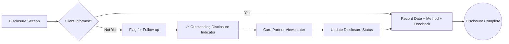

---

### User Story 8 — Global Incidents List with Filtering (Priority: P2)

As a Clinical Team member, I can view all incidents across all clients with filtering and sorting so that I can monitor incident patterns, triage outstanding items, and prepare for governance reviews.

**Why this priority**: The existing incidents list exists but is basic. Clinical governance roles need filtering by harm tier, resolution status, date range, and trend flags.

**Independent Test**: Navigate to the global incidents list and apply various filters to verify correct results.

**Acceptance Scenarios**:

1. **Given** a Clinical Team member opens the global incidents list, **When** they filter by "Severe Harm", **Then** only incidents classified as Severe Harm are shown
2. **Given** a Clinical Team member filters by "Unresolved" status, **When** results display, **Then** only open incidents appear, sorted by harm severity (most severe first)
3. **Given** a Clinical Team member filters by date range, **When** they select the last quarter, **Then** only incidents within that period display with a count summary

**Flow:**

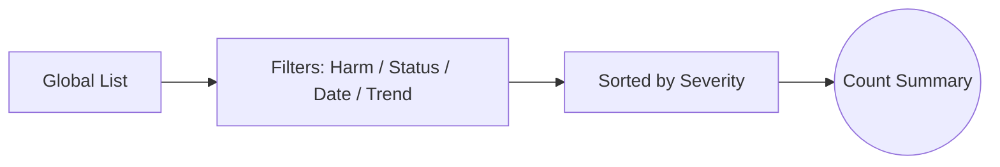

---

### User Story 9 — Basic SIRS Deadline Tracking (Priority: P2)

As a Clinical Team member, I can see which incidents are SIRS-reportable and their reporting deadlines so that I can ensure Trilogy Care meets its regulatory obligations without relying on memory or spreadsheets.

SIRS Priority classification is an internal operational process (per Marianne's documentation review). A clinical lead assigns Priority 1 or Priority 2 after reviewing the harm classification and incident details:

- Priority 1 (24 hours): Has/could cause harm requiring treatment, involves sexual contact, death, unexplained absence, or reasonable grounds to report to police
- Priority 2 (30 days): All other SIRS-reportable incidents

**Why this priority**: SIRS compliance is currently manual and relies on human memory. Priority 1 incidents must be reported within 24 hours — missing this is a regulatory breach. Even basic deadline visibility is a significant compliance improvement.

**Independent Test**: Create a SIRS-classified incident, assign a priority, and verify the deadline is calculated and displayed.

**Acceptance Scenarios**:

1. **Given** an incident is flagged as SIRS-reportable and assigned Priority 1, **When** the priority is saved, **Then** the system calculates a deadline of 24 hours from the reported date and displays it on the incident record
2. **Given** an incident is flagged as SIRS-reportable and assigned Priority 2, **When** the priority is saved, **Then** the system calculates a deadline of 30 days from the reported date and displays it on the incident record
3. **Given** a SIRS deadline is approaching (within 4 hours for P1, within 3 days for P2), **When** a Clinical Team member views the incidents list, **Then** the incident shows a visual warning indicator (amber for approaching, red for overdue)
4. **Given** a Clinical Team member wants to see all SIRS incidents, **When** they filter the global incidents list by "SIRS", **Then** they see all SIRS incidents sorted by deadline urgency with P1/P2 indicators and time remaining
5. **Given** a SIRS incident has been reported to the ACQSC, **When** the Clinical Team member marks it as "Reported" with a date, **Then** the deadline warning is removed and the report date is recorded

**Flow:**

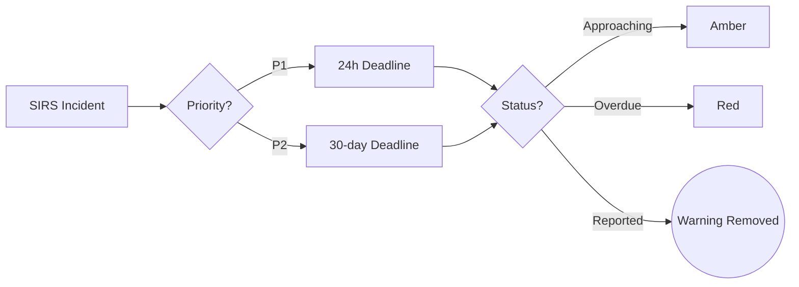

---

### User Story 10 — One-Time Data Migration from CRM (Priority: P2)

As a System Administrator, I can run a one-time migration that moves all existing incident records from Zoho CRM into Portal so that Portal becomes the single source of truth for all incidents — historical and new.

**Why this priority**: Portal is replacing CRM for incidents entirely (clean cut, no dual-system period). All historical data must be present in Portal from day one so that Care Partners have complete incident history during calls. The existing Zoho sync job is decommissioned after migration.

**Independent Test**: Run the migration job against a test dataset and verify all CRM incidents appear in Portal with correct field mapping, including CAT 1-5 triage values mapped to the new 4-tier harm classification.

**Acceptance Scenarios**:

1. **Given** the migration job is run against the CRM incident dataset, **When** it completes, **Then** all existing incidents are created in Portal with correct field mappings: dates, reporter, description, origin, classification, outcomes, and resolution
2. **Given** an existing CRM incident has a CAT 1-5 triage value, **When** migrated, **Then** the triage value is auto-mapped to the 4-tier harm classification (CAT 1→Severe, CAT 2→Moderate, CAT 3→Low, CAT 4-5→Clinical Notification) and the original CAT value is preserved in a legacy field for audit
3. **Given** the migration completes successfully, **When** the Zoho incident sync job is decommissioned, **Then** no further CRM sync occurs and Portal is the sole system for incident management
4. **Given** a Care Partner views a migrated incident, **When** they open the detail view, **Then** the incident is fully editable and behaves identically to a Portal-originated incident

**Flow:**

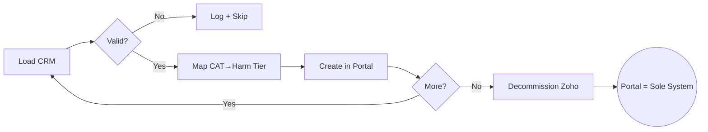

---

### User Story 11 — Gradual Rollout via Feature Flag (Priority: P2)

As a Product Owner, I can control access to the new incident management features via a feature flag so that we can roll out to early adopters first and expand gradually.

**Why this priority**: Even with a clean cut from CRM, a phased rollout allows co-design with early adopters as Marianne recommended. The flag controls visibility of the new V2 form, edit capability, and related features while the team validates with real users.

**Independent Test**: Enable the flag for one organisation and verify they see the full V2 incident capabilities, while another organisation sees a simpler view.

**Acceptance Scenarios**:

1. **Given** the feature flag is enabled for Organisation A, **When** a Care Partner from Organisation A views incidents, **Then** they see the "Report Incident" button and can create and edit incidents using the V2 form
2. **Given** the feature flag is disabled for Organisation B, **When** a Care Partner from Organisation B views incidents, **Then** they see incident records (migrated from CRM) but without create/edit capability until rollout reaches them
3. **Given** the feature flag is enabled globally, **When** all organisations have access, **Then** the flag can be removed and the feature is permanently available

**Flow:**

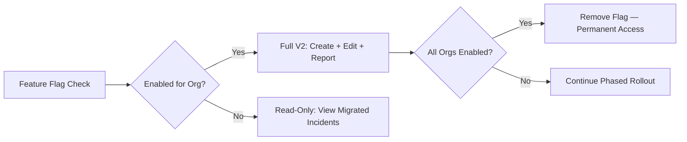

---

### User Story 12 — Public Incident Intake Form (Priority: P2)

As a care recipient, family member, support worker, or representative, I can report an incident via a public intake form (no login required) so that anyone involved in a client's care can raise an incident without needing Portal access.

The public form uses the same V2 structure as the internal Portal form but is accessible via a standalone link. Incidents submitted through the public form are flagged for review by a Care Partner or Coordinator before being fully accepted into the system.

**Why this priority**: Marianne's V2 form was designed for all reporter types including care recipients and family. Restricting intake to Portal-logged-in users excludes the very people closest to incidents. A public form enables anyone to report while maintaining quality control through review.

**Independent Test**: Access the public form link without logging in, submit an incident with client details and description, and verify it appears in Portal as "Pending Review" for a Care Partner to accept.

**Acceptance Scenarios**:

1. **Given** a family member accesses the public incident form link, **When** they fill in the V2 form sections and submit, **Then** the incident is created in Portal with a "Pending Review" status and the reporter's name, contact details, and relationship are recorded
2. **Given** a public-submitted incident is pending review, **When** a Care Partner or Coordinator opens the review queue, **Then** they see the incident details and can accept (linking to the correct package), request more information, or reject with a reason
3. **Given** a Care Partner accepts a public-submitted incident, **When** they confirm the package association and harm classification, **Then** the incident enters the standard lifecycle (Reported → Triaged → ...) and appears in the package incidents tab
4. **Given** a public-submitted incident is rejected, **When** the reviewer provides a reason, **Then** the rejection is recorded in the audit trail

**Flow:**

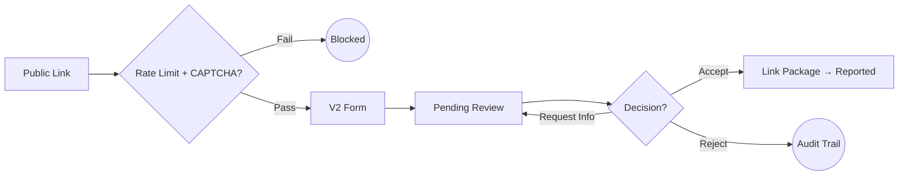

---

### User Story 13 — Auto-Escalation Based on Harm Classification (Priority: P3 — Phase 2)

As a Clinical Team member, I can trust that the system automatically routes incidents to the right person based on harm classification so that critical incidents are never missed and I don't need to manually triage every report.

**Why this priority**: Stakeholder vision from Sian Holman — "the system should know based on the triage category who needs to be notified and when." Phase 2 builds on the structured data captured in Phase 1 intake.

**Independent Test**: Create a Severe Harm incident and verify the system generates an escalation notification to the assigned clinical nurse within the configured timeframe.

**Acceptance Scenarios**:

1. **Given** a reporter submits a Severe Harm incident, **When** the incident is saved, **Then** the system automatically notifies the assigned clinical nurse and the POD leader within 1 hour
2. **Given** a reporter submits a Moderate Harm incident, **When** the incident is saved, **Then** the system notifies the clinical team within 1 business day
3. **Given** no acknowledgement is received within the escalation timeframe, **When** the deadline passes, **Then** the system escalates to the next level (e.g., Head of Clinical Governance)

**Flow:**

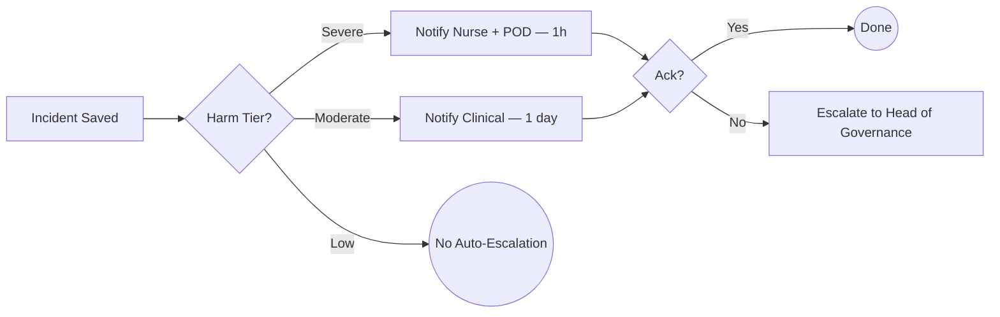

---

### User Story 14 — Incident → Case Automation (Priority: P3 — Phase 2)

As a Clinical Team member, when an incident warrants a clinical response, I can have the system automatically create a clinical case so that the incident resolution is tracked through the clinical pathway.

**Why this priority**: Currently, the link between incidents and management plans/cases is manual. Automating this closes a major gap in the care cycle. Depends on CLI (Clinical Portal Uplift) epic.

**Independent Test**: Resolve an incident with "Requires clinical case" and verify a case is automatically created and linked back to the incident.

**Acceptance Scenarios**:

1. **Given** a Clinical Team member resolves an incident and selects "Create clinical case", **When** the resolution is saved, **Then** a new case is created in the Clinical Pathways system pre-populated with incident details
2. **Given** a case was created from an incident, **When** the Clinical Team member views the incident, **Then** they see a link to the associated case
3. **Given** a case was created from an incident, **When** the Clinical Team member views the case, **Then** they see the originating incident linked

**Flow:**

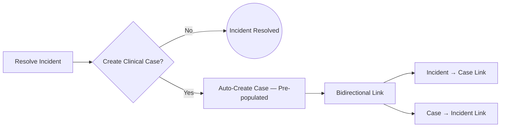

---

### User Story 15 — Risk Profile Auto-Update (Priority: P3 — Phase 2)

As a Clinical Team member, when an incident reveals a new or changed risk, I can have the system automatically update the client's risk profile so that the care plan reflects the latest information.

**Why this priority**: SAH Manual s8.6.2 mandates care plan review when an incident occurs. Currently this is manual. Depends on RNC2 (Future State Care Planning) epic.

**Independent Test**: Create an incident for a client with an existing risk profile and verify the risk profile is flagged for review.

**Acceptance Scenarios**:

1. **Given** an incident is recorded for a client with an existing risk profile, **When** the incident is saved, **Then** the risk profile is flagged as "Review required — incident recorded"
2. **Given** an incident is classified as Severe Harm, **When** the clinical team reviews it, **Then** the system suggests specific risk categories to update based on the incident type
3. **Given** a risk profile is updated following an incident, **When** the update is saved, **Then** the audit trail links the risk change to the originating incident

**Flow:**

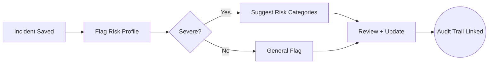

---

### User Story 16 — SIRS Deadline Enforcement with Alerts (Priority: P4 — Phase 2)

As a Clinical Governance lead, I can rely on the system to enforce SIRS reporting deadlines with automated alerts so that Trilogy Care never misses a Commission reporting obligation.

**Why this priority**: Phase 1 provides visibility; Phase 2 adds enforcement. Automated alerts replace the manual memory-based system and provide an audit trail for Commission reviews.

**Independent Test**: Create a SIRS Priority 1 incident and verify that alerts are sent at 12 hours, 20 hours, and when overdue.

**Acceptance Scenarios**:

1. **Given** a SIRS P1 incident is approaching its 24-hour deadline, **When** 12 hours remain, **Then** the assigned clinical lead receives an alert
2. **Given** a SIRS P1 incident is approaching its deadline, **When** 4 hours remain, **Then** escalation alerts are sent to the Head of Clinical Governance
3. **Given** a SIRS incident passes its deadline without being marked as "Reported", **When** the deadline expires, **Then** the system generates an overdue alert and flags the incident in the governance dashboard

**Flow:**

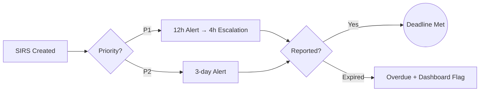

---

### User Story 17 — Incident Analytics and Export (Priority: P4 — Phase 2)

As a Clinical Governance lead, I can view trend analysis, pattern detection, and Commission-ready reports across all incidents so that I can prepare for governance reviews, identify systemic risks, and demonstrate continuous improvement.

**Why this priority**: With \~2,781 incidents per quarter and no analytics, pattern analysis is impossible. Commission audit readiness requires demonstrable quality improvement cycles.

**Independent Test**: Navigate to the incidents dashboard and verify trend charts display, filters work, and export produces a formatted report.

**Acceptance Scenarios**:

1. **Given** a Clinical Governance lead opens the incidents dashboard, **When** they select the last quarter, **Then** they see trend charts: incidents by harm tier, incidents by type, repeat incidents, resolution timelines
2. **Given** the dashboard shows a pattern (e.g., spike in falls at a specific location), **When** the lead drills into the data, **Then** they see individual incidents contributing to the pattern with links to the records
3. **Given** a Clinical Governance lead needs a Commission report, **When** they export, **Then** a formatted report is generated with: incident counts by SIRS category, P1/P2 reporting compliance, resolution rates, and trend analysis

**Flow:**

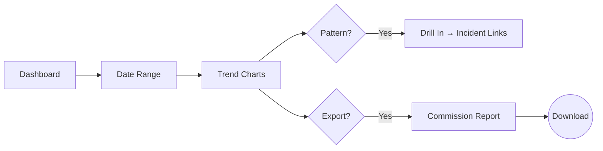

---

### User Story 18 — Notifications and In-App Alerts (Priority: P4 — Phase 2)

As a Care Partner or Clinical Team member, I receive timely notifications about incidents relevant to me so that I can respond promptly without needing to manually check the incidents list.

**Why this priority**: No notifications currently exist. Auto-escalation and deadline tracking (Phase 2) require a notification system to be effective.

**Independent Test**: Create an incident and verify the assigned care partners and clinical team receive in-app and/or email notifications.

**Acceptance Scenarios**:

1. **Given** a new incident is raised for a package, **When** the incident is saved, **Then** the assigned Care Partner for that package receives an in-app notification
2. **Given** an incident is escalated (Severe or Moderate harm), **When** the escalation is triggered, **Then** the clinical team receives a notification with incident summary and required action
3. **Given** a Care Partner is assigned a follow-up action on an incident, **When** the follow-up date approaches, **Then** they receive a reminder notification

**Flow:**

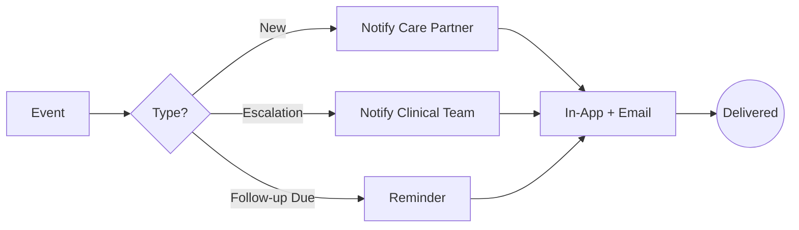

---

### User Flow Summary

**Phase 1 — End-to-End Incident Lifecycle:**

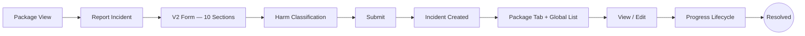

**Phase 2 — Automation Layer:**

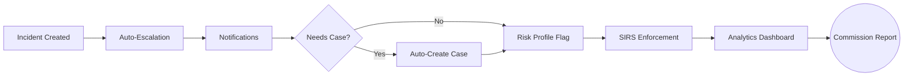

**Incident Intake Channels:**

```mermaid
flowchart LR
    A[Internal] --> D[V2 Form] --> E[Created — Reported] --> F[Package Tab + Global List]
    B[Public] --> C{Rate Limit + CAPTCHA} -->|Pass| G[Pending Review] --> H{Accept?}
    H -->|Yes| D
    H -->|Reject| I((Audit Trail))
    C -->|Fail| J((Blocked))
```

**Incident Lifecycle State Transitions:**

```mermaid
stateDiagram-v2
    [*] --> PendingReview : Public
    [*] --> Reported : Internal
    PendingReview --> Reported : Accepted
    PendingReview --> Rejected : Rejected
    Reported --> Triaged
    Triaged --> Escalated
    Triaged --> Actioned : Skip (low harm)
    Escalated --> Actioned
    Actioned --> Disclosed
    Disclosed --> Resolved
    Rejected --> [*]
    Resolved --> [*]
```

**SIRS Compliance Flow:**

```mermaid
flowchart LR
    A[Incident] --> B{SIRS?}
    B -->|No| C[Standard Lifecycle]
    B -->|Yes| D{P1/P2} -->|P1| E[24h]
    D -->|P2| F[30 days]
    E & F --> G[Ph1: Visible Deadline] --> H[Ph2: Auto Alerts]
    H --> I{Reported?} -->|Yes| J((Compliant))
    I -->|No| K[Overdue — Cannot Delete]
```

---

### Out of Scope

- **SIRS submission to My Aged Care Provider Portal** — the system tracks deadlines and compliance but actual submission to ACQSC remains a manual process via My Aged Care
- **Ongoing CRM sync** — after the one-time migration, no further sync between CRM and Portal occurs in either direction
- **Anonymous reporting** — the Best Practice Guide mentions allowing anonymous reporting, but this requires separate policy decisions and is deferred
- **Police notification tracking** — the documentation review identifies this as a gap, but tracking police involvement is captured in the outcomes checklist (Phase 1) and full police notification workflow is deferred

---

### Edge Cases

- What happens when an incident is raised against a client with no active package? The system should allow raising the incident but flag the missing package association for resolution.
- What happens when a reporter raises an incident but doesn't know the client's Support at Home ID? The form should accept name + DOB as minimum identification.
- What happens when a Care Partner raises an incident for a self-managed client? The form works identically — Trilogy remains legally responsible regardless of management model.
- What happens when an incident is raised outside business hours? Harm classification timeframes are in business days (except Severe Harm which is 24 hours absolute). The system should calculate deadlines accordingly.
- What happens if the one-time CRM migration encounters an incident with missing or invalid data? The migration job logs the error, skips the record, and produces a report of unmigrated incidents for manual review.
- What happens if a migrated incident has a CAT value that doesn't cleanly map (e.g., blank triage)? The harm classification is set to "Clinical Notification Only" (safest default) and flagged for clinical review.
- What happens when a Care Partner changes harm classification after initial intake? Both the original intake classification and the current classification are recorded for audit trail purposes.
- What happens when a SIRS deadline has already passed when the incident is first classified as SIRS? The deadline shows as overdue immediately; the system does not prevent saving.
- What happens when an incident is soft-deleted? It is removed from the default list but retained for audit; SIRS-reportable incidents cannot be deleted (only resolved).

---

## Requirements

### Functional Requirements

**Phase 1 — Portal Intake + Viewer**

- **FR-001**: System MUST allow Care Partners to raise new incidents directly from a package's record
- **FR-002**: System MUST present the V2 incident form with all 10 sections (client identification, incident details, reporter details, description, harm classification, outcomes, actions taken, escalation details, follow-up plan, client notification)
- **FR-003**: System MUST pre-fill client identification (name, DOB, Support at Home ID) when raising from a package context
- **FR-004**: System MUST enforce selection of one harm classification tier (4-tier, replacing CAT 1–5) and one classification (Clinical / Non-clinical / SIRS) before submission
- **FR-005**: System MUST display timeframes for action corresponding to the selected harm tier
- **FR-006**: System MUST support selecting multiple outcomes from the outcomes checklist
- **FR-007**: System MUST support selecting multiple actions from the actions-taken checklist
- **FR-008**: System MUST capture trend information (has this happened before, part of a trend) with optional free text
- **FR-009**: System MUST capture escalation details (who contacted, date/time, outcome)
- **FR-010**: System MUST capture follow-up plan (GP appointment, care plan update required, monitoring requirements)
- **FR-011**: System MUST capture client notification status (yes/no/not yet, date, method, feedback)
- **FR-012**: System MUST provide an Edit/Detail page for viewing and editing all incident fields
- **FR-013**: System MUST display incidents on the package incidents tab sorted most-recent-first with: date, harm classification, description summary, resolution status
- **FR-014**: System MUST provide an empty state with a "Report Incident" action when a package has no incidents
- **FR-015**: System MUST provide the global incidents list with filtering by harm tier, resolution status, date range, and trend flag
- **FR-016**: System MUST support a one-time data migration of all existing CRM incidents into Portal, mapping CAT 1-5 triage to the 4-tier harm classification (CAT 1→Severe, CAT 2→Moderate, CAT 3→Low, CAT 4-5→Clinical Notification) and preserving original values in a legacy field
- **FR-017**: System MUST decommission the Zoho incident sync job after migration — Portal becomes the sole system for incident management
- **FR-018**: System MUST ensure migrated incidents are fully editable and behave identically to Portal-originated incidents
- **FR-019**: System MUST record the reporter's relationship to the care recipient
- **FR-020**: System MUST record the location of the incident
- **FR-021**: System MUST be controllable via a feature flag toggled per organisation — when disabled, the current read-only views remain; when enabled, create and edit capabilities appear
- **FR-022**: System MUST allow Clinical Team members to assign SIRS priority (P1/P2) to reportable incidents
- **FR-023**: System MUST auto-calculate SIRS reporting deadlines: 24 hours from reported date for Priority 1, 30 days from reported date for Priority 2
- **FR-024**: System MUST display SIRS deadline urgency indicators: approaching (amber) and overdue (red)
- **FR-025**: System MUST allow Clinical Team members to mark a SIRS incident as "Reported" and record the report date
- **FR-026**: System MUST capture an immutable intake snapshot recording the original harm classification at time of creation (separate from current values if later changed)
- **FR-027**: System MUST maintain a complete audit trail for every incident creation, update, and field change with acting user and timestamp
- **FR-028**: System MUST implement the V2 incident lifecycle: Reported → Triaged → Escalated → Actioned → Disclosed → Resolved. Incidents MAY skip stages when not applicable (e.g., skip Escalated for Low Harm). Each skip must record a justification. CRM-migrated incidents are mapped to the nearest V2 stage.
- **FR-029**: System MUST require resolution when stage is changed to "Resolved"
- **FR-030**: System MUST prevent deletion of SIRS-reportable incidents (soft-delete only for non-SIRS)
- **FR-031**: System MUST show a visual indicator for incidents with outstanding disclosure (client not yet informed)
- **FR-032**: System MUST allow any Care Partner or Coordinator with access to a package to create and edit incidents on that package. SIRS priority assignment and "Reported" marking require Clinical Team access.
- **FR-033**: System MUST provide a public incident intake form (no login required) that care recipients, family members, support workers, and representatives can use to report incidents. Public-submitted incidents sit in a pre-lifecycle "Pending Review" queue until accepted by a Care Partner or Coordinator, at which point they enter the lifecycle at "Reported". Rejected submissions never enter the lifecycle. The form MUST include rate limiting (max 5 submissions per IP per hour) and CAPTCHA to prevent abuse.

**Phase 2 — Full IMS with Automation**

- **FR-034**: System MUST auto-escalate incidents to clinical staff based on harm classification tier and configured routing rules
- **FR-035**: System MUST create a clinical case when an incident is resolved with "Requires clinical case" (depends on CLI epic)
- **FR-036**: System MUST flag the client's risk profile for review when an incident is recorded (depends on RNC2 epic)
- **FR-037**: System MUST enforce SIRS reporting deadlines with automated alerts at configurable thresholds
- **FR-038**: System MUST send in-app and/or email notifications for new incidents, escalations, and approaching deadlines
- **FR-039**: System MUST provide an incidents dashboard with trend analysis, pattern detection, and configurable date ranges
- **FR-040**: System MUST support export of incidents in a Commission-ready report format
- **FR-041**: System MUST track SIRS reportable incident types (8 types per Aged Care Act 2024)

### Key Entities

- **Incident**: An event during care delivery that caused or could cause harm. Key attributes: client identification, date/time, location, description, harm tier, stage, trend flag, reporter details, source (CRM or Portal), SIRS priority, SIRS deadline, intake harm classification snapshot. **Lifecycle**: Reported → Triaged → Escalated → Actioned → Disclosed → Resolved. CRM-synced incidents are mapped to the nearest V2 stage on import.
- **Incident Outcome**: A result of the incident for the client (e.g., hospital admission, first aid, police involvement). Multiple outcomes per incident.
- **Incident Action**: An action taken by the reporter in response (e.g., called 000, provided first aid, contacted supporter). Multiple actions per incident.
- **Incident Escalation**: Record of who was contacted, when, and the outcome. One per incident.
- **Incident Follow-Up**: GP appointment, care plan update requirement, monitoring plan. One per incident.
- **Incident Disclosure**: Whether client/representative was informed, date, method, feedback. One per incident.

---

## Success Criteria

### Measurable Outcomes

**Phase 1**

- **SC-001**: Care Partners can raise an incident from Portal in under 5 minutes (current CRM process takes 10-15 minutes with context-switching)
- **SC-002**: 100% of incidents raised from Portal include harm classification (currently 0% have structured triage at intake)
- **SC-003**: Care Partners can view a client's incident history within 2 clicks from the package view
- **SC-004**: Clinical Team can filter the global incidents list to find specific incidents within 10 seconds
- **SC-005**: Trend tracking is captured on at least 80% of incidents where recurrence is known
- **SC-006**: Open disclosure status is recorded on 100% of incidents
- **SC-007**: 100% of existing CRM incidents successfully migrated to Portal with correct field mapping
- **SC-008**: System supports the current volume of \~930 incidents per month without performance degradation
- **SC-009**: The Edit page is functional — 100% of incidents viewable and editable in Portal (eliminating the documented "Edit.vue missing" gap)
- **SC-010**: 100% of SIRS-classified incidents have an auto-calculated reporting deadline visible on the record
- **SC-011**: Zoho incident sync job successfully decommissioned post-migration with zero data loss

**Phase 2**

- **SC-012**: Zero missed SIRS Priority 1 deadlines (24h) after automated enforcement is enabled
- **SC-013**: Average time from incident creation to clinical acknowledgement reduced by 50% through auto-escalation
- **SC-014**: 100% of SIRS-reportable incidents have a system-enforced deadline with alert trail
- **SC-015**: Governance lead can generate a Commission-ready quarterly report in under 5 minutes

---

## Clarifications

### Session 2026-02-24

- Q: Should Phase 1 use the existing stage model (New/In Progress/Reviewed/Resolved/Insufficient) or introduce a new lifecycle? → A: New V2 lifecycle: Reported → Triaged → Escalated → Actioned → Disclosed → Resolved. CRM-synced incidents mapped to nearest stage on import.
- Q: How should the new 4-tier harm classification relate to existing triage (CAT 1-5) and classification (Clinical/Non-clinical/SIRS)? → A: 4-tier harm replaces CAT 1-5 triage only. Classification (Clinical/Non-clinical/SIRS) remains as a separate field.
- Q: How should the 10-section V2 intake form be presented? → A: Deferred to design phase.
- Q: Who can edit incidents after creation? → A: Any Care Partner or Coordinator with access to the package. SIRS priority assignment and "Reported" marking require Clinical Team access.
- Q: How should care recipients, family, and representatives report incidents? → A: Public intake form (no login required) + internal Portal page. Public submissions enter "Pending Review" for Care Partner/Coordinator acceptance.
- Q: What is the CRM migration strategy? → A: One-time migration + clean cut. All CRM incidents migrated to Portal in a one-off job. Zoho sync decommissioned. No dual-system period. CAT 1-5 auto-mapped to 4-tier harm (CAT 1→Severe, CAT 2→Moderate, CAT 3→Low, CAT 4-5→Clinical Notification).
- Q: Can incidents skip lifecycle stages? → A: Yes, stages can be skipped when not applicable (e.g., skip Escalated for Low Harm). Each skip must record a justification.
- Q: Where does "Pending Review" (public form submissions) fit in the lifecycle? → A: Pre-lifecycle queue. Once accepted by a Care Partner/Coordinator, the incident enters at "Reported". Rejected submissions never enter the lifecycle.
- Q: What protection against public form abuse? → A: Rate limiting (max 5 per IP per hour) + CAPTCHA.
- Q: Should there be additional data sensitivity controls beyond standard Portal ACL? → A: No, standard Portal role-based access is sufficient.
