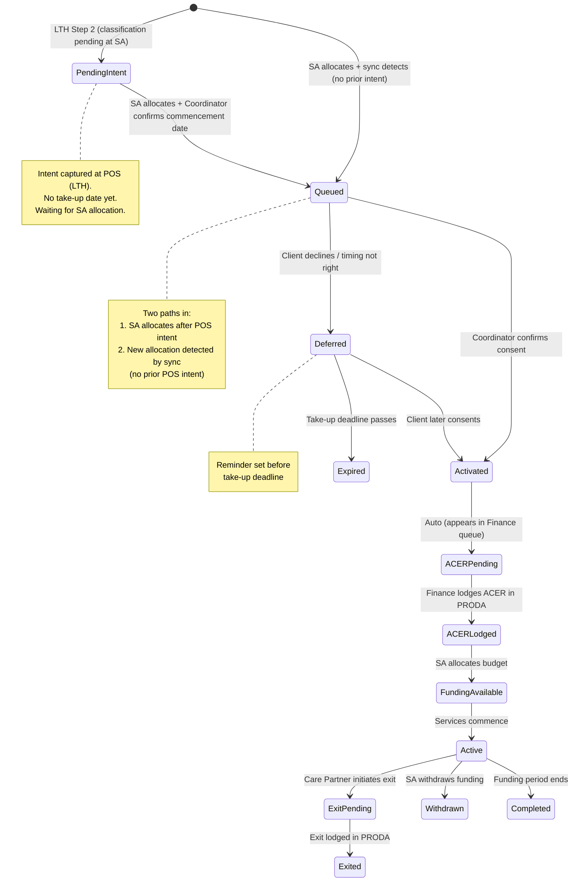
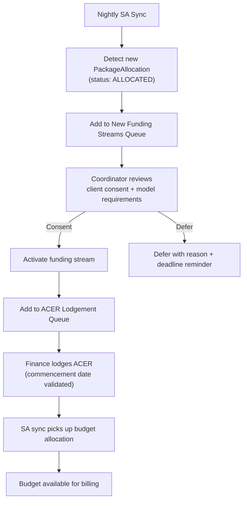

> **[View Mockup](/mockups/multi-package-support/index.html)**{.mockup-link}

# Feature Specification: Multi-Package Support (MPS)

**Feature Branch**: `epic/mps-multi-package-support`
**Created**: 2026-02-25
**Updated**: 2026-02-25
**Status**: Draft
**Input**: Idea brief + archived spec (Dec 2025) + Teams chat context (Jan 2026) + ACER Lodgement Process Streamlining meeting (Feb 2026) + codebase architecture review

---

## Overview

Portal supports clients with multiple concurrent funding classifications from Services Australia, but currently operates as if each client has a single funding stream. MPS enables the full lifecycle for multi-classification clients: detecting new classifications via the SA API, tracking ACER lodgement per funding stream, managing consent and activation per stream, and providing visibility into which streams are pending, active, or withdrawn.

This replaces the current manual process where Budget Coordinators discover missing funding streams after onboarding and manually add them, ACER lodgements are tracked in CRM against a single CR-ID, and newly approved short-term pathway funding (AT, HM, Restorative Care, End of Life) goes unnoticed until someone happens to check.

**Key Actors**:
- **Finance Team** (Brennan, Lydia, Jacob) — Lodge ACERs for clients based on the "ACER to be lodged" report, currently in CRM
- **Budget Coordinators** — Manage funding streams and budgets per client
- **Care Partners** — Manage client relationships, consent to activate funding streams, deliver services under specific funding streams

**Epic Dependencies**:
- **Lead to HCA (LTH)** — Captures primary and secondary classifications at point of sale (Step 2 of conversion wizard)
- **Client HCA** — Manages post-onboarding agreement amendments when new funding streams are added
- **SAH API** — Underlying Services Australia integration that provides classification and allocation data via nightly API sync
- **Budget Reloaded** — Budget plan generation per funding stream (already supports multiple streams)

---

## User Scenarios & Testing

### User Story 1 — Detect New Funding Classifications (Priority: P1)

As a Budget Coordinator, I can see when a client has been approved for new funding classifications by Services Australia, so that I can action the onboarding of those funding streams without manual discovery.

**Why this priority**: This is the root cause of the problem. Finance and Care teams currently have no visibility into new classifications until someone manually checks the SA portal or stumbles across them. 60+ restorative care approvals were recently discovered purely through an ad-hoc API check.

**Independent Test**: Can be tested by verifying that the nightly SA sync detects a new `PackageAllocation` with status `ALLOCATED` for a classification the client didn't previously have, and that this appears in the new funding streams queue.

**Acceptance Scenarios**:

1. **Given** a client has an active ongoing (ON) funding stream, **When** Services Australia approves them for Restorative Care (RC), **Then** the nightly sync creates a new `PackageAllocation` record and the client appears in the "Entry" queue with the RC classification highlighted.

2. **Given** a client appears in the "Entry" queue, **When** a Budget Coordinator views the queue, **Then** they see: client name, existing funding streams, new classification(s), approval date, and take-up deadline.

3. **Given** a client has been approved for multiple new classifications simultaneously (e.g., AT + HM), **When** the sync runs, **Then** each new classification appears as a separate line item in the queue.

4. **Given** a client already has an active RC funding stream and receives a second RC approval, **When** the sync runs, **Then** the system does not create a duplicate queue entry (only first-time approvals trigger queue entries per classification type).

---

### User Story 2 — Funding Stream Activation Workflow (Priority: P1)

As a Care Partner, I can review a client's newly approved funding classification and decide whether to activate it, so that we only lodge ACERs and commence funding for streams the client has consented to.

**Why this priority**: Not all approved funding should be automatically activated. Restorative Care requires the client to switch to fully coordinated management. End of Life has timing implications (3-month window). AT/HM may not be wanted. Activating without consent has resulted in withdrawn funding and regulatory issues.

**Independent Test**: Can be tested by selecting a client from the "Entry" queue, reviewing the classification details, and either activating or deferring the stream.

**Acceptance Scenarios**:

1. **Given** I select a client from the "Entry" queue, **When** I open the activation workflow, **Then** I see: funding stream type, classification details, approval period, take-up deadline, any coordination model requirements (e.g., RC requires fully coordinated), and the client's current management model.

2. **Given** the client has consented to activate Restorative Care, **When** I click "Activate Funding Stream", **Then** the system records the activation, creates the funding record, and marks the stream as ready for ACER lodgement.

3. **Given** the client does not want to activate a funding stream (e.g., they don't want to use their RC approval yet), **When** I click "Defer", **Then** the stream is marked as deferred with a reason, and a reminder is set before the take-up deadline.

4. **Given** a funding stream requires a management model change (RC requires fully coordinated), **When** the coordinator views the activation workflow, **Then** a warning is displayed: "This funding stream requires Fully Coordinated management. The client is currently Self-Managed."

5. **Given** a funding stream has a take-up deadline approaching, **When** fewer than 14 days remain, **Then** the queue item is flagged as urgent.

---

### User Story 3 — ACER Lodgement per Funding Stream (Priority: P1)

As a Finance team member, I can lodge an ACER for each activated funding stream independently, so that each classification is properly registered with Services Australia and funding becomes available.

**Why this priority**: ACER lodgement is currently tied to a single CR-ID in CRM's Consider module. Under Support at Home, every funding stream needs its own ACER entry record. The Finance team is manually working through a CRM report with no visibility into which streams have been lodged and which haven't.

**Independent Test**: Can be tested by viewing a client with multiple activated funding streams, lodging an ACER for one stream, and verifying the other streams still show as pending lodgement.

**Acceptance Scenarios**:

1. **Given** a client has three activated funding streams (ON, RC, AT), **When** a Finance team member views the client's ACER status, **Then** they see each stream listed separately with its lodgement status: Pending, Lodged, or Not Required.

2. **Given** I lodge an ACER for the ON funding stream, **When** I mark it as lodged with the lodgement date, **Then** the ON stream status changes to "Lodged" while RC and AT remain "Pending".

3. **Given** a client's ACER has been lodged for a funding stream, **When** the SA sync runs and the funding becomes available (budget allocated), **Then** the funding record is created/updated with the SA budget data.

4. **Given** a client has a funding stream where ACER was lodged after the take-up date, **When** the quarterly funding review occurs, **Then** the system flags this stream as at risk of withdrawal (SA may withdraw funding lodged after take-up date).

5. **Given** I need to view all pending ACER lodgements across all clients, **When** I access the "Entry" queue (ACER Pending tab), **Then** I see a filterable list of all streams awaiting lodgement, sorted by take-up deadline urgency.

---

### User Story 4 — Multi-Stream Package View (Priority: P1)

As a Care Partner, I can see all of a client's funding streams and their statuses on the package page, so that I have a complete picture of the client's funding without checking multiple systems.

**Why this priority**: Currently, Portal shows labels for funding classifications but there's no structured view showing the lifecycle status of each stream (allocated, activated, ACER lodged, funding available, withdrawn). Coordinators have to cross-reference CRM and the SA portal.

**Independent Test**: Can be tested by navigating to a client's package page and verifying all funding streams are displayed with accurate lifecycle statuses.

**Acceptance Scenarios**:

1. **Given** a client has funding streams ON (active), RC (allocated but not activated), AT (ACER lodged, awaiting funding), **When** I view their package page, **Then** I see a "Funding Streams" section showing each stream with its current lifecycle status.

2. **Given** a funding stream has been withdrawn by Services Australia, **When** I view the package page, **Then** the withdrawn stream is clearly marked with the withdrawal date and reason.

3. **Given** a client's funding stream transitions from one status to another (e.g., ACER lodged → funding available), **When** the SA sync runs, **Then** the package page reflects the updated status.

4. **Given** a client has a funding stream with an active budget, **When** I view that stream's details, **Then** I see: total amount, available amount, used amount, start/end dates, and entitlement items.

5. **Given** I click on an entry row in the queue, **When** the show page loads, **Then** I see: full entry history (status transitions with timestamps and user attribution), associated funding records, care partner assignment, lodgement dates, and an audit trail of all actions taken on this entry.

---

### User Story 5 — Commencement Date Validation (Priority: P2)

As a Finance team member, I can set the commencement date for a funding stream with validation against the take-up deadline, so that we avoid lodging ACERs that will result in withdrawn funding.

**Why this priority**: A significant number of funding withdrawals are caused by ACERs lodged after the take-up date, or with commencement dates that fall in the wrong quarter. This creates cascading problems for budgets and billing.

**Independent Test**: Can be tested by attempting to set a commencement date after the take-up deadline and verifying the system prevents it.

**Acceptance Scenarios**:

1. **Given** a funding stream has a take-up deadline of 2026-03-31, **When** I attempt to set a commencement date of 2026-04-05, **Then** the system blocks the action with: "Commencement date must be on or before the take-up deadline (2026-03-31)."

2. **Given** a commencement date falls in the first week of a quarter, **When** I select a date between the 1st and 7th, **Then** the system displays a warning: "Commencement dates in the first week of the quarter may result in funding being allocated to the previous quarter. Consider a date after the 7th."

3. **Given** a funding stream's take-up deadline is within 14 days, **When** the ACER has not been lodged, **Then** the system sends a notification to the Finance team and flags the stream as urgent in the queue.

---

### User Story 6 — Funding Stream Change Notifications (Priority: P2)

As a Budget Coordinator, I receive notifications when a client's funding landscape changes, so that I can take timely action on new approvals, level changes, or withdrawals.

**Why this priority**: The team currently discovers funding changes reactively. New AT/HM approvals go unnoticed. Level changes (MSO → FSO, Level 1 → Level 2) sometimes cause unexpected funding withdrawals. A notification system ensures proactive management.

**Independent Test**: Can be tested by simulating SA sync data changes and verifying notifications are generated for the correct recipients.

**Acceptance Scenarios**:

1. **Given** a client receives a new classification approval, **When** the nightly sync detects the new `PackageAllocation`, **Then** a notification is sent to the Budget Coordinator and Care Partner assigned to the client.

2. **Given** a client's funding is withdrawn by Services Australia, **When** the sync detects the withdrawal, **Then** a high-priority notification is sent to the Budget Coordinator and Finance team.

3. **Given** a client's classification level changes (e.g., SAH 3 → SAH 4), **When** the sync detects the change, **Then** a notification is sent indicating a budget review is needed.

4. **Given** a client's offer type changes (MSO → FSO), **When** the sync detects the change, **Then** a notification is sent indicating the funding amount will change and a new budget should be prepared.

---

### User Story 7 — Restorative Care / End of Life Package Activation (Priority: P2)

As a Care Partner, I can activate a Restorative Care or End of Life funding stream with the appropriate care model changes, so that the client receives the correct level of clinical coordination and a separate care plan where required.

**Why this priority**: RC and EOL require fully coordinated management and often a separate clinical care partner. The current system has no way to model this — clients have been activated for RC without a clinical care partner assigned, which is a regulatory requirement.

**Independent Test**: Can be tested by activating an RC funding stream and verifying the system prompts for a clinical care partner and management model change.

**Acceptance Scenarios**:

1. **Given** I activate a Restorative Care funding stream for a self-managed client, **When** the activation flow begins, **Then** the system requires me to: assign a clinical care partner, confirm the management model change to fully coordinated for RC, and acknowledge that the client's ongoing package remains self-managed.

2. **Given** I activate an End of Life funding stream, **When** the activation flow begins, **Then** the system displays a warning: "End of Life is a once-in-a-lifetime, 3-month funding stream. Ensure the client wants to activate now rather than preserving their ongoing funding first."

3. **Given** an EOL stream is activated, **When** the original ongoing package has active services, **Then** the ongoing package status changes to "Dormant" (not terminated) and the EOL package becomes the active billing context.

4. **Given** a client has both an ongoing care partner and a clinical RC care partner, **When** I view the client's care circle, **Then** both care partners are visible with their associated funding stream clearly indicated.

---

### User Story 8 — Multi-Care Partner & Clinical Care Partner Assignment (Priority: P2)

As a Care Partner, I can assign multiple care partners to a package and designate a clinical care partner, so that clients with multiple funding streams have the correct care team for each stream.

**Why this priority**: Currently, a package has a single care partner. With multiple funding streams (especially RC), a client needs both their ongoing care partner and a clinical care partner for RC. The Feb 6 meeting confirmed "multiple care partners for different funding streams" is needed, and the clinical care partner role is RC-specific.

**Independent Test**: Can be tested by assigning multiple care partners to a package and verifying both appear in the care circle with their associated funding stream.

**Acceptance Scenarios**:

1. **Given** a client has both ongoing and RC funding streams, **When** I view the care partner assignment on the package, **Then** I can assign multiple care partners (multi-select) and designate one as the clinical care partner for RC.

2. **Given** a clinical care partner is assigned for RC, **When** a Care Partner views the client's care circle, **Then** both the ongoing care partner and clinical care partner are visible with their associated funding stream clearly indicated.

3. **Given** a client's RC funding stream is completed or exited, **When** the stream is closed, **Then** the clinical care partner assignment remains for audit but is marked as inactive.

4. **Given** I need to reassign a clinical care partner (e.g., staff change), **When** I update the assignment, **Then** the change is logged and the new partner inherits the RC coordination responsibilities.

---

### Edge Cases

- **What happens if SA withdraws funding after ACER lodgement?** The system flags the withdrawal, notifies the Finance team, and marks the stream as "Withdrawn" on the package view. The withdrawal is tracked for audit.

- **What happens if a client's classification changes mid-quarter (e.g., MSO → FSO)?** The sync detects the change, sends a notification, and the Budget Coordinator must generate a new budget reflecting the updated funding amount.

- **What happens if funding is lodged after the take-up date?** The system warns at commencement date entry. If it proceeds, the stream is flagged as at-risk. If SA withdraws, the workaround process is documented but not automated (this is an SA-side issue).

- **What happens if a client doesn't want to activate a short-term pathway (e.g., RC)?** The stream is deferred with a reason. The take-up deadline is tracked and reminders sent. If the take-up deadline passes, the entry moves to `Expired` status — distinct from `Completed` (funding period ended after use) and `Withdrawn` (SA withdrew funding). Expired means the funding was never taken up.

- **What happens if a client has both AT and HM approved simultaneously?** Each appears as a separate queue item. They can be activated independently. Home Modifications is a once-in-a-lifetime funding stream.

- **What happens with externally coordinated clients who get approved for RC?** The system warns that RC requires fully coordinated management. The coordinator must have a conversation with the client before activation.

- **What happens if the funding stream from the SA API doesn't drop off after end-of-life?** This is a known SA-side issue. The system should track the ACER lodgement date and expected end date, and flag streams that remain active beyond their expected duration for manual review.

---

### User Flow Summary

**Entry Record Lifecycle:**


**Two entry paths into the lifecycle:**

| Path | Trigger | Initial Status | Next Step |
|------|---------|----------------|-----------|
| **At POS (LTH)** — classification is **pending** at SA | Sales captures intent in Step 2 | `Pending Intent` | When SA allocates → notify Coordinator → confirm commencement date → `Queued` |
| **At POS (LTH)** — classification is **allocated** at SA | Sales captures intent + commencement date in Step 2 | `Queued` (skips Pending Intent) | Coordinator confirms consent → `Activated` |
| **Post-onboarding** — new allocation detected by sync | Nightly sync finds new `PackageAllocation` | `Queued` (auto-created) | Coordinator confirms consent → `Activated` |

**ACER Lodgement Process:**


---

## Requirements

### Functional Requirements

**Funding Stream Detection**

- **FR-001**: System MUST detect new `PackageAllocation` records (status: `ALLOCATED`, `current_place_indicator: Y`) during the nightly SA sync and surface them in a "Entry" queue.
- **FR-002**: System MUST only queue first-time approvals per classification type per client (duplicate approvals for the same classification type do not create new queue entries).
- **FR-003**: System MUST display take-up deadline (`takeup_end_date` from `PackageAllocation`) for each queued funding stream.
- **FR-004**: System MUST exclude classifications with zero funding codes (AT Zero Funding code `55`, HM Zero Funding code `56`) from the queue.

**Activation Workflow**

- **FR-005**: System MUST support an activation workflow for each funding stream that captures: consent confirmation, management model acknowledgement, and care partner assignment (where required).
- **FR-006**: System MUST warn when a funding stream requires a different management model than the client's current model (e.g., RC requires Fully Coordinated).
- **FR-007**: System MUST support deferral of funding stream activation with a reason and automatic reminders before the take-up deadline.
- **FR-008**: System MUST require assignment of a clinical care partner when activating RC funding streams. EOL does not require a separate clinical care partner (ongoing goes dormant, existing care partner handles EOL).

**ACER Lodgement**

- **FR-009**: System MUST track ACER lodgement status per funding stream per client (Pending, Lodged, Not Required).
- **FR-010**: System MUST provide an "Entry" queue (ACER Pending tab) showing all streams awaiting lodgement, sortable by take-up deadline urgency.
- **FR-011**: System MUST validate that the commencement date is on or before the take-up deadline.
- **FR-012**: System MUST warn when a commencement date falls in the first 7 days of a quarter.
- **FR-013**: System MUST record the ACER lodgement date and commencement date per funding stream.

**Package View**

- **FR-014**: System MUST display all funding streams on the package page with their lifecycle status (Allocated, Activated, ACER Pending, ACER Lodged, Funding Available, Active, Exit Pending, Exited, Withdrawn, Completed, Deferred, Expired).
- **FR-015**: System MUST show funding details per stream: total amount, available amount, used amount, start/end dates, entitlement items.
- **FR-015a**: System MUST display the coordination fee % per funding stream (read-only, sourced from budget rules — e.g., RC = 0% internal coordination, EOL = 10%). Fee editing remains in Budget Reloaded.
- **FR-016**: System MUST clearly indicate withdrawn funding streams with withdrawal date and reason.
- **FR-017**: System MUST support showing multiple care partners per client with their associated funding stream.

**Notifications**

- **FR-018**: System MUST send a notification to the assigned Care Partner when new classifications are detected for their client.
- **FR-019**: System MUST send high-priority notifications when funding is withdrawn.
- **FR-020**: System MUST send notifications when classification level or offer type changes.
- **FR-021**: System MUST send urgent notifications when a take-up deadline is within 14 days and ACER has not been lodged.

**Restorative Care / End of Life Specifics**

- **FR-022**: System MUST support EOL package dormancy — when EOL is activated, the ongoing package transitions to "Dormant" (not Terminated).
- **FR-023**: System MUST support reactivation of a dormant package when the EOL period ends.
- **FR-024**: System MUST display a warning when activating EOL: "End of Life is a once-in-a-lifetime, 3-month funding stream."
- **FR-025**: System MUST enforce that RC streams have a clinical care partner assigned before activation. EOL uses the existing care partner (ongoing goes dormant).
- **FR-026**: System MUST display separate care plans per funding stream where the stream requires fully coordinated management.

**Point of Sale (LTH Integration)** — *LTH-dependent: deferred until LTH epic ships. MPS v1 uses sync detection path only.*

- **FR-027** *(LTH-dependent)*: At LTH Step 2, the system MUST display both allocated AND pending classifications from the SA API for the client's referral code.
- **FR-028** *(LTH-dependent)*: For **pending** classifications at POS, the system MUST capture intent ("Does the client plan for us to deliver this service?") and create an EntryRecord in `Pending Intent` status with no commencement date.
- **FR-029** *(LTH-dependent)*: For **allocated** classifications at POS, the system MUST capture intent + commencement date (validated ≤ take-up date) and create an EntryRecord in `Queued` status.
- **FR-030** *(LTH-dependent)*: When a `Pending Intent` EntryRecord's classification becomes allocated (detected by sync), the system MUST notify the assigned Care Partner to confirm commencement date and final consent before promoting to `Queued`.

**Multi-Care Partner Assignment**

- **FR-034**: System MUST support assigning multiple care partners to a single package (multi-select), each associated with a specific funding stream or role.
- **FR-035**: System MUST support a "Clinical Care Partner" designation for RC funding streams, distinct from the primary care partner.
- **FR-036**: System MUST display all assigned care partners in the client's care circle with their associated funding stream clearly indicated.
- **FR-037**: When a funding stream is completed or exited, the associated care partner assignment MUST remain for audit but be marked as inactive.

**Data Integrity**

- **FR-031**: System MUST NOT automatically lodge ACERs or activate funding streams without explicit user action (no auto-activation).
- **FR-032**: System MUST track all entry record status transitions with timestamps and user attribution for audit.
- **FR-033**: System MUST prevent the same classification from being activated twice for the same approval period.

### Key Entities

- **EntryRecord** (new): Represents an ACER lodgement per classification per package. An Entry is lodged once per classification type (e.g., one Entry for Restorative Care). A single Entry can produce multiple Funding Streams (e.g., RC entry → RC funding + CM funding). Contains: package_id, classification_code, status (Pending Intent, Queued, Activated, ACER Pending, ACER Lodged, Funding Available, Active, Exit Pending, Exited, Deferred, Expired, Withdrawn, Completed), lodgement_date, commencement_date, consent_date, consent_confirmed_by, deferred_reason, take_up_deadline, intent_captured_at (POS date, nullable), withdrawal_reason (from SA API, nullable). Note: clinical care partner is assigned at the Package level, not on individual EntryRecords.

  **Relationships:**
  - BelongsTo Package
  - BelongsTo PackageAllocation (the SA-issued allocation that triggered this entry)
  - HasMany Funding (the funding streams activated by this entry)

- **PackageAllocation** (existing): SA-issued place allocation per classification. Contains `classification_code`, `offer_type`, `takeup_end_date`, `status`. Source of truth for what SA has approved. The nightly sync creates these — MPS creates EntryRecords from them.

- **Funding** (existing): Per-package-per-stream budget record synced from SA via event sourcing. Already supports multiple streams per package. Contains SA budget amounts, usage tracking, entitlement items. An Entry can produce 1:many Fundings (e.g., RC entry → RC + CM funding streams).

- **FundingStream** (existing): Reference table of 10 funding stream types (ON, CM, RC, EL, AT, HM, CU, HC, AS, VC). Already seeded and used throughout the system.

- **PackageClassification** (existing): SA-issued classification records per package. Contains classification code, type, approval period, effective dates.

**Entity Relationship:**
```
PackageAllocation (SA approval)
    └── EntryRecord (ACER lodgement, 1 per classification)
            └── Funding (1:many, budget records per stream)
                    └── FundingStream (reference: ON, RC, CM, etc.)
```

> **Key distinction**: An Entry Record is lodged per *classification* (e.g., one ACER for Restorative Care). But a single classification can produce *multiple* funding streams (e.g., RC classification → RC funding stream + Care Management funding stream). The Entry is the lodgement unit; Funding Streams are the budget units.

---

## Success Criteria

### Measurable Outcomes

- **SC-001**: Zero funding streams missed — 100% of new SA classifications detected and queued within 24 hours of SA approval.

- **SC-002**: Finance team can view all pending ACER lodgements across all clients in a single queue (replaces CRM report).

- **SC-003**: ACER lodgement status is tracked per funding stream — no more single-CR-ID limitation.

- **SC-004**: Zero ACERs lodged after take-up deadline due to system-enforced date validation.

- **SC-005**: Commencement date warnings prevent first-week-of-quarter lodgements that cause funding withdrawals.

- **SC-006**: Care Partners can see all funding stream statuses on a single package page (replaces cross-referencing CRM + SA portal).

- **SC-007**: Notifications sent within 1 hour of sync completion for new classifications, withdrawals, and level changes.

- **SC-008**: RC and EOL activations always have a clinical care partner assigned (system-enforced, 100% compliance).

---

## Assumptions

1. **SA API is the source of truth**: The nightly sync via `SyncPackageFromServicesAustralia` already detects new `PackageAllocation` records. MPS builds on this existing sync, not a new integration.

2. **Existing funding model supports multiple streams**: The `Funding` model already has a `funding_stream_id` FK and supports multiple records per package. No schema change needed for the funding records themselves.

3. **Home Care Agreement covers all funding streams**: The current client agreement includes schedules for all funding stream types. Activating a new stream requires issuing a budget for the new stream, not a new agreement (per Romy's confirmation in the Feb 2026 meeting).

4. **Consent is required before activation**: Some streams (especially RC, EOL) require explicit client conversation before activation. The system must never auto-activate.

5. **Take-up date enforcement is critical**: Funding withdrawal due to late ACER lodgement is a material financial issue. Date validation is a hard requirement, not a nice-to-have.

6. **EOL and Home Modifications are once-in-a-lifetime**: These have special considerations — EOL is 3 months max, HM is a one-time allocation. The system must communicate these constraints.

---

## Out of Scope

| Item | Handled By | Reason |
|------|-----------|--------|
| Automatic ACER lodgement via SA API | Future phase | SA API EntryDeparture endpoint exists. Manual lodgement first, API automation later. |
| Exit/departure workflow (closing individual funding streams) | Future phase | EntryRecord schema includes `ExitPending` and `Exited` statuses. Exit UI and PRODA API integration built later. Terminology: "exit" = close a funding stream; "terminate" = end entire client relationship (per Feb 6 meeting). |
| Multiple package records per client | Deferred | Original approach (Dec 2025 spec). Current approach uses single package with multiple funding streams, which matches the existing data model |
| Zoho CRM sync for funding streams | Separate track | CRM deal module changes for multi-classification tracking are a CRM initiative |
| Restorative Care care plan template | Clinical & Care Plan epic | RC-specific care plan structure is a clinical workflow concern |
| Funding withdrawal workarounds | Not automated | SA-side issue when classifications change (MSO → FSO, level changes). Process documented but not automated |
| HCA form generation per funding stream | Client HCA | Budget/schedule documents per stream are part of agreement management |

---

## Related Documents

| Document | Location |
|----------|----------|
| Idea Brief | [IDEA-BRIEF.md](IDEA-BRIEF.md) |
| Archived Spec (Dec 2025 — multiple packages approach) | [context/raw_context/spec-archived-2026-01-27.md](context/raw_context/spec-archived-2026-01-27.md) |
| Teams Chat Context | [context/raw_context/teams-chat-2026-01-27.md](context/raw_context/teams-chat-2026-01-27.md) |
| ACER Lodgement Meeting Transcript (Feb 2026) | Downloaded JSON transcript |
| Context README | [context/README.md](context/README.md) |
| Completion Report (Dec 2025) | [context/COMPLETION-REPORT.md](context/COMPLETION-REPORT.md) |
| Design Brief | [design.md](design.md) |

---

## Clarifications

### Session 2026-02-25
- Q: When a funding stream is activated (coordinator confirms consent), does it automatically become 'ACER Pending', or does someone manually mark it ready for ACER lodgement? -> A: Auto — activation immediately moves the stream to ACER Pending. Finance sees it in their lodgement queue without a separate handoff step.
- Q: Where does the 'New Funding Streams' queue live in Portal? -> A: New dedicated page (e.g., /funding-streams/queue) accessible from the sidebar. Finance and Coordinators each see their relevant items. Clear, discoverable, filterable.
- Q: Should ACER lodgement be automated via SA API or remain manual? -> A: Manual record only. Finance lodges in PRODA manually, then records the lodgement date in Portal. Portal is a tracking/queue system, not a lodgement system. API automation is a future phase.
- Q: Should Entry Records (ACERs) be a separate entity from Funding Streams? -> A: Yes, separate entity. An Entry is lodged per classification (1 ACER for RC). But one classification can produce multiple funding streams (RC entry → RC + CM funding). Entry = lodgement unit; Funding Stream = budget unit. Relationship: PackageAllocation → EntryRecord (1:1) → Funding (1:many).
- Q: For new clients via LTH, should MPS create Entry Records for ALL classifications from Step 2, or only primary? -> A: All classifications. LTH Step 2 captures primary + secondary. MPS creates an EntryRecord for each. Finance sees all of them in their ACER queue immediately after agreement is sent.
- Q: Should the sync auto-create EntryRecords when new PackageAllocations are detected? -> A: Yes, auto-create in 'Queued' status. No manual acknowledgement step needed. Sync detects → creates EntryRecord → appears in queue → notification sent.
- Q: Who should be notified when new funding classifications are detected? -> A: Assigned Care Partner only. They handle the consent conversation with the client and are the primary action-taker. Finance sees pending items via their ACER queue (no push notification needed).
- Q: Should withdrawal tracking capture the reason from SA API? -> A: Yes — capture status + date + status_reason from PackageAllocation. SA returns this field. Gives Finance context on why funding was pulled without manual data entry.
- Q: Should the funding streams queue and ACER lodgement queue be the same page or separate? -> A: Single page at '/entries' with tabs/filters: 'New / Awaiting Consent', 'ACER Pending', 'Lodged', 'All'. Both Coordinators and Finance use the same page with different filter defaults. Page is called "Entry" (not "Funding Streams").
- Q: Should MPS include a backfill migration for existing clients with untracked allocations? -> A: Yes, automated backfill. Migration creates EntryRecords from existing PackageAllocations that don't have a matching entry. Status inferred from existing data: if a Funding record already exists for the allocation → `Active`; if allocation is active but no funding exists → `Queued`. This avoids flooding the queue with already-actioned entries.
- Q: At LTH (POS), the API shows both allocated AND pending classifications. How should pending ones be handled? -> A: Capture intent at POS for pending classifications (EntryRecord in 'Pending Intent' status, no commencement date). When SA later allocates, notify Coordinator to confirm commencement date before promoting to 'Queued'. For already-allocated classifications at POS, capture intent + commencement date → EntryRecord goes straight to 'Queued'.
- Q: When a pending classification becomes allocated, auto-promote or notify + confirm? -> A: Notify + confirm. Timing may have changed since POS. Coordinator must confirm commencement date and final consent before the entry moves to 'Queued'.

### Session 2026-02-25 (continued)
- Q: RC allows 2 episodes/year. When a client finishes episode 1 and SA approves episode 2, should a new EntryRecord be created? -> A: Reuse existing EntryRecord — it stays as-is (completed). The new RC allocation creates new Funding records under the same EntryRecord. The Entry is the lodgement unit and doesn't reset; the Funding Stream model handles the new episode's budget. The unique constraint remains `(package_id, classification_code)`.
- Q: Should EntryRecord include exit/departure statuses for closing individual funding streams (inverse of ACER entry)? -> A: Yes — add `ExitPending` and `Exited` statuses to the lifecycle schema now. Don't build the exit workflow in MPS v1, but model the data so it's ready. Exit UI and PRODA API integration built in a future phase. Terminology: "exit" = close a funding stream; "terminate" = end entire client relationship.
- Q: Should EOL require a clinical care partner like RC does? -> A: RC only. EOL doesn't need a separate clinical care partner since ongoing goes dormant and the existing care partner handles EOL. Per Romy (Feb 6): "Restorative care is the edge case" for needing a clinical care partner.
- Q: Should MPS include coordination fee rules per funding stream (RC = 0% internal, EOL = 10%)? -> A: Display only (read-only). Show the coordination fee % per funding stream on the Entry queue and package view. Fee editing and calculation stays in Budget Reloaded.
- Q: Backfill — should all entries start as 'Queued' (flooding queue) or infer status from existing data? -> A: Infer status. If a Funding record exists for the allocation → `Active`. If allocation is active but no funding → `Queued`. Avoids flooding Finance with already-actioned entries.
- Q: Should /entries page default tab vary by role (Coordinators → New, Finance → ACER Pending)? -> A: Same view for everyone. All users land on the same default tab. No role-based filtering — everyone sees the full queue and switches tabs as needed.
- Q: When RC episode 2 comes through, should the EntryRecord be reset? -> A: No. The EntryRecord stays as-is (completed). The entry date hasn't changed — the ACER was already lodged for RC. New RC allocation creates new Funding records under the same EntryRecord. The Entry is the lodgement unit and doesn't reset; the Funding Stream model handles the new episode's budget.
- Q: Does /entries need a show page or just modals? -> A: Both. Quick actions (activate, defer, lodge) via modals from table row actions. Clicking a row navigates to /entries/{id} show page with full entry history, funding records, care partner, audit trail.
- Q: Should clinical care partner be assigned at package level or entry/funding stream level? -> A: Package level. One clinical care partner field on the Package model (alongside existing care_partner and care_coordinator). Matches Romy's suggestion (Feb 6) of adding 'clinical care partner' to the left-hand menu alongside existing roles.
- Q: Should EntryRecord audit use Activity Log or Event Sourcing? -> A: Spatie Activity Log. Simple, consistent with existing codebase patterns (PackageAllocation, Funding, etc.). Logs status changes with timestamps, user, and old/new values. Event Sourcing is overkill for this use case.
- Q: Should care_partner_id remain on EntryRecord now that clinical care partner is at package level? -> A: Remove it. Clinical care partner lives on Package only. EntryRecord doesn't need to duplicate it. Simpler schema.
- Q: FR-027-030 (POS/LTH integration) depend on LTH epic. Defer or include? -> A: Defer to LTH. Tag FR-027-030 as LTH-dependent. MPS v1 only handles the post-onboarding sync detection path. POS intent capture built when LTH ships.
- Q: Who has access to /entries page? -> A: Finance + Care Partners (who act as coordinators) only. Actions further gated by policy: Care Partners can activate/defer; Finance can lodge ACERs. Note: "Coordinators" in this context = Care Partners who coordinate client care.
- Q: Should notifications be in-app only or also email? -> A: Database (in-app) only. No email. Matches Feb 6 meeting direction: notifications embedded in Portal inbox, not email alerts (which are often overlooked). Care Partners check Portal daily.
- Q: What should the default tab be on /entries? -> A: "New / Awaiting Consent" — shows entries that need action. Most useful default since it surfaces items requiring attention.
- Q: Should the entry queue be on the package index page or a standalone page? -> A: Standalone /entries page in the sidebar. Dedicated page, not a tab on the packages index.
- Q: Should 'Care Coordinator' and 'Care Partner' be standardized? -> A: Use 'Care Partner' everywhere. They are the same role in Portal — the person who manages the client relationship and activates entries.

## Clarification Outcomes

### Q1: [Dependency] The SAH API epic is infrastructure-critical. What is the SAH API delivery timeline relative to MPS?
**Answer:** The codebase already has the SA API integration in production: `domain/Package/Feature/PackageSync/Actions/SyncPackageFromServicesAustralia.php`, `SyncPackageAllocations.php`, and `FetchPackageClassificationsAction.php`. The `PackageAllocation` model (`domain/Package/Models/PackageAllocation.php`) already stores `classification_code`, `offer_type`, `takeup_end_date`, `status`, `status_reason`, `current_place_indicator`. The nightly sync already detects new allocations. **The SAH API dependency is already met. The sync infrastructure exists and is in production. MPS builds on top of existing sync results by creating EntryRecords from detected PackageAllocations. No new API integration is needed for MPS v1.**

### Q2: [Scope] US7-US8 introduce multi-care-partner assignment and clinical care partner designation. Does this conflict with CCU which also manages care partner relationships?
**Answer:** CCU manages the contact/care circle (external contacts: supporters, GPs, specialists, emergency contacts) with role taxonomy and authority mapping. MPS introduces multi-care-partner assignment at the package level (internal staff: care partner, clinical care partner, care coordinator). These are different concerns. The clarification sessions resolved that clinical care partner is a package-level field, not an EntryRecord field. **No conflict. CCU manages external contacts (care circle). MPS manages internal staff assignment (care partners). The clinical care partner field is added to the Package model as a new FK to users, alongside the existing `caseManager` (care partner) and `careCoordinator` relationships. These are orthogonal concerns.**

### Q3: [Data] What happens if the SA sync is delayed or fails? Is there a manual mechanism?
**Answer:** The existing sync (`SyncPackageFromServicesAustralia.php`) is a nightly job. If it fails, the next run picks up the delta. The clarification sessions resolve: "auto-create in 'Queued' status. No manual acknowledgement step needed." However, there is no manual entry mechanism described. **Recommendation: Add a manual "Add Entry" action on the /entries page for edge cases where the sync misses an allocation (SA API outage, data discrepancy). This is a safety valve, not the primary workflow. The manual entry should require a PackageAllocation reference or manual classification details. Flag manual entries differently from sync-created ones for audit purposes.**

### Q4: [Edge Case] Can a single client have different management models across funding streams simultaneously?
**Answer:** The clarification session (US7 acceptance scenario 1) explicitly states: "confirm the management model change to fully coordinated for RC, and acknowledge that the client's ongoing package remains self-managed." This means YES -- a client can be self-managed for their ongoing package and fully coordinated for RC simultaneously. **This is a per-funding-stream attribute, not a per-package attribute. The data model should support a management model per EntryRecord or Funding record, not change the package-level management model. The existing `PackageOptionEnum` (SELF_MANAGED_PLUS, etc.) is package-level. Recommendation: Add a `management_model` field to the EntryRecord for stream-specific overrides, while the package retains its overall model.**

### Q5: [UX] Where does the Entry queue live in Portal navigation?
**Answer:** Resolved in clarification session: "Standalone /entries page in the sidebar. Dedicated page, not a tab on the packages index." The page has tabs: 'New / Awaiting Consent', 'ACER Pending', 'Lodged', 'All'. Default tab is "New / Awaiting Consent." Access: Finance + Care Partners only. Quick actions via modals from table rows; clicking a row navigates to /entries/{id} show page. **Fully resolved. The /entries page is a standalone sidebar item with tab-based filtering.**

### Q6: [Data] The EntryRecord has 13 lifecycle statuses (Pending Intent through Completed). This is a complex state machine. Has this been validated against all funding stream types?
**Answer:** The lifecycle is well-documented in the spec with a Mermaid state diagram. The clarifications add nuance: Pending Intent is LTH-dependent (deferred to Phase 2), Expired is distinct from Completed and Withdrawn, ExitPending/Exited are modelled but not built in v1. The 10 FundingStream reference types (ON, CM, RC, EL, AT, HM, CU, HC, AS, VC) are already seeded. **The state machine is well-considered. For MPS v1, the active statuses are: Queued, Activated, ACER Pending, ACER Lodged, Funding Available, Active, Deferred, Expired, Withdrawn, Completed. Pending Intent and ExitPending/Exited are deferred. Recommendation: Implement the enum with all statuses now but only build UI/workflows for the v1 subset.**

### Q7: [Performance] The /entries page shows all entries across all clients. For an organisation with 1000+ clients and multiple funding streams each, this could be a large dataset. How is performance managed?
**Answer:** The spec says entries are filterable and sortable. The existing Portal uses server-side pagination patterns (e.g., `PackageBillsTable` with Inertia pagination). **Recommendation: Server-side pagination with filters (status tab, date range, search). The default "New / Awaiting Consent" tab will show a small subset. Index the `entry_records` table on `(status, created_at)` for efficient tab filtering. Load 25 entries per page with Inertia's pagination component.**

### Q8: [Integration] FR-004 excludes classifications with zero funding codes (AT code 55, HM code 56). How are these codes identified in the PackageAllocation data?
**Answer:** The existing `PackageAllocation` model stores `classification_code` as a string. The spec explicitly identifies AT Zero Funding = code 55, HM Zero Funding = code 56. **These should be defined as constants on the EntryRecord model or a dedicated enum. The sync logic filters these out before creating EntryRecords. Recommendation: Create a `FundingClassificationCode` enum or constants class that maps classification codes to their meaning, including zero-funding exclusions.**

## Refined Requirements

1. **Manual entry safety valve**: Add a manual "Add Entry" action on the /entries page for edge cases where SA sync misses an allocation. Manual entries should be flagged for audit distinction.
2. **Per-stream management model**: Add a `management_model` field to EntryRecord to support different management models per funding stream (e.g., self-managed for ON, fully coordinated for RC) without changing the package-level model.
3. **Classification code constants**: Define funding classification codes (including zero-funding exclusions) as named constants or an enum for maintainability.
4. **Full enum, partial build**: Implement the EntryRecord status enum with all 13 statuses but only build UI/workflows for the v1 subset (excluding Pending Intent, ExitPending, Exited).
