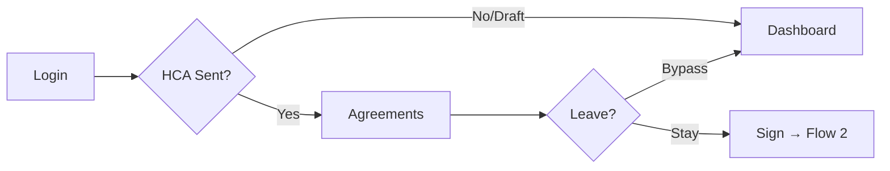
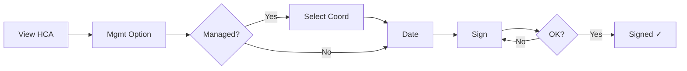
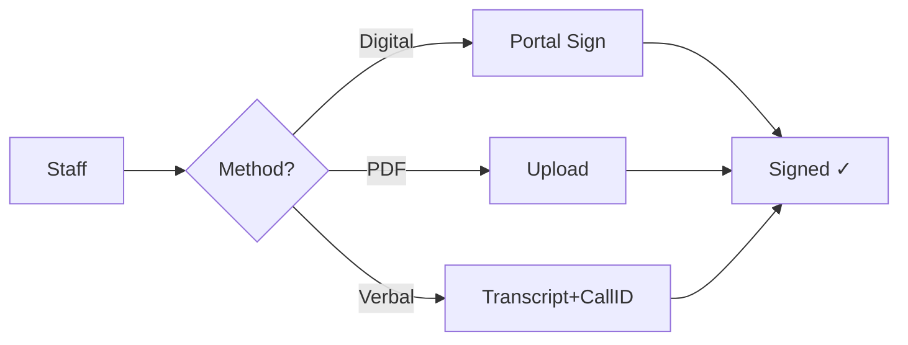
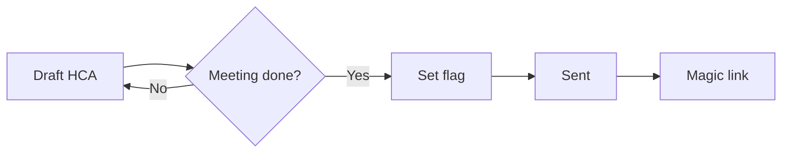
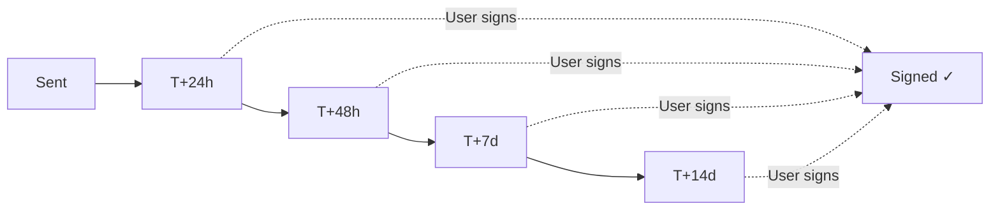
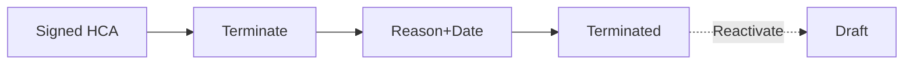
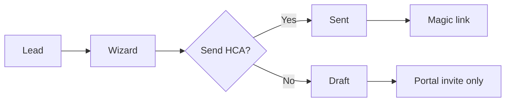
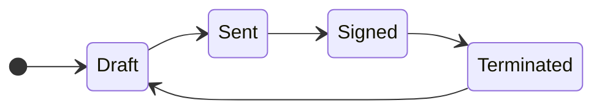

## Flow 1: First-Login Journey

## Flow 2: HCA Signing

## Flow 3: Staff Consent Capture

## Flow 4: Draft → Sent

## Flow 5: SLA Reminders

## Flow 6: Termination

## Flow 7: LTH Conversion

## State Model

## Quick Reference

| Flow | User Stories | Trigger | Result |
|------|--------------|---------|--------|
| 1 | US01 | First login | → Signing or Dashboard |
| 2 | US02, US16 | Sign HCA | → Signed |
| 3 | US06, US07 | Staff consent | → Signed |
| 4 | US05 | Post-meeting | → Sent |
| 5 | US09 | Time elapsed | → Reminders |
| 6 | US10, US15 | Terminate | → Terminated |
| 7 | US05 (LTH) | LTH convert | → Draft or Sent |

## Story Coverage

| Story | Flow | Description |
|-------|------|-------------|
| US01 | 1 | First-Login HCA Signing Flow |
| US02 | 2 | Digital In-Portal Signature |
| US03 | - | View Agreements List (UI only) |
| US04 | - | View Agreement Details (UI only) |
| US05 | 4, 7 | Draft→Sent Transition |
| US06 | 3 | Upload Signed PDF |
| US07 | 3 | Verbal Consent Capture |
| US09 | 5 | SLA Reminders |
| US10 | 6 | Terminate/Reactivate |
| US15 | 6 | Terminate with Compliance |
| US16 | 2 | Management Option Selection |
