# Video Analysis Report

**Generated:** 2026-02-04T15:38:18.941697
**Duration:** 404.3s
**Keyframes:** 185
**Transcript Segments:** 115

---

## Full Transcript

Hello, I just want to quickly walk through where I'm at with my designs for home care agreements and the capturing of the signature. So I'll just quickly walk through what I've got so far just to get some feedback. So prior to anything showing in portal, the sales team will convert the lead to consumer, send out the push form and then send out the sample agreement. When that sample agreement gets sent, ideally that's when you'll be able to see the sample agreement as part of the client's package too. So you'll be able to log into the portal, see this new portal and package architecture. Under profile, you'll have the agreement and fees tabs alongside client details and care circle. And within that, you'd see your home care agreement and all other agreements as well. Ideally, the variations of any of those agreements will be sat in the relevant category rather than a kind of section on its own. So here I'm just showing where you'd have the home care agreement. It'll outline the parties that are involved. Obviously for home care agreement, it's trilogy care, but for other agreements would be all your suppliers. You've got the created date, the statuses, which would change between sample pending, which would be pending signature and signed. And then you'll have the signed date and then the valid until once that has been completed. The filter search and filter by those different statuses as well, just for if you've got lots of agreements on the package. So you'd be able to go click view, you'd see the sample agreement and you'd go and convert it with the watermark and you'd be able to go convert it to sign when you're ready to capture that signature. So whether that's in the meeting or perhaps it's after the meeting, it will have the status of sample. And in terms of actually just viewing the document, in terms of interactivity, you can zoom in, zoom out, click between pages or just scroll and then expand to view full page. But once you convert to sign, then essentially all it does is just opens up the section on the right hand side, which captures the main contents of the agreement and then also the signature collection method. So if you're in the meeting and you want to capture a verbal signature, you'd go and select verbal signature and it will display these relevant fields afterwards. So the signed date, so that's the meeting date, the call ID and the full recording URL for from air call. And then the consent, consent transcript would just be like a copied and pasted section of the transcript, which actually contains the verbal consent. Not sure if we feel like that's necessary or not, but I've added it in and then just who it's been captured by. Similar for the signed document, you just have the signed date, upload the document and then again, who has been uploaded by and you'd be able to go and submit the two. And then it would just confirm that it's been signed and then it would navigate you to a completed state with the table view again. If you go and select a digital signature from client, then what it will do is it will remove the submit button and then it will display this card where you can go and click the button to say send email to client. And that will trigger an email which provides a link to portal for the client for them to go and sign digitally there. Once that's, once that has been sent, this card would update to a pending state, which is just saying that the signature request has been sent, who it's been sent by, what time, and then just that it's awaiting the signature. You can then go and resend that link as well if they claim that they haven't received it. I'll go through the client slide in a second. I'll just quickly walk through the different states. So for the signed document, this is what the completed state looks like. You'd then be able to see a full overview, you'd be able to download the document, see who was uploaded by, etc. and then terminate if necessary. And then you'd be able to flick between history as well, just similar to what we do with bills, etc. And you'd see like when a sample was created, when it was sent, when it was signed, and then ideally any variations of the agreement as well afterwards would all be contained here. And then again, pretty much the same for all of the different types of consent. So the verbal signature would have the URL to the recording, the consent transcript captured here as well, and then again, the history. And then for the client signature, just kind of capturing what they've checked off, and the date at which that was completed. So if you click terminate package, I've just got the the days due in one day, and they have different colours of just informational for 30 days, warning for seven, and then red, red display for high attention. Then we've got the on the valid until it will just display the number of days until that document expires to. And then as you can see here as well, you can see all the different statuses. Okay, I'll quickly walk over to the client side. So as soon as you've sent that request for a digital signature, the client would receive an email, I haven't got the email here, but it's just to show that you'd have an email there, you'd be able to click a link, and then that would take you and the client into portals, they'd log in, and it will direct them straight to the relevant section. So in this case, the home care agreement, and they'd be able to sign on the right hand side. So it will say it'll say who you're signing as or who you're logged in as. And then just outlining what this means by selecting that checkbox, and then that you can send to signing it electronically. So as soon as that checkbox is clicked, you'd be able to sign agreement, and then that would just convert to a signed document. I've enabled the decline button, I'm not sure if this is something that we necessarily want. But again, if they don't agree with anything, then they can decline. And then that will trigger us to go and follow up rather than just not signing and us not knowing at what point we should be following up. But as soon as you sign, it will display a modal again, similar to the internal view, and it will just navigate them back to the table again, wherever they were, I've just created a mobile view of this as well. Obviously, this will be available in the native app. So essentially, this is what it would look like, you'd go and click view your agreements, and it will display a preview, which you'd be able to scroll, you'd have to exit it and then sign below just so it's not super cluttered on the page. And then this is what the broader table view would look like as well. So you'd have your agreement, you'd navigate off to that, and then you'd see all of the individual agreements listed below like this. So in this case, where let's say a client logs in, and they didn't receive the link for the email, they just choose to log in first, then it will take them here to the dashboard, they receive an alert on their main dashboard, which would say please sign your home care agreement, and that would navigate them straight to here, like we had before. Or if they happen to click through to their agreements and fees, which they'd be able to go click drop down their name, select agreement and fees, and then that'll take them to this table view page. And again, similar to the internal view, they'd be able to go and click that view button on the table, and it will navigate them to this to the to this agreement, or if it is not official agreement at this point, and they'd be navigated to the sample agreement. And again, they can't do anything other than download, but it just allows them to preview the document where required. So that's everything that I've got so far. Yeah, just keen to get some feedback earlier on and if there's any fields that are required for home care agreements, and also any of the other agreements as well. good sex and good sex and good sex and good sex and good sex and good sex and good sex and good sex and good sex and good sex and good sex and good sex and good sex and good sex and good sex and good sex and good sex and good Thank you.

---

## Timeline (Keyframes + Transcript)

### [00:00.000] Keyframe 0

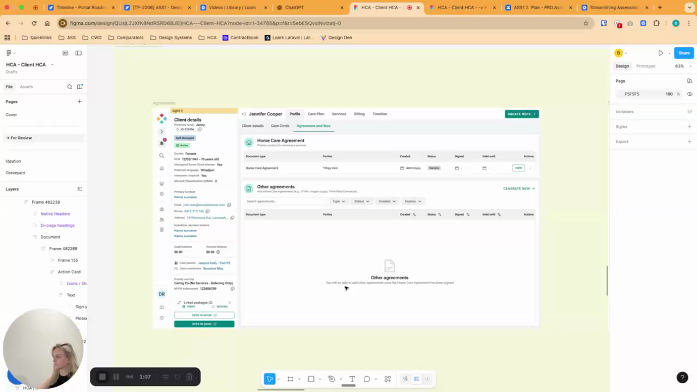

**Context:**
> Hello, I just want to quickly walk through where I'm at with my designs for home care agreements

**[00:01.899]** Hello, I just want to quickly walk through where I'm at with my designs for home care agreements

**[00:05.339]** and the capturing of the signature. So I'll just quickly walk through what I've got so far just to

**[00:09.480]** get some feedback. So prior to anything showing in portal, the sales team will convert the lead

**[00:13.800]** to consumer, send out the push form and then send out the sample agreement. When that sample

**[00:18.019]** agreement gets sent, ideally that's when you'll be able to see the sample agreement as part of

**[00:22.359]** the client's package too. So you'll be able to log into the portal, see this new portal and package

**[00:27.160]** architecture. Under profile, you'll have the agreement and fees tabs alongside client details

**[00:32.179]** and care circle. And within that, you'd see your home care agreement and all other agreements as well.

**[00:37.399]** Ideally, the variations of any of those agreements will be sat in the relevant category rather than

**[00:42.039]** a kind of section on its own. So here I'm just showing where you'd have the home care agreement.

### [00:44.232] Keyframe 1

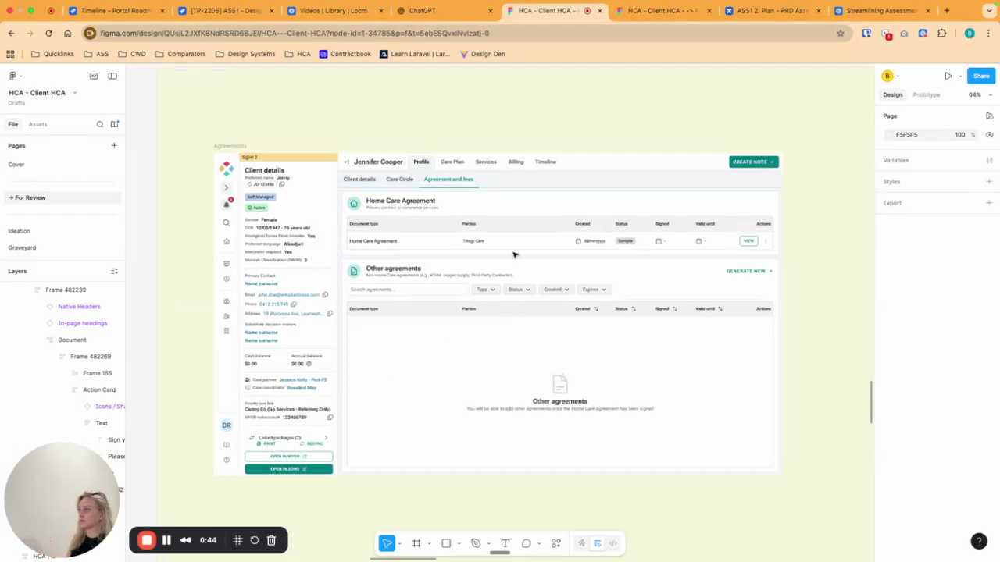

**Context:**
> a kind of section on its own. So here I'm just showing where you'd have the home care agreement.
> It'll outline the parties that are involved. Obviously for home care agreement, it's trilogy care,

### [00:46.133] Keyframe 2

**Context:**
> a kind of section on its own. So here I'm just showing where you'd have the home care agreement.
> It'll outline the parties that are involved. Obviously for home care agreement, it's trilogy care,

**[00:47.159]** It'll outline the parties that are involved. Obviously for home care agreement, it's trilogy care,

**[00:51.280]** but for other agreements would be all your suppliers. You've got the created date, the statuses,

**[00:55.500]** which would change between sample pending, which would be pending signature and signed. And then you'll

**[01:01.240]** have the signed date and then the valid until once that has been completed. The filter search and filter

**[01:06.340]** by those different statuses as well, just for if you've got lots of agreements on the package. So you'd be

### [01:12.367] Keyframe 3

**Context:**
> by those different statuses as well, just for if you've got lots of agreements on the package. So you'd be
> able to go click view, you'd see the sample agreement and you'd go and convert it with the watermark and you'd be

### [01:12.867] Keyframe 4

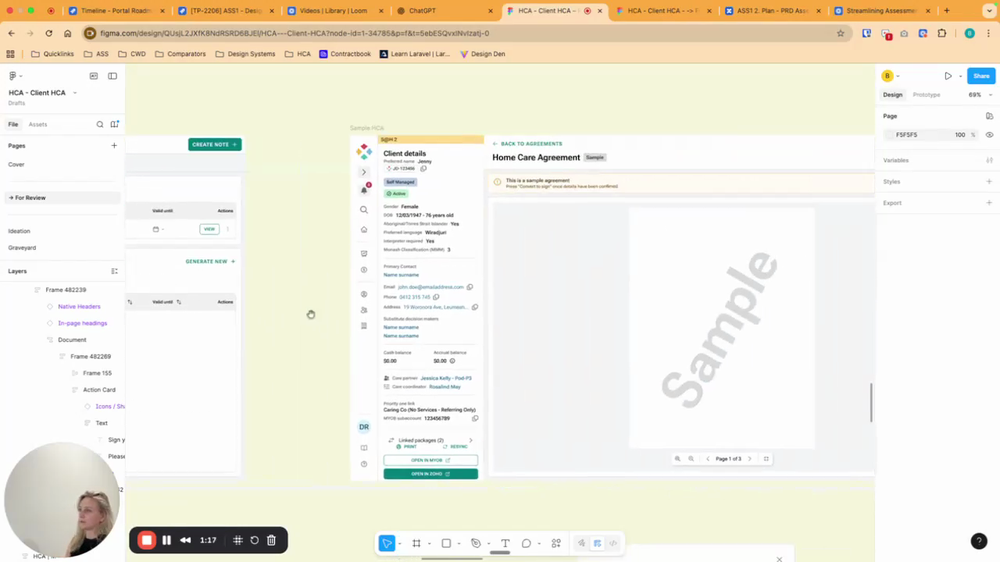

**Context:**
> by those different statuses as well, just for if you've got lots of agreements on the package. So you'd be
> able to go click view, you'd see the sample agreement and you'd go and convert it with the watermark and you'd be
> able to go convert it to sign when you're ready to capture that signature. So whether that's in the meeting or perhaps it's after the meeting,

**[01:13.000]** able to go click view, you'd see the sample agreement and you'd go and convert it with the watermark and you'd be

### [01:13.433] Keyframe 5

**Context:**
> by those different statuses as well, just for if you've got lots of agreements on the package. So you'd be
> able to go click view, you'd see the sample agreement and you'd go and convert it with the watermark and you'd be
> able to go convert it to sign when you're ready to capture that signature. So whether that's in the meeting or perhaps it's after the meeting,

**[01:17.739]** able to go convert it to sign when you're ready to capture that signature. So whether that's in the meeting or perhaps it's after the meeting,

**[01:23.959]** it will have the status of sample. And in terms of actually just viewing the document, in terms of interactivity,

**[01:29.379]** you can zoom in, zoom out, click between pages or just scroll and then expand to view full page.

### [01:33.700] Keyframe 6

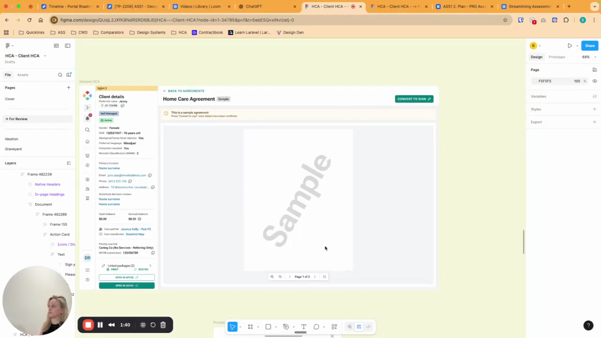

**Context:**
> you can zoom in, zoom out, click between pages or just scroll and then expand to view full page.
> But once you convert to sign, then essentially all it does is just opens up the section on the right hand side,

### [01:34.599] Keyframe 7

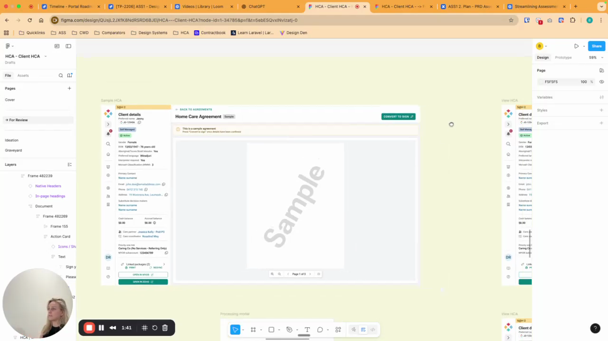

**Context:**
> you can zoom in, zoom out, click between pages or just scroll and then expand to view full page.
> But once you convert to sign, then essentially all it does is just opens up the section on the right hand side,

**[01:34.920]** But once you convert to sign, then essentially all it does is just opens up the section on the right hand side,

### [01:35.367] Keyframe 8

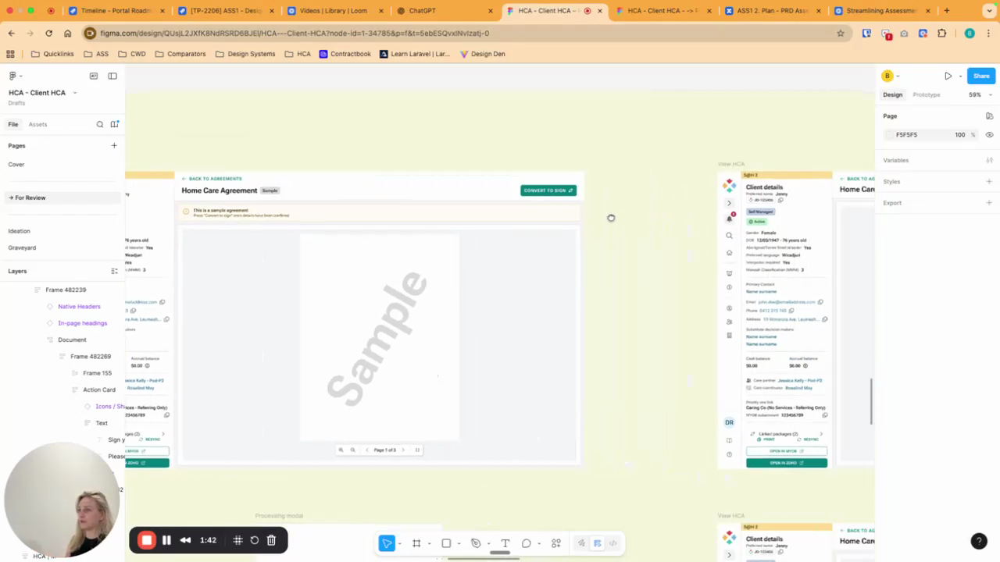

**Context:**
> you can zoom in, zoom out, click between pages or just scroll and then expand to view full page.
> But once you convert to sign, then essentially all it does is just opens up the section on the right hand side,
> which captures the main contents of the agreement and then also the signature collection method.

### [01:35.900] Keyframe 9

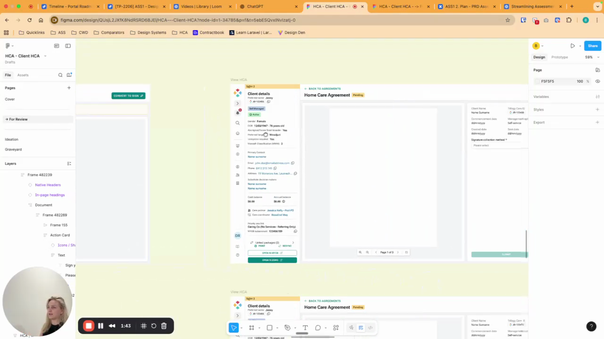

**Context:**
> you can zoom in, zoom out, click between pages or just scroll and then expand to view full page.
> But once you convert to sign, then essentially all it does is just opens up the section on the right hand side,
> which captures the main contents of the agreement and then also the signature collection method.

### [01:36.566] Keyframe 10

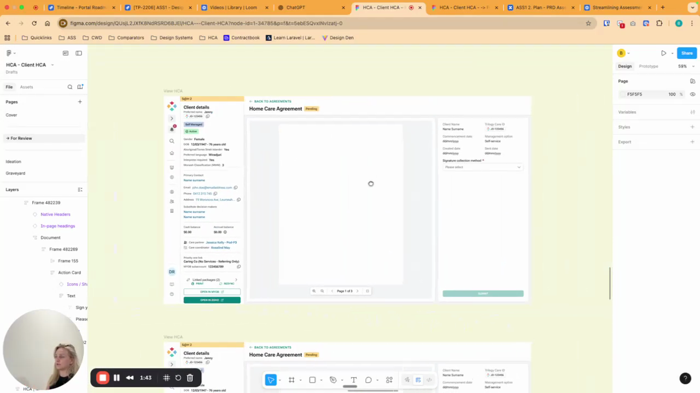

**Context:**
> you can zoom in, zoom out, click between pages or just scroll and then expand to view full page.
> But once you convert to sign, then essentially all it does is just opens up the section on the right hand side,
> which captures the main contents of the agreement and then also the signature collection method.

### [01:37.400] Keyframe 11

**Context:**
> But once you convert to sign, then essentially all it does is just opens up the section on the right hand side,
> which captures the main contents of the agreement and then also the signature collection method.

**[01:40.299]** which captures the main contents of the agreement and then also the signature collection method.

### [01:45.000] Keyframe 12

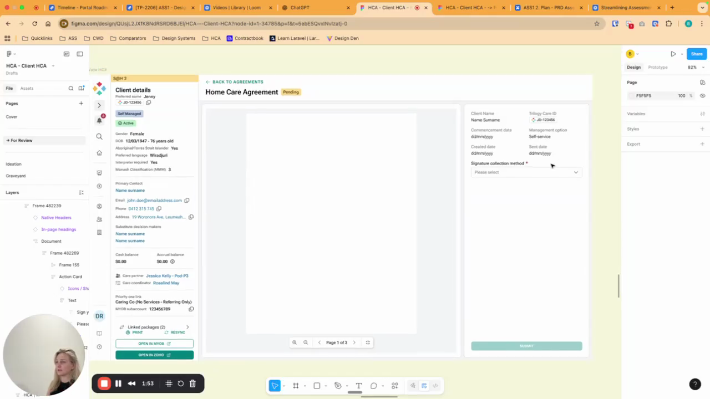

**Context:**
> which captures the main contents of the agreement and then also the signature collection method.
> So if you're in the meeting and you want to capture a verbal signature, you'd go and select verbal

**[01:45.000]** So if you're in the meeting and you want to capture a verbal signature, you'd go and select verbal

### [01:45.900] Keyframe 13

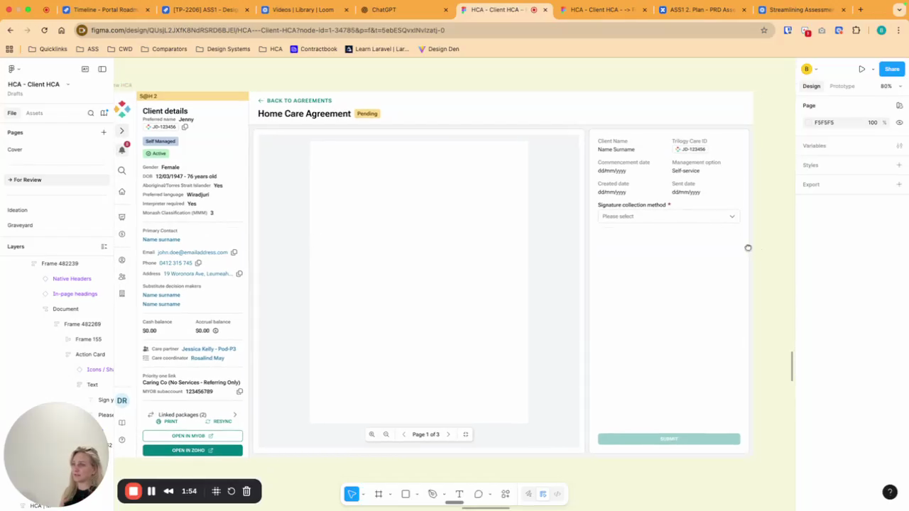

**Context:**
> which captures the main contents of the agreement and then also the signature collection method.
> So if you're in the meeting and you want to capture a verbal signature, you'd go and select verbal
> signature and it will display these relevant fields afterwards. So the signed date, so that's the

### [01:48.867] Keyframe 14

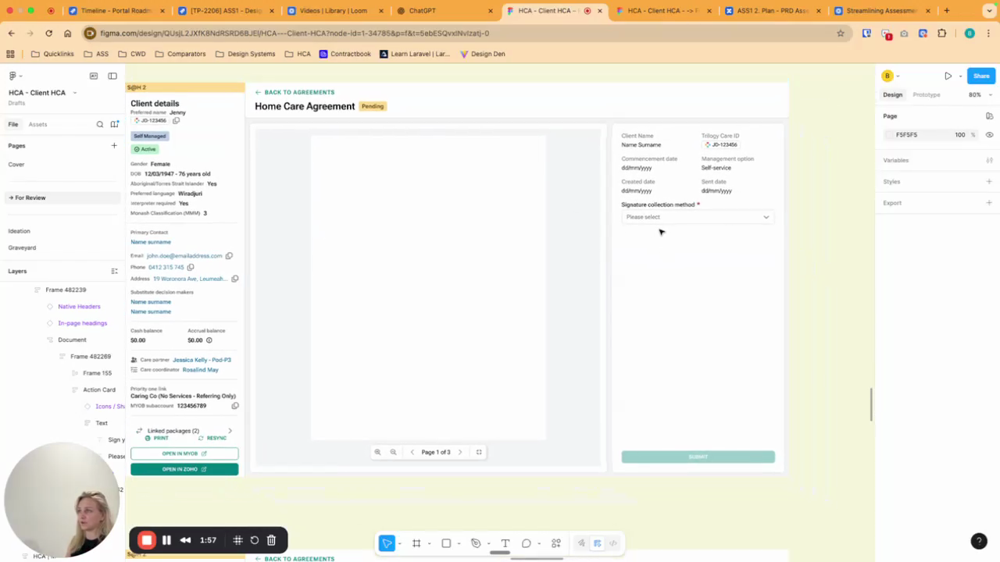

**Context:**
> So if you're in the meeting and you want to capture a verbal signature, you'd go and select verbal
> signature and it will display these relevant fields afterwards. So the signed date, so that's the

### [01:49.367] Keyframe 15

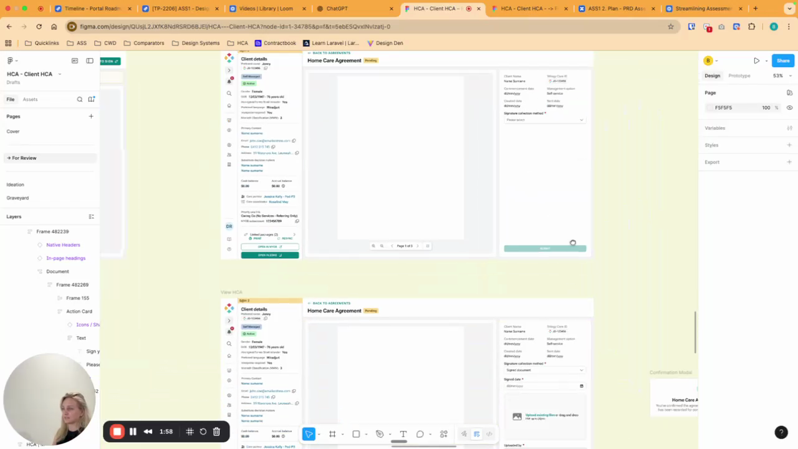

**Context:**
> So if you're in the meeting and you want to capture a verbal signature, you'd go and select verbal
> signature and it will display these relevant fields afterwards. So the signed date, so that's the

### [01:49.867] Keyframe 16

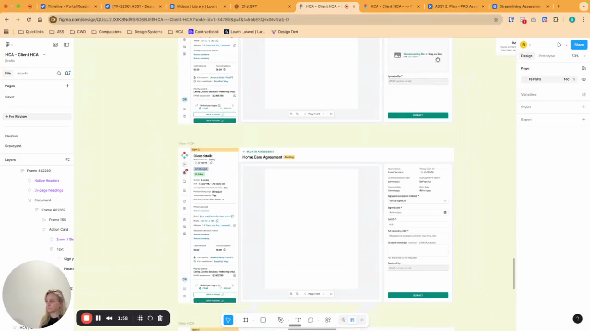

**Context:**
> So if you're in the meeting and you want to capture a verbal signature, you'd go and select verbal
> signature and it will display these relevant fields afterwards. So the signed date, so that's the

**[01:50.420]** signature and it will display these relevant fields afterwards. So the signed date, so that's the

### [01:50.433] Keyframe 17

**Context:**
> So if you're in the meeting and you want to capture a verbal signature, you'd go and select verbal
> signature and it will display these relevant fields afterwards. So the signed date, so that's the
> meeting date, the call ID and the full recording URL for from air call. And then the consent, consent

### [01:51.766] Keyframe 18

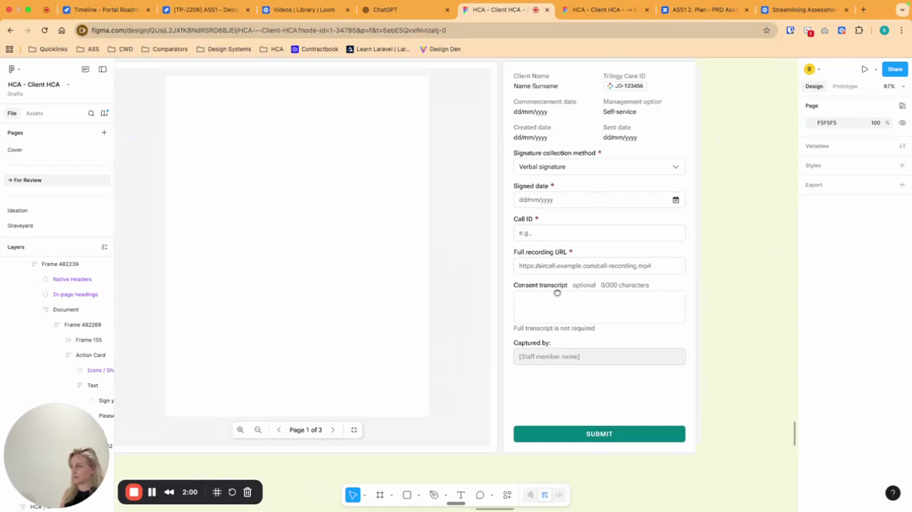

**Context:**
> So if you're in the meeting and you want to capture a verbal signature, you'd go and select verbal
> signature and it will display these relevant fields afterwards. So the signed date, so that's the
> meeting date, the call ID and the full recording URL for from air call. And then the consent, consent

### [01:52.667] Keyframe 19

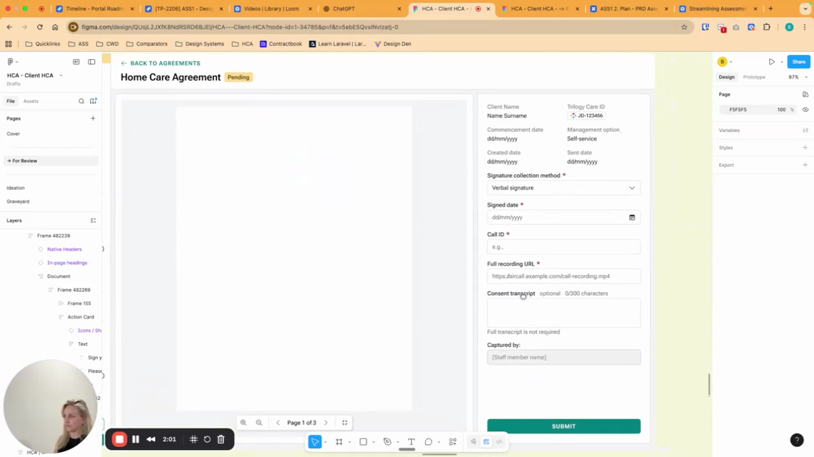

**Context:**
> signature and it will display these relevant fields afterwards. So the signed date, so that's the
> meeting date, the call ID and the full recording URL for from air call. And then the consent, consent

**[01:55.060]** meeting date, the call ID and the full recording URL for from air call. And then the consent, consent

**[02:01.920]** transcript would just be like a copied and pasted section of the transcript, which actually contains

**[02:06.620]** the verbal consent. Not sure if we feel like that's necessary or not, but I've added it in and then just who

### [02:11.133] Keyframe 20

**Context:**
> the verbal consent. Not sure if we feel like that's necessary or not, but I've added it in and then just who
> it's been captured by. Similar for the signed document, you just have the signed date, upload the

**[02:11.520]** it's been captured by. Similar for the signed document, you just have the signed date, upload the

### [02:11.699] Keyframe 21

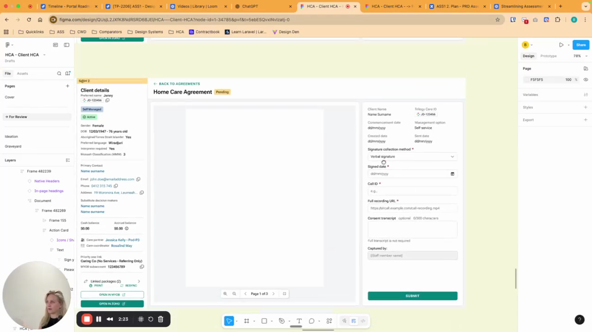

**Context:**
> the verbal consent. Not sure if we feel like that's necessary or not, but I've added it in and then just who
> it's been captured by. Similar for the signed document, you just have the signed date, upload the
> document and then again, who has been uploaded by and you'd be able to go and submit the two.

### [02:12.266] Keyframe 22

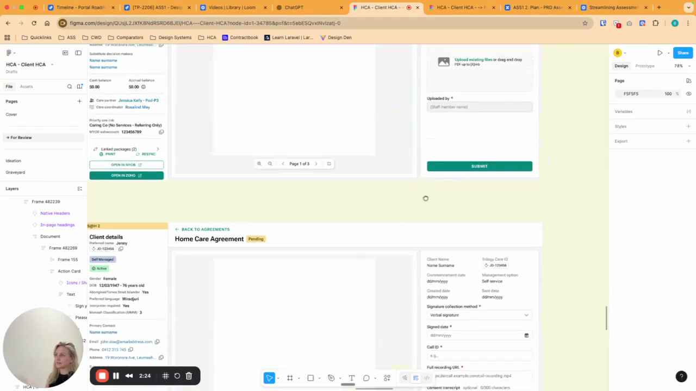

**Context:**
> the verbal consent. Not sure if we feel like that's necessary or not, but I've added it in and then just who
> it's been captured by. Similar for the signed document, you just have the signed date, upload the
> document and then again, who has been uploaded by and you'd be able to go and submit the two.

### [02:12.766] Keyframe 23

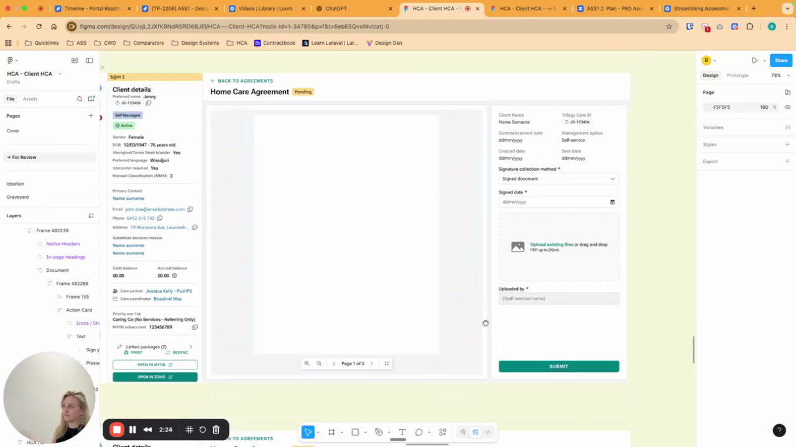

**Context:**
> the verbal consent. Not sure if we feel like that's necessary or not, but I've added it in and then just who
> it's been captured by. Similar for the signed document, you just have the signed date, upload the
> document and then again, who has been uploaded by and you'd be able to go and submit the two.

### [02:13.400] Keyframe 24

**Context:**
> the verbal consent. Not sure if we feel like that's necessary or not, but I've added it in and then just who
> it's been captured by. Similar for the signed document, you just have the signed date, upload the
> document and then again, who has been uploaded by and you'd be able to go and submit the two.

### [02:14.366] Keyframe 25

**Context:**
> it's been captured by. Similar for the signed document, you just have the signed date, upload the
> document and then again, who has been uploaded by and you'd be able to go and submit the two.

### [02:15.500] Keyframe 26

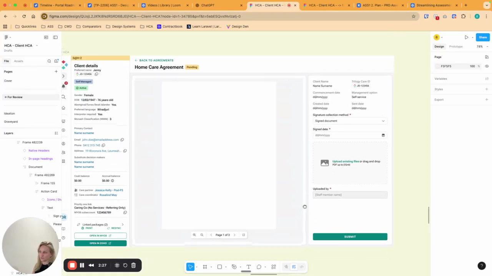

**Context:**
> it's been captured by. Similar for the signed document, you just have the signed date, upload the
> document and then again, who has been uploaded by and you'd be able to go and submit the two.
> And then it would just confirm that it's been signed and then it would navigate you to a completed

**[02:16.159]** document and then again, who has been uploaded by and you'd be able to go and submit the two.

### [02:16.300] Keyframe 27

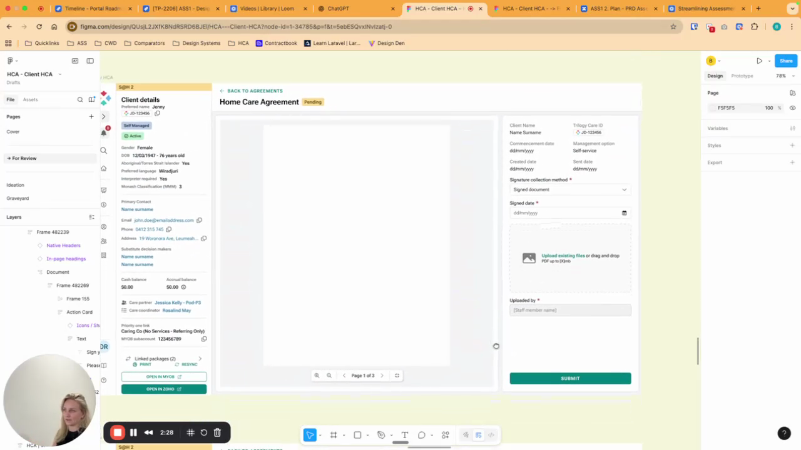

**Context:**
> it's been captured by. Similar for the signed document, you just have the signed date, upload the
> document and then again, who has been uploaded by and you'd be able to go and submit the two.
> And then it would just confirm that it's been signed and then it would navigate you to a completed

### [02:16.832] Keyframe 28

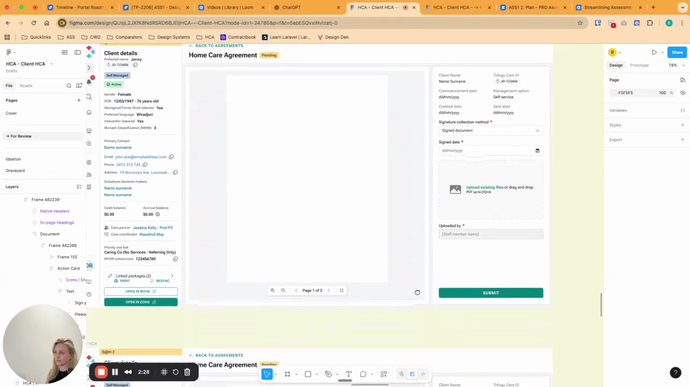

**Context:**
> it's been captured by. Similar for the signed document, you just have the signed date, upload the
> document and then again, who has been uploaded by and you'd be able to go and submit the two.
> And then it would just confirm that it's been signed and then it would navigate you to a completed

### [02:17.366] Keyframe 29

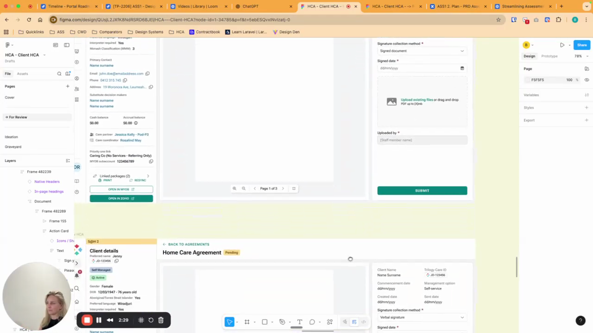

**Context:**
> it's been captured by. Similar for the signed document, you just have the signed date, upload the
> document and then again, who has been uploaded by and you'd be able to go and submit the two.
> And then it would just confirm that it's been signed and then it would navigate you to a completed

### [02:17.866] Keyframe 30

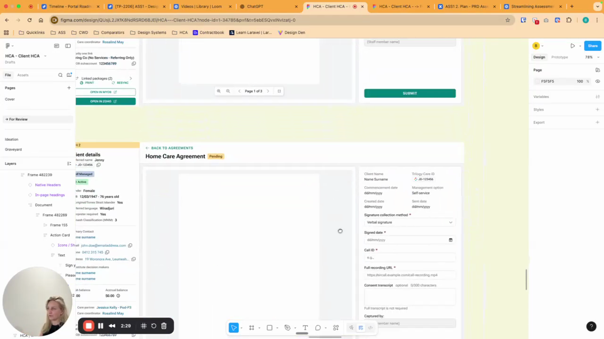

**Context:**
> it's been captured by. Similar for the signed document, you just have the signed date, upload the
> document and then again, who has been uploaded by and you'd be able to go and submit the two.
> And then it would just confirm that it's been signed and then it would navigate you to a completed

### [02:18.532] Keyframe 31

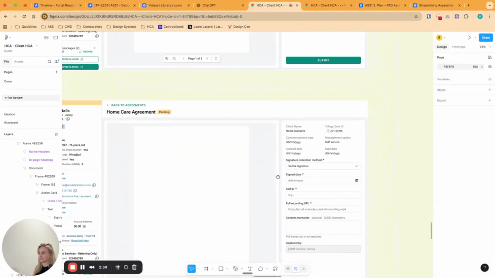

**Context:**
> document and then again, who has been uploaded by and you'd be able to go and submit the two.
> And then it would just confirm that it's been signed and then it would navigate you to a completed

### [02:19.032] Keyframe 32

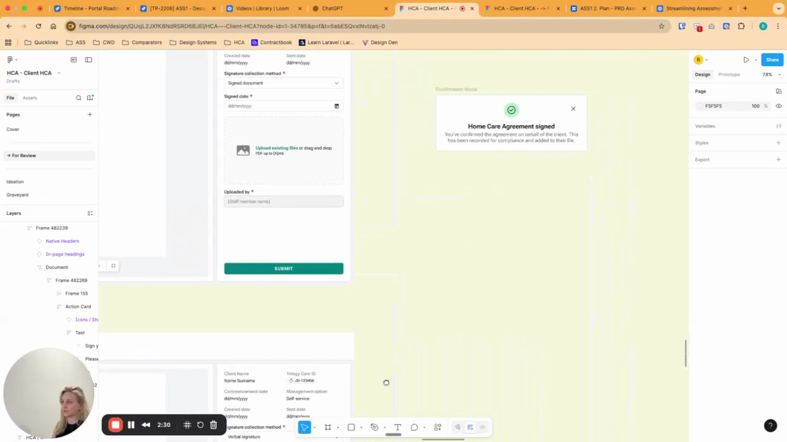

**Context:**
> document and then again, who has been uploaded by and you'd be able to go and submit the two.
> And then it would just confirm that it's been signed and then it would navigate you to a completed

### [02:19.532] Keyframe 33

**Context:**
> document and then again, who has been uploaded by and you'd be able to go and submit the two.
> And then it would just confirm that it's been signed and then it would navigate you to a completed
> state with the table view again. If you go and select a digital signature from client, then what it will

**[02:20.439]** And then it would just confirm that it's been signed and then it would navigate you to a completed

### [02:21.266] Keyframe 34

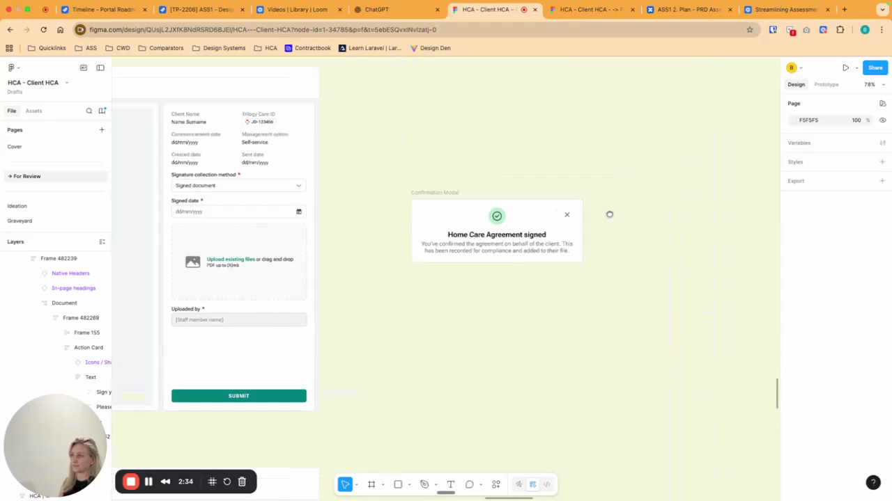

**Context:**
> document and then again, who has been uploaded by and you'd be able to go and submit the two.
> And then it would just confirm that it's been signed and then it would navigate you to a completed
> state with the table view again. If you go and select a digital signature from client, then what it will

### [02:21.766] Keyframe 35

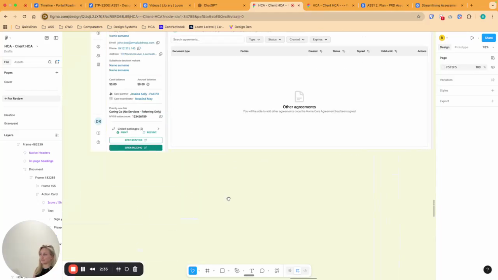

**Context:**
> document and then again, who has been uploaded by and you'd be able to go and submit the two.
> And then it would just confirm that it's been signed and then it would navigate you to a completed
> state with the table view again. If you go and select a digital signature from client, then what it will

### [02:22.766] Keyframe 36

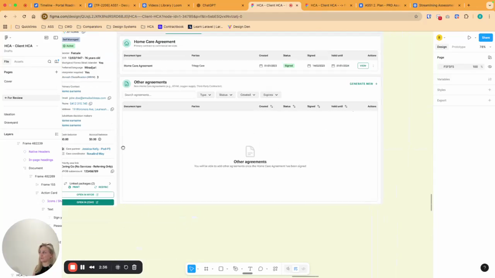

**Context:**
> And then it would just confirm that it's been signed and then it would navigate you to a completed
> state with the table view again. If you go and select a digital signature from client, then what it will

### [02:24.067] Keyframe 37

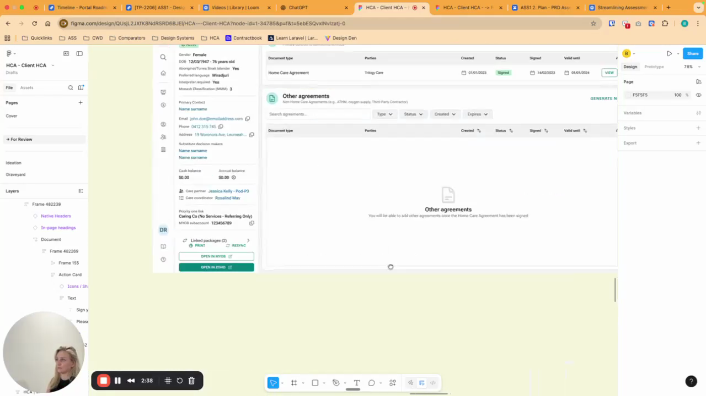

**Context:**
> And then it would just confirm that it's been signed and then it would navigate you to a completed
> state with the table view again. If you go and select a digital signature from client, then what it will

**[02:24.300]** state with the table view again. If you go and select a digital signature from client, then what it will

### [02:24.567] Keyframe 38

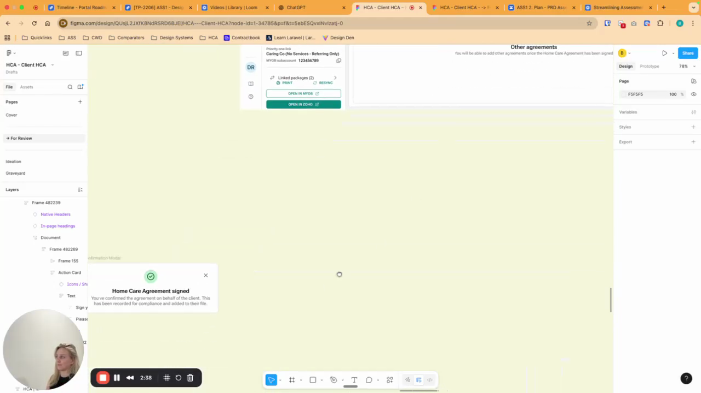

**Context:**
> And then it would just confirm that it's been signed and then it would navigate you to a completed
> state with the table view again. If you go and select a digital signature from client, then what it will

### [02:25.067] Keyframe 39

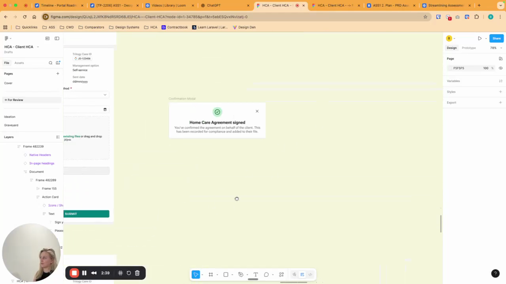

**Context:**
> And then it would just confirm that it's been signed and then it would navigate you to a completed
> state with the table view again. If you go and select a digital signature from client, then what it will

### [02:25.599] Keyframe 40

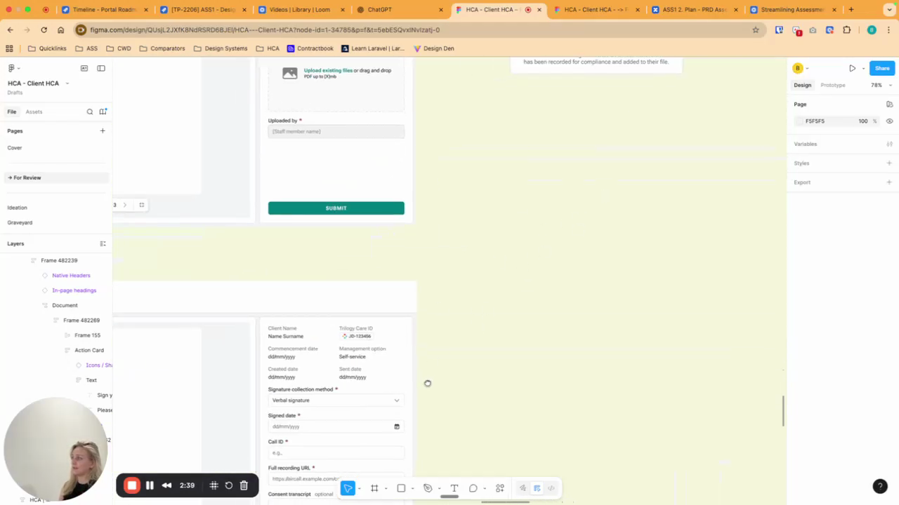

**Context:**
> And then it would just confirm that it's been signed and then it would navigate you to a completed
> state with the table view again. If you go and select a digital signature from client, then what it will
> do is it will remove the submit button and then it will display this card where you can go and click the

### [02:26.099] Keyframe 41

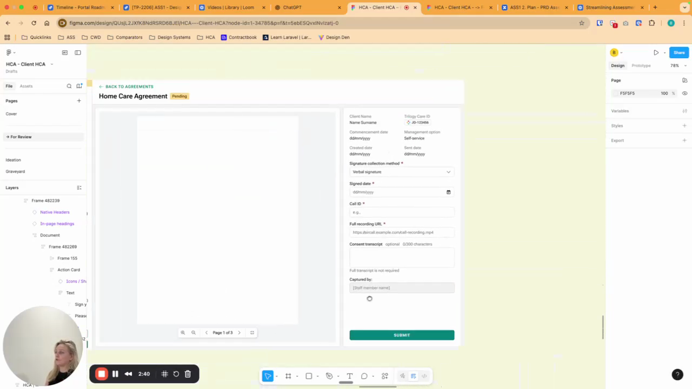

**Context:**
> And then it would just confirm that it's been signed and then it would navigate you to a completed
> state with the table view again. If you go and select a digital signature from client, then what it will
> do is it will remove the submit button and then it will display this card where you can go and click the

### [02:26.599] Keyframe 42

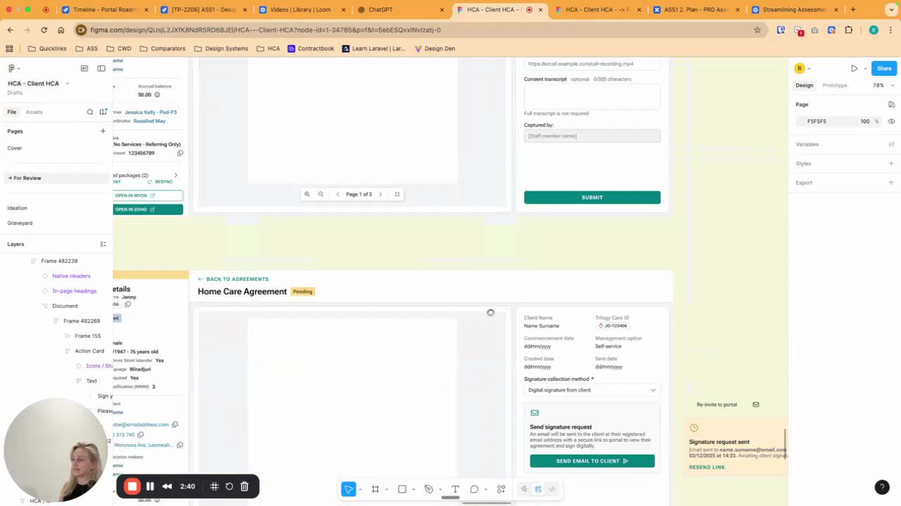

**Context:**
> state with the table view again. If you go and select a digital signature from client, then what it will
> do is it will remove the submit button and then it will display this card where you can go and click the

### [02:27.099] Keyframe 43

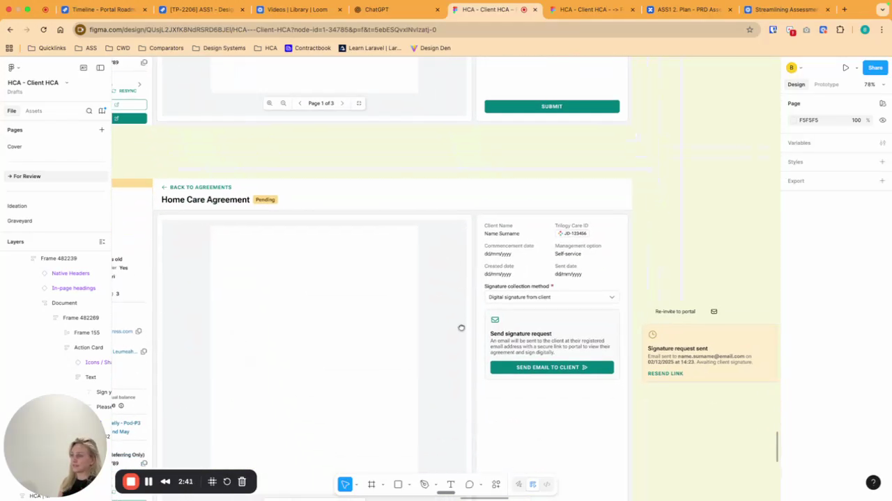

**Context:**
> state with the table view again. If you go and select a digital signature from client, then what it will
> do is it will remove the submit button and then it will display this card where you can go and click the

### [02:27.599] Keyframe 44

**Context:**
> state with the table view again. If you go and select a digital signature from client, then what it will
> do is it will remove the submit button and then it will display this card where you can go and click the

### [02:28.400] Keyframe 45

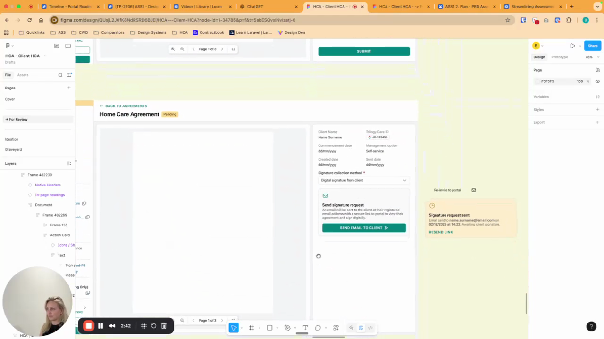

**Context:**
> state with the table view again. If you go and select a digital signature from client, then what it will
> do is it will remove the submit button and then it will display this card where you can go and click the

### [02:29.133] Keyframe 46

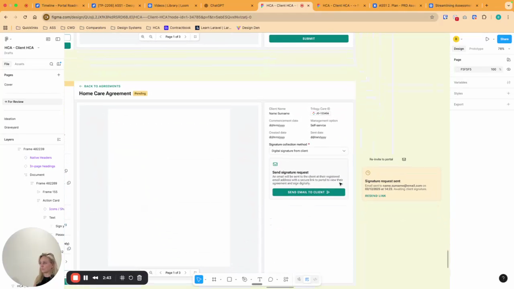

**Context:**
> state with the table view again. If you go and select a digital signature from client, then what it will
> do is it will remove the submit button and then it will display this card where you can go and click the

### [02:29.932] Keyframe 47

**Context:**
> state with the table view again. If you go and select a digital signature from client, then what it will
> do is it will remove the submit button and then it will display this card where you can go and click the
> button to say send email to client. And that will trigger an email which provides a link to portal for the

**[02:30.240]** do is it will remove the submit button and then it will display this card where you can go and click the

### [02:30.832] Keyframe 48

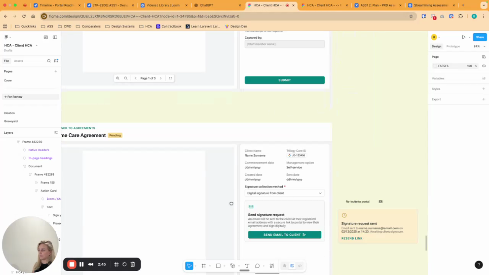

**Context:**
> state with the table view again. If you go and select a digital signature from client, then what it will
> do is it will remove the submit button and then it will display this card where you can go and click the
> button to say send email to client. And that will trigger an email which provides a link to portal for the

### [02:31.467] Keyframe 49

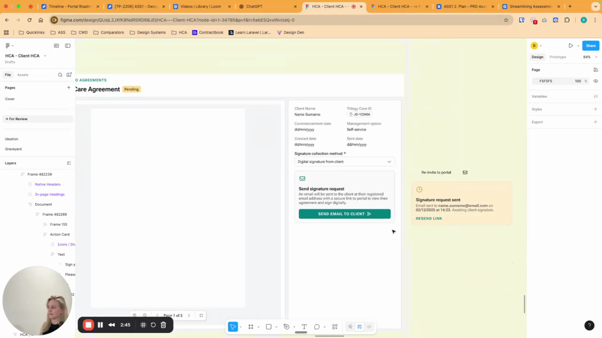

**Context:**
> state with the table view again. If you go and select a digital signature from client, then what it will
> do is it will remove the submit button and then it will display this card where you can go and click the
> button to say send email to client. And that will trigger an email which provides a link to portal for the

**[02:34.860]** button to say send email to client. And that will trigger an email which provides a link to portal for the

### [02:35.866] Keyframe 50

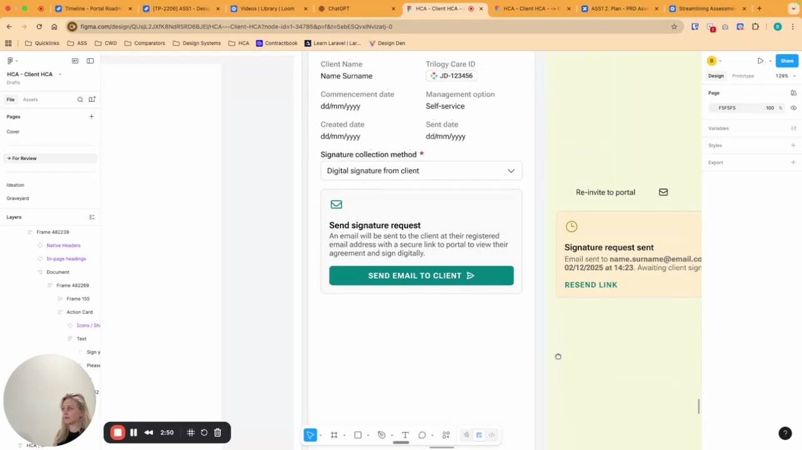

**Context:**
> do is it will remove the submit button and then it will display this card where you can go and click the
> button to say send email to client. And that will trigger an email which provides a link to portal for the
> client for them to go and sign digitally there. Once that's, once that has been sent, this card would

**[02:40.199]** client for them to go and sign digitally there. Once that's, once that has been sent, this card would

### [02:41.967] Keyframe 51

**Context:**
> button to say send email to client. And that will trigger an email which provides a link to portal for the
> client for them to go and sign digitally there. Once that's, once that has been sent, this card would
> update to a pending state, which is just saying that the signature request has been sent, who it's been

**[02:45.539]** update to a pending state, which is just saying that the signature request has been sent, who it's been

**[02:51.199]** sent by, what time, and then just that it's awaiting the signature. You can then go and resend that link

**[02:55.979]** as well if they claim that they haven't received it. I'll go through the client slide in a second.

### [02:56.832] Keyframe 52

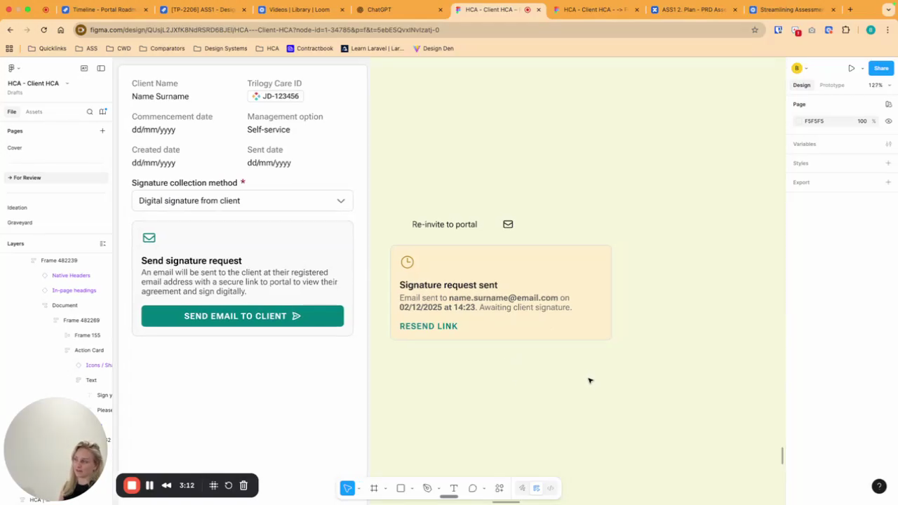

**Context:**
> sent by, what time, and then just that it's awaiting the signature. You can then go and resend that link
> as well if they claim that they haven't received it. I'll go through the client slide in a second.

### [02:57.366] Keyframe 53

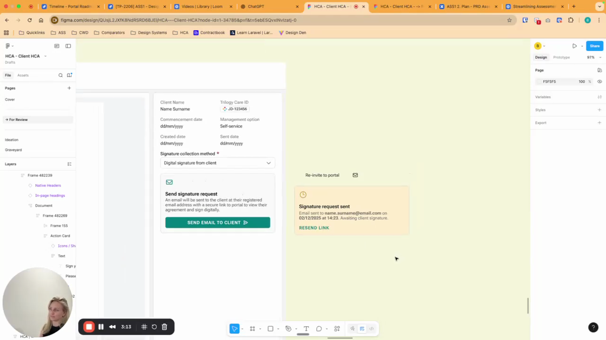

**Context:**
> sent by, what time, and then just that it's awaiting the signature. You can then go and resend that link
> as well if they claim that they haven't received it. I'll go through the client slide in a second.
> I'll just quickly walk through the different states. So for the signed document, this is what the

### [02:57.866] Keyframe 54

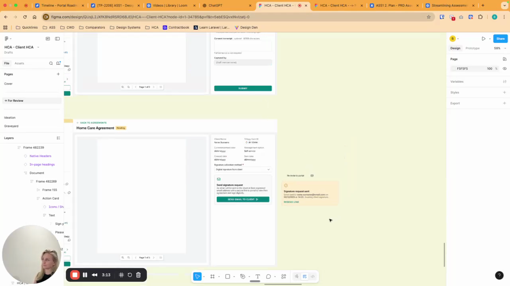

**Context:**
> sent by, what time, and then just that it's awaiting the signature. You can then go and resend that link
> as well if they claim that they haven't received it. I'll go through the client slide in a second.
> I'll just quickly walk through the different states. So for the signed document, this is what the

### [02:58.400] Keyframe 55

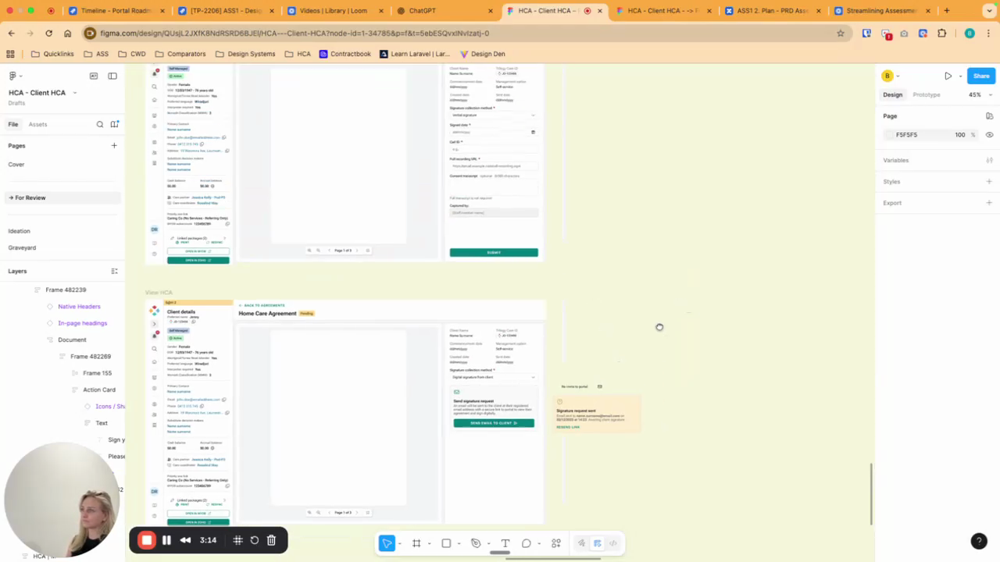

**Context:**
> as well if they claim that they haven't received it. I'll go through the client slide in a second.
> I'll just quickly walk through the different states. So for the signed document, this is what the

### [03:00.067] Keyframe 56

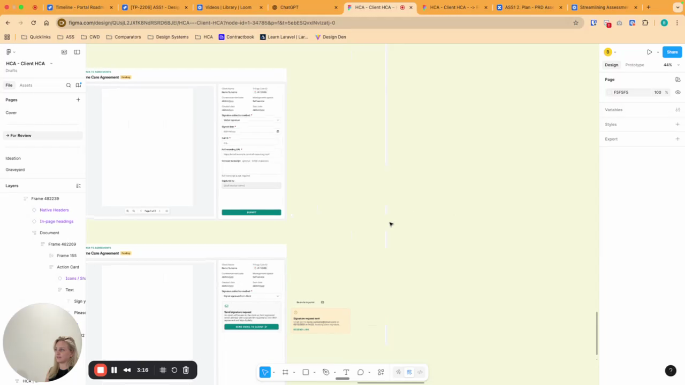

**Context:**
> as well if they claim that they haven't received it. I'll go through the client slide in a second.
> I'll just quickly walk through the different states. So for the signed document, this is what the

### [03:00.599] Keyframe 57

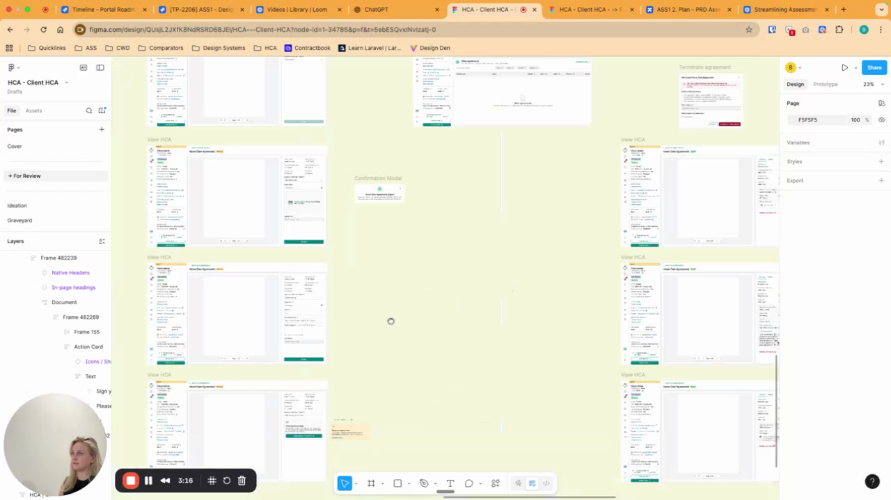

**Context:**
> as well if they claim that they haven't received it. I'll go through the client slide in a second.
> I'll just quickly walk through the different states. So for the signed document, this is what the

### [03:01.099] Keyframe 58

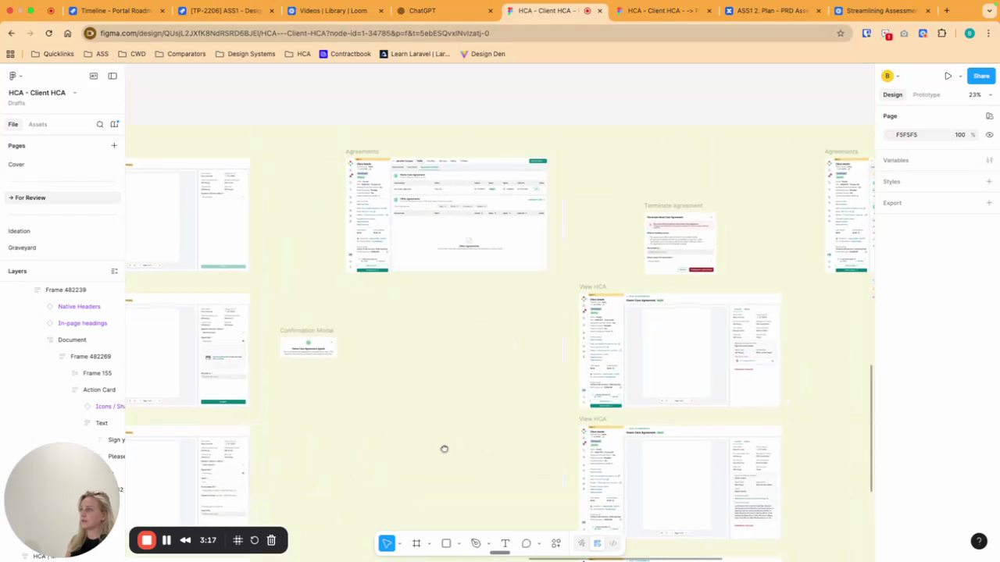

**Context:**
> as well if they claim that they haven't received it. I'll go through the client slide in a second.
> I'll just quickly walk through the different states. So for the signed document, this is what the

**[03:02.060]** I'll just quickly walk through the different states. So for the signed document, this is what the

### [03:02.300] Keyframe 59

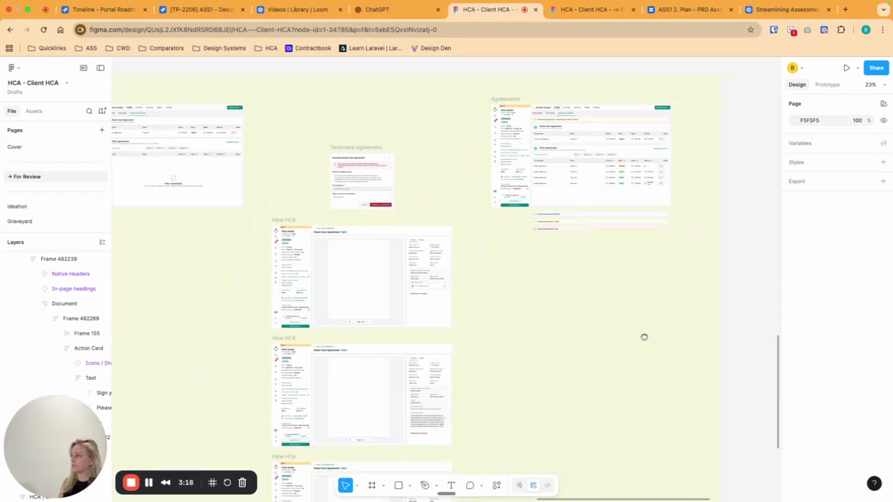

**Context:**
> as well if they claim that they haven't received it. I'll go through the client slide in a second.
> I'll just quickly walk through the different states. So for the signed document, this is what the
> completed state looks like. You'd then be able to see a full overview, you'd be able to download the

### [03:02.900] Keyframe 60

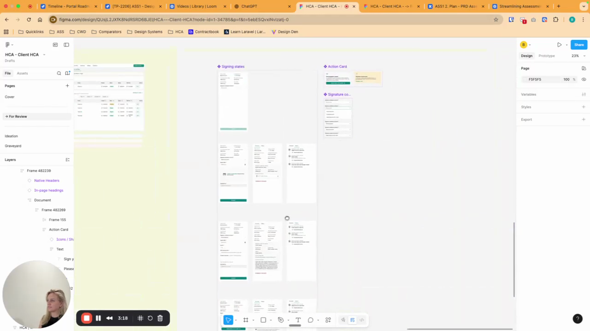

**Context:**
> as well if they claim that they haven't received it. I'll go through the client slide in a second.
> I'll just quickly walk through the different states. So for the signed document, this is what the
> completed state looks like. You'd then be able to see a full overview, you'd be able to download the

### [03:03.532] Keyframe 61

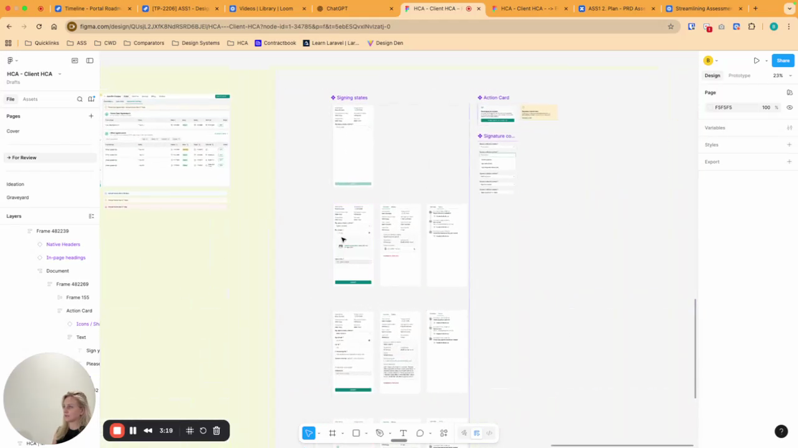

**Context:**
> I'll just quickly walk through the different states. So for the signed document, this is what the
> completed state looks like. You'd then be able to see a full overview, you'd be able to download the

### [03:04.032] Keyframe 62

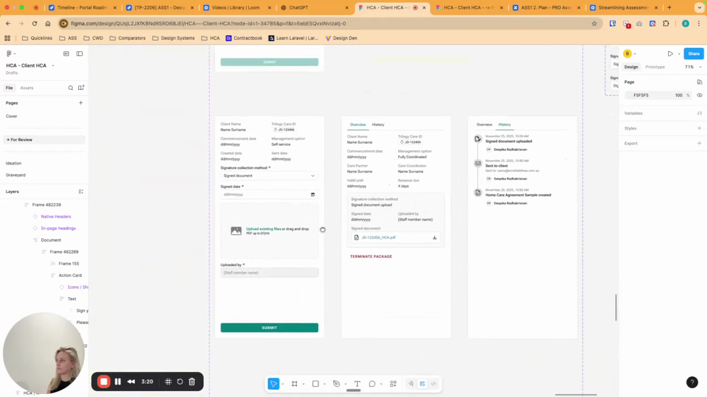

**Context:**
> I'll just quickly walk through the different states. So for the signed document, this is what the
> completed state looks like. You'd then be able to see a full overview, you'd be able to download the

### [03:04.599] Keyframe 63

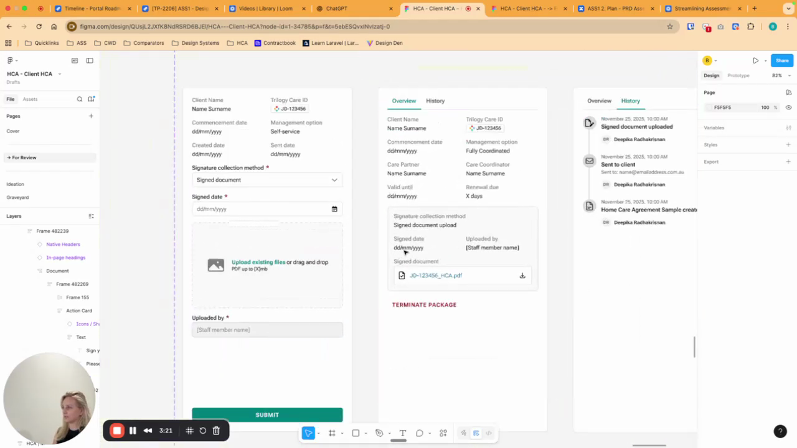

**Context:**
> I'll just quickly walk through the different states. So for the signed document, this is what the
> completed state looks like. You'd then be able to see a full overview, you'd be able to download the

### [03:05.199] Keyframe 64

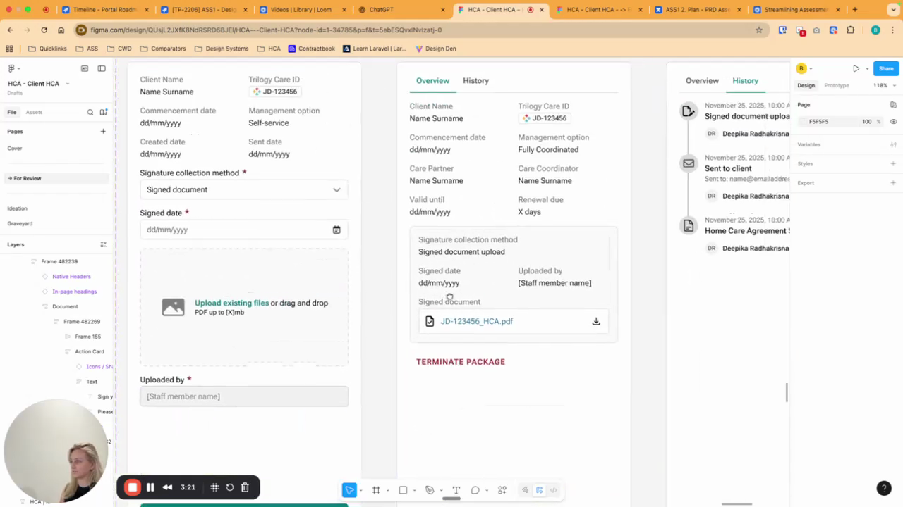

**Context:**
> I'll just quickly walk through the different states. So for the signed document, this is what the
> completed state looks like. You'd then be able to see a full overview, you'd be able to download the

### [03:06.032] Keyframe 65

**Context:**
> I'll just quickly walk through the different states. So for the signed document, this is what the
> completed state looks like. You'd then be able to see a full overview, you'd be able to download the

**[03:06.580]** completed state looks like. You'd then be able to see a full overview, you'd be able to download the

### [03:10.266] Keyframe 66

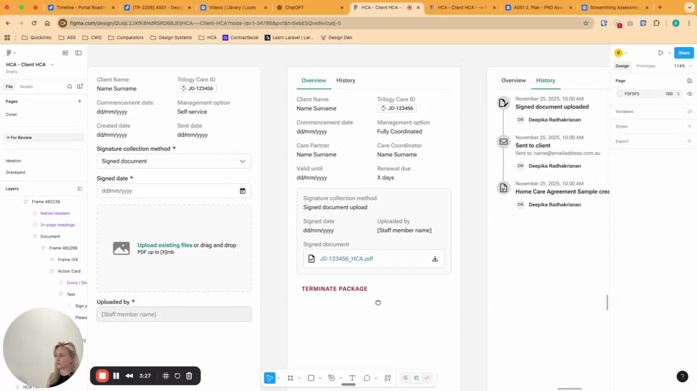

**Context:**
> completed state looks like. You'd then be able to see a full overview, you'd be able to download the
> document, see who was uploaded by, etc. and then terminate if necessary. And then you'd be able

**[03:11.319]** document, see who was uploaded by, etc. and then terminate if necessary. And then you'd be able

### [03:11.532] Keyframe 67

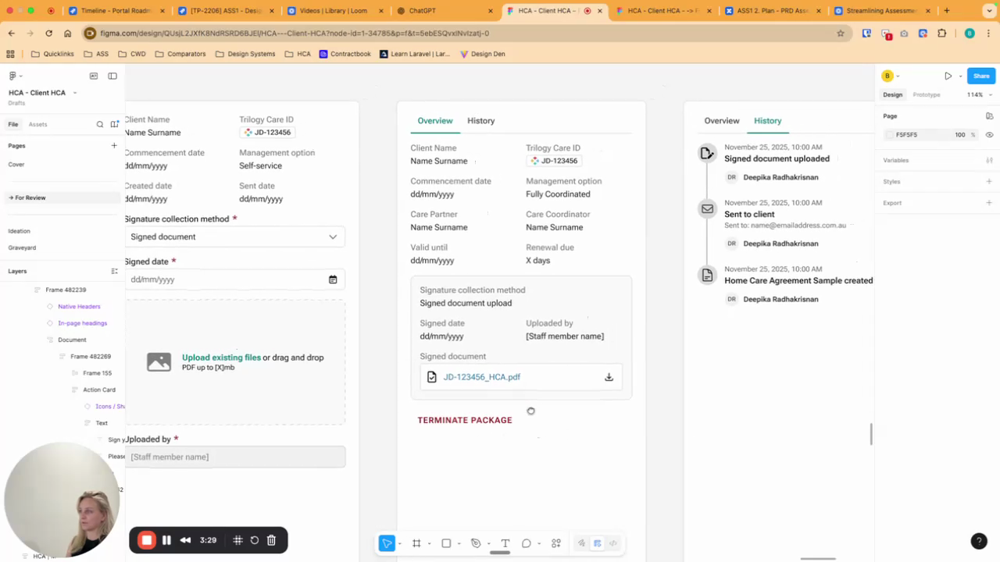

**Context:**
> completed state looks like. You'd then be able to see a full overview, you'd be able to download the
> document, see who was uploaded by, etc. and then terminate if necessary. And then you'd be able
> to flick between history as well, just similar to what we do with bills, etc. And you'd see like when

### [03:12.032] Keyframe 68

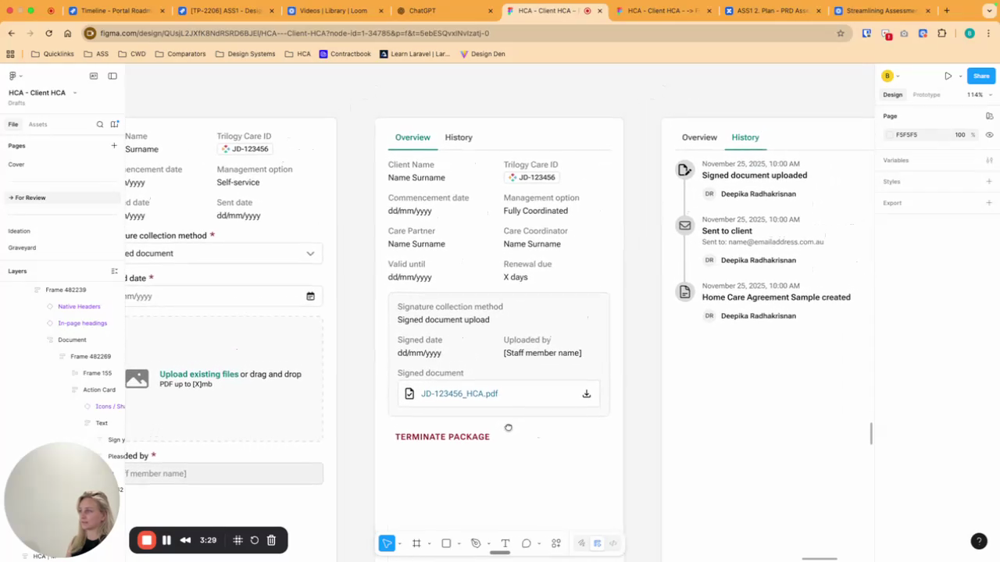

**Context:**
> completed state looks like. You'd then be able to see a full overview, you'd be able to download the
> document, see who was uploaded by, etc. and then terminate if necessary. And then you'd be able
> to flick between history as well, just similar to what we do with bills, etc. And you'd see like when

### [03:13.967] Keyframe 69

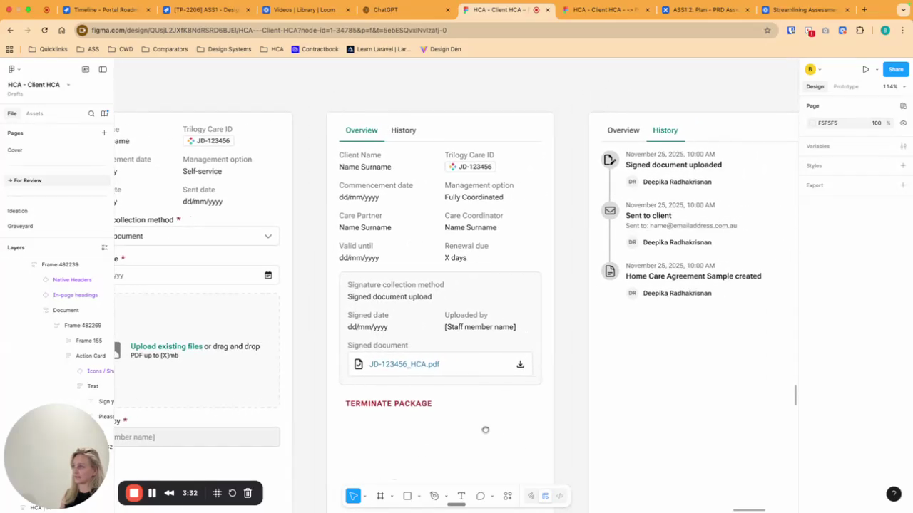

**Context:**
> document, see who was uploaded by, etc. and then terminate if necessary. And then you'd be able
> to flick between history as well, just similar to what we do with bills, etc. And you'd see like when

### [03:16.400] Keyframe 70

**Context:**
> document, see who was uploaded by, etc. and then terminate if necessary. And then you'd be able
> to flick between history as well, just similar to what we do with bills, etc. And you'd see like when
> a sample was created, when it was sent, when it was signed, and then ideally any variations of the

**[03:16.500]** to flick between history as well, just similar to what we do with bills, etc. And you'd see like when

**[03:21.120]** a sample was created, when it was sent, when it was signed, and then ideally any variations of the

### [03:25.800] Keyframe 71

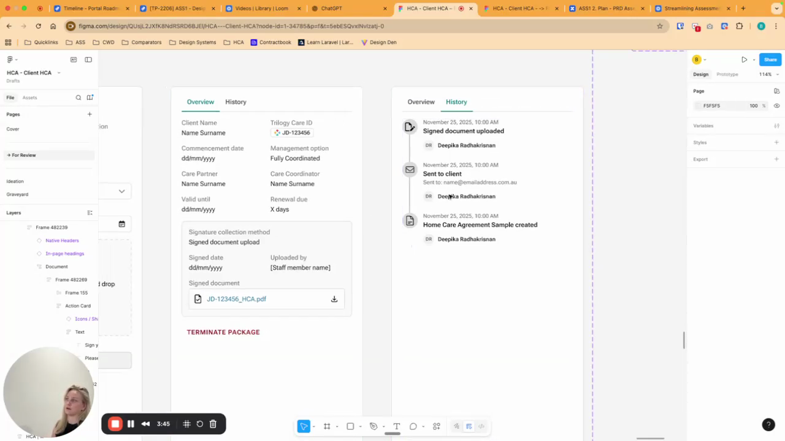

**Context:**
> a sample was created, when it was sent, when it was signed, and then ideally any variations of the
> agreement as well afterwards would all be contained here. And then again, pretty much the same for all of

**[03:25.979]** agreement as well afterwards would all be contained here. And then again, pretty much the same for all of

### [03:27.300] Keyframe 72

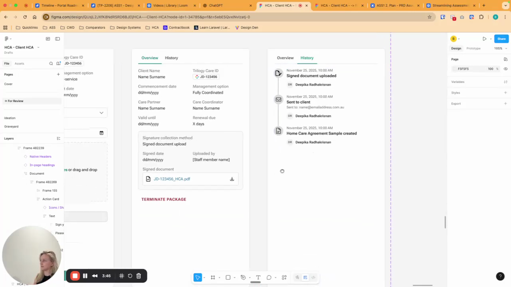

**Context:**
> a sample was created, when it was sent, when it was signed, and then ideally any variations of the
> agreement as well afterwards would all be contained here. And then again, pretty much the same for all of
> the different types of consent. So the verbal signature would have the URL to the recording, the consent

### [03:27.800] Keyframe 73

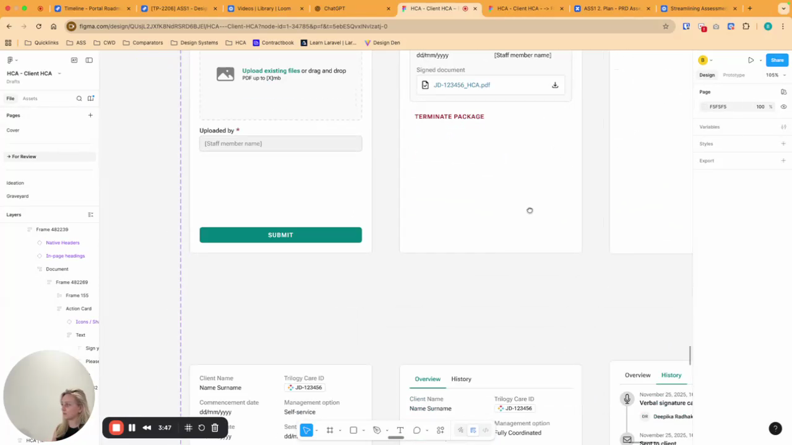

**Context:**
> a sample was created, when it was sent, when it was signed, and then ideally any variations of the
> agreement as well afterwards would all be contained here. And then again, pretty much the same for all of
> the different types of consent. So the verbal signature would have the URL to the recording, the consent

### [03:28.300] Keyframe 74

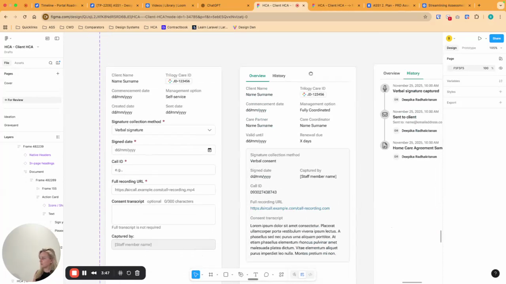

**Context:**
> agreement as well afterwards would all be contained here. And then again, pretty much the same for all of
> the different types of consent. So the verbal signature would have the URL to the recording, the consent

### [03:28.800] Keyframe 75

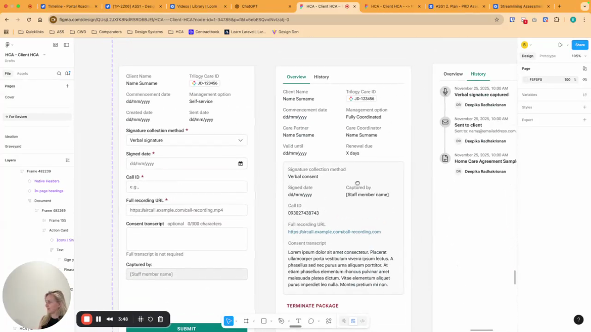

**Context:**
> agreement as well afterwards would all be contained here. And then again, pretty much the same for all of
> the different types of consent. So the verbal signature would have the URL to the recording, the consent

### [03:29.733] Keyframe 76

**Context:**
> agreement as well afterwards would all be contained here. And then again, pretty much the same for all of
> the different types of consent. So the verbal signature would have the URL to the recording, the consent

**[03:31.500]** the different types of consent. So the verbal signature would have the URL to the recording, the consent

### [03:31.667] Keyframe 77

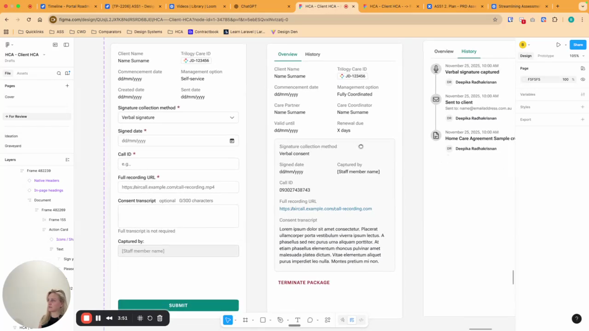

**Context:**
> agreement as well afterwards would all be contained here. And then again, pretty much the same for all of
> the different types of consent. So the verbal signature would have the URL to the recording, the consent

**[03:36.819]** transcript captured here as well, and then again, the history. And then for the client signature, just

### [03:36.900] Keyframe 78

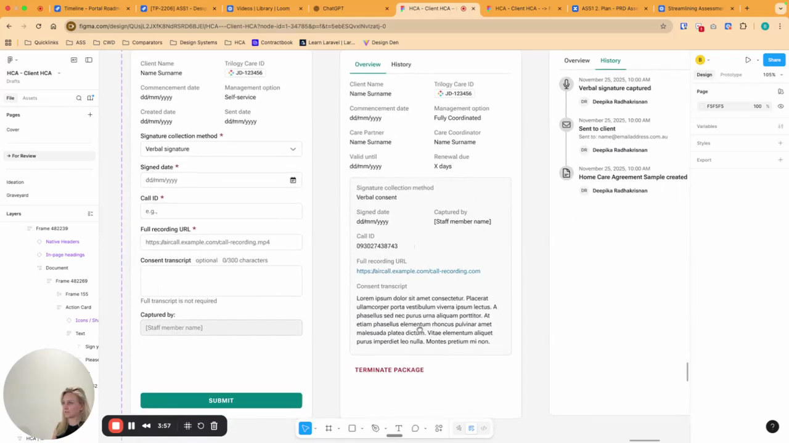

**Context:**
> the different types of consent. So the verbal signature would have the URL to the recording, the consent
> transcript captured here as well, and then again, the history. And then for the client signature, just

### [03:37.400] Keyframe 79

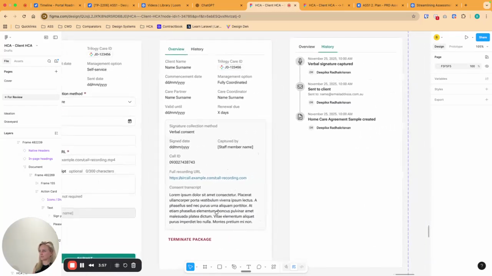

**Context:**
> the different types of consent. So the verbal signature would have the URL to the recording, the consent
> transcript captured here as well, and then again, the history. And then for the client signature, just

### [03:38.667] Keyframe 80

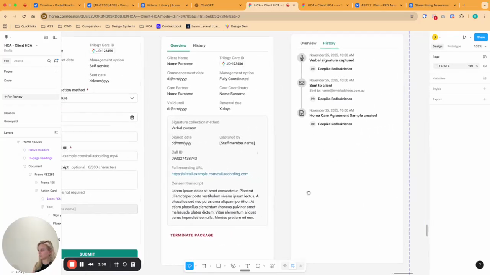

**Context:**
> the different types of consent. So the verbal signature would have the URL to the recording, the consent
> transcript captured here as well, and then again, the history. And then for the client signature, just
> kind of capturing what they've checked off, and the date at which that was completed. So if you click

### [03:39.199] Keyframe 81

**Context:**
> transcript captured here as well, and then again, the history. And then for the client signature, just
> kind of capturing what they've checked off, and the date at which that was completed. So if you click

### [03:39.699] Keyframe 82

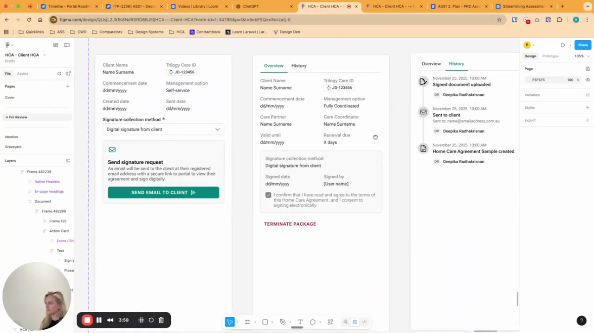

**Context:**
> transcript captured here as well, and then again, the history. And then for the client signature, just
> kind of capturing what they've checked off, and the date at which that was completed. So if you click

### [03:40.400] Keyframe 83

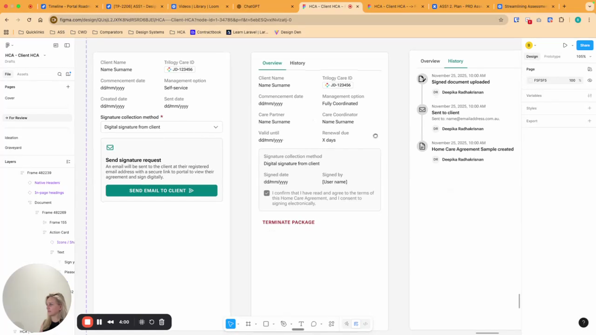

**Context:**
> transcript captured here as well, and then again, the history. And then for the client signature, just
> kind of capturing what they've checked off, and the date at which that was completed. So if you click

### [03:40.932] Keyframe 84

**Context:**
> transcript captured here as well, and then again, the history. And then for the client signature, just
> kind of capturing what they've checked off, and the date at which that was completed. So if you click

**[03:42.919]** kind of capturing what they've checked off, and the date at which that was completed. So if you click

### [03:44.500] Keyframe 85

**Context:**
> transcript captured here as well, and then again, the history. And then for the client signature, just
> kind of capturing what they've checked off, and the date at which that was completed. So if you click

### [03:45.266] Keyframe 86

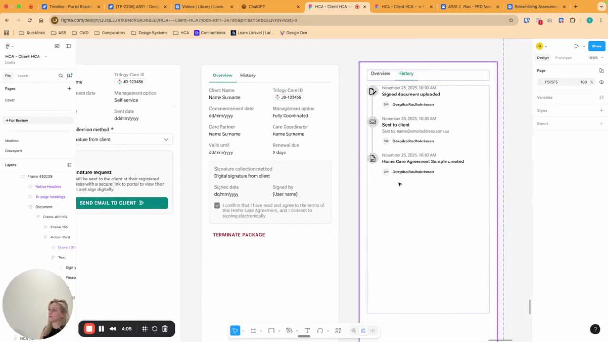

**Context:**
> kind of capturing what they've checked off, and the date at which that was completed. So if you click

### [03:45.800] Keyframe 87

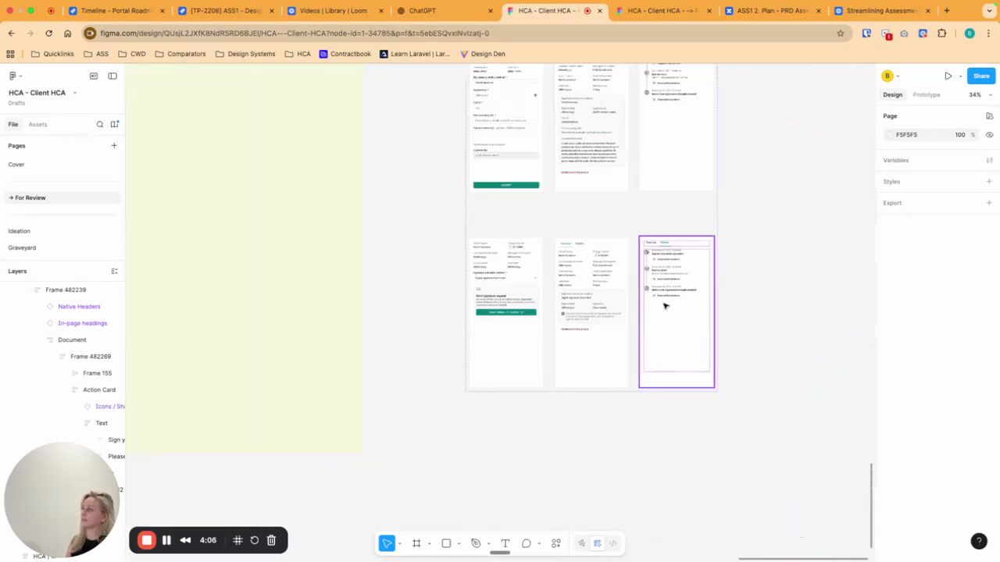

**Context:**
> kind of capturing what they've checked off, and the date at which that was completed. So if you click
> terminate package, I've just got the the days due in one day, and they have different colours of just

### [03:46.532] Keyframe 88

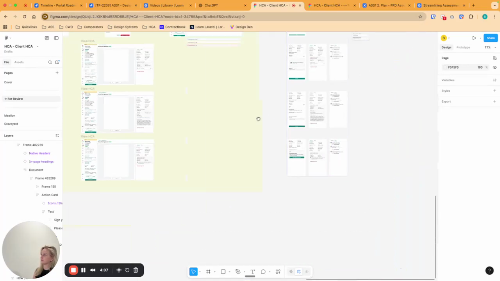

**Context:**
> kind of capturing what they've checked off, and the date at which that was completed. So if you click
> terminate package, I've just got the the days due in one day, and they have different colours of just

### [03:47.032] Keyframe 89

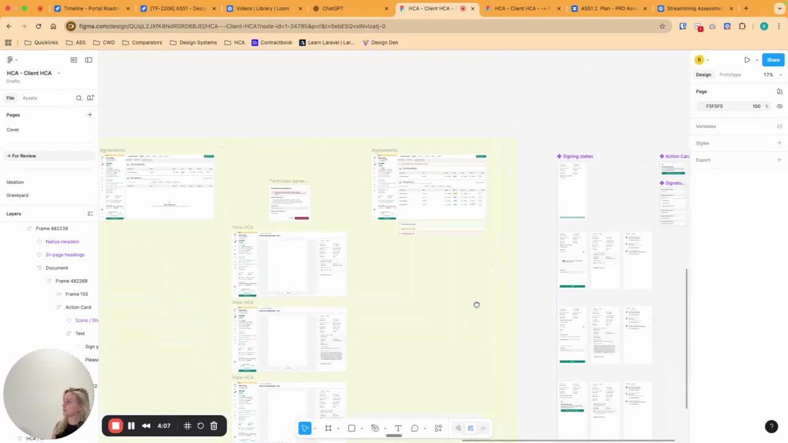

**Context:**
> kind of capturing what they've checked off, and the date at which that was completed. So if you click
> terminate package, I've just got the the days due in one day, and they have different colours of just

### [03:47.567] Keyframe 90

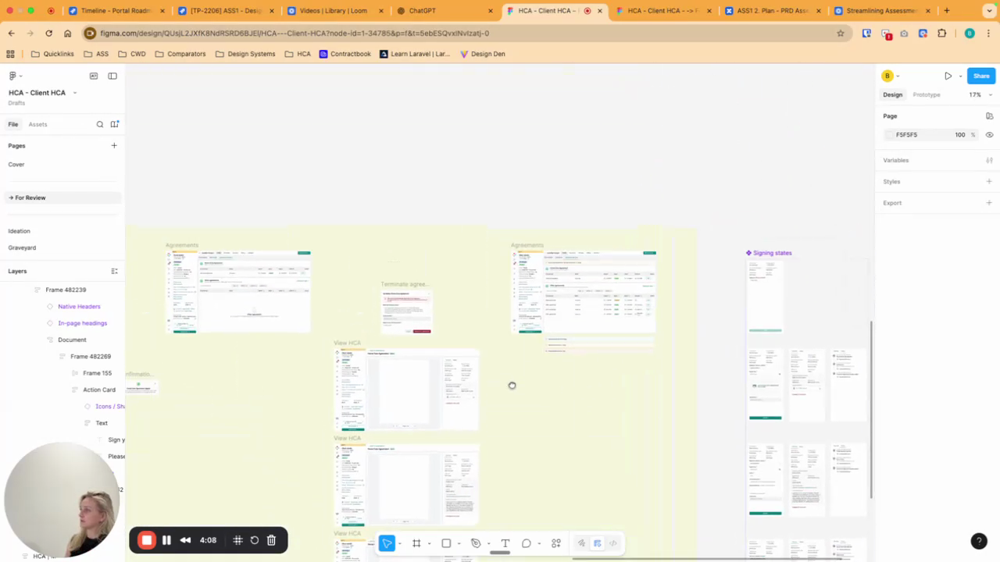

**Context:**
> kind of capturing what they've checked off, and the date at which that was completed. So if you click
> terminate package, I've just got the the days due in one day, and they have different colours of just

### [03:48.932] Keyframe 91

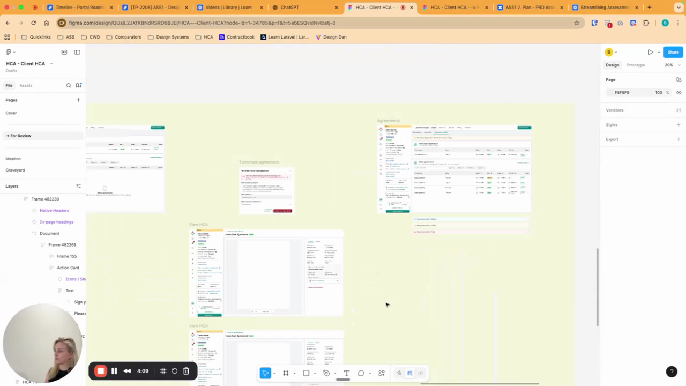

**Context:**
> kind of capturing what they've checked off, and the date at which that was completed. So if you click
> terminate package, I've just got the the days due in one day, and they have different colours of just

### [03:49.432] Keyframe 92

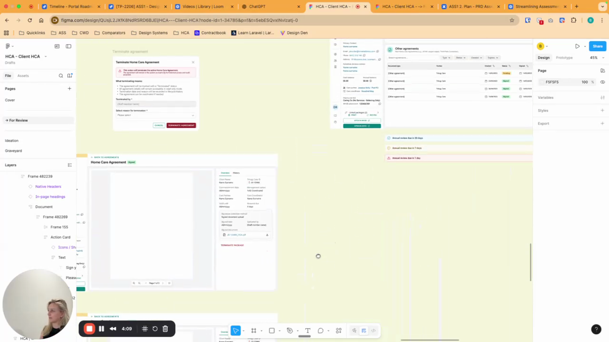

**Context:**
> kind of capturing what they've checked off, and the date at which that was completed. So if you click
> terminate package, I've just got the the days due in one day, and they have different colours of just

### [03:50.000] Keyframe 93

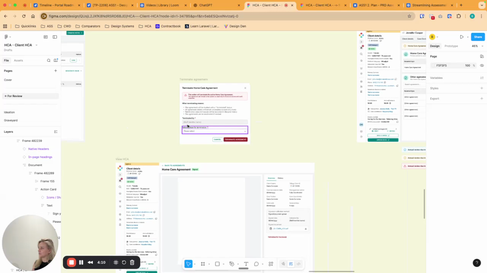

**Context:**
> kind of capturing what they've checked off, and the date at which that was completed. So if you click
> terminate package, I've just got the the days due in one day, and they have different colours of just

**[03:50.460]** terminate package, I've just got the the days due in one day, and they have different colours of just

### [03:50.733] Keyframe 94

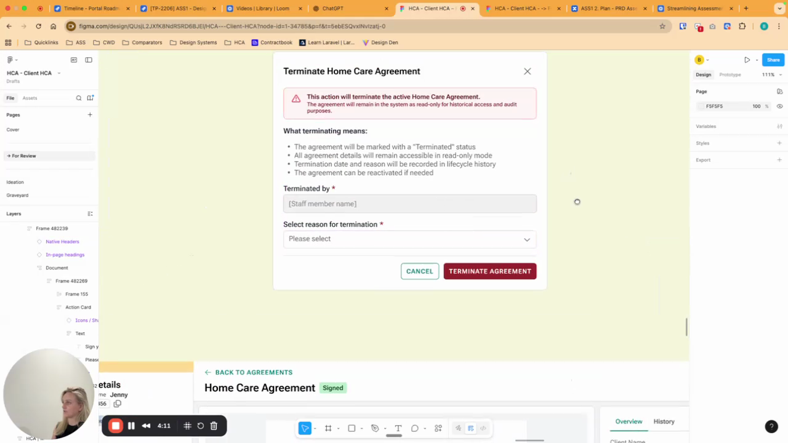

**Context:**
> kind of capturing what they've checked off, and the date at which that was completed. So if you click
> terminate package, I've just got the the days due in one day, and they have different colours of just

**[03:55.759]** informational for 30 days, warning for seven, and then red, red display for high attention. Then we've

### [03:57.967] Keyframe 95

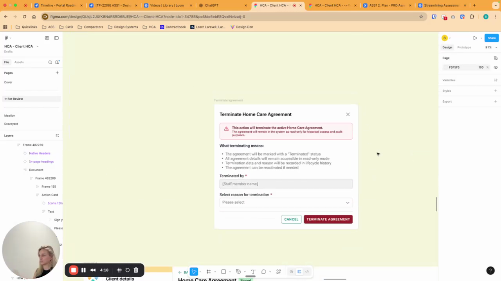

**Context:**
> informational for 30 days, warning for seven, and then red, red display for high attention. Then we've

### [03:58.500] Keyframe 96

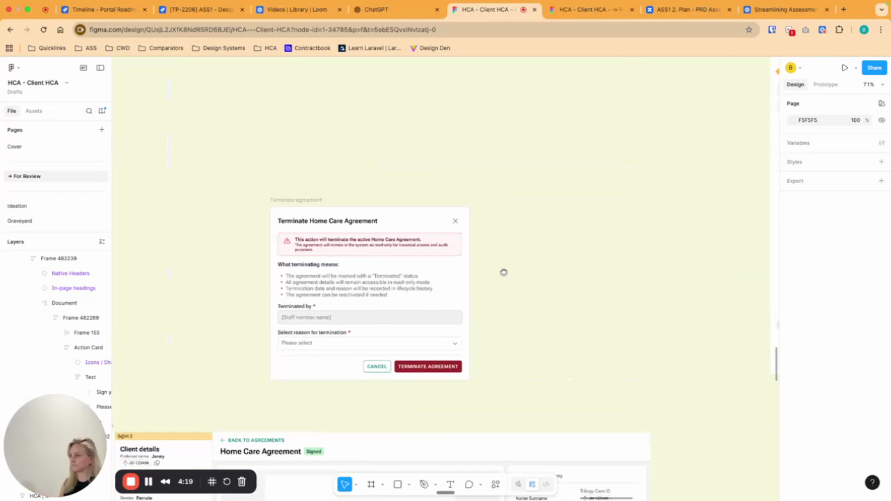

**Context:**
> informational for 30 days, warning for seven, and then red, red display for high attention. Then we've
> got the on the valid until it will just display the number of days until that document expires to.

### [03:59.167] Keyframe 97

**Context:**
> informational for 30 days, warning for seven, and then red, red display for high attention. Then we've
> got the on the valid until it will just display the number of days until that document expires to.

### [03:59.667] Keyframe 98

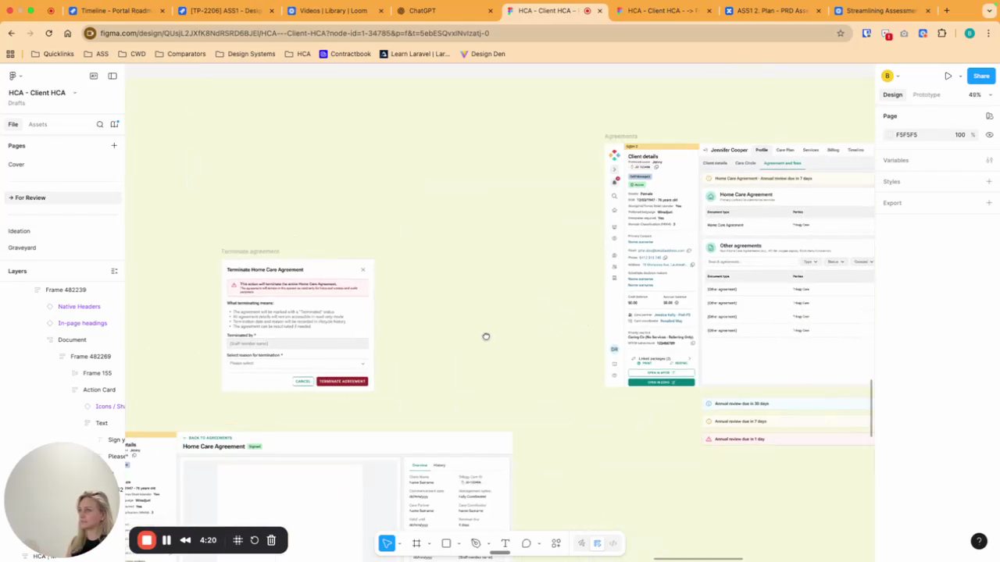

**Context:**
> informational for 30 days, warning for seven, and then red, red display for high attention. Then we've
> got the on the valid until it will just display the number of days until that document expires to.

### [04:00.567] Keyframe 99

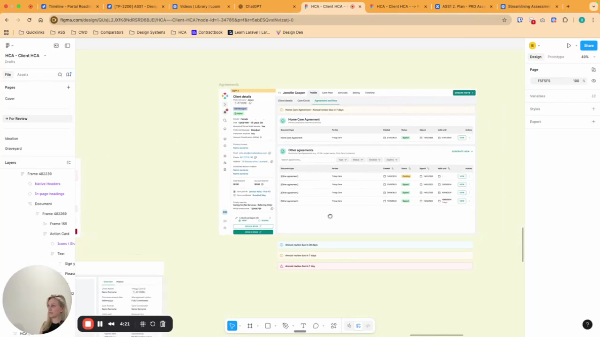

**Context:**
> informational for 30 days, warning for seven, and then red, red display for high attention. Then we've
> got the on the valid until it will just display the number of days until that document expires to.

**[04:03.159]** got the on the valid until it will just display the number of days until that document expires to.

### [04:04.133] Keyframe 100

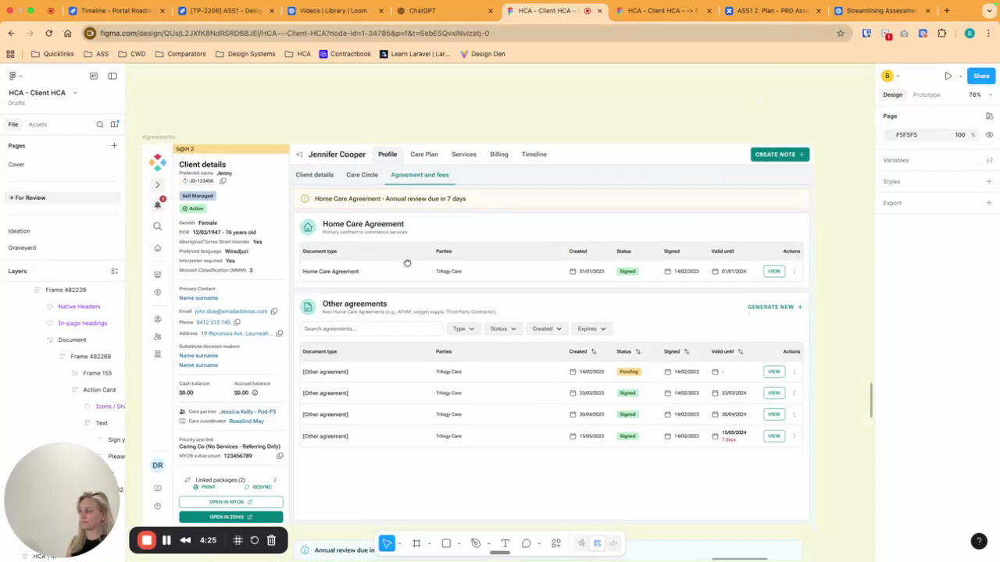

**Context:**
> informational for 30 days, warning for seven, and then red, red display for high attention. Then we've
> got the on the valid until it will just display the number of days until that document expires to.
> And then as you can see here as well, you can see all the different statuses.

### [04:04.633] Keyframe 101

**Context:**
> informational for 30 days, warning for seven, and then red, red display for high attention. Then we've
> got the on the valid until it will just display the number of days until that document expires to.
> And then as you can see here as well, you can see all the different statuses.

**[04:08.840]** And then as you can see here as well, you can see all the different statuses.

### [04:11.967] Keyframe 102

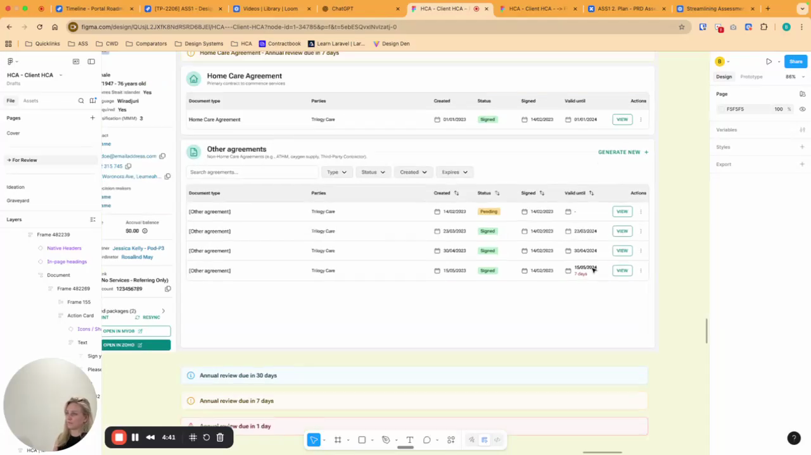

**Context:**
> And then as you can see here as well, you can see all the different statuses.
> Okay, I'll quickly walk over to the client side. So as soon as you've sent that request for a digital

**[04:12.419]** Okay, I'll quickly walk over to the client side. So as soon as you've sent that request for a digital

### [04:16.233] Keyframe 103

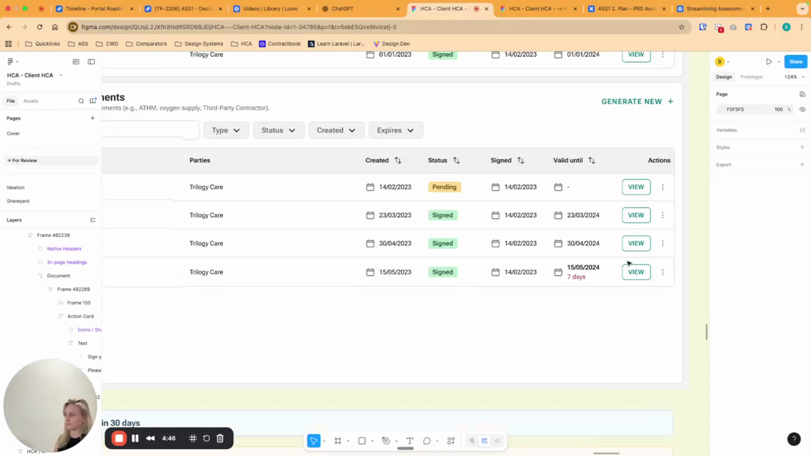

**Context:**
> Okay, I'll quickly walk over to the client side. So as soon as you've sent that request for a digital
> signature, the client would receive an email, I haven't got the email here, but it's just to show that

### [04:16.733] Keyframe 104

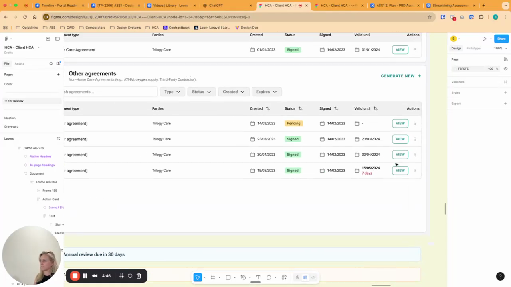

**Context:**
> Okay, I'll quickly walk over to the client side. So as soon as you've sent that request for a digital
> signature, the client would receive an email, I haven't got the email here, but it's just to show that

### [04:17.399] Keyframe 105

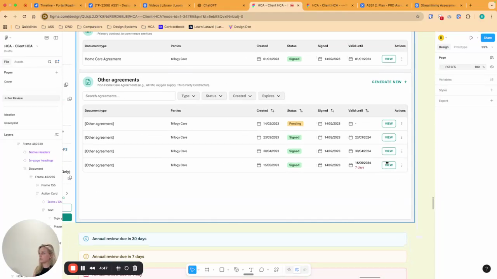

**Context:**
> Okay, I'll quickly walk over to the client side. So as soon as you've sent that request for a digital
> signature, the client would receive an email, I haven't got the email here, but it's just to show that

**[04:17.639]** signature, the client would receive an email, I haven't got the email here, but it's just to show that

### [04:18.166] Keyframe 106

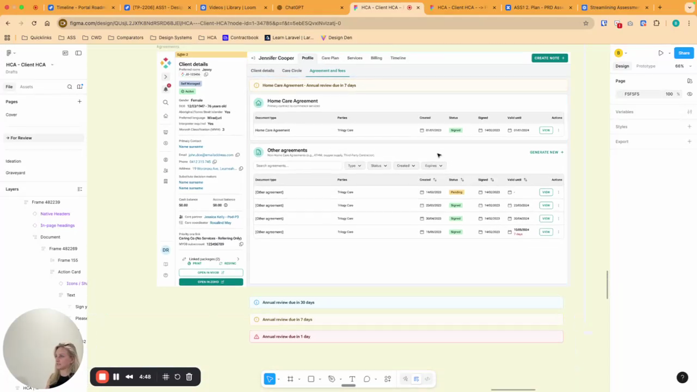

**Context:**
> Okay, I'll quickly walk over to the client side. So as soon as you've sent that request for a digital
> signature, the client would receive an email, I haven't got the email here, but it's just to show that
> you'd have an email there, you'd be able to click a link, and then that would take you and the client

### [04:20.000] Keyframe 107

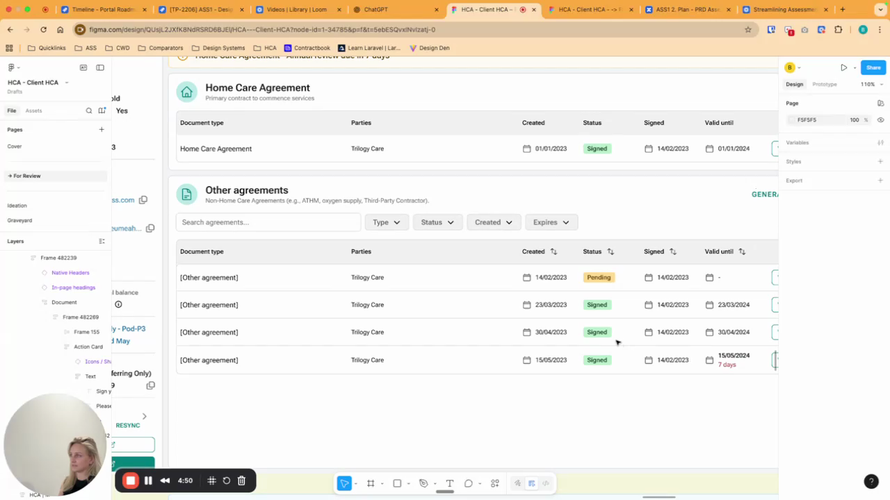

**Context:**
> signature, the client would receive an email, I haven't got the email here, but it's just to show that
> you'd have an email there, you'd be able to click a link, and then that would take you and the client

### [04:20.533] Keyframe 108

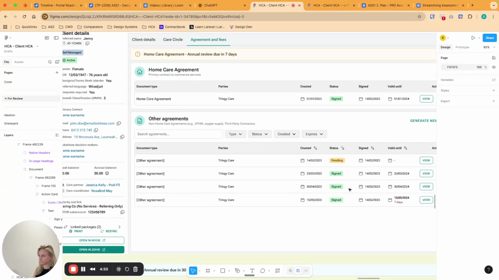

**Context:**
> signature, the client would receive an email, I haven't got the email here, but it's just to show that
> you'd have an email there, you'd be able to click a link, and then that would take you and the client

### [04:21.300] Keyframe 109

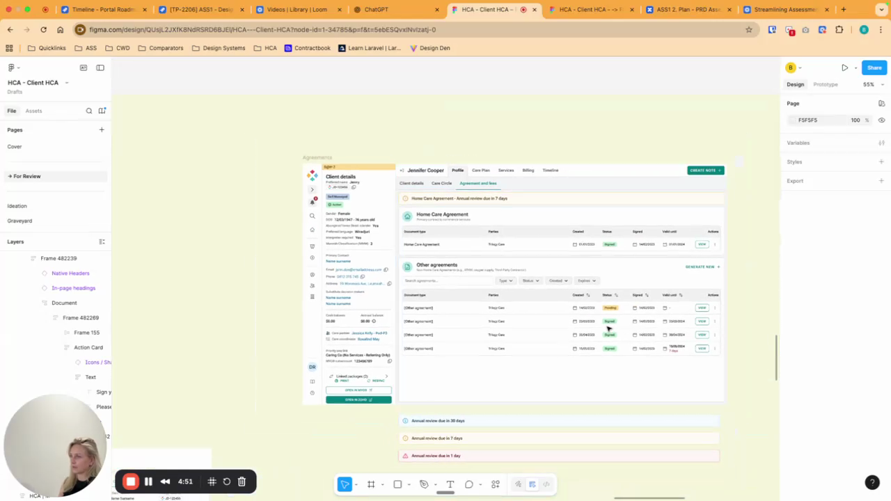

**Context:**
> signature, the client would receive an email, I haven't got the email here, but it's just to show that
> you'd have an email there, you'd be able to click a link, and then that would take you and the client

### [04:22.199] Keyframe 110

**Context:**
> signature, the client would receive an email, I haven't got the email here, but it's just to show that
> you'd have an email there, you'd be able to click a link, and then that would take you and the client
> into portals, they'd log in, and it will direct them straight to the relevant section. So in this

**[04:22.879]** you'd have an email there, you'd be able to click a link, and then that would take you and the client

### [04:23.033] Keyframe 111

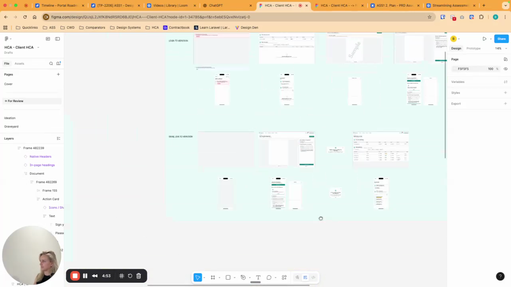

**Context:**
> signature, the client would receive an email, I haven't got the email here, but it's just to show that
> you'd have an email there, you'd be able to click a link, and then that would take you and the client
> into portals, they'd log in, and it will direct them straight to the relevant section. So in this

### [04:23.800] Keyframe 112

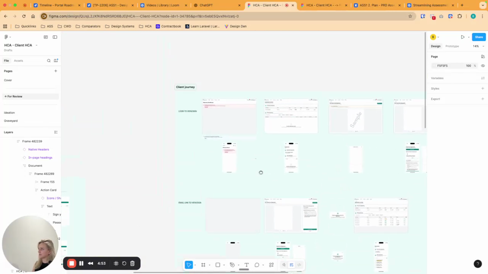

**Context:**
> signature, the client would receive an email, I haven't got the email here, but it's just to show that
> you'd have an email there, you'd be able to click a link, and then that would take you and the client
> into portals, they'd log in, and it will direct them straight to the relevant section. So in this

**[04:26.620]** into portals, they'd log in, and it will direct them straight to the relevant section. So in this

### [04:27.500] Keyframe 113

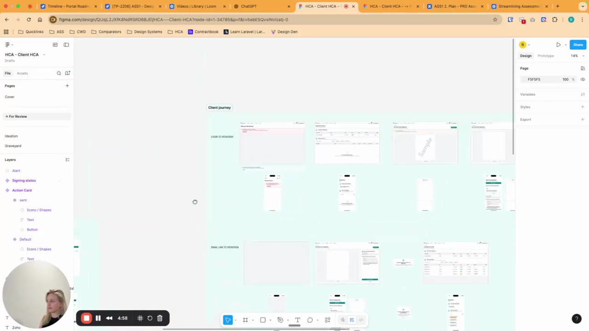

**Context:**
> you'd have an email there, you'd be able to click a link, and then that would take you and the client
> into portals, they'd log in, and it will direct them straight to the relevant section. So in this
> case, the home care agreement, and they'd be able to sign on the right hand side. So it will say it'll

### [04:28.000] Keyframe 114

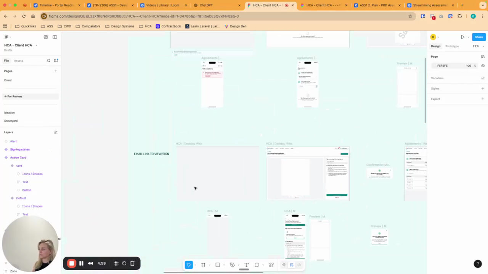

**Context:**
> you'd have an email there, you'd be able to click a link, and then that would take you and the client
> into portals, they'd log in, and it will direct them straight to the relevant section. So in this
> case, the home care agreement, and they'd be able to sign on the right hand side. So it will say it'll

### [04:29.199] Keyframe 115

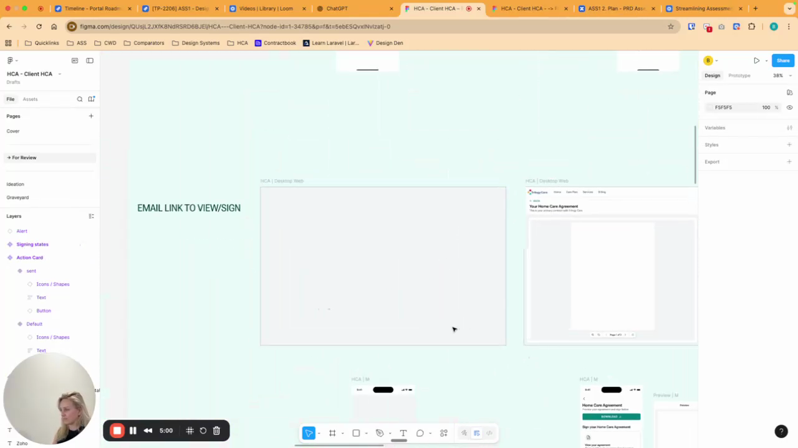

**Context:**
> into portals, they'd log in, and it will direct them straight to the relevant section. So in this
> case, the home care agreement, and they'd be able to sign on the right hand side. So it will say it'll

### [04:30.300] Keyframe 116

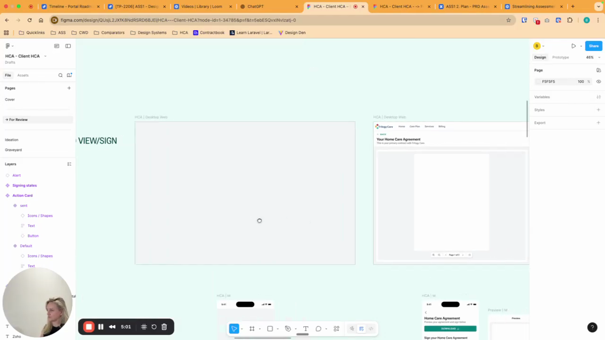

**Context:**
> into portals, they'd log in, and it will direct them straight to the relevant section. So in this
> case, the home care agreement, and they'd be able to sign on the right hand side. So it will say it'll

**[04:31.120]** case, the home care agreement, and they'd be able to sign on the right hand side. So it will say it'll

### [04:32.432] Keyframe 117

**Context:**
> into portals, they'd log in, and it will direct them straight to the relevant section. So in this
> case, the home care agreement, and they'd be able to sign on the right hand side. So it will say it'll
> say who you're signing as or who you're logged in as. And then just outlining what this means by

### [04:33.500] Keyframe 118

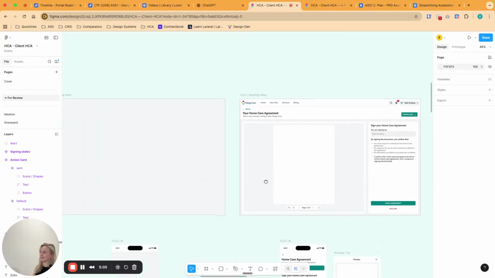

**Context:**
> case, the home care agreement, and they'd be able to sign on the right hand side. So it will say it'll
> say who you're signing as or who you're logged in as. And then just outlining what this means by

### [04:34.000] Keyframe 119

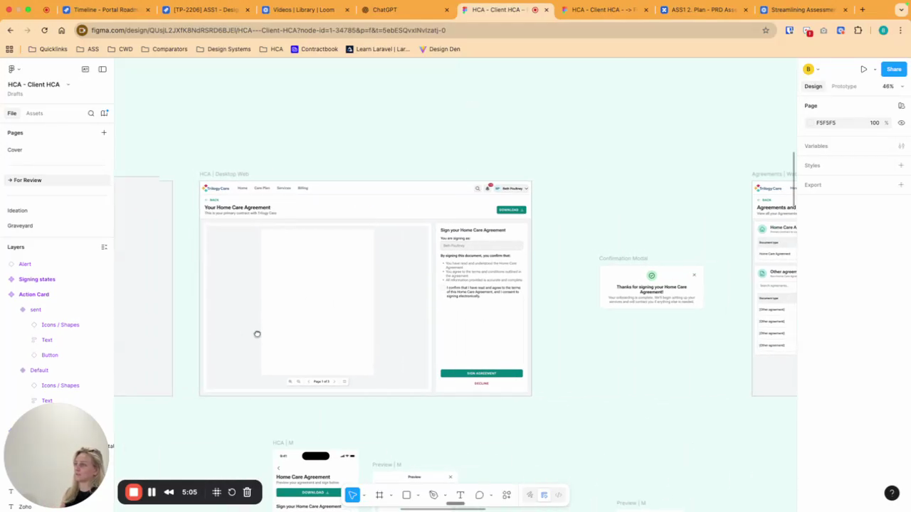

**Context:**
> case, the home care agreement, and they'd be able to sign on the right hand side. So it will say it'll
> say who you're signing as or who you're logged in as. And then just outlining what this means by

### [04:34.699] Keyframe 120

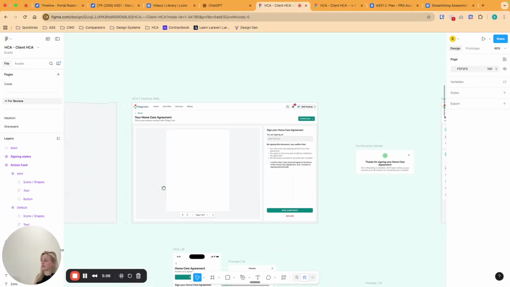

**Context:**
> case, the home care agreement, and they'd be able to sign on the right hand side. So it will say it'll
> say who you're signing as or who you're logged in as. And then just outlining what this means by

**[04:35.519]** say who you're signing as or who you're logged in as. And then just outlining what this means by

### [04:37.300] Keyframe 121

**Context:**
> case, the home care agreement, and they'd be able to sign on the right hand side. So it will say it'll
> say who you're signing as or who you're logged in as. And then just outlining what this means by
> selecting that checkbox, and then that you can send to signing it electronically. So as soon as that

**[04:41.879]** selecting that checkbox, and then that you can send to signing it electronically. So as soon as that

**[04:46.379]** checkbox is clicked, you'd be able to sign agreement, and then that would just convert to a signed

### [04:46.666] Keyframe 122

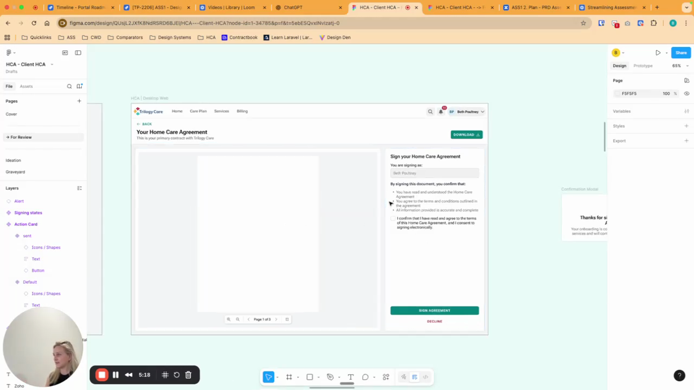

**Context:**
> selecting that checkbox, and then that you can send to signing it electronically. So as soon as that
> checkbox is clicked, you'd be able to sign agreement, and then that would just convert to a signed
> document. I've enabled the decline button, I'm not sure if this is something that we necessarily want.

### [04:47.300] Keyframe 123

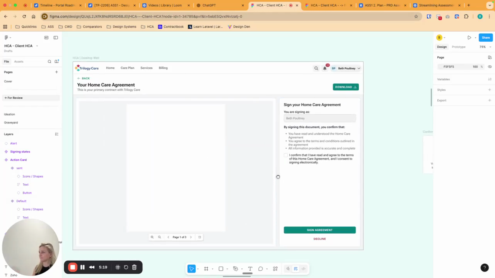

**Context:**
> selecting that checkbox, and then that you can send to signing it electronically. So as soon as that
> checkbox is clicked, you'd be able to sign agreement, and then that would just convert to a signed
> document. I've enabled the decline button, I'm not sure if this is something that we necessarily want.

### [04:47.800] Keyframe 124

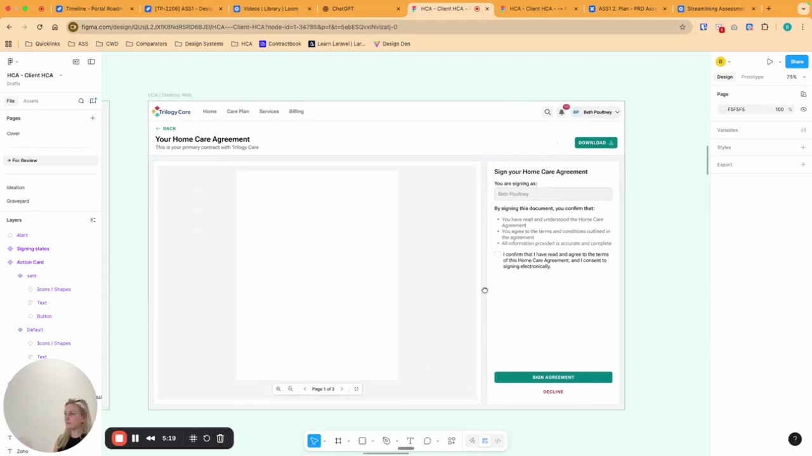

**Context:**
> selecting that checkbox, and then that you can send to signing it electronically. So as soon as that
> checkbox is clicked, you'd be able to sign agreement, and then that would just convert to a signed
> document. I've enabled the decline button, I'm not sure if this is something that we necessarily want.

**[04:50.579]** document. I've enabled the decline button, I'm not sure if this is something that we necessarily want.

**[04:56.199]** But again, if they don't agree with anything, then they can decline. And then that will trigger us to

### [04:56.932] Keyframe 125

**Context:**
> document. I've enabled the decline button, I'm not sure if this is something that we necessarily want.
> But again, if they don't agree with anything, then they can decline. And then that will trigger us to
> go and follow up rather than just not signing and us not knowing at what point we should be following up.

**[04:59.879]** go and follow up rather than just not signing and us not knowing at what point we should be following up.

**[05:05.519]** But as soon as you sign, it will display a modal again, similar to the internal view, and it will just

**[05:10.899]** navigate them back to the table again, wherever they were, I've just created a mobile view of this as

### [05:12.432] Keyframe 126

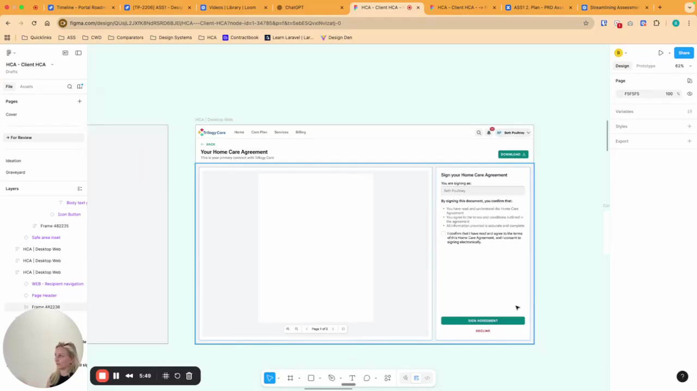

**Context:**
> But as soon as you sign, it will display a modal again, similar to the internal view, and it will just
> navigate them back to the table again, wherever they were, I've just created a mobile view of this as
> well. Obviously, this will be available in the native app. So essentially, this is what it would

### [05:15.432] Keyframe 127

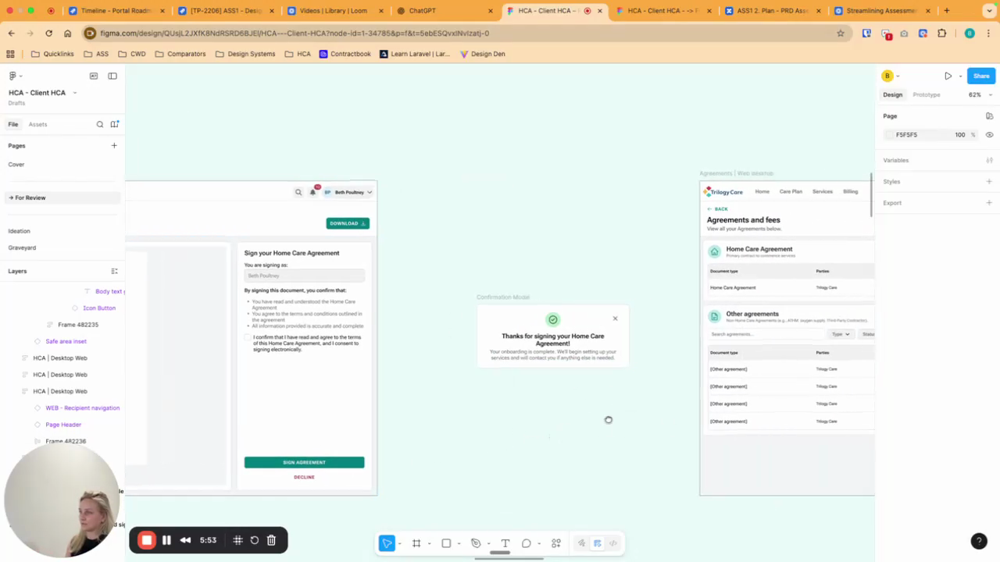

**Context:**
> navigate them back to the table again, wherever they were, I've just created a mobile view of this as
> well. Obviously, this will be available in the native app. So essentially, this is what it would

### [05:15.932] Keyframe 128

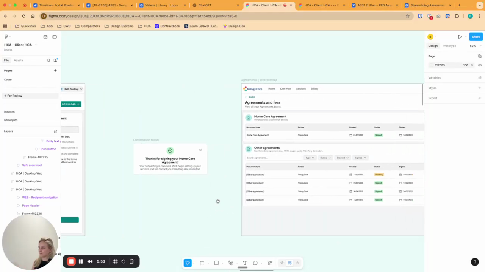

**Context:**
> navigate them back to the table again, wherever they were, I've just created a mobile view of this as
> well. Obviously, this will be available in the native app. So essentially, this is what it would

### [05:16.432] Keyframe 129

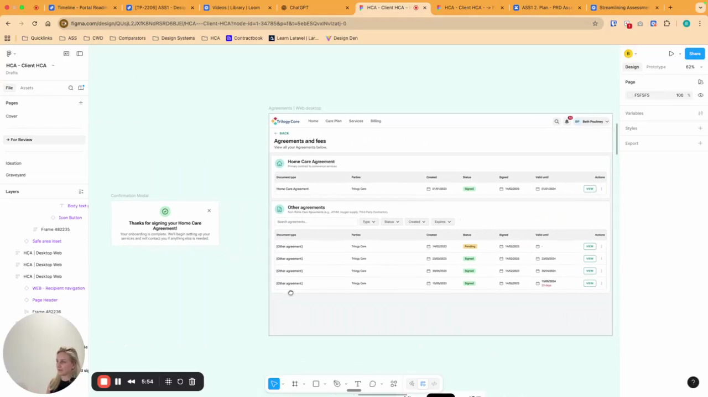

**Context:**
> navigate them back to the table again, wherever they were, I've just created a mobile view of this as
> well. Obviously, this will be available in the native app. So essentially, this is what it would

**[05:16.879]** well. Obviously, this will be available in the native app. So essentially, this is what it would

### [05:16.932] Keyframe 130

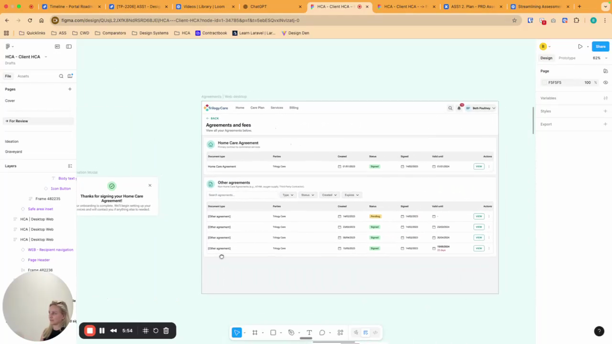

**Context:**
> navigate them back to the table again, wherever they were, I've just created a mobile view of this as
> well. Obviously, this will be available in the native app. So essentially, this is what it would

### [05:20.699] Keyframe 131

**Context:**
> well. Obviously, this will be available in the native app. So essentially, this is what it would
> look like, you'd go and click view your agreements, and it will display a preview, which you'd be able

### [05:21.300] Keyframe 132

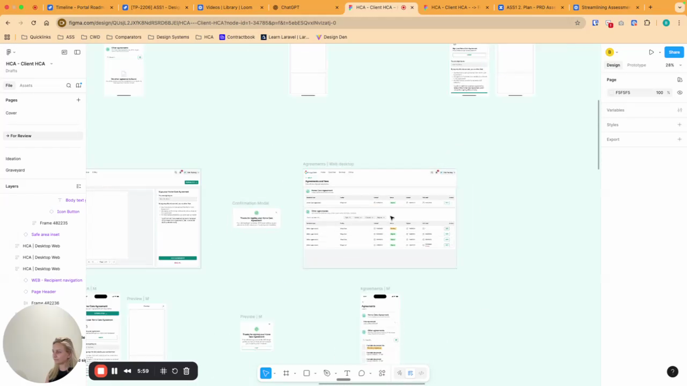

**Context:**
> well. Obviously, this will be available in the native app. So essentially, this is what it would
> look like, you'd go and click view your agreements, and it will display a preview, which you'd be able
> to scroll, you'd have to exit it and then sign below just so it's not super cluttered on the page. And

**[05:22.160]** look like, you'd go and click view your agreements, and it will display a preview, which you'd be able

### [05:22.266] Keyframe 133

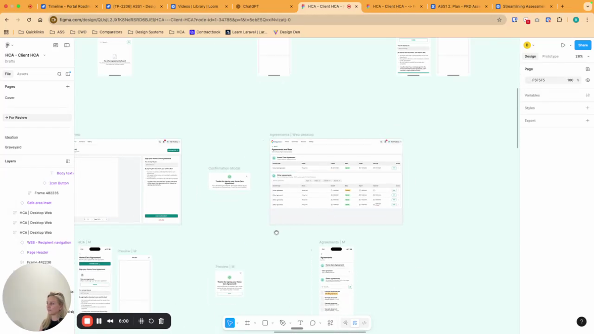

**Context:**
> well. Obviously, this will be available in the native app. So essentially, this is what it would
> look like, you'd go and click view your agreements, and it will display a preview, which you'd be able
> to scroll, you'd have to exit it and then sign below just so it's not super cluttered on the page. And

### [05:22.833] Keyframe 134

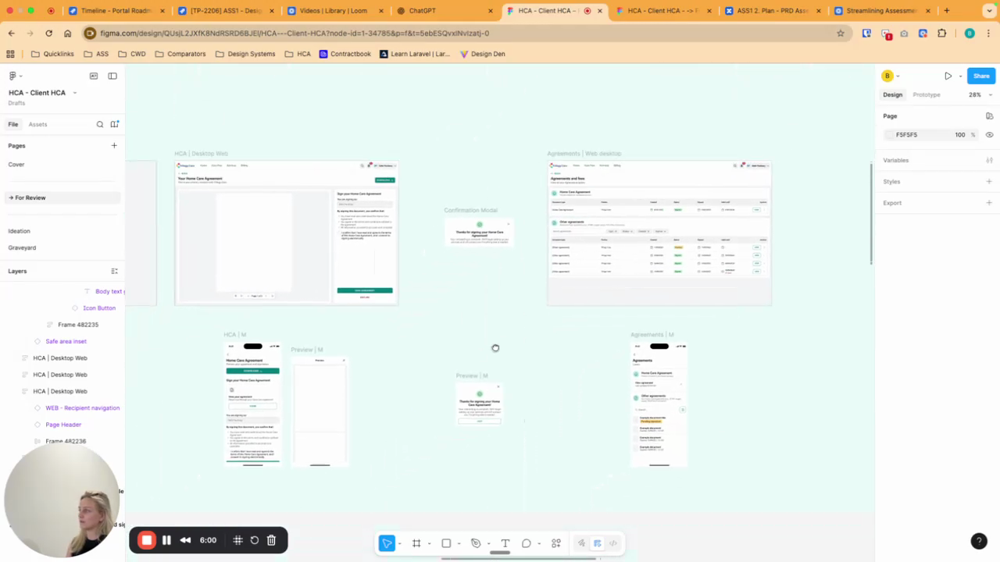

**Context:**
> well. Obviously, this will be available in the native app. So essentially, this is what it would
> look like, you'd go and click view your agreements, and it will display a preview, which you'd be able
> to scroll, you'd have to exit it and then sign below just so it's not super cluttered on the page. And

### [05:23.500] Keyframe 135

**Context:**
> well. Obviously, this will be available in the native app. So essentially, this is what it would
> look like, you'd go and click view your agreements, and it will display a preview, which you'd be able
> to scroll, you'd have to exit it and then sign below just so it's not super cluttered on the page. And

### [05:24.033] Keyframe 136

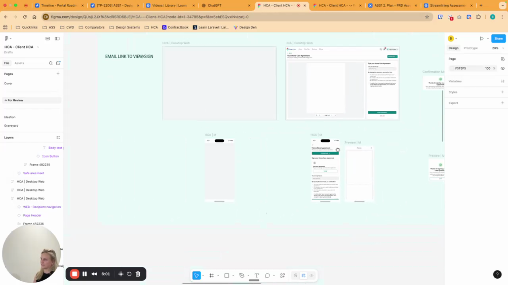

**Context:**
> well. Obviously, this will be available in the native app. So essentially, this is what it would
> look like, you'd go and click view your agreements, and it will display a preview, which you'd be able
> to scroll, you'd have to exit it and then sign below just so it's not super cluttered on the page. And

### [05:24.567] Keyframe 137

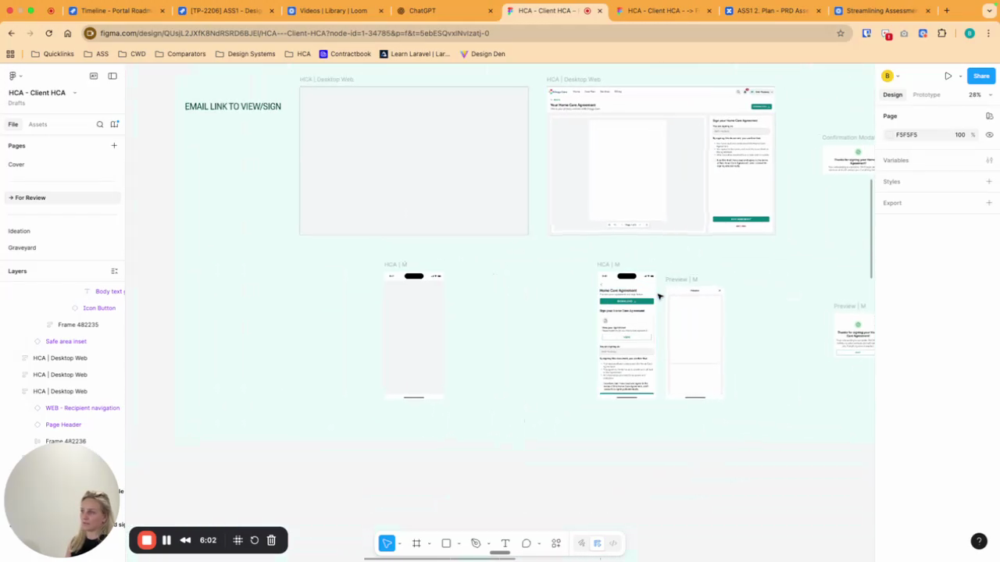

**Context:**
> look like, you'd go and click view your agreements, and it will display a preview, which you'd be able
> to scroll, you'd have to exit it and then sign below just so it's not super cluttered on the page. And

### [05:25.466] Keyframe 138

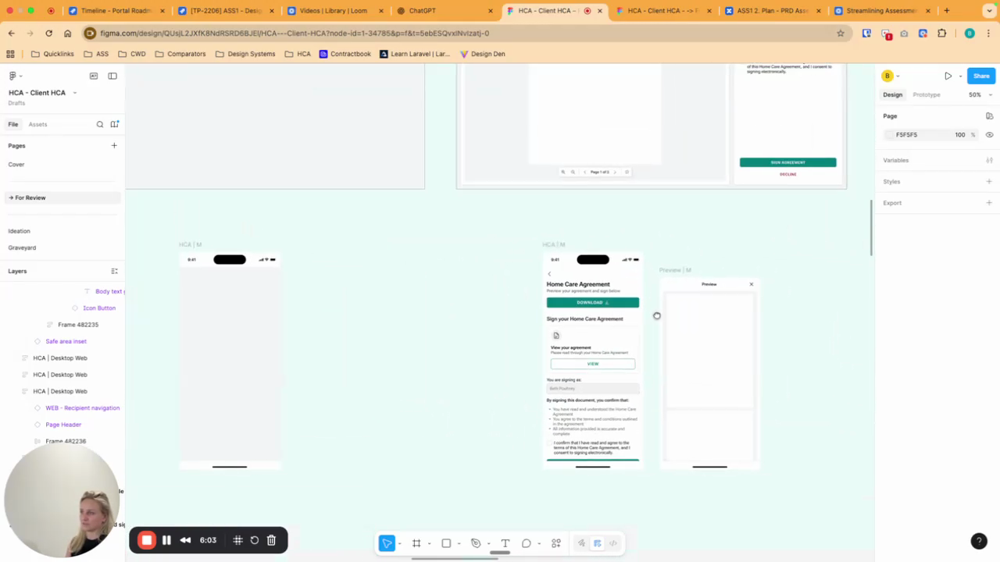

**Context:**
> look like, you'd go and click view your agreements, and it will display a preview, which you'd be able
> to scroll, you'd have to exit it and then sign below just so it's not super cluttered on the page. And

**[05:26.040]** to scroll, you'd have to exit it and then sign below just so it's not super cluttered on the page. And

### [05:28.399] Keyframe 139

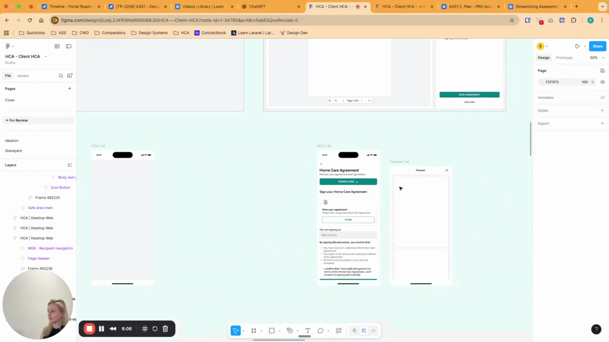

**Context:**
> to scroll, you'd have to exit it and then sign below just so it's not super cluttered on the page. And
> then this is what the broader table view would look like as well. So you'd have your agreement,

### [05:29.233] Keyframe 140

**Context:**
> to scroll, you'd have to exit it and then sign below just so it's not super cluttered on the page. And
> then this is what the broader table view would look like as well. So you'd have your agreement,

**[05:30.740]** then this is what the broader table view would look like as well. So you'd have your agreement,

### [05:32.567] Keyframe 141

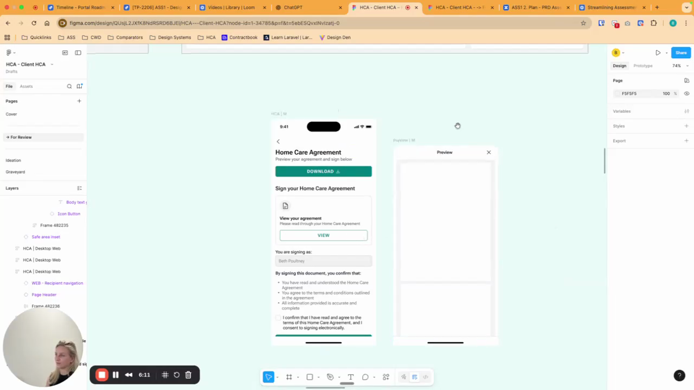

**Context:**
> to scroll, you'd have to exit it and then sign below just so it's not super cluttered on the page. And
> then this is what the broader table view would look like as well. So you'd have your agreement,
> you'd navigate off to that, and then you'd see all of the individual agreements listed below like this.

### [05:37.033] Keyframe 142

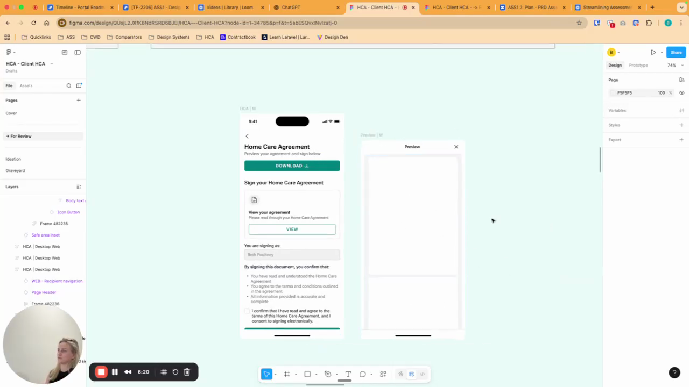

**Context:**
> then this is what the broader table view would look like as well. So you'd have your agreement,
> you'd navigate off to that, and then you'd see all of the individual agreements listed below like this.
> So in this case, where let's say a client logs in, and they didn't receive the link for the email,

**[05:37.439]** you'd navigate off to that, and then you'd see all of the individual agreements listed below like this.

### [05:38.300] Keyframe 143

**Context:**
> then this is what the broader table view would look like as well. So you'd have your agreement,
> you'd navigate off to that, and then you'd see all of the individual agreements listed below like this.
> So in this case, where let's say a client logs in, and they didn't receive the link for the email,

### [05:38.800] Keyframe 144

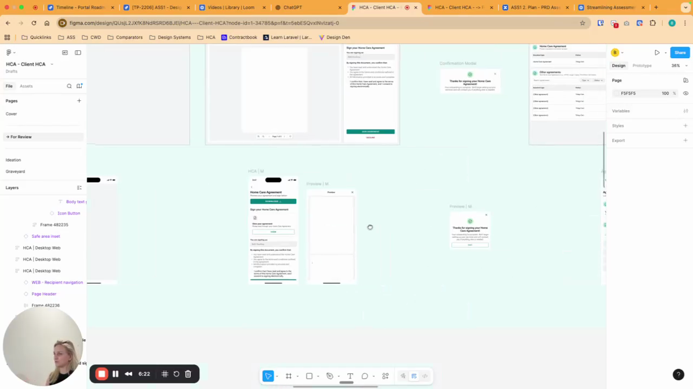

**Context:**
> then this is what the broader table view would look like as well. So you'd have your agreement,
> you'd navigate off to that, and then you'd see all of the individual agreements listed below like this.
> So in this case, where let's say a client logs in, and they didn't receive the link for the email,

### [05:39.533] Keyframe 145

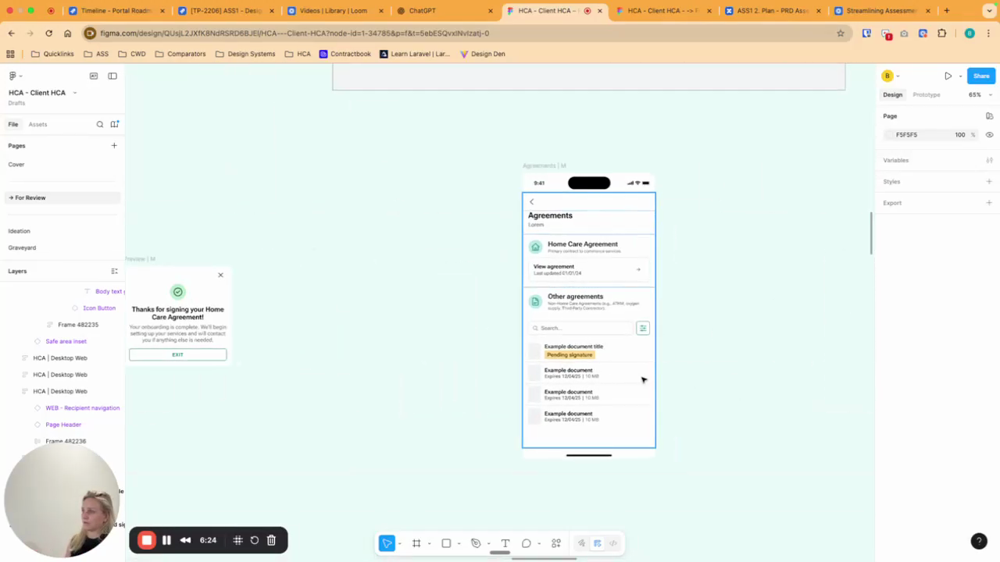

**Context:**
> you'd navigate off to that, and then you'd see all of the individual agreements listed below like this.
> So in this case, where let's say a client logs in, and they didn't receive the link for the email,

**[05:41.660]** So in this case, where let's say a client logs in, and they didn't receive the link for the email,

**[05:46.459]** they just choose to log in first, then it will take them here to the dashboard, they receive an

### [05:49.733] Keyframe 146

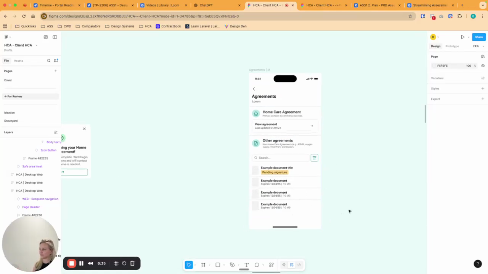

**Context:**
> they just choose to log in first, then it will take them here to the dashboard, they receive an
> alert on their main dashboard, which would say please sign your home care agreement, and that
> would navigate them straight to here, like we had before. Or if they happen to click through to their

### [05:50.300] Keyframe 147

**Context:**
> they just choose to log in first, then it will take them here to the dashboard, they receive an
> alert on their main dashboard, which would say please sign your home care agreement, and that
> would navigate them straight to here, like we had before. Or if they happen to click through to their

**[05:50.500]** alert on their main dashboard, which would say please sign your home care agreement, and that

**[05:54.199]** would navigate them straight to here, like we had before. Or if they happen to click through to their

### [05:55.966] Keyframe 148

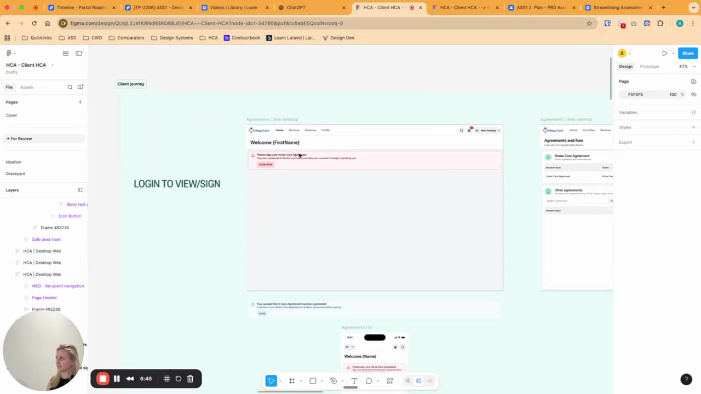

**Context:**
> alert on their main dashboard, which would say please sign your home care agreement, and that
> would navigate them straight to here, like we had before. Or if they happen to click through to their
> agreements and fees, which they'd be able to go click drop down their name, select agreement and fees,

**[06:00.300]** agreements and fees, which they'd be able to go click drop down their name, select agreement and fees,

### [06:01.567] Keyframe 149

**Context:**
> would navigate them straight to here, like we had before. Or if they happen to click through to their
> agreements and fees, which they'd be able to go click drop down their name, select agreement and fees,
> and then that'll take them to this table view page. And again, similar to the internal view, they'd be able to go and

### [06:02.500] Keyframe 150

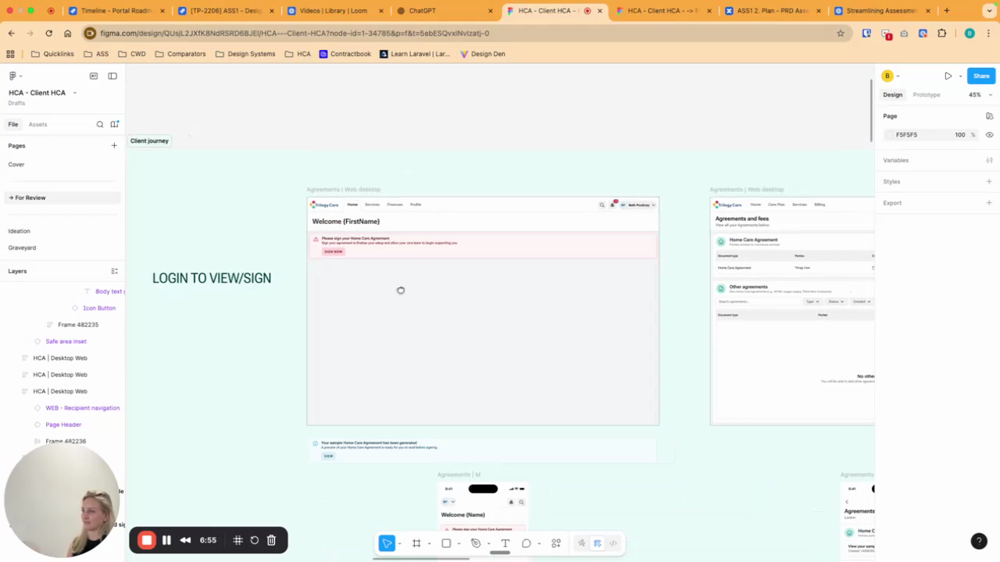

**Context:**
> agreements and fees, which they'd be able to go click drop down their name, select agreement and fees,
> and then that'll take them to this table view page. And again, similar to the internal view, they'd be able to go and

### [06:03.300] Keyframe 151

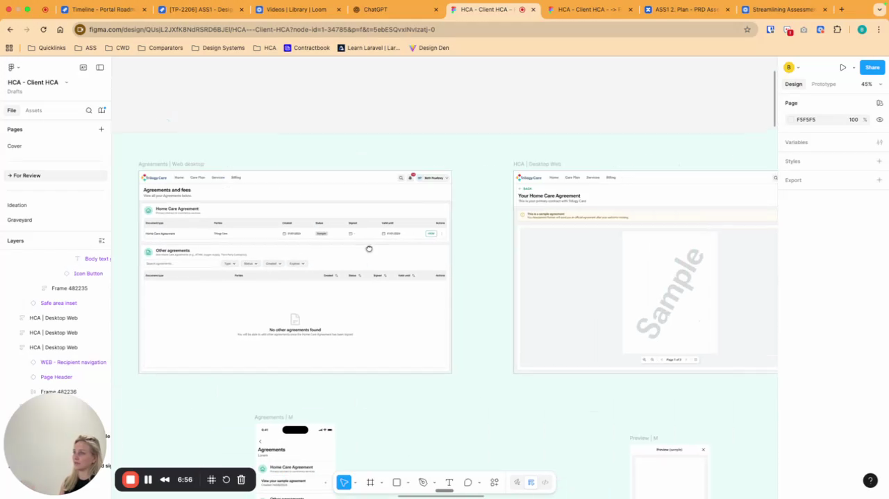

**Context:**
> agreements and fees, which they'd be able to go click drop down their name, select agreement and fees,
> and then that'll take them to this table view page. And again, similar to the internal view, they'd be able to go and

### [06:03.800] Keyframe 152

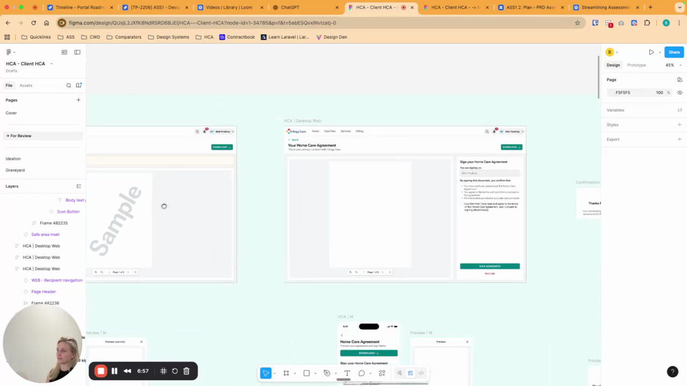

**Context:**
> agreements and fees, which they'd be able to go click drop down their name, select agreement and fees,
> and then that'll take them to this table view page. And again, similar to the internal view, they'd be able to go and

### [06:04.333] Keyframe 153

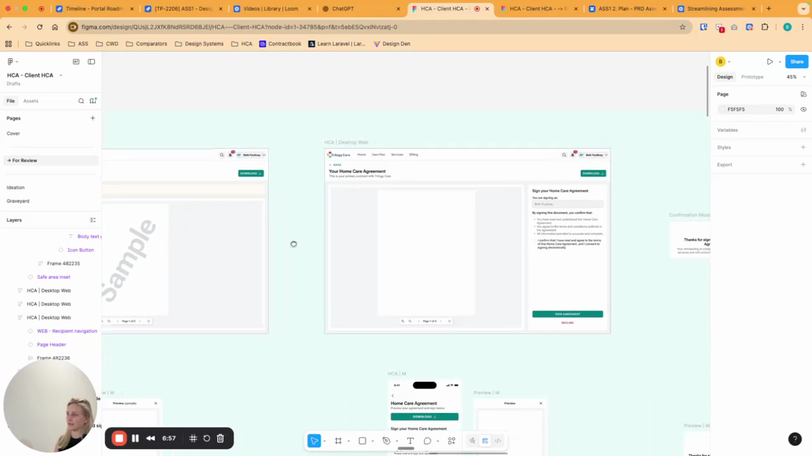

**Context:**
> agreements and fees, which they'd be able to go click drop down their name, select agreement and fees,
> and then that'll take them to this table view page. And again, similar to the internal view, they'd be able to go and

**[06:05.360]** and then that'll take them to this table view page. And again, similar to the internal view, they'd be able to go and

### [06:06.166] Keyframe 154

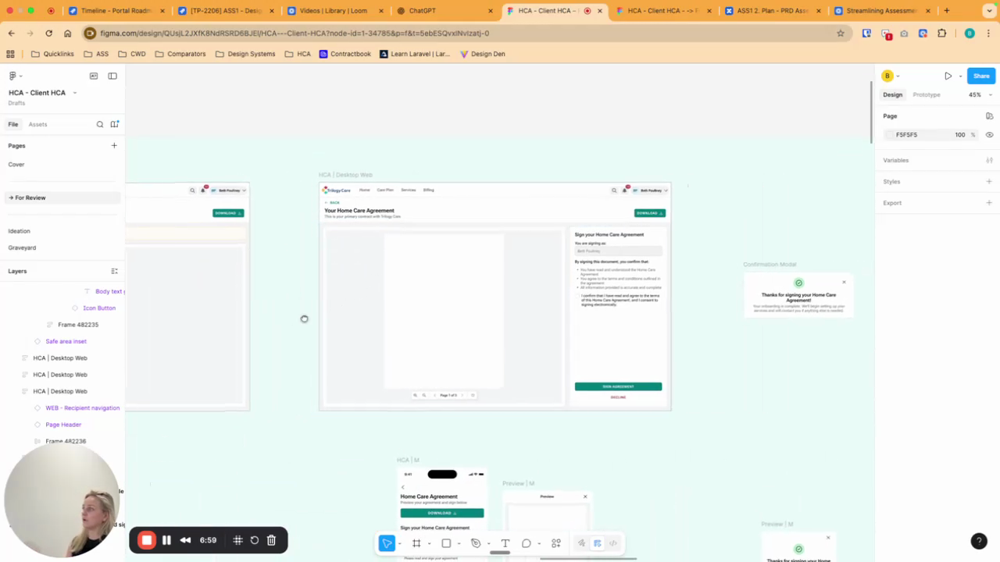

**Context:**
> agreements and fees, which they'd be able to go click drop down their name, select agreement and fees,
> and then that'll take them to this table view page. And again, similar to the internal view, they'd be able to go and
> click that view button on the table, and it will navigate them to this to the to this agreement, or if it is not

### [06:06.766] Keyframe 155

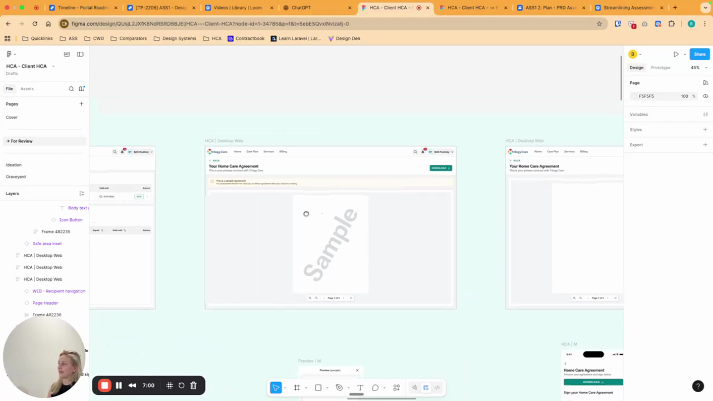

**Context:**
> agreements and fees, which they'd be able to go click drop down their name, select agreement and fees,
> and then that'll take them to this table view page. And again, similar to the internal view, they'd be able to go and
> click that view button on the table, and it will navigate them to this to the to this agreement, or if it is not

### [06:07.266] Keyframe 156

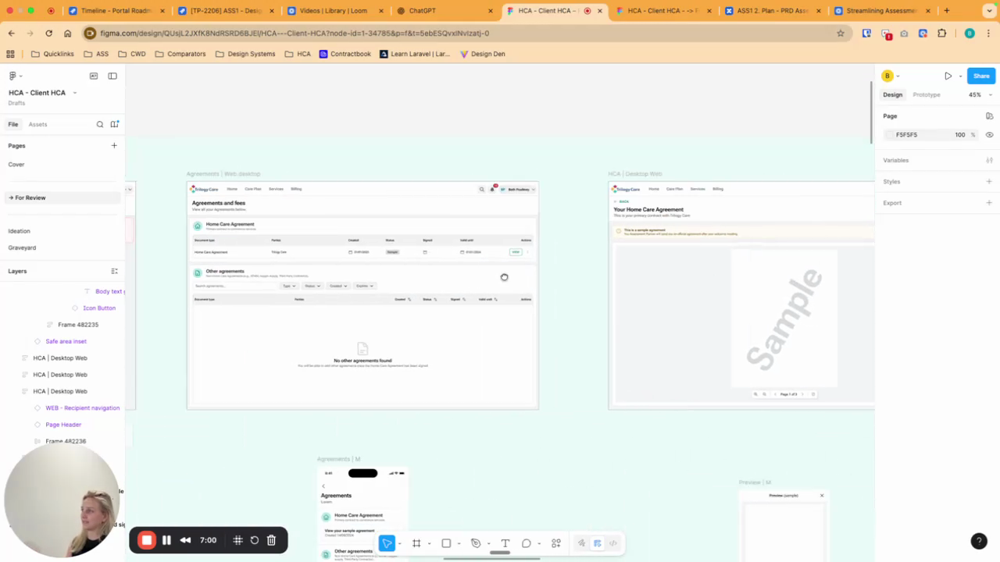

**Context:**
> and then that'll take them to this table view page. And again, similar to the internal view, they'd be able to go and
> click that view button on the table, and it will navigate them to this to the to this agreement, or if it is not

### [06:08.067] Keyframe 157

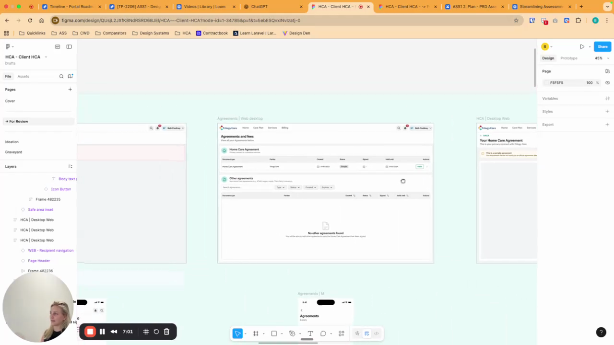

**Context:**
> and then that'll take them to this table view page. And again, similar to the internal view, they'd be able to go and
> click that view button on the table, and it will navigate them to this to the to this agreement, or if it is not

### [06:08.567] Keyframe 158

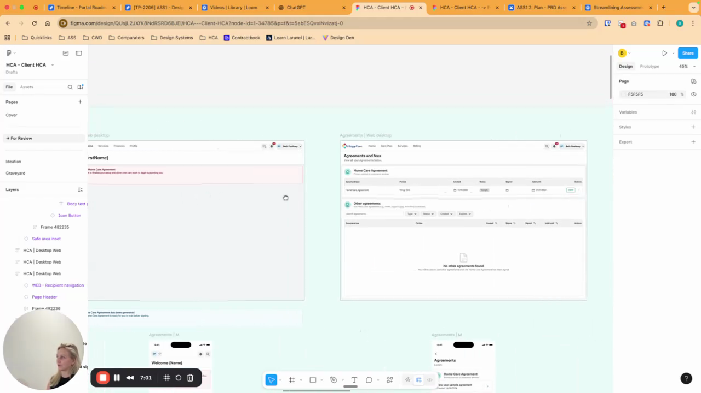

**Context:**
> and then that'll take them to this table view page. And again, similar to the internal view, they'd be able to go and
> click that view button on the table, and it will navigate them to this to the to this agreement, or if it is not

### [06:09.367] Keyframe 159

**Context:**
> and then that'll take them to this table view page. And again, similar to the internal view, they'd be able to go and
> click that view button on the table, and it will navigate them to this to the to this agreement, or if it is not

**[06:10.100]** click that view button on the table, and it will navigate them to this to the to this agreement, or if it is not

### [06:12.132] Keyframe 160

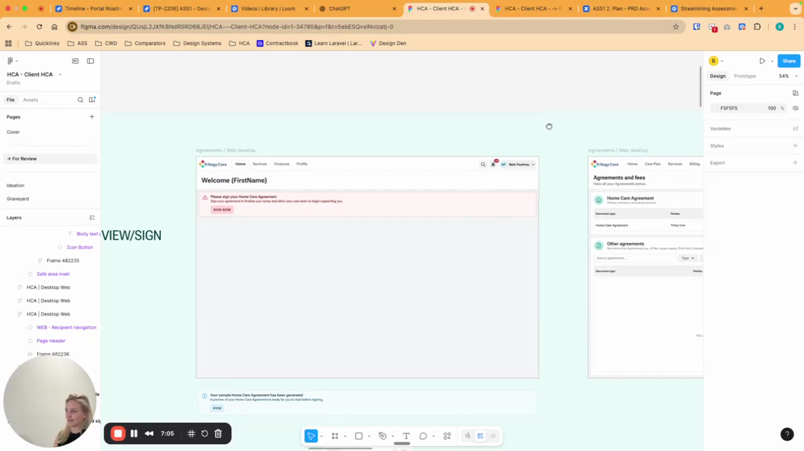

**Context:**
> click that view button on the table, and it will navigate them to this to the to this agreement, or if it is not
> official agreement at this point, and they'd be navigated to the sample agreement. And again, they can't do anything

### [06:12.833] Keyframe 161

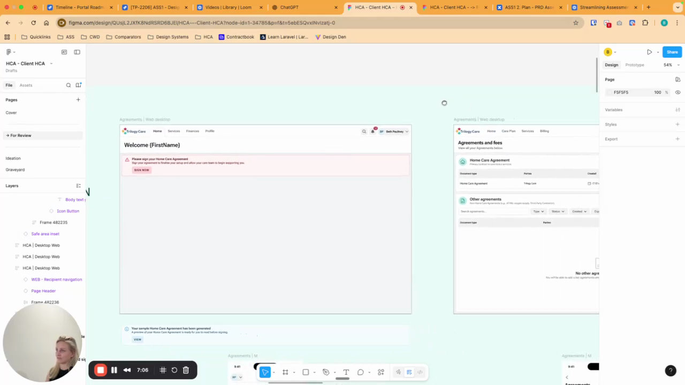

**Context:**
> click that view button on the table, and it will navigate them to this to the to this agreement, or if it is not
> official agreement at this point, and they'd be navigated to the sample agreement. And again, they can't do anything

### [06:13.333] Keyframe 162

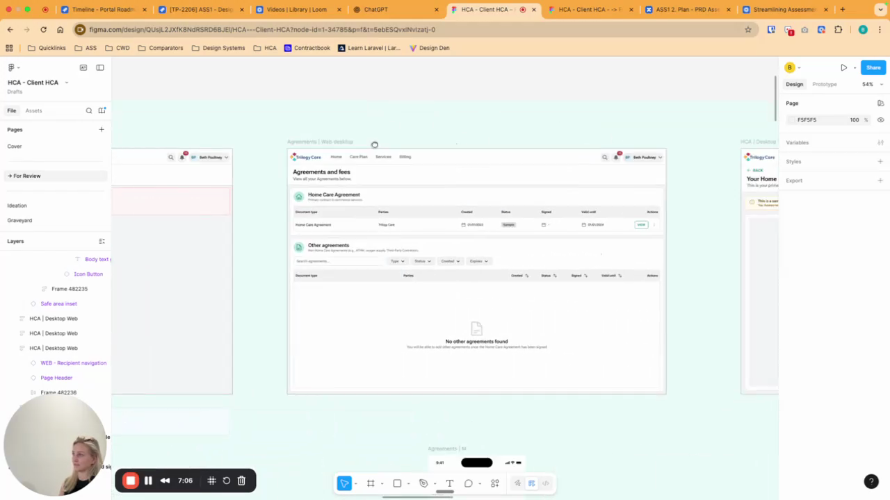

**Context:**
> click that view button on the table, and it will navigate them to this to the to this agreement, or if it is not
> official agreement at this point, and they'd be navigated to the sample agreement. And again, they can't do anything

**[06:16.519]** official agreement at this point, and they'd be navigated to the sample agreement. And again, they can't do anything

### [06:19.100] Keyframe 163

**Context:**
> official agreement at this point, and they'd be navigated to the sample agreement. And again, they can't do anything
> other than download, but it just allows them to preview the document where required. So that's everything that I've got so far.

### [06:19.733] Keyframe 164

**Context:**
> official agreement at this point, and they'd be navigated to the sample agreement. And again, they can't do anything
> other than download, but it just allows them to preview the document where required. So that's everything that I've got so far.

### [06:20.233] Keyframe 165

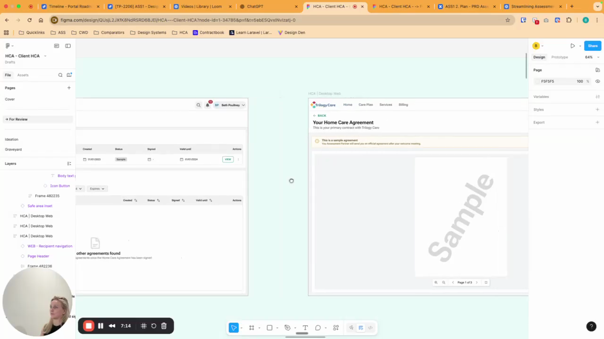

**Context:**
> official agreement at this point, and they'd be navigated to the sample agreement. And again, they can't do anything
> other than download, but it just allows them to preview the document where required. So that's everything that I've got so far.

### [06:20.733] Keyframe 166

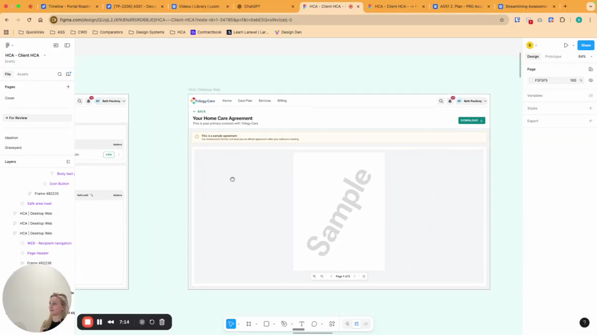

**Context:**
> official agreement at this point, and they'd be navigated to the sample agreement. And again, they can't do anything
> other than download, but it just allows them to preview the document where required. So that's everything that I've got so far.

**[06:21.220]** other than download, but it just allows them to preview the document where required. So that's everything that I've got so far.

### [06:21.300] Keyframe 167

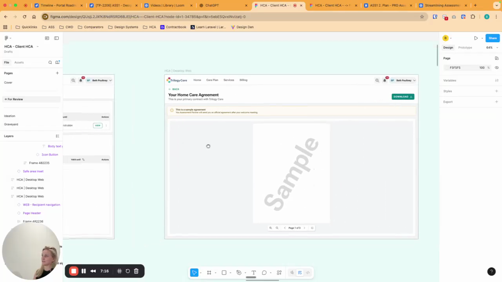

**Context:**
> official agreement at this point, and they'd be navigated to the sample agreement. And again, they can't do anything
> other than download, but it just allows them to preview the document where required. So that's everything that I've got so far.

### [06:21.800] Keyframe 168

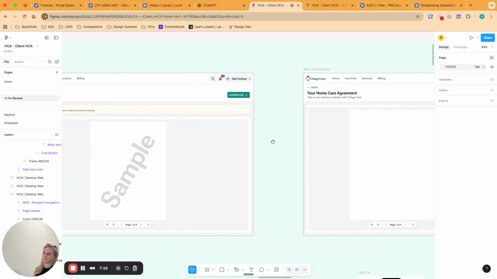

**Context:**
> official agreement at this point, and they'd be navigated to the sample agreement. And again, they can't do anything
> other than download, but it just allows them to preview the document where required. So that's everything that I've got so far.

### [06:22.966] Keyframe 169

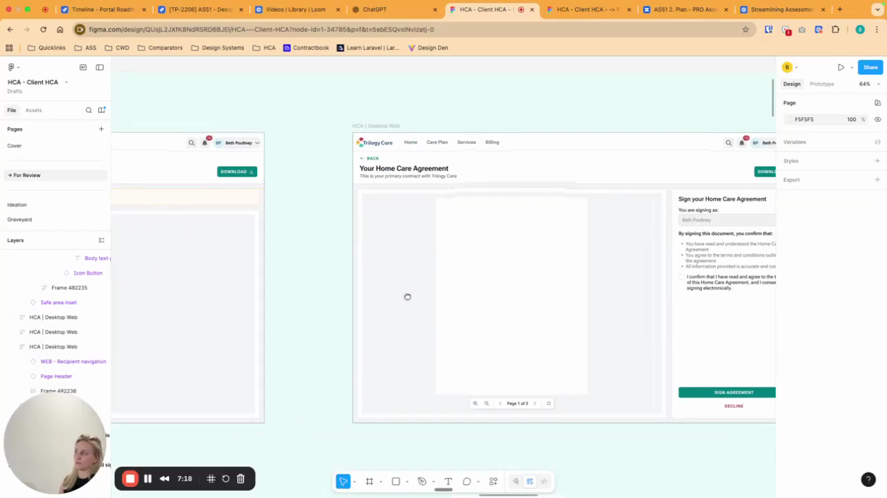

**Context:**
> official agreement at this point, and they'd be navigated to the sample agreement. And again, they can't do anything
> other than download, but it just allows them to preview the document where required. So that's everything that I've got so far.

### [06:25.132] Keyframe 170

**Context:**
> other than download, but it just allows them to preview the document where required. So that's everything that I've got so far.
> Yeah, just keen to get some feedback earlier on and if there's any fields that are required for home care agreements, and also any of the other agreements as well.

**[06:28.399]** Yeah, just keen to get some feedback earlier on and if there's any fields that are required for home care agreements, and also any of the other agreements as well.

### [06:31.199] Keyframe 171

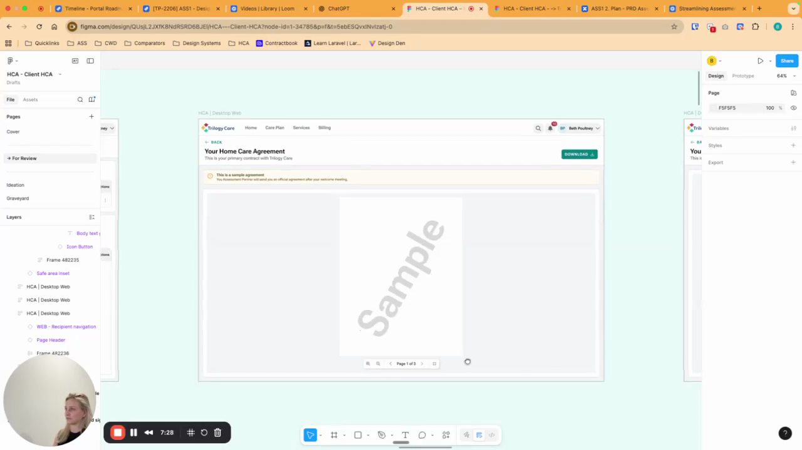

**Context:**
> Yeah, just keen to get some feedback earlier on and if there's any fields that are required for home care agreements, and also any of the other agreements as well.

### [06:31.932] Keyframe 172

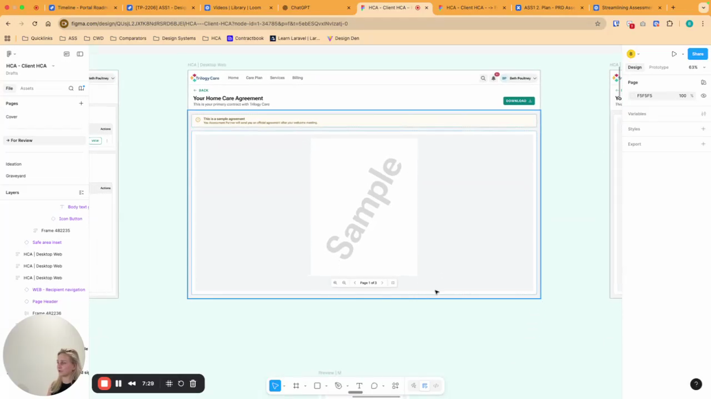

**Context:**
> Yeah, just keen to get some feedback earlier on and if there's any fields that are required for home care agreements, and also any of the other agreements as well.

### [06:32.567] Keyframe 173

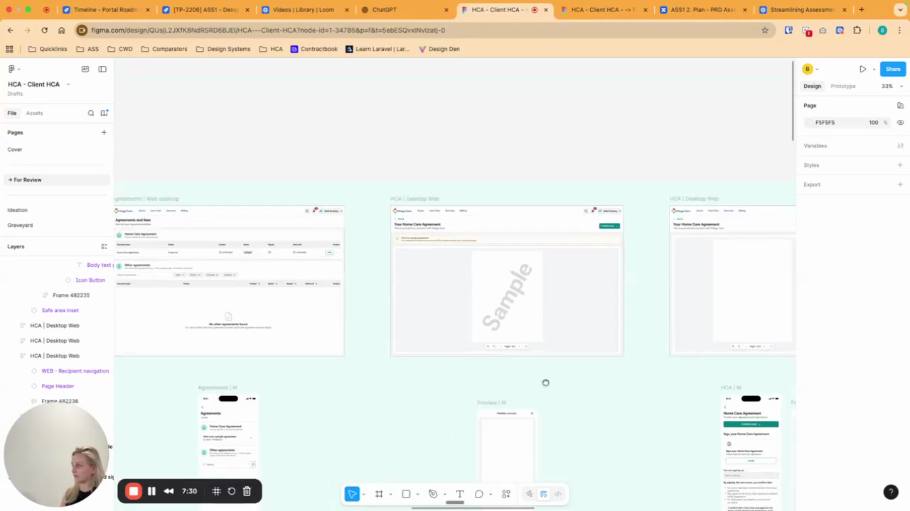

**Context:**
> Yeah, just keen to get some feedback earlier on and if there's any fields that are required for home care agreements, and also any of the other agreements as well.
> good sex and
> good sex and

### [06:33.367] Keyframe 174

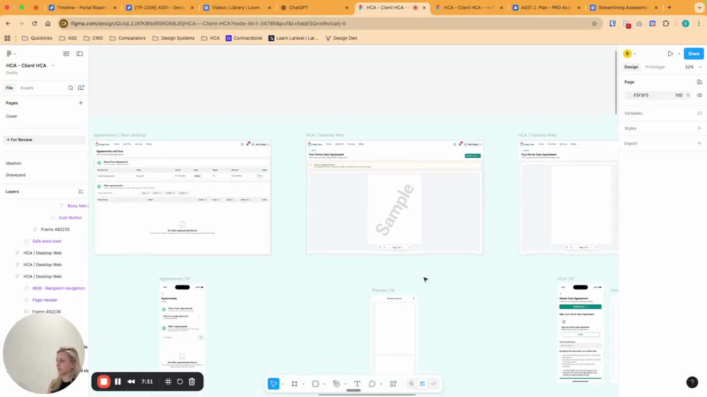

**Context:**
> Yeah, just keen to get some feedback earlier on and if there's any fields that are required for home care agreements, and also any of the other agreements as well.
> good sex and
> good sex and
> 
> good sex and
> good sex and
> good sex and
> good sex and
> 
> good sex and
> 
> 
> 

### [06:34.166] Keyframe 175

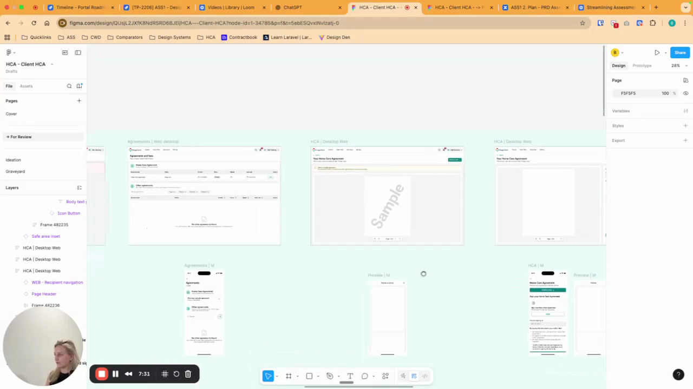

**Context:**
> Yeah, just keen to get some feedback earlier on and if there's any fields that are required for home care agreements, and also any of the other agreements as well.
> good sex and
> good sex and
> 
> good sex and
> good sex and
> good sex and
> good sex and
> 
> good sex and
> 
> 
> 
> good sex and
> 
> 
> 
> good sex and
> good sex and
> good sex and
> 
> 
> 
> 
> 
> 
> 
> 
> 
> 
> 
> 
> 
> 
> 
> 
> good sex and good sex and good sex and good sex and good sex and good sex and good
> Thank you.

### [06:34.932] Keyframe 176

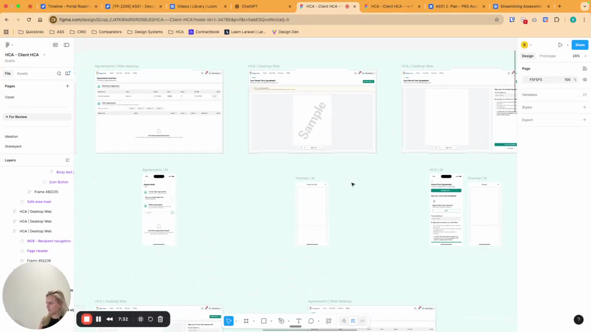

**Context:**
> Yeah, just keen to get some feedback earlier on and if there's any fields that are required for home care agreements, and also any of the other agreements as well.
> good sex and
> good sex and
> 
> good sex and
> good sex and
> good sex and
> good sex and
> 
> good sex and
> 
> 
> 
> good sex and
> 
> 
> 
> good sex and
> good sex and
> good sex and
> 
> 
> 
> 
> 
> 
> 
> 
> 
> 
> 
> 
> 
> 
> 
> 
> good sex and good sex and good sex and good sex and good sex and good sex and good
> Thank you.

### [06:35.567] Keyframe 177

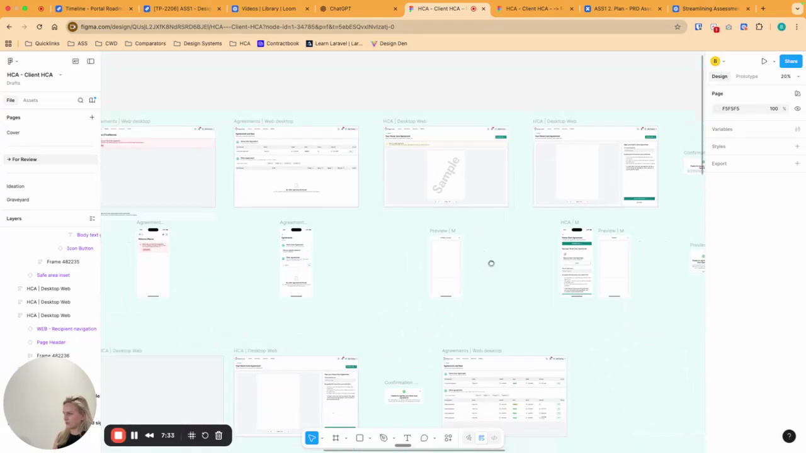

**Context:**
> Yeah, just keen to get some feedback earlier on and if there's any fields that are required for home care agreements, and also any of the other agreements as well.
> good sex and
> good sex and
> 
> good sex and
> good sex and
> good sex and
> good sex and
> 
> good sex and
> 
> 
> 
> good sex and
> 
> 
> 
> good sex and
> good sex and
> good sex and
> 
> 
> 
> 
> 
> 
> 
> 
> 
> 
> 
> 
> 
> 
> 
> 
> good sex and good sex and good sex and good sex and good sex and good sex and good
> Thank you.

### [06:36.166] Keyframe 178

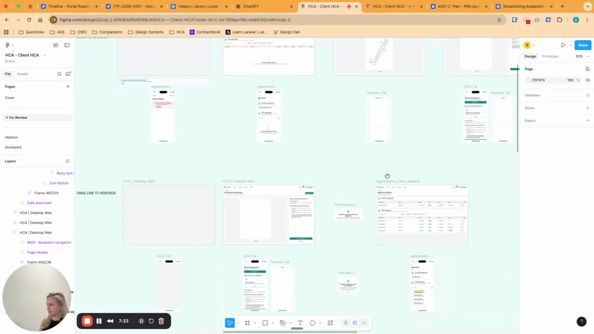

**Context:**
> Yeah, just keen to get some feedback earlier on and if there's any fields that are required for home care agreements, and also any of the other agreements as well.
> good sex and
> good sex and
> 
> good sex and
> good sex and
> good sex and
> good sex and
> 
> good sex and
> 
> 
> 
> good sex and
> 
> 
> 
> good sex and
> good sex and
> good sex and
> 
> 
> 
> 
> 
> 
> 
> 
> 
> 
> 
> 
> 
> 
> 
> 
> good sex and good sex and good sex and good sex and good sex and good sex and good
> Thank you.

### [06:36.666] Keyframe 179

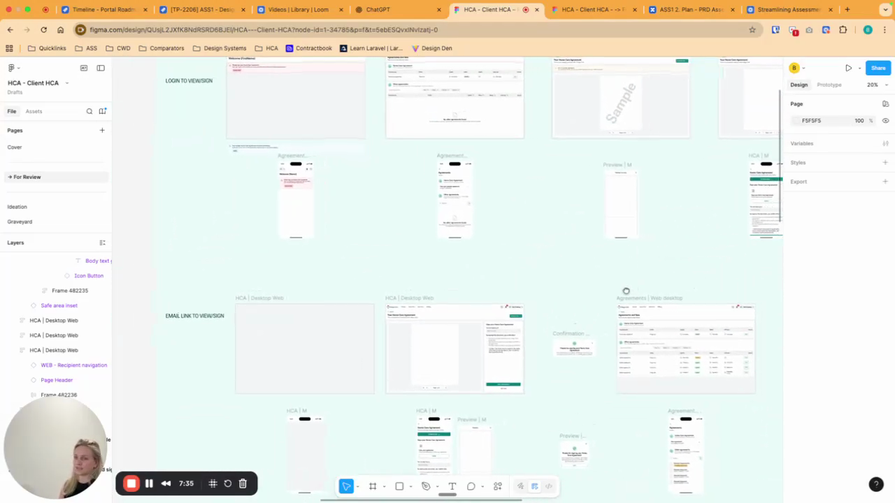

**Context:**
> Yeah, just keen to get some feedback earlier on and if there's any fields that are required for home care agreements, and also any of the other agreements as well.
> good sex and
> good sex and
> 
> good sex and
> good sex and
> good sex and
> good sex and
> 
> good sex and
> 
> 
> 
> good sex and
> 
> 
> 
> good sex and
> good sex and
> good sex and
> 
> 
> 
> 
> 
> 
> 
> 
> 
> 
> 
> 
> 
> 
> 
> 
> good sex and good sex and good sex and good sex and good sex and good sex and good
> Thank you.

**[06:36.959]** good sex and

**[06:37.500]** good sex and

**[06:37.680]** 

**[06:37.680]** good sex and

### [06:37.699] Keyframe 180

**Context:**
> Yeah, just keen to get some feedback earlier on and if there's any fields that are required for home care agreements, and also any of the other agreements as well.
> good sex and
> good sex and
> 
> good sex and
> good sex and
> good sex and
> good sex and
> 
> good sex and
> 
> 
> 
> good sex and
> 
> 
> 
> good sex and
> good sex and
> good sex and
> 
> 
> 
> 
> 
> 
> 
> 
> 
> 
> 
> 
> 
> 
> 
> 
> good sex and good sex and good sex and good sex and good sex and good sex and good
> Thank you.

**[06:37.720]** good sex and

**[06:37.740]** good sex and

**[06:37.800]** good sex and

**[06:37.959]** 

**[06:37.959]** good sex and

**[06:38.019]** 

**[06:38.019]** 

**[06:38.019]** 

### [06:38.233] Keyframe 181

**Context:**
> Yeah, just keen to get some feedback earlier on and if there's any fields that are required for home care agreements, and also any of the other agreements as well.
> good sex and
> good sex and
> 
> good sex and
> good sex and
> good sex and
> good sex and
> 
> good sex and
> 
> 
> 
> good sex and
> 
> 
> 
> good sex and
> good sex and
> good sex and
> 
> 
> 
> 
> 
> 
> 
> 
> 
> 
> 
> 
> 
> 
> 
> 
> good sex and good sex and good sex and good sex and good sex and good sex and good
> Thank you.

**[06:38.620]** good sex and

**[06:38.860]** 

**[06:38.860]** 

**[06:38.860]** 

**[06:38.860]** good sex and

**[06:38.899]** good sex and

**[06:39.000]** good sex and

### [06:39.033] Keyframe 182

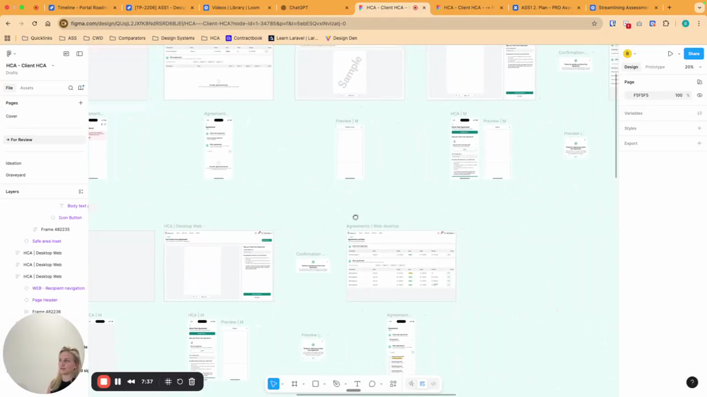

**Context:**
> good sex and
> good sex and
> 
> good sex and
> good sex and
> good sex and
> good sex and
> 
> good sex and
> 
> 
> 
> good sex and
> 
> 
> 
> good sex and
> good sex and
> good sex and
> 
> 
> 
> 
> 
> 
> 
> 
> 
> 
> 
> 
> 
> 
> 
> 
> good sex and good sex and good sex and good sex and good sex and good sex and good
> Thank you.

**[06:39.079]** 

**[06:39.079]** 

**[06:39.079]** 

**[06:39.079]** 

**[06:39.079]** 

**[06:39.079]** 

**[06:39.079]** 

**[06:39.079]** 

**[06:39.079]** 

**[06:39.079]** 

**[06:39.079]** 

**[06:39.079]** 

**[06:39.079]** 

**[06:39.079]** 

**[06:39.079]** 

**[06:39.079]** 

**[06:39.079]** good sex and good sex and good sex and good sex and good sex and good sex and good

**[06:39.100]** Thank you.

### [06:40.300] Keyframe 183

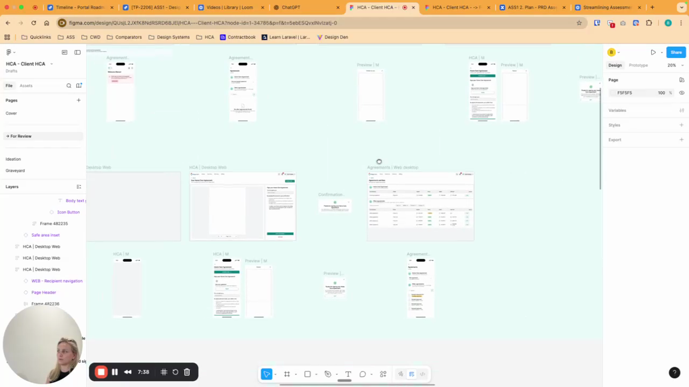

**Context:**
> good sex and
> 
> 
> 
> good sex and
> good sex and
> good sex and
> 
> 
> 
> 
> 
> 
> 
> 
> 
> 
> 
> 
> 
> 
> 
> 
> good sex and good sex and good sex and good sex and good sex and good sex and good
> Thank you.

### [06:44.333] Keyframe 184

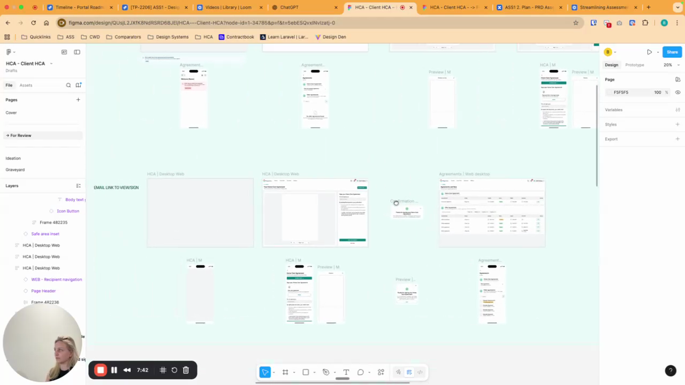

**[07:05.699]** 

---

## Keyframe Gallery

|  |
| 00:00.000 |

|  |
| 00:44.233 |

|  |
| 00:46.133 |

|  |
| 01:12.366 |

|  |
| 01:12.866 |

|  |
| 01:13.433 |

|  |
| 01:33.700 |

|  |
| 01:34.599 |

|  |
| 01:35.366 |

|  |
| 01:35.900 |

|  |
| 01:36.566 |

|  |
| 01:37.400 |

|  |
| 01:45.000 |

|  |
| 01:45.900 |

|  |
| 01:48.866 |

|  |
| 01:49.366 |

|  |
| 01:49.866 |

|  |
| 01:50.433 |

|  |
| 01:51.766 |

|  |
| 01:52.666 |

|  |
| 02:11.133 |

|  |
| 02:11.699 |

|  |
| 02:12.266 |

|  |
| 02:12.766 |

|  |
| 02:13.400 |

|  |
| 02:14.366 |

|  |
| 02:15.500 |

|  |
| 02:16.300 |

|  |
| 02:16.833 |

|  |
| 02:17.366 |

|  |
| 02:17.866 |

|  |
| 02:18.533 |

|  |
| 02:19.033 |

|  |
| 02:19.533 |

|  |
| 02:21.266 |

|  |
| 02:21.766 |

|  |
| 02:22.766 |

|  |
| 02:24.066 |

|  |
| 02:24.566 |

|  |
| 02:25.066 |

|  |
| 02:25.599 |

|  |
| 02:26.099 |

|  |
| 02:26.599 |

|  |
| 02:27.099 |

|  |
| 02:27.599 |

|  |
| 02:28.400 |

|  |
| 02:29.133 |

|  |
| 02:29.933 |

|  |
| 02:30.833 |

|  |
| 02:31.466 |

|  |
| 02:35.866 |

|  |
| 02:41.966 |

|  |
| 02:56.833 |

|  |
| 02:57.366 |

|  |
| 02:57.866 |

|  |
| 02:58.400 |

|  |
| 03:00.066 |

|  |
| 03:00.599 |

|  |
| 03:01.099 |

|  |
| 03:02.300 |

|  |
| 03:02.900 |

|  |
| 03:03.533 |

|  |
| 03:04.033 |

|  |
| 03:04.599 |

|  |
| 03:05.199 |

|  |
| 03:06.033 |

|  |
| 03:10.266 |

|  |
| 03:11.533 |

|  |
| 03:12.033 |

|  |
| 03:13.966 |

|  |
| 03:16.400 |

|  |
| 03:25.800 |

|  |
| 03:27.300 |

|  |
| 03:27.800 |

|  |
| 03:28.300 |

|  |
| 03:28.800 |

|  |
| 03:29.733 |

|  |
| 03:31.666 |

|  |
| 03:36.900 |

|  |
| 03:37.400 |

|  |
| 03:38.666 |

|  |
| 03:39.199 |

|  |
| 03:39.699 |

|  |
| 03:40.400 |

|  |
| 03:40.933 |

|  |
| 03:44.500 |

|  |
| 03:45.266 |

|  |
| 03:45.800 |

|  |
| 03:46.533 |

|  |
| 03:47.033 |

|  |
| 03:47.566 |

|  |
| 03:48.933 |

|  |
| 03:49.433 |

|  |
| 03:50.000 |

|  |
| 03:50.733 |

|  |
| 03:57.966 |

|  |
| 03:58.500 |

|  |
| 03:59.166 |

|  |
| 03:59.666 |

|  |
| 04:00.566 |

|  |
| 04:04.133 |

|  |
| 04:04.633 |

|  |
| 04:11.966 |

|  |
| 04:16.233 |

|  |
| 04:16.733 |

|  |
| 04:17.399 |

|  |
| 04:18.166 |

|  |
| 04:20.000 |

|  |
| 04:20.533 |

|  |
| 04:21.300 |

|  |
| 04:22.199 |

|  |
| 04:23.033 |

|  |
| 04:23.800 |

|  |
| 04:27.500 |

|  |
| 04:28.000 |

|  |
| 04:29.199 |

|  |
| 04:30.300 |

|  |
| 04:32.433 |

|  |
| 04:33.500 |

|  |
| 04:34.000 |

|  |
| 04:34.699 |

|  |
| 04:37.300 |

|  |
| 04:46.666 |

|  |
| 04:47.300 |

|  |
| 04:47.800 |

|  |
| 04:56.933 |

|  |
| 05:12.433 |

|  |
| 05:15.433 |

|  |
| 05:15.933 |

|  |
| 05:16.433 |

|  |
| 05:16.933 |

|  |
| 05:20.699 |

|  |
| 05:21.300 |

|  |
| 05:22.266 |

|  |
| 05:22.833 |

|  |
| 05:23.500 |

|  |
| 05:24.033 |

|  |
| 05:24.566 |

|  |
| 05:25.466 |

|  |
| 05:28.399 |

|  |
| 05:29.233 |

|  |
| 05:32.566 |

|  |
| 05:37.033 |

|  |
| 05:38.300 |

|  |
| 05:38.800 |

|  |
| 05:39.533 |

|  |
| 05:49.733 |

|  |
| 05:50.300 |

|  |
| 05:55.966 |

|  |
| 06:01.566 |

|  |
| 06:02.500 |

|  |
| 06:03.300 |

|  |
| 06:03.800 |

|  |
| 06:04.333 |

|  |
| 06:06.166 |

|  |
| 06:06.766 |

|  |
| 06:07.266 |

|  |
| 06:08.066 |

|  |
| 06:08.566 |

|  |
| 06:09.366 |

|  |
| 06:12.133 |

|  |
| 06:12.833 |

|  |
| 06:13.333 |

|  |
| 06:19.100 |

|  |
| 06:19.733 |

|  |
| 06:20.233 |

|  |
| 06:20.733 |

|  |
| 06:21.300 |

|  |
| 06:21.800 |

|  |
| 06:22.966 |

|  |
| 06:25.133 |

|  |
| 06:31.199 |

|  |
| 06:31.933 |

|  |
| 06:32.566 |

|  |
| 06:33.366 |

|  |
| 06:34.166 |

|  |
| 06:34.933 |

|  |
| 06:35.566 |

|  |
| 06:36.166 |

|  |
| 06:36.666 |

|  |
| 06:37.699 |

|  |
| 06:38.233 |

|  |
| 06:39.033 |

|  |
| 06:40.300 |

|  |
| 06:44.333 |
