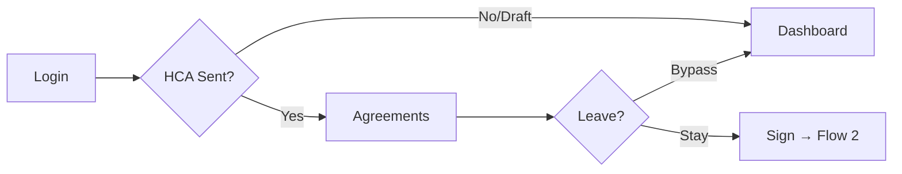
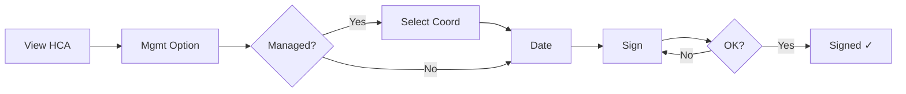
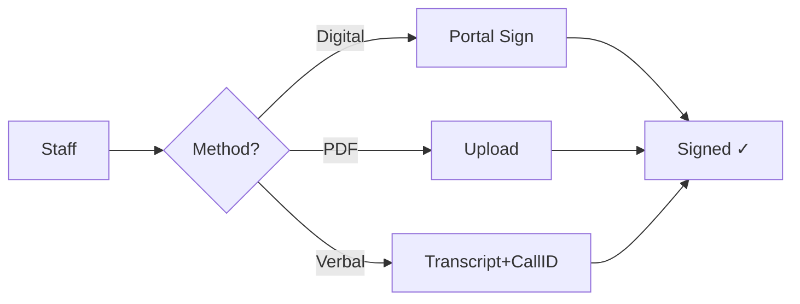
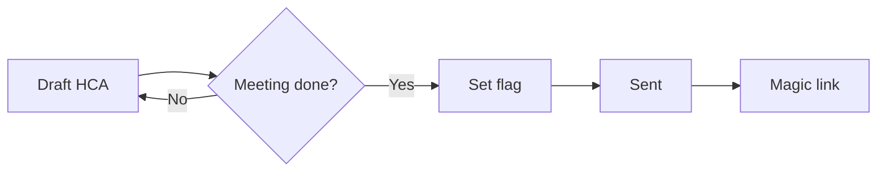
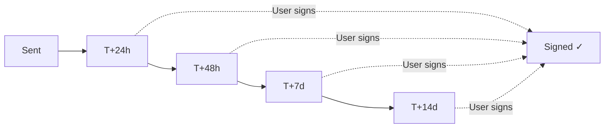
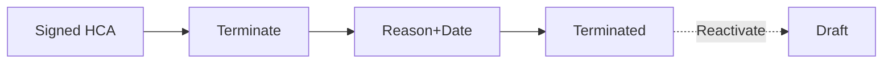
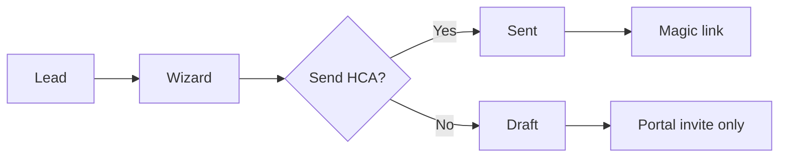
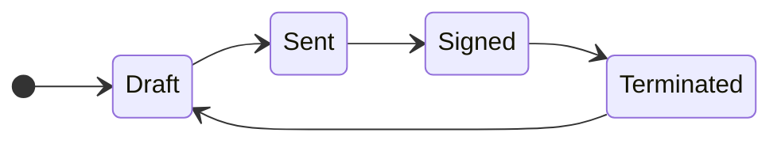

> **[View Mockup](/mockups/client-hca/index.html)**{.mockup-link}

## Upstream Dependency: Lead to HCA (LTH) Conversion Wizard

This epic depends on the **Lead to HCA (LTH)** epic which handles the conversion of qualified leads into clients with Home Care Packages. The LTH Conversion Wizard is the primary entry point for HCA creation.

### End-to-End Flow

```text
Lead (LES) → Conversion Wizard (LTH) → HCA Created → HCA Signed → ACER Lodged → Package Active
```

### LTH Conversion Wizard Steps

| Step               | Description                                     | HCA Integration                        |
| ------------------ | ----------------------------------------------- | -------------------------------------- |
| 1. Package Details | Capture Level, Management Option, Approval Date | Prefills HCA fields                    |
| 2. Dates           | Commencement Date, Cessation Date               | Sets HCA effective dates               |
| 3. Recipients      | Select HCA recipients (lead + contacts)         | Determines who receives magic link     |
| 4. ACAT/IAT        | Extract assessment data via API or upload       | Required before HCA can be sent        |
| 5. Agreement Setup | Generate and send HCA                           | **Creates HCA record in "Sent" state** |
| 6. Confirmation    | Summary and audit logging                       | Timeline entry created                 |

### Integration Points

| LTH Requirement                  | HCA Requirement             | Notes                                          |
| -------------------------------- | --------------------------- | ---------------------------------------------- |
| LTH 4.1.a: Generate HCA          | HCA-US05: Draft→Sent        | HCA created when wizard reaches Agreement step |
| LTH 4.1.e: Send Agreement        | HCA-US01: First-Login Flow  | Magic link sent to recipients                  |
| LTH 4.1.f: Track delivery status | FR-003: Agreement States    | Sent, Viewed, Signed status                    |
| LTH 4.1.g: Capture signatures    | HCA-US02: Digital Signature | Portal-native signature capture                |
| LTH 4.1.h: Timeline entries      | FR-013: Audit logging       | All actions logged to Lead Timeline            |

### Open Question (from LTH PRD)

> **"What triggers the package object creation — upon 'Send Agreement' or upon 'Signed Agreement'?"**

**Recommendation**: Package should be created in "Pending" state when HCA is sent, then activated when HCA is signed. This allows:

- Package record to exist for tracking before signing
- ACER lodgement to trigger on Signed state
- Clear separation between "prospective" and "active" packages

### Related Documentation

- [LTH Idea Brief](../Lead-To-HCA/IDEA-BRIEF)
- [LTH PRD (old context)](../Lead-To-HCA/context/raw_context/old_context/LTH_old_con_files/old_LTH-2.-Plan-PRD-Lead-to-HCA_436896189)
- [LES (Lead Essential)](../Lead-Essential/) - Data model dependency

---

## User Flows

### Flow 1: First-Login Journey



### Flow 2: HCA Signing



### Flow 3: Staff Consent Capture



### Flow 4: Draft → Sent



### Flow 5: SLA Reminders



### Flow 6: Termination



### Flow 7: LTH Conversion



### State Model



### Flow Reference

| Flow | User Stories | Trigger       | Result                 |
| ---- | ------------ | ------------- | ---------------------- |
| 1    | US01         | First login   | → Signing or Dashboard |
| 2    | US02, US16   | Sign HCA      | → Signed               |
| 3    | US06, US07   | Staff consent | → Signed               |
| 4    | US05         | Post-meeting  | → Sent                 |
| 5    | US09         | Time elapsed  | → Reminders            |
| 6    | US10, US15   | Terminate     | → Terminated           |
| 7    | US05 (LTH)   | LTH convert   | → Draft or Sent        |

---

## User Scenarios & Testing

### User Story 1 - First-Login HCA Signing Flow (Priority: P1)

As a new recipient or representative, I want to be guided directly to sign my Home Care Agreement on first login so that I can quickly begin receiving services without delays.

**Why this priority**: First-login conversion is critical for onboarding success and reduces manual follow-ups. This is the primary friction point the feature solves.

**Independent Test**: Can be fully tested by creating a new recipient account, logging in for the first time, and verifying the redirect to Agreements with signing flow. Delivers immediate value for onboarding conversion.

**Acceptance Scenarios**:

1. **Given** I am a new recipient with an HCA in "Sent" state (awaiting signature), **When** I log in for the first time, **Then** I am redirected to the Agreements area with an explainer about signing requirements
2. **Given** I am redirected to Agreements, **When** I attempt to navigate away, **Then** I must explicitly acknowledge exit (bypass logging captured)
3. **Given** I have a Signed HCA, **When** I log in, **Then** I am taken to my normal dashboard (no redirect)
4. **Given** I am redirected to Agreements, **When** I complete signing, **Then** I am taken to my dashboard with a success confirmation
5. **Given** I am a new recipient with HCA in "Draft" state only (not yet sent for signing), **When** I log in, **Then** I am taken to my normal dashboard (no redirect) - allows Portal access for prep activities

---

### User Story 2 - Digital In-Portal Signature (Priority: P1)

As a recipient or authorised representative, I want to sign my Home Care Agreement digitally within the Portal so that I can complete contracting without printing, scanning, or external tools.

**Why this priority**: Digital signing is the preferred consent capture method and delivers the fastest time-to-contract. This is the primary signing path.

**Independent Test**: Can be fully tested by opening a "Sent" HCA, completing the digital signature flow, and verifying the agreement transitions to "Signed" with artefact stored.

**Acceptance Scenarios**:

1. **Given** I have an HCA in "Sent" state, **When** I click "Sign Agreement", **Then** I see a digital signature capture interface
2. **Given** I am in the signature interface, **When** I draw/type my signature and confirm, **Then** the signature is captured with my identity, timestamp, and IP address
3. **Given** I complete the signature, **When** the process completes, **Then** the HCA transitions to "Signed" and a signed artefact is generated and stored
4. **Given** signature capture fails (network error), **When** I retry, **Then** I can attempt signing again without data loss
5. **Given** I am using a mobile device, **When** I sign, **Then** the signature interface works correctly with touch input

---

### User Story 3 - View Agreements List (Priority: P1)

As a recipient or representative, I want to view all my agreements in one place so that I can see my HCA, variations, and other agreements with their current status.

**Why this priority**: The Agreements area is the foundation for all HCA functionality. Users need to see and navigate their agreements.

**Independent Test**: Can be fully tested by logging in and navigating to Agreements to see the list view with HCA, Variations, and Other Agreements sections.

**Acceptance Scenarios**:

1. **Given** I am logged in, **When** I navigate to Agreements, **Then** I see three sections: HCA (pinned first), Variations, and Other Agreements
2. **Given** I have multiple agreements, **When** I view the list, **Then** each row shows Type, Stage (Draft/Sent/Signed/Terminated), Created Date, and Signed Date
3. **Given** I have no agreements, **When** I view Agreements, **Then** I see appropriate empty states for each section
4. **Given** I am viewing the list, **When** I click on an agreement row, **Then** I navigate to the agreement detail view

---

### User Story 4 - View Agreement Details (Priority: P1)

As a recipient or representative, I want to view the details of any agreement so that I can review the terms, see signing status, and access the signed artefact.

**Why this priority**: Detail view is essential for reviewing agreement content and understanding status. Required for all user journeys.

**Independent Test**: Can be fully tested by clicking on an agreement in the list and verifying the detail view shows all expected information.

**Acceptance Scenarios**:

1. **Given** I click on an agreement, **When** the detail view loads, **Then** I see "Basic Facts" panel (type, state, dates, parties)
2. **Given** I am viewing agreement details, **When** the agreement has a signed artefact, **Then** I can view/download the signed document
3. **Given** I am viewing agreement details, **When** I check lifecycle history, **Then** I see all state transitions with timestamps and actors
4. **Given** I am on the detail view, **When** I click breadcrumb, **Then** I return to the Agreements list

---

### User Story 5 - Draft HCA to Sent Transition (Priority: P1)

As a staff member (coordinator/sales), I want the Draft HCA to automatically transition to Sent after the assessment meeting so that clients receive an actionable agreement only after proper consultation.

**Why this priority**: The Draft→Sent gating ensures clients don't sign prematurely before understanding terms. Critical for compliance.

**Independent Test**: Can be fully tested by creating a Draft HCA, setting the post-meeting flag, and verifying the state transitions to Sent with signing controls enabled.

**Acceptance Scenarios**:

1. **Given** a client has a Draft HCA (pre-meeting), **When** I view it, **Then** I see a watermark indicating "Draft - Non-Offer" and no signing controls
2. **Given** a Draft HCA exists, **When** the post-meeting flag is set (by staff), **Then** the HCA transitions to "Sent" state
3. **Given** an HCA transitions to Sent, **When** the client views it, **Then** the watermark is removed and signing controls are available
4. **Given** any state transition occurs, **When** complete, **Then** the transition is logged with actor, timestamp, and reason

---

### User Story 6 - Upload Signed PDF (Priority: P2)

As a staff member, I want to upload a signed PDF for clients who signed outside the Portal so that we can capture consent artefacts for agreements completed manually.

**Why this priority**: Some clients sign via DocuSign or physical documents. Staff need to record these to maintain complete records.

**Independent Test**: Can be fully tested by uploading a signed PDF to an agreement and verifying the state transitions to Signed with artefact stored.

**Acceptance Scenarios**:

1. **Given** I am staff viewing a Sent HCA, **When** I click "Upload Signed Document", **Then** I see a file upload interface
2. **Given** I select a PDF to upload, **When** I add a reason/note and submit, **Then** the PDF is stored and HCA transitions to Signed
3. **Given** I upload a document, **When** the upload completes, **Then** my identity, timestamp, and upload reason are logged
4. **Given** a signed PDF is uploaded, **When** the client views the agreement, **Then** they can access the uploaded artefact

---

### User Story 7 - Verbal Consent Capture (Priority: P2)

As a staff member, I want to record verbal consent with a transcript and call ID so that we can capture consent for clients who agree over the phone.

**Why this priority**: Verbal consent is required for accessibility and client preference. The strengthened minimum (transcript + call ID) ensures auditability.

**Independent Test**: Can be fully tested by completing the verbal consent form with required fields and verifying the agreement transitions to Signed.

**Acceptance Scenarios**:

1. **Given** I am staff viewing a Sent HCA, **When** I click "Record Verbal Consent", **Then** I see a form with required fields (transcript, call ID) and optional fields (audio URL)
2. **Given** I fill in transcript and call ID, **When** I submit, **Then** the HCA transitions to Signed and consent details are stored
3. **Given** I try to submit without transcript or call ID, **When** I click submit, **Then** I see validation errors for missing required fields
4. **Given** verbal consent is recorded, **When** viewing agreement details, **Then** I can see the transcript, call ID, and audio link (if provided)
5. **Given** any verbal consent is submitted, **When** complete, **Then** all fields are immutably logged with staff identity and timestamp

---

### User Story 8 - Create and Manage Variations (Priority: P2)

As a staff member, I want to create variations (amendments) to existing HCAs so that management option changes, coordinator changes, and other updates are tracked with version history.

**Why this priority**: Variations are essential for ongoing client relationships. Amendments must maintain audit trail and effective dates.

**Independent Test**: Can be fully tested by creating a variation linked to an HCA, setting effective date, and verifying it appears in the Variations section.

**Acceptance Scenarios**:

1. **Given** I am staff viewing a Signed HCA, **When** I click "Create Variation", **Then** I see a form to create an amendment linked to the HCA
2. **Given** I create a variation, **When** I set the effective date and attach a PDF, **Then** the variation is created with version chain to the HCA
3. **Given** a variation is created, **When** I view the HCA, **Then** I see the variation in the version history
4. **Given** a variation is created, **When** stakeholders need notification, **Then** relevant parties are notified of the new variation
5. **Given** variations exist, **When** I view the Agreements list, **Then** variations appear in the Variations section with status and dates

---

### User Story 9 - SLA Reminders and Escalation (Priority: P2)

As a staff member, I want automatic reminders sent for unsigned agreements so that clients are prompted to sign without manual follow-up.

**Why this priority**: Automated reminders reduce staff workload and improve time-to-contract. Target is to auto-close 60% of agreements without manual chase.

**Independent Test**: Can be fully tested by creating a Sent HCA, waiting for reminder triggers, and verifying notifications are sent and logged.

**Acceptance Scenarios**:

1. **Given** an HCA is in Sent state, **When** 24 hours pass without signature, **Then** an automatic reminder is sent to the client
2. **Given** an HCA remains in Sent state, **When** 48 hours pass without signature, **Then** an escalation notification is sent (configurable channel)
3. **Given** any reminder/escalation is sent, **When** delivery completes, **Then** the delivery status is logged on the agreement record
4. **Given** a client signs after a reminder, **When** I view the agreement, **Then** I can see which reminders were sent before signing

---

### User Story 10 - Terminate and Reactivate Agreement (Priority: P3)

As a staff member, I want to terminate an agreement when a client leaves and optionally reactivate it if they return so that agreement lifecycle is accurately tracked.

**Why this priority**: Lifecycle management is important for compliance but not needed for initial onboarding flow. Can follow core functionality.

**Independent Test**: Can be fully tested by terminating an agreement with a reason and verifying historical access is preserved.

**Acceptance Scenarios**:

1. **Given** I am staff viewing a Signed HCA, **When** I click "Terminate", **Then** I see a form to enter termination reason
2. **Given** I terminate an HCA, **When** complete, **Then** the HCA shows "Terminated" status with read-only historical access
3. **Given** an HCA is Terminated, **When** I click "Reactivate", **Then** the agreement restarts the flow (Draft/Sent based on meeting status)
4. **Given** any termination or reactivation occurs, **When** complete, **Then** the event is audited with reason, actor, and timestamp
5. **Given** a client is terminated, **When** they log in, **Then** they can view past agreements but cannot sign new ones (until reactivated)

---

### User Story 11 - Annual Review Tracking (Priority: P3)

As a coordinator, I want to track annual review due dates for agreements so that I can ensure clients are reviewed on schedule.

**Why this priority**: Annual reviews are compliance-driven but can be addressed after core signing flow is complete.

**Independent Test**: Can be fully tested by setting an annual review date and verifying dashboard indicators and notifications trigger correctly.

**Acceptance Scenarios**:

1. **Given** an HCA is Signed, **When** I view the agreement, **Then** I see an "Annual Review Due" date field
2. **Given** an annual review is approaching, **When** 30/7/1 days remain, **Then** notifications are sent to relevant coordinators
3. **Given** annual reviews are tracked, **When** I view my dashboard, **Then** I see a summary of upcoming review dates
4. **Given** an annual review is completed, **When** I mark it done, **Then** the completion is logged and the next review date is set

---

### User Story 12 - Other Agreements (TPC, ATHM, etc.) (Priority: P3)

As a recipient or representative, I want to view other agreements (TPC, ATHM, oxygen supply) in the same Agreements area so that all my contracts are in one place.

**Why this priority**: Consolidation improves discoverability but is not critical for core HCA flow. Can be added incrementally.

**Independent Test**: Can be fully tested by viewing the Other Agreements section and verifying different agreement types display correctly.

**Acceptance Scenarios**:

1. **Given** I have a TPC agreement, **When** I view Agreements, **Then** I see it in the "Other Agreements" section
2. **Given** I click on an Other Agreement, **When** the detail loads, **Then** I see appropriate facts, dates, and artefact viewer
3. **Given** TPC cross-surfacing is enabled, **When** I view Suppliers/Services, **Then** I see a read-only link to the TPC agreement

---

### User Story 13 - Search, Filter, and Export (Priority: P3)

As a staff member, I want to search, filter, and export agreements so that I can find specific agreements and generate reports.

**Why this priority**: Useful for operations but not required for core signing flow. Can be added after primary functionality.

**Independent Test**: Can be fully tested by applying filters, searching by keyword, and exporting results to CSV.

**Acceptance Scenarios**:

1. **Given** I am viewing Agreements, **When** I filter by type/stage/date range, **Then** the list updates to show matching agreements
2. **Given** I search by keyword, **When** results return, **Then** I see agreements matching the search term (paginated)
3. **Given** I have filtered results, **When** I click Export, **Then** a CSV downloads with the filtered agreements (permissions-aware)

---

### User Story 14 - ACER Status Tracking (Priority: P2)

**Jira**: [TP-533](https://trilogycare.atlassian.net/browse/TP-533), [TC-2498](https://trilogycare.atlassian.net/browse/TC-2498)

As a Care Partner or Admin, I want the signed Home Care Agreement to reflect the ACER (Aged Care Entry Record) lodgement status so that I can see whether the agreement has been successfully registered with Services Australia.

**Why this priority**: ACER lodgement is a compliance requirement that directly affects claims, budgeting, and package subsidy calculations. Currently manual and lacks visibility.

**Independent Test**: Can be fully tested by signing an HCA, triggering the background ACER lodgement job, and verifying status updates appear on the HCA detail view.

**Acceptance Scenarios**:

1. **Given** an HCA is signed, **When** I view the agreement details, **Then** I see an ACER status field (Pending, Lodged, Confirmed, Failed, Manual Override)
2. **Given** an HCA reaches "Signed" state, **When** the post-entry process completes, **Then** a background job is dispatched to lodge via ACI (Aged Care Interface)
3. **Given** the ACI lodgement completes, **When** I view the HCA, **Then** the ACER status is updated based on the Services Australia response
4. **Given** I am an admin and ACER lodgement failed, **When** I view the agreement, **Then** I can manually override the ACER status with a reason note
5. **Given** an ACER lodgement fails, **When** the failure is detected, **Then** a notification is sent to the relevant team for manual follow-up
6. **Given** any ACER status change occurs, **When** complete, **Then** the change is logged in the audit trail with timestamp and user attribution

**Technical Notes**:

- Integrate with existing ACI (Aged Care Interface) connection
- Use Laravel Jobs + Horizon for background processing
- Implement retry logic with exponential backoff for transient ACI failures
- Store lodgement attempts and responses for debugging
- ACER lodgement requires: Care recipient details (name, DOB, gender), Entry date, HCP level, Carer status, Address information

---

### User Story 15 - Terminate Flow with Compliance (Priority: P2)

**Jira**: [TP-516](https://trilogycare.atlassian.net/browse/TP-516)

As a Care Partner or Admin, I want to terminate a Home Care Agreement through a structured workflow so that the termination is properly documented, compliant, and triggers appropriate downstream actions.

**Why this priority**: Termination is a compliance-critical workflow covering client transitions, residential care entry, death, or voluntary exit. Must integrate with Services Australia notifications.

**Independent Test**: Can be fully tested by terminating a signed HCA with a reason and effective date, and verifying all downstream actions trigger correctly.

**Acceptance Scenarios**:

1. **Given** I am staff viewing a Signed HCA, **When** I click "Terminate Agreement", **Then** I see a termination wizard (permission-gated)
2. **Given** I am in the termination wizard, **When** I complete the form, **Then** I must provide: termination reason (dropdown), effective date, final statement requirements, and notes
3. **Given** I submit termination, **When** complete, **Then** the HCA state changes to "Terminated", package status updates, stakeholders are notified, and ACI notification is sent (if required)
4. **Given** an HCA is terminated, **When** I view it, **Then** I see termination details (date, reason, terminated by) in read-only mode
5. **Given** a terminated client is eligible for return, **When** I click "Reactivate", **Then** the reactivation path is available with a new agreement flow
6. **Given** any termination action occurs, **When** complete, **Then** full audit trail is captured

**Termination Reasons** (dropdown):

- Transition to another provider
- Entry to residential care
- Death
- Voluntary exit from program
- Other (with notes required)

---

### User Story 16 - Package Management Option Selection (Priority: P2)

**Jira**: [TC-2113](https://trilogycare.atlassian.net/browse/TC-2113), [TP-527](https://trilogycare.atlassian.net/browse/TP-527)

As a recipient or primary representative, I want to confirm or change my package management option during the HCA signing flow so that I have control over how my package is managed.

**Why this priority**: Management option selection is a key decision point during onboarding. Currently handled outside Portal, creating friction.

**Independent Test**: Can be fully tested by going through the HCA signing flow and selecting a management option before signing.

**Acceptance Scenarios**:

1. **Given** I am signing an HCA, **When** I reach the management option step, **Then** I see all available management options with my current/proposed option highlighted
2. **Given** I view management options, **When** displayed, **Then** I see clear descriptions, benefits, and implications of each option (Self-Managed, Self-Managed Plus, Fully Managed)
3. **Given** I select a different management option, **When** I proceed, **Then** the HCA reflects my chosen option
4. **Given** I select a managed option requiring a coordinator, **When** the HCA is signed, **Then** the coordinator assignment workflow is triggered
5. **Given** a coordinator is predefined for my package, **When** I view options, **Then** I am not offered self-manage options (if coordinator is mandatory)
6. **Given** I change management option, **When** saved, **Then** system notifies recipient, representative, and affected coordinators
7. **Given** I am a Self-Managed client signing HCA, **When** I reach the management option step, **Then** I see an option to upgrade to Self-Managed Plus with benefits explained
8. **Given** I am signing HCA, **When** I reach the commencement date step, **Then** I can confirm or adjust my package commencement date

**Note**: Care Coordinators can have multiple price templates (e.g., 20% or 25% loading). When selecting a coordinator, users should also select their coordination package.

---

### User Story 17 - Switch Management Option (Post-HCA) (Priority: P2)

**Jira**: [TC-2113](https://trilogycare.atlassian.net/browse/TC-2113), [TP-527](https://trilogycare.atlassian.net/browse/TP-527)

As a recipient or primary representative, I want to switch my package management option after signing the HCA so that I can change how my package is managed as my needs evolve.

**Why this priority**: Clients need flexibility to change management options over time. Creates a HCA Variation.

**Independent Test**: Can be fully tested by navigating to Package Overview, clicking "Switch Management Option", and completing the change flow.

**Acceptance Scenarios**:

**For Recipients/Representatives:**

1. **Given** I am a recipient/primary rep viewing my package overview, **When** I click "Switch Management Option", **Then** I see a page listing all management options with my current option highlighted
2. **Given** I am viewing management options, **When** displayed, **Then** I see a rich card selector with descriptions, benefits, and (optionally) cost calculations
3. **Given** I am a Self-Managed Plus client, **When** I view options, **Then** I do NOT see the option to downgrade to Self-Managed (coordination partner protection)
4. **Given** I select a new management option, **When** I confirm, **Then** the change creates an HCA Variation with effective date

**For Care Partners/Staff:**

1. **Given** I am staff viewing a package overview, **When** I click "Change Management Option", **Then** I see a dropdown to select new option
2. **Given** I am changing management option, **When** I complete the form, **Then** I must provide: new option, effective date, and (optionally) coordinator assignment
3. **Given** the new option requires a coordinator, **When** I save, **Then** I can assign a care coordinator with their price template (20%/25% loading)
4. **Given** a coordinator is assigned, **When** saved, **Then** system sends email + dashboard notification to recipient, primary rep, and new coordinator
5. **Given** the new option does NOT require a coordinator, **When** I save, **Then** the previous coordinator is removed
6. **Given** a coordinator is removed, **When** saved, **Then** system sends email + dashboard notification to recipient, primary rep, and removed coordinator

**Coordinator Notes:**

- If Coordinator has a "Preferred Care Manager", offer to also change care partner (links to change of care partner flow)
- Coordinator can have multiple price templates - user must select which package (e.g., 20% or 25% loading)

---

### User Story 18 - Bulk Recontracting for SAH Transition (Priority: P1)

**Jira**: [TCR-35](https://trilogycare.atlassian.net/browse/TCR-35) (Recontracting - blocked by TP-516)

As an Admin, I want to send new agreements to all \~10,000 clients, coordinators, brokered managers, and suppliers for the Support at Home (SAH) transition so that we can recontract at scale while tracking acceptance and follow-ups.

**Why this priority**: SAH transition is a regulatory requirement. Must recontract entire client base plus all coordination partners and suppliers. Critical compliance deadline.

**Independent Test**: Can be fully tested by creating a recontracting campaign, sending agreements to a test cohort, and verifying tracking, follow-up, and acceptance workflows.

**Acceptance Scenarios**:

**Campaign Management:**

1. **Given** I am an admin, **When** I create a recontracting campaign, **Then** I can select target audience (Clients, Coordinators, Brokered Managers, Suppliers) and agreement templates
2. **Given** I am creating a campaign, **When** I configure it, **Then** I can attach cover letters, appendices (service lists, DD authorities), and other documents
3. **Given** I have a campaign ready, **When** I launch it, **Then** agreements are sent to all recipients in the target audience

**Multi-Channel Delivery:**

1. **Given** a recipient has email, **When** the agreement is sent, **Then** it is delivered via email with magic link to Portal
2. **Given** a recipient does NOT have email or prefers mail, **When** the agreement is sent, **Then** it is queued for postal delivery with tracking
3. **Given** a recipient requires verbal recontracting, **When** processed, **Then** staff can record verbal consent with transcript + call ID
4. **Given** a recipient requires translation, **When** the agreement is sent, **Then** translated versions are available in their preferred language

**Tracking & Follow-up:**

1. **Given** agreements are sent, **When** I view the campaign dashboard, **Then** I see status for each recipient (Sent, Opened, Signed, Declined, No Response)
2. **Given** a recipient has not accepted within SLA, **When** the follow-up trigger fires, **Then** automatic reminders are sent (configurable intervals)
3. **Given** I need to follow up manually, **When** I view non-responders, **Then** I can filter by channel, days outstanding, and audience type
4. **Given** a coordinator has not agreed to a rate, **When** I view the tracking dashboard, **Then** I see a flag for "Rate not agreed" requiring action

**Amendment Tracking:**

1. **Given** an agreement is amended during recontracting, **When** saved, **Then** the amendment is tracked with version history
2. **Given** an authorised representative changes, **When** updated, **Then** the change is captured and logged in the agreement record

**Acceptance Rates:**

1. **Given** a campaign is running, **When** I view metrics, **Then** I see acceptance rate, outstanding count, and trend over time
2. **Given** recontracting is complete, **When** I generate a report, **Then** I can export full audit trail of all agreements sent, accepted, and outstanding

**Scale Requirements:**

- Must handle \~10,000 clients
- Must handle all coordinators (with rate agreement tracking)
- Must handle all brokered managers
- Must handle all suppliers
- Must support batch processing to avoid system overload

**Channel Options:**

- Email (primary - magic link to Portal)
- Postal mail (fallback - tracked delivery)
- Verbal (accessibility - transcript + call ID required)
- Translated versions (multi-language support)

**Note**: Decision register indicates Portal-native approach preferred (Asim working on it), with Zoho Sign/Forms and DocuSign as potential alternatives if needed.

### Zoho Forms Fallback Channel (Transition Period)

During the transition to Portal-native signing, Zoho Forms can serve as a fallback signing channel for cases where Portal access isn't available (e.g., no email, elderly client, field signing).

**Flow**:
1. Staff selects "Send via Zoho Forms" on the Agreement tab (instead of Portal magic link)
2. Portal generates a prefilled Zoho Form URL with package/recipient data
3. URL is sent to the recipient (email/SMS) or opened by staff during a meeting
4. Recipient completes the form (reviews terms, captures consent)
5. Zoho Forms webhook fires back to Portal → `Agreement` state transitions to `signed`
6. `CreateZohoCarePlanAction` triggers (same as Portal-native path)

**Integration requirements**:
- Zoho Forms API: Generate prefilled form links with lead/package/recipient data
- Webhook endpoint in Portal: Receives form submission, updates Agreement state
- Feature flag: `zoho-forms-signing` — disable once Portal-native is fully live

**When to retire**: Once Portal-native signing is live and adoption is >90%, Zoho Forms channel can be disabled via feature flag. Historical agreements signed via Zoho Forms retain a "Source: Zoho Forms" indicator.

---

### User Story 19 - Zoho Bridging & Historical Migration (Priority: P2)

**Jira**: Part of TP-1865

As an Admin, I want historical HCAs migrated from Zoho and ongoing Zoho-originated agreements ingested during transition so that we have complete agreement records in the Portal regardless of origin.

**Why this priority**: Interim Zoho bridging is required during migration to Portal-native. Historical data must be preserved and new Zoho agreements must flow into Portal until cutover.

**Independent Test**: Can be fully tested by triggering a Zoho webhook for a new agreement and verifying it appears in the Portal, and by verifying historical HCAs are visible after migration.

**Acceptance Scenarios**:

**Historical Migration:**

1. **Given** historical HCAs exist in Zoho, **When** the migration runs, **Then** all historical agreements are backfilled into the Portal with correct state, dates, and artefacts
2. **Given** a historical HCA has a call ID, **When** migrated, **Then** the call ID is preserved for audit purposes
3. **Given** migration completes, **When** I view a migrated agreement, **Then** I see a "Migrated from Zoho" indicator with migration date

**Zoho Bridging (During Transition):**

1. **Given** a new agreement is signed in Zoho, **When** the webhook fires, **Then** the agreement is created in Portal with correct state and artefact link
2. **Given** Zoho bridging is active, **When** I view Agreements, **Then** I see both Portal-native and Zoho-originated agreements in unified list
3. **Given** a Zoho agreement is ingested, **When** I view details, **Then** I see "Source: Zoho" indicator

**Feature Flags:**

1. **Given** Zoho bridging is disabled (feature flag), **When** a Zoho webhook fires, **Then** it is logged but not processed
2. **Given** migration is complete, **When** Portal-native is fully live, **Then** Zoho connectors can be disabled via feature flag

**Technical Notes**:

- One-time backfill job for historical HCAs from Zoho
- Webhook listeners for ongoing Zoho agreement events
- Feature flags to control bridging during transition
- Map Zoho states to Portal states (Draft/Sent/Signed)
- Store durable links to Zoho artefacts or migrate artefacts to Portal storage

---

### Edge Cases

- What happens when a client's representative changes mid-signing? → Representative permissions are checked at signing time; previous rep loses access if removed
- What happens if the same client has multiple HCA attempts (declined, then re-sent)? → Each attempt is a separate agreement record with full history; only one can be "Signed" at a time
- What happens when a PDF upload fails (file too large, wrong format)? → Clear error message with allowed formats and size limits; retry allowed
- What happens when verbal consent transcript is disputed? → Immutable log with call ID allows retrieval of original call recording
- What happens when SLA reminders fail to send? → Delivery failure logged; staff notification for manual follow-up
- What happens when recontracting campaign has duplicate recipients? → Deduplicate by unique identifier; single agreement per recipient
- What happens when a coordinator doesn't agree to the new rate? → Flag in dashboard; manual follow-up required before services can continue
- What happens when postal mail is returned undeliverable? → Mark as failed; trigger alternative contact method or manual follow-up
- What happens when a translated agreement has errors? → Version control on translations; ability to resend corrected version

---

## HCA Signing Flow (End-to-End)

The following describes the complete signing flow when an HCA is sent:

### 1. Agreement Sent

- HCA sent via **email** (or SMS) to Recipient/Representative
- Contains **magic link** to Portal agreement page
- Agreement is in **"Sent"** state (not Draft - already post-meeting)

### 2. Pre-Signing Confirmation Steps

Before signing, recipient must confirm:

1. **Management Option**- Select from available options (Self-Managed, Self-Managed Plus, Fully Managed)
   - If Coordinator is predefined → self-manage options NOT shown
   - If no Coordinator defined → can select self-manage
2. **Coordinator Assignment** (if applicable) - Select coordinator with price template
3. **Commencement Date** - Confirm or adjust package start date

### 3. Signature Capture

- Digital signature captured in Portal
- System records:
  - Signer identity (name, user ID)
  - Timestamp
  - IP address
  - Declaration that signer is authorised representative (if applicable)
- Agreement transitions to **"Signed"** state

### 4. Post-Signing Triggers

After HCA is signed, system triggers:

1. **ACER Workflow** (TC-2498) - Background job lodges entry record with Services Australia via ACI
2. **Coordinator Assignment Workflow** (TC-2113) - If coordinator not yet defined and managed option selected

---

## Requirements

### Functional Requirements

**Agreements Area & Navigation**

- **FR-001**: System MUST display an "Agreements" area in the Recipient Portal navigation (feature-flagged)
- **FR-002**: System MUST display three sections within Agreements: HCA (pinned first), Variations, Other Agreements
- **FR-003**: System MUST display agreement list rows with Type, Stage, Created Date, and Signed Date
- **FR-004**: System MUST display appropriate empty states when no agreements exist in a section

**Agreement Detail View**

- **FR-005**: System MUST display agreement detail view with "Basic Facts" panel (type, state, dates, parties)
- **FR-006**: System MUST display artefact viewer/download for signed agreements
- **FR-007**: System MUST display lifecycle history showing all state transitions with timestamps and actors
- **FR-008**: System MUST provide breadcrumb navigation back to Agreements list

**State Model & Transitions**

- **FR-009**: System MUST support HCA states: Draft, Sent, Signed, Terminated
- **FR-010**: System MUST display watermark on Draft HCAs indicating "Non-Offer" status
- **FR-011**: System MUST prevent signing controls on Draft HCAs until transitioned to Sent
- **FR-012**: System MUST transition Draft to Sent when post-meeting flag is set
- **FR-013**: System MUST log all state transitions with actor, timestamp, and reason

**First-Login Routing**

- **FR-014**: System MUST redirect first-login users to Agreements if no Signed HCA exists
- **FR-015**: System MUST display explainer message for first-login redirect
- **FR-016**: System MUST require explicit acknowledgment to bypass Agreements (with event logging)

**Consent Capture - Digital Signature**

- **FR-017**: System MUST provide in-Portal digital signature capture for Sent HCAs
- **FR-018**: System MUST capture signer identity, timestamp, and IP address with signature
- **FR-019**: System MUST generate and store signed artefact upon signature completion
- **FR-020**: System MUST support signature retry on failure without data loss
- **FR-021**: System MUST support touch input for mobile signature capture

**Consent Capture - Uploaded PDF**

- **FR-022**: System MUST allow staff to upload signed PDF for manual signing path
- **FR-023**: System MUST transition HCA to Signed upon valid PDF upload
- **FR-024**: System MUST log uploader identity, timestamp, and upload reason

**Consent Capture - Verbal Consent**

- **FR-025**: System MUST require transcript text and call ID for verbal consent (minimum)
- **FR-026**: System MUST optionally accept audio URL for verbal consent
- **FR-027**: System MUST transition HCA to Signed upon valid verbal consent submission
- **FR-028**: System MUST immutably log all verbal consent fields with staff identity and timestamp

**Variations**

- **FR-029**: System MUST allow creation of variations linked to a signed HCA
- **FR-030**: System MUST maintain version chain between HCA and variations
- **FR-031**: System MUST support effective dates on variations
- **FR-032**: System MUST store variation artefacts (PDF)
- **FR-033**: System MUST notify stakeholders when variations are created

**SLA & Reminders**

- **FR-034**: System MUST send automatic reminder at T+24h for unsigned Sent agreements via email + in-app notification
- **FR-035**: System MUST send escalation notification at T+48h for unsigned Sent agreements via email + in-app notification
- **FR-035a**: System MUST send follow-up reminder at T+7 days for unsigned Sent agreements via email + in-app notification
- **FR-035b**: System MUST send final reminder at T+14 days for unsigned Sent agreements via email + in-app notification
- **FR-036**: System MUST log delivery status for all reminders/escalations on agreement record

**Lifecycle - Terminate/Reactivate**

- **FR-037**: System MUST allow staff to terminate agreements with reason
- **FR-038**: System MUST preserve read-only historical access for terminated agreements
- **FR-039**: System MUST allow staff to reactivate terminated agreements
- **FR-040**: System MUST audit all terminate/reactivate events with reason, actor, and timestamp
- **FR-117**: System MUST allow ex-clients (terminated) to retain read-only Portal access to view past agreements (no Rejoin CTA initially)

**Annual Review**

- **FR-041**: System MUST track "Annual Review Due" date on signed HCAs
- **FR-042**: System MUST send notifications at 30/7/1 days before review due date
- **FR-043**: System MUST display upcoming reviews on coordinator dashboards

**Other Agreements**

- **FR-044**: System MUST display non-HCA agreements (TPC, ATHM, oxygen supply) in Other Agreements section
- **FR-045**: System MUST provide detail view for Other Agreements with artefact viewer
- **FR-118**: System MUST display read-only "View TPC" link in Suppliers/Services that navigates to TPC detail in Other Agreements

**Search, Filter, Export**

- **FR-046**: System MUST allow filtering agreements by type, stage, and date range
- **FR-047**: System MUST allow keyword search across agreements
- **FR-048**: System MUST support paginated results for large agreement sets
- **FR-049**: System MUST allow CSV export of filtered agreements (permissions-aware)

**Permissions & Privacy**

- **FR-050**: System MUST restrict recipients to viewing their own package agreements
- **FR-051**: System MUST restrict representatives to agreements they are entitled to
- **FR-052**: System MUST restrict staff access based on role permissions
- **FR-053**: System MUST log all agreement reads and writes for audit

**ACER Integration**

- **FR-054**: System MUST track ACER status on HCA records (Pending, Lodged, Confirmed, Failed, Manual Override)
- **FR-055**: System MUST dispatch background job to lodge ACER via ACI after HCA reaches "Signed" state
- **FR-056**: System MUST update ACER status based on Services Australia response
- **FR-057**: System MUST allow admins to manually override ACER status with reason note
- **FR-058**: System MUST send notification to relevant team on ACER lodgement failure
- **FR-059**: System MUST log all ACER status changes in audit trail
- **FR-060**: System MUST implement retry logic with exponential backoff for transient ACI failures
- **FR-061**: System MUST store ACER lodgement attempts and responses for debugging

**Termination Workflow**

- **FR-062**: System MUST provide "Terminate Agreement" action on signed HCAs (permission-gated)
- **FR-063**: System MUST capture termination reason (from standard dropdown), effective date, final statement requirements, and notes
- **FR-064**: System MUST update package status upon HCA termination
- **FR-065**: System MUST notify stakeholders upon HCA termination
- **FR-066**: System MUST send ACI notification upon termination (if required)
- **FR-067**: System MUST display termination details (date, reason, terminated by) in read-only mode

**Package Management Option (HCA Signing)**

- **FR-068**: System MUST display management option selection during HCA signing flow
- **FR-069**: System MUST show all available management options with descriptions, benefits, and implications
- **FR-070**: System MUST trigger coordinator assignment workflow when managed option is selected
- **FR-071**: System MUST hide self-manage options when coordinator is predefined/mandatory
- **FR-072**: System MUST support multiple price templates per Care Coordinator (e.g., 20%/25% loading)
- **FR-073**: System MUST notify recipient, representative, and affected coordinators on management option change
- **FR-074**: System MUST allow recipients to confirm/adjust package commencement date during HCA signing
- **FR-075**: System MUST show upgrade option from Self-Managed to Self-Managed Plus with benefits during HCA signing

**Switch Management Option (Post-HCA)**

- **FR-076**: System MUST display "Switch Management Option" button on Package Overview for recipients/primary reps
- **FR-077**: System MUST display rich card selector with descriptions, benefits, and cost calculations for client-facing option selection
- **FR-078**: System MUST hide downgrade option from Self-Managed Plus to Self-Managed (coordination partner protection)
- **FR-079**: System MUST create HCA Variation when management option is changed post-signing
- **FR-080**: System MUST display "Change Management Option" button with dropdown for Care Partners/Staff on Package Overview
- **FR-081**: System MUST capture effective date when changing management option
- **FR-082**: System MUST allow coordinator assignment with price template selection when new option requires coordinator
- **FR-083**: System MUST send email + dashboard notification to recipient, primary rep, and new coordinator on coordinator assignment
- **FR-084**: System MUST remove previous coordinator when new option does not require coordination
- **FR-085**: System MUST send email + dashboard notification to recipient, primary rep, and removed coordinator on coordinator removal
- **FR-086**: System MUST offer to also change care partner if assigned coordinator has a "Preferred Care Manager"

**HCA Sending & Magic Link**

- **FR-087**: System MUST send HCA via email with magic link to Portal agreement page
- **FR-088**: System MUST support SMS delivery as alternative channel
- **FR-089**: System MUST capture signer identity, timestamp, IP address, and authorised rep declaration on signature
- **FR-090**: System MUST trigger ACER workflow (TC-2498) after HCA is signed
- **FR-091**: System MUST trigger Coordinator Assignment workflow (TC-2113) if coordinator not defined and managed option selected

**Bulk Recontracting (SAH Transition)**

- **FR-092**: System MUST support creating recontracting campaigns with selectable target audiences (Clients, Coordinators, Brokered Managers, Suppliers)
- **FR-093**: System MUST support attaching cover letters, appendices, service lists, and DD authorities to campaigns
- **FR-094**: System MUST support batch sending to \~10,000+ recipients without system overload
- **FR-095**: System MUST support multi-channel delivery: Email (primary), Postal mail (tracked), Verbal (transcript + call ID)
- **FR-096**: System MUST support translated agreement versions for multi-language recipients
- **FR-097**: System MUST track campaign status per recipient: Sent, Opened, Signed, Declined, No Response
- **FR-098**: System MUST send automatic follow-up reminders at configurable intervals for non-responders
- **FR-099**: System MUST flag coordinators who have not agreed to new rate
- **FR-100**: System MUST track authorised representative changes during recontracting
- **FR-101**: System MUST track amendments during recontracting with version history
- **FR-102**: System MUST provide campaign dashboard with acceptance rates, outstanding counts, and trend metrics
- **FR-103**: System MUST support exporting full audit trail of recontracting campaign

**LTH Conversion Wizard Integration**

- **FR-113**: System MUST accept HCA creation requests from the LTH Conversion Wizard with prefilled lead, contact, and package data
- **FR-114**: System MUST link created HCA to the originating Lead record for timeline synchronization
- **FR-115**: System MUST create Package record in "Pending" state when HCA is sent (or earlier if assessment meeting signing expected)
- **FR-116**: System MUST log all HCA events (sent, viewed, signed) to the Lead Timeline via LTH integration
- **FR-119**: System MUST transition Package from "Pending" to "Active" state when HCA is signed
- **FR-119a**: When HCA is signed, system MUST update the Zoho Deal record (created by LTH Step 6 `convertLead()`) with the signed status and signed date
- **FR-119b**: When HCA is signed, system MUST create a Care Plan record in Zoho linked to the Deal and Consumer, with package details (classification, management option, commencement/cessation dates, coordinator) from the LTH conversion data
- **FR-121**: System MUST allow LTH conversion to complete without sending HCA for signing (HCA remains in "Draft" state)
- **FR-122**: System MUST allow Portal invitation to be sent independently of HCA activation (client can access Portal before HCA is sent for signing)

**Zoho Bridging & Migration**

- **FR-104**: System MUST support one-time backfill of historical HCAs from Zoho with state, dates, and artefacts preserved
- **FR-105**: System MUST preserve call IDs from historical Zoho records for audit purposes
- **FR-106**: System MUST display "Migrated from Zoho" indicator on migrated agreements with migration date
- **FR-107**: System MUST support webhook listeners for ongoing Zoho agreement events during transition
- **FR-108**: System MUST create Portal agreements from Zoho webhooks with correct state mapping (Zoho states → Draft/Sent/Signed)
- **FR-109**: System MUST display "Source: Zoho" indicator on Zoho-originated agreements
- **FR-110**: System MUST provide feature flags to enable/disable Zoho bridging
- **FR-111**: System MUST log Zoho webhook events even when bridging is disabled
- **FR-112**: System MUST store durable links to Zoho artefacts or migrate artefacts to Portal storage

### Key Entities

- **Agreement**: Core contract record with type (HCA/Variation/TPC/etc.), state, parties, dates, linked artefact, lifecycle history, ACER status
- **Agreement State**: Draft → Sent → Signed → Terminated (with Reactivate loop)
- **Artefact**: Signed document (digital signature, uploaded PDF, or verbal consent record) with durable storage/link
- **Verbal Consent Record**: Transcript text, call ID, optional audio URL, staff recorder identity, timestamp
- **Variation**: Amendment linked to parent HCA with version chain, effective date, and artefact
- **Lifecycle Event**: Immutable audit log entry for state transitions (actor, timestamp, reason)
- **Reminder/Escalation Log**: Record of automated notifications sent for SLA tracking
- **ACER Record**: Aged Care Entry Record with status (Pending/Lodged/Confirmed/Failed/Manual Override), lodgement date, Care Recipient ID link, lodgement attempts/responses
- **Termination Record**: Reason (from dropdown), effective date, final statement requirements, notes, terminated by, ACI notification status
- **Management Option**: Package management type (Self-Managed, Self-Managed Plus, Fully Managed) with coordinator assignment and price template selection
- **Recontracting Campaign**: Bulk agreement sending campaign with target audience, templates, attachments, channel configuration, and tracking metrics
- **Campaign Recipient**: Individual recipient in a campaign with status (Sent/Opened/Signed/Declined/No Response), channel used, follow-up history
- **Signature Record**: Digital signature capture with signer identity, timestamp, IP address, authorised rep declaration
- **Zoho Migration Record**: Migrated agreement with source system, migration date, original Zoho ID, artefact link mapping

---

## Success Criteria

### Measurable Outcomes

- **SC-001**: Median time from Sent to Signed is ≤24 hours
- **SC-002**: ≥99% of signed agreements have complete consent artefacts (digital signature OR uploaded PDF OR transcript+call ID)
- **SC-003**: ≥80% of first-login users complete HCA signing in-session (when required)
- **SC-004**: ≥60% of agreements auto-close via reminders without staff manual follow-up
- **SC-005**: 100% of agreements have accurate state tracking (including Terminated/Reactivate)
- **SC-006**: Users can complete digital signature in under 2 minutes on desktop
- **SC-007**: Users can complete digital signature in under 3 minutes on mobile
- **SC-008**: Staff can upload a signed PDF in under 1 minute
- **SC-009**: Staff can record verbal consent in under 2 minutes
- **SC-010**: Agreement list loads in under 2 seconds for recipients with up to 20 agreements

---

## Open Questions

1. ~~**Ex-client visibility**~~~~: Should ex-clients retain Portal access to view past agreements and a "Rejoin" CTA?~~ **RESOLVED** - See Clarifications
2. ~~**TPC cross-surfacing**~~~~: While TPC remains under Other Agreements, should we also surface a read-only view under Suppliers/Services?~~ **RESOLVED** - See Clarifications
3. ~~**SLA policy confirmation**~~~~: Confirm reminder/escalation timings (24h/48h?) and channels (email/SMS/in-app)~~ **RESOLVED** - See Clarifications
4. ~~**Durable storage**~~~~: Confirm system of record for audio files and retention policy~~ **RESOLVED** - See Clarifications
5. ~~**Package creation timing**~~ ~~(from LTH): When should the Package record be created — upon "Send Agreement" or upon "Signed Agreement"?~~ **RESOLVED** - See Clarifications

---

## Clarifications

### Session 2026-01-22

- Q: Should ex-clients retain Portal access to view past agreements and a "Rejoin" CTA? -> A: **Read-only access only** (no Rejoin CTA for now). Future consideration: show Rejoin CTA only when termination reason is client-initiated (voluntary exit) vs provider-initiated.
- Q: Should TPC also surface in Suppliers/Services (read-only)? -> A: **Yes, read-only link**. Show "View TPC" link in Suppliers/Services that opens the TPC detail in Other Agreements. Source of truth remains Other Agreements.
- Q: What are the SLA reminder timings and notification channels for unsigned agreements? -> A: **Escalating cadence via email + in-app**: T+24h (first reminder), T+48h (escalation), T+7 days (follow-up), T+14 days (final reminder). All notifications use both email and in-app channels.
- Q: What is the system of record for audio files (verbal consent) and retention policy? -> A: **External URL only**. Staff provides link to recording in call system (e.g., Zoom, Teams, call center recordings). Portal stores the URL reference but does not copy/host audio files. Call system is responsible for retention.
- Q: When should the Package record be created — upon "Send Agreement" or upon "Signed Agreement"? -> A: **Create Package in "Pending" state on HCA Send** (or earlier). This is required because HCA may be signed immediately at the assessment meeting. Package must exist before signing to enable other actions. Package transitions to "Active" state upon HCA Signed.
- Q: Is sending the HCA for signing mandatory during LTH conversion? -> A: **No, optional**. Staff can complete LTH conversion and invite client to Portal without activating the HCA for signing. HCA remains in "Draft" state until staff explicitly sends it. This allows Portal access for other features before HCA signing is required.

---

## User Flow Diagrams

### Flow 1: First-Login Signing Journey (Recipient/Representative)

```text
                          START: User Logs In
                                  │
                                  ▼
                    ╔═══════════════════════════════╗
                    ║   Does user have HCA to sign? ║
                    ╚═══════════════════════════════╝
                       │                    │
                HCA in "Sent"          No HCA or
                   state              "Draft" only
                       │                    │
                       ▼                    ▼
          [Redirect to Agreements]    [Go to Dashboard]
          [Show signing explainer]         DONE ✓
                       │
                       ▼
            ╔═════════════════════════╗
            ║  User tries to leave?   ║
            ╚═════════════════════════╝
                 │              │
               Yes             No
                 │              │
                 ▼              ▼
    [Show exit confirmation]   [Continue to signing]
    [Log bypass if confirmed]         │
                 │                    │
                 ▼                    ▼
          [Go to Dashboard]    ───────────────────────►  FLOW 2
               DONE ✓
```

### Flow 2: HCA Signing Flow (Recipient/Representative)

```text
                     START: View HCA in "Sent" State
                                  │
                                  ▼
                 [Show Agreement Details & Terms]
                                  │
                                  ▼
                 [Click "Sign Agreement" Button]
                                  │
                                  ▼
                ╔════════════════════════════════╗
                ║  Step 1: Management Option     ║
                ╚════════════════════════════════╝
                       │                │
          Coordinator               No Coordinator
           predefined                 defined
               │                        │
               ▼                        ▼
      [Show managed options     [Show all options:
       only - no self-manage]    Self-Managed,
               │                 Self-Managed Plus,
               │                 Fully Managed]
               │                        │
               └────────────┬───────────┘
                            │
                            ▼
                ╔════════════════════════════════╗
                ║  Step 2: Coordinator Selection ║
                ║  (if managed option selected)  ║
                ╚════════════════════════════════╝
                       │                │
               Coordinator         Self-Managed
                required           (no coordinator)
                   │                    │
                   ▼                    │
        [Select Coordinator]            │
        [Select Price Template          │
         (20% / 25% loading)]           │
                   │                    │
                   └────────┬───────────┘
                            │
                            ▼
                ╔════════════════════════════════╗
                ║  Step 3: Commencement Date     ║
                ╚════════════════════════════════╝
                            │
                            ▼
                [Confirm or adjust start date]
                            │
                            ▼
                ╔════════════════════════════════╗
                ║  Step 4: Signature Capture     ║
                ╚════════════════════════════════╝
                            │
                            ▼
                [Digital signature interface]
                [Draw/type signature]
                            │
                            ▼
                ╔═════════════════════════╗
                ║  Signature successful?  ║
                ╚═════════════════════════╝
                     │              │
                   Yes             No (network error)
                     │              │
                     ▼              ▼
               [Capture:      [Show error message]
                - Identity    [Allow retry]
                - Timestamp         │
                - IP address        │
                - Auth rep          │
                  declaration]      │
                     │              │
                     ▼              └──► [Retry] ──► (back to signature)
               [HCA → "Signed"]
                     │
                     ▼
            ┌────────────────────────┐
            │   POST-SIGNING         │
            │   TRIGGERS             │
            │                        │
            │  • ACER lodgement job  │
            │  • Coordinator assign  │
            │  • Audit log entry     │
            │  • Stakeholder notify  │
            └────────────────────────┘
                     │
                     ▼
            [Redirect to Dashboard]
            [Show success message]
                  DONE ✓
```

### Flow 3: Staff Consent Capture (Alternative Signing Methods)

```text
                START: Staff Views HCA in "Sent" State
                                  │
                                  ▼
                ╔════════════════════════════════╗
                ║    Select consent method       ║
                ╚════════════════════════════════╝
                  │          │          │
                  ▼          ▼          ▼
           [Digital     [Upload      [Record
            Sign]       Signed       Verbal
             │           PDF]        Consent]
             │            │             │
             │            │             │
             ▼            ▼             ▼
      (User signs   [File upload  [Show form:
       in Portal)    interface]    - Transcript (req)
          │               │        - Call ID (req)
          │               │        - Audio URL (opt)]
          │               │             │
          │               ▼             ▼
          │      ╔══════════════╗  ╔══════════════╗
          │      ║ Valid PDF?   ║  ║ Valid form?  ║
          │      ╚══════════════╝  ╚══════════════╝
          │        │        │        │        │
          │       Yes      No       Yes      No
          │        │        │        │        │
          │        ▼        ▼        ▼        ▼
          │   [Store    [Show     [Store   [Show
          │    PDF]     error:    consent  validation
          │      │      format/    data]   errors]
          │      │      size]       │        │
          │      │        │         │        │
          │      │        ▼         │        ▼
          │      │    [Retry]       │    [Fix & retry]
          │      │                  │
          └──────┴────────┬─────────┘
                          │
                          ▼
                [HCA → "Signed"]
                [Log: actor, timestamp, method]
                          │
                          ▼
                     DONE ✓
```

### Flow 4: Draft → Sent State Transition (Staff)

```text
                START: HCA in "Draft" State
                          │
                          ▼
                [HCA shows watermark:
                 "Draft - Non-Offer"]
                [No signing controls]
                          │
                          ▼
                ╔═══════════════════════════════╗
                ║  Assessment meeting complete? ║
                ╚═══════════════════════════════╝
                     │              │
                    No             Yes
                     │              │
                     ▼              ▼
                [HCA stays    [Staff sets
                 in Draft]    post-meeting flag]
                     │              │
                     │              ▼
                     │        [HCA → "Sent"]
                     │        [Watermark removed]
                     │        [Signing enabled]
                     │              │
                     │              ▼
                     │        [Magic link sent
                     │         to recipient]
                     │              │
                     └──────────────┘
                              │
                              ▼
                         DONE ✓
```

### Flow 5: SLA Reminders & Escalation (Automated)

```text
                START: HCA in "Sent" State
                          │
                          ▼
                [Clock starts: T=0]
                          │
     ┌────────────────────┼────────────────────┐
     │                    │                    │
     ▼                    ▼                    ▼
╔═══════════╗       ╔═══════════╗       ╔═══════════╗
║ T+24h     ║       ║ T+48h     ║       ║ T+7 days  ║
║ Reminder  ║       ║ Escalate  ║       ║ Follow-up ║
╚═══════════╝       ╚═══════════╝       ╚═══════════╝
     │                    │                    │
     ▼                    ▼                    ▼
[Send email +        [Send email +       [Send email +
 in-app notif]        in-app notif]       in-app notif]
     │                    │                    │
     └────────────────────┼────────────────────┘
                          │
                          ▼                    ┌───────────┐
                    ╔═══════════╗              │ At any    │
                    ║ T+14 days ║              │ point:    │
                    ║ Final     ║              │ User signs│
                    ╚═══════════╝              │ HCA       │
                          │                    │     │     │
                          ▼                    └─────┼─────┘
                    [Send final                      │
                     reminder]                       ▼
                          │                   [HCA → "Signed"]
                          ▼                   [Stop reminders]
                    [Manual follow-up              │
                     if still unsigned]            ▼
                          │                     DONE ✓
                          ▼
                     DONE ✓
```

### Flow 6: Termination Workflow (Staff)

```text
                START: Staff Views Signed HCA
                          │
                          ▼
                [Click "Terminate Agreement"]
                          │
                          ▼
                ╔═══════════════════════════════╗
                ║  Has permission to terminate? ║
                ╚═══════════════════════════════╝
                     │              │
                    No             Yes
                     │              │
                     ▼              ▼
                [Access denied]  [Show termination wizard]
                 ✗ ERROR                │
                                        ▼
                          ┌─────────────────────┐
                          │  Termination Form:  │
                          │  • Reason (dropdown)│
                          │  • Effective date   │
                          │  • Final statement  │
                          │  • Notes            │
                          └─────────────────────┘
                                        │
                          Reasons:      │
                          • Transition to another provider
                          • Entry to residential care
                          • Death
                          • Voluntary exit
                          • Other (notes required)
                                        │
                                        ▼
                          ╔═══════════════════╗
                          ║  Form complete?   ║
                          ╚═══════════════════╝
                               │        │
                              No       Yes
                               │        │
                               ▼        ▼
                          [Show      [Submit]
                           errors]       │
                               │         ▼
                               │    ┌─────────────────────┐
                               │    │  • HCA → Terminated │
                               │    │  • Package updated  │
                               │    │  • ACI notification │
                               │    │  • Stakeholders     │
                               │    │    notified         │
                               │    │  • Audit logged     │
                               │    └─────────────────────┘
                               │              │
                               │              ▼
                               │         DONE ✓
                               │
                               └──► [Fix & retry]
```

### Flow 7: LTH Conversion Wizard Integration

```text
                START: Lead Qualified in LES
                          │
                          ▼
                [Enter LTH Conversion Wizard]
                          │
    ┌─────────────────────┼─────────────────────┐
    │                     │                     │
    ▼                     ▼                     ▼
[Step 1:              [Step 2:              [Step 3:
 Package Details]      Dates]                Recipients]
    │                     │                     │
    └─────────────────────┼─────────────────────┘
                          │
                          ▼
                [Step 4: ACAT/IAT]
                [Assessment data required]
                          │
                          ▼
                ╔════════════════════════════════╗
                ║  Step 5: Agreement Setup       ║
                ║  Send HCA for signing?         ║
                ╚════════════════════════════════╝
                     │              │
                    No             Yes
               (Prep only)    (Full conversion)
                     │              │
                     ▼              ▼
               [HCA created    [HCA created
                in "Draft"]     in "Sent"]
                     │              │
                     ▼              ▼
               [Portal invite  [Magic link sent]
                sent only]     [Package → Pending]
                     │              │
                     ▼              ▼
               [Client can    [First-login redirect
                prep: update   to signing flow]
                contacts]      (FLOW 1)
                     │              │
                     └──────┬───────┘
                            │
                            ▼
                [Step 6: Confirmation]
                [Audit logged to Lead Timeline]
                          │
                          ▼
                     DONE ✓
```

### State Transitions

```text
    Draft ──────► Sent ──────► Signed
      │                          │
      │                          ▼
      └──────────────────► Terminated
                                 │
                                 ▼
                            Reactivate
                            (→ Draft)
```

---

## Stakeholder Feedback

### 2026-02-02: Onboarding Flow Discussion (Jacqui Palmer / Will)

**Context**: Teams chat discussion about commencement date and care plan timing in the customer journey.

#### Jacqui's Concerns

1. **Commencement Date Timing**
   - Currently have commencement date in agreement set to meeting date
   - Reason: Must produce care plan within 24 hours of signing
   - Had to have commencement date in agreement (determined to be best start date)

2. **Security of Tenure**
   - Cares concern: Agreement signed before meeting relates to security of tenure
   - Challenging to offboard a client if risks identified in care plan meeting
   - Growing confidence in onboarding tool may allow this to be reconsidered

3. **Client Expectations**
   - Frequent request: Clients want to see produced care plan and budget before signing
   - Expect resistance from client to sales (or longer sales experience) if signature required to progress
   - Sales can be upskilled to produce mock-up budget to support progression
   - Will inflate POS call time if implemented

#### Will's Response Thoughts

1. **Commencement Date Logic**
   - If commencement date determines start of 24hr period - can still work for clients who have signed
   - Different situation for clients who haven't signed yet

2. **Process Flow Clarification**
   - Clients don't need to see care plan before signing agreement
   - Process in place to inform clients:
     1. First: Sign up
     2. Then: Assessment meeting to build care plan
     3. Finally: Get allocated a care partner

#### Impact on Design

- Consider whether commencement date should be:
  - Set at agreement signing time, OR
  - Set at assessment meeting completion
- May need flexibility for different scenarios (signed vs unsigned at meeting time)
- UX should clearly communicate the process flow to clients

---

## Related Documents

- [Design Specification](./design.md) - UX/UI design decisions with keyframe references
- [User Flows](./user-flows.md) - Visual flow diagrams
- [Rich Content](./rich-content/) - Figma walkthrough keyframes and analysis

---

## Next Steps

1. → `/trilogy.mockup` — Create UI mockups for Agreements area and signing flows
2. → `/speckit.plan` — Create implementation plan with phases
3. → `/speckit.tasks` — Generate dependency-ordered task list

## Clarification Outcomes

### Q1: [Dependency] Has the LTH handoff contract been validated? What if LTH changes the state model?
**Answer:** The LTH spec's "Handoff to Client HCA" section explicitly defines the contract: LTH creates a Package record with agreement in "Sent" or "Clinical Review" state. The integration table maps LTH outputs to HCA inputs. The HCA spec's own "Upstream Dependency" section references LTH directly. **The contract is well-documented but has not been formally validated between engineering teams.** The agreement state model (Draft -> Sent -> Signed -> Terminated) is consistent across both specs. **Recommendation:** Create a shared integration test that validates the LTH-to-HCA handoff: given a completed LTH wizard, verify a Package and Agreement exist in the expected states.

### Q2: [Scope] Should signature capture (verbal, digital, PDF), SLA reminders, and amendments be phased?
**Answer:** The spec assigns priorities: Digital signature (P1), SLA reminders (P2), PDF upload (P2), Verbal consent (P2), Variations/amendments (P2). **Recommended phasing:** Phase 1: Digital in-Portal signature (US2), Agreements list/detail (US3/US4), First-login routing (US1), Draft->Sent transition (US5). Phase 2: PDF upload (US6), Verbal consent (US7), SLA reminders (US9), ACER integration (US14). Phase 3: Variations (US8), Termination (US10/US15), Annual reviews (US11), Recontracting (US18). **Digital signature is correctly the MVP.**

### Q3: [Data] Should there be a shared RecipientAgreement model across HCA, MOB1, and RCU?
**Answer:** Yes. The existing `app/Models/Agreement.php` should be extended (not duplicated) to serve all three surfaces. The HCA spec is the most comprehensive with 120+ FRs. MOB1 proposes new `RecipientAgreement` and `AgreementSignature` models -- **these should NOT be separate models.** Instead, extend the existing Agreement model with the state machine (Draft/Sent/Signed/Terminated), signature capture, and consent artefact storage defined in HCA. MOB1 and RCU consume the same backend via API endpoints. **Single model, multiple surfaces.**

### Q4: [Edge Case] What happens if a client passes away before signing?
**Answer:** The HCA spec includes termination reasons: "Death" is one of the dropdown options (US15). **If a client passes away before signing,** the agreement should be terminated by staff with reason "Death" and effective date = date of death. The agreement transitions from Sent -> Terminated (bypassing Signed). **The UI should handle this compassionately:** the termination form should not require excessive detail when the reason is "Death." A departure record must also be lodged with Services Australia (SAH spec US5) with `departureReasonCode = DECEA`.

### Q5: [Integration] Where does meeting booking live? Is it integrated with CIP?
**Answer:** The spec explicitly states: "Meeting booking (previously planned as a gated step in LTH) is deferred to Client HCA or a subsequent workflow." The business rule is: "assessment meeting cannot be booked until the agreement is signed." **Meeting booking is NOT part of HCA MVP.** It is deferred to a future workflow. The CIP (Calendar Integration) epic would handle pushing booked meetings to external calendars, but CIP depends on a booking system existing first. **Meeting booking should be tracked as a separate backlog item** that bridges HCA (gate condition) and CIP (calendar push).

### Q6: [Scale] Can the recontracting campaign (US18) handle ~10,000 clients?
**Answer:** The recontracting campaign requires batch processing for ~10,000 clients plus coordinators, brokered managers, and suppliers. Laravel Horizon with Redis queues can handle this volume. **Recommendation:** Use Laravel's job batching (`Bus::batch()`) with progress tracking. Process in batches of 100 to avoid memory issues. Email delivery should use a dedicated `recontracting-mail` queue to not interfere with transactional email delivery. **Estimated processing time: 2-4 hours for 10,000 emails** (accounting for rate limiting).

### Q7: [Migration] How complex is the Zoho bridging and historical migration (US19)?
**Answer:** The Portal has an existing Zoho webhook controller (`app/Http/Controllers/ZohoWebhookController.php`). Historical migration requires: (a) querying Zoho for all existing HCAs, (b) mapping Zoho states to Portal states, (c) importing artefacts (or storing durable links). **The biggest risk is data quality** -- Zoho records may have inconsistent states, missing dates, or broken artefact links. **Recommendation:** Run a data quality audit on Zoho HCA data before building the migration. Provide a reconciliation report after migration showing matched vs unmatched records.

## Refined Requirements

1. **Create a shared integration test** for the LTH-to-HCA handoff contract.
2. **Use the existing Agreement model** (`app/Models/Agreement.php`) -- do not create parallel RecipientAgreement, AgreementSignature models for MOB1 or RCU.
3. **Phase delivery:** Phase 1 = Digital signing + list/detail + first-login. Phase 2 = PDF/verbal + SLA + ACER. Phase 3 = Variations + termination + recontracting.
4. **Meeting booking is NOT part of HCA** -- track as a separate backlog item.
5. **Run a Zoho data quality audit** before building the historical migration.
