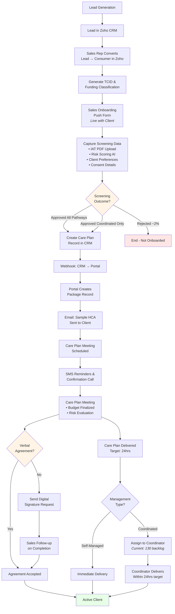

# Lead to HCA - Current State Process

**Source**: Meeting with Jackie Palmer (Head of Sales), February 3, 2026

## Current Process Flow

## Key Observations

### Current State Characteristics
- **Zoho CRM-centric**: All lead conversion, consumer creation, and push form data lives in Zoho
- **Webhook Integration**: CRM triggers Portal package creation via webhook after care plan record created
- **Manual Follow-up**: Agreement signing requires manual sales follow-up post-meeting
- **Split Delivery**: Self-managed vs coordinated clients have different workflows

### Pain Points Identified
1. **Churn**: Was 14%, improved to <6% with faster meeting-to-care plan turnaround
2. **Coordinator Backlog**: 130 clients waiting for allocation in coordinated pathway
3. **Agreement Timing**: Currently sent as sample, then verbal/digital post-meeting
4. **Multiple Funding Streams**: Only primary stream captured at point of sale; secondary streams buried in notes

### Planned Improvements (from meeting)
- Move digital signature request to **immediately after screening approval** (before care plan meeting)
- Target 60% agreement uptake before meeting
- Automate care plan delivery post-assessment without manual coordinator handoff
- Support multi-select funding streams at point of sale with explicit consent capture

---

**Meeting Attendees**: David Henry, Jackie Palmer, Mike Wise, Room 403
**Document Created**: February 5, 2026
