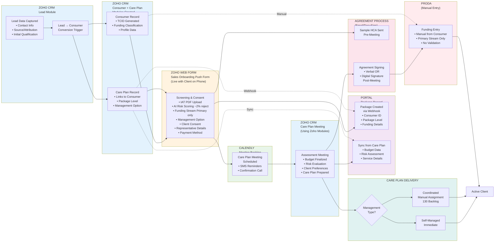

# Lead to HCA - Current State Systems Overview

**Source**: Validated with Jackie Palmer (Head of Sales), Feb 3, 2026
**Purpose**: High-level system-by-system breakdown of onboarding process

---

## Process Flow by System

---

## Key Data Capture Points

### 1. ZOHO CRM - Lead Module
**When**: Initial contact through to qualified lead
**Key Data**:
- Contact information (name, email, phone)
- Source/attribution (how they found us)
- Initial qualification status
- Sales rep assignment

**Trigger**: Sales rep manually converts Lead → Consumer

---

### 2. ZOHO CRM - Consumer + Care Plan Modules
**When**: Immediately after Lead conversion
**What's Created**:

**Consumer Record**:
- TCID (Trilogy Care ID) generated automatically
- Funding classification (HCP, Restorative, etc.)
- Profile data (DOB, address, Medicare number)
- Primary contact details

**Care Plan Record**:
- Linked to Consumer record
- Package level placeholder
- Management option (self/coordinated/brokered)
- Will trigger webhook after push form

---

### 3. ZOHO WEB FORM - Sales Onboarding Push Form
**When**: Live on phone call with client (post-conversion)
**Interface**: Zoho web form (NOT Zoho CRM module)
**Key Data**:
- **IAT Screening**: PDF upload, AI-powered risk scoring (~2% rejection, 0.2% false negative)
- **Funding Stream**: Single/primary only (highest value)
- **Management Option**: Self-managed, coordinated, or brokered
- **Client Consent**: Terms, privacy, service agreement
- **Representative Details**: POA, family contacts, relationships
- **Payment Method**: Direct debit preferred, alternatives captured
- **Language/Accessibility**: Interpreter needs, preferred language

**Trigger**: Upon form submission → Care Plan record updated → Webhook fires

---

### 4. PORTAL - Package Record
**When**: Immediately after push form submission
**How**: Webhook from Zoho Care Plan Module → Portal
**What's Created**:
- Package record linked to Consumer ID (TCID)
- Package level (from Care Plan)
- Funding classification
- Management option
- Initial status: Pending

**Ongoing Sync**:
- Care Plan Module ↔ Portal Package (bi-directional for some fields)
- Budget data synced after care plan meeting
- Risk assessment results
- Service authorizations

---

### 5. CALENDLY - Meeting Booking
**When**: After push form, before care plan meeting
**What Happens**:
- Care plan meeting scheduled
- SMS reminder sent to client
- Confirmation call on meeting day
- Default commencement date = meeting time

**Note**: Separate system, integrates with Zoho via calendar sync

---

### 6. ZOHO CRM - Care Plan Meeting
**When**: Scheduled meeting (target: within days of push form)
**Primary Interface**: Zoho CRM modules (Care Plan, Consumer)
**What's Captured**:
- Budget finalized per funding stream
- Risk evaluation completed
- Client service preferences
- Care plan document prepared
- Assessment outcomes recorded

**Outputs**:
- Care plan document (PDF)
- Budget breakdown
- Risk score
- Service recommendations

**Sync to Portal**: Budget, risk data, assessment outcomes

---

### 7. AGREEMENT PROCESS
**When**: Pre-meeting (sample) + Post-meeting (signing)
**System**: Email + DocuSign (external)

**Pre-Meeting**:
- Sample Home Care Agreement (HCA) emailed to client
- Client reviews before meeting

**Post-Meeting**:
- **Option 1**: Verbal agreement during meeting (recorded in CRM)
- **Option 2**: Digital signature request sent via DocuSign
- Sales follows up on signature completion
- Status tracked in Consumer module

**Current Pain Point**: Agreement sent AFTER meeting → delays activation

---

### 8. PRODA - Funding Entry
**When**: After agreement signed
**System**: PRODA (government portal)
**Process**: **MANUAL** entry by operations team
**Data Source**: Consumer record in Zoho CRM
**What's Entered**:
- Primary funding stream only
- Commencement date
- Package level
- Client details

**Pain Points**:
- Manual process (prone to delays)
- No validation that amendment signed for secondary streams
- Backdating required if delayed
- No automated tracking

---

### 9. CARE PLAN DELIVERY
**When**: After care plan meeting (target: 24hrs)
**Process**:

**Self-Managed Clients**:
- Care plan emailed immediately after meeting
- Client receives budget + service plan
- Activation proceeds

**Coordinated Clients**:
- Manual assignment to care partner (coordinator)
- **Current backlog**: 130 clients waiting for allocation
- Coordinator delivers care plan within 24hrs (target)
- Delays common due to capacity constraints

**Pain Point**: Coordinator bottleneck causes churn

---

## System Integration Summary

| From System | To System | Trigger | Data Transferred | Method |
|-------------|-----------|---------|------------------|--------|
| Lead Module (Zoho) | Consumer Module (Zoho) | Manual conversion | All lead data | Internal CRM |
| Lead Module (Zoho) | Care Plan Module (Zoho) | Manual conversion | Consumer ID, package details | Internal CRM |
| Push Form (Zoho Web Form) | Care Plan Module (Zoho) | Form submission | Screening, consent, funding, preferences | Form → CRM |
| Care Plan Module (Zoho) | Portal | Webhook | Consumer ID, package level, funding | Webhook API |
| Care Plan Module (Zoho) | Portal | Ongoing sync | Budget, risk, services | API sync |
| Consumer Module (Zoho) | Proda | Manual entry | Funding details, dates | Manual |
| Calendly | Zoho CRM | Calendar sync | Meeting time, attendees | Calendar integration |

---

## Key Pain Points by System

### ZOHO WEB FORM (Push Form)
- ❌ Only captures **single funding stream** (primary/highest value)
- ❌ Additional streams buried in notes → missed revenue
- ❌ Sales rep sends form to themselves (clunky workaround)

### PORTAL
- ❌ Only receives **primary funding stream** via webhook
- ❌ No amendment tracking for additional streams
- ❌ No validation before Proda entry

### AGREEMENT PROCESS
- ❌ Sample sent pre-meeting, signing post-meeting → **delays activation**
- ❌ Manual sales follow-up required for signatures
- ❌ 0% pre-meeting agreement uptake

### PRODA
- ❌ **Manual entry** → delays, errors
- ❌ No validation that amendment signed
- ❌ Only primary stream entered
- ❌ No automated tracking

### CARE PLAN DELIVERY
- ❌ **130-client coordinator backlog** (coordinated pathway)
- ❌ Manual assignment process
- ❌ Delays contribute to churn

---

## Success Metrics (Current)

| Metric | Current State |
|--------|---------------|
| Churn rate | <6% (improved from 14%) |
| Screening rejection rate | ~2% |
| Screening false negative | 0.2% (6 of 3,000) |
| Coordinator backlog | 130 clients |
| Funding streams captured at onboarding | 1 (primary only) |
| Pre-meeting agreement uptake | 0% |
| Meeting-to-care plan turnaround | Variable (7-9d → 24hr recent improvement) |

---

**Document Created**: February 5, 2026
**Status**: Current State (validated with stakeholders)
**Next**: See [proposed-process-with-multi-funding.md](proposed-process-with-multi-funding.md) for future state
