# Lead to HCA - Proposed Process with Multiple Funding Streams

**Combines insights from**:
- LTH Current State Meeting (Jackie Palmer, Feb 3, 2026)
- Multiple Funding Streams Meeting (Rebecca Eadie, Romy Blacklaw, Jan 30, 2026)

## Proposed Process Flow

```mermaid
flowchart TD
    A[Lead Generation] --> B[Lead in Zoho CRM]
    B --> C[Sales Rep Converts<br/>Lead → Consumer in Zoho]
    C --> D[Generate TCID]

    D --> E[Sales Onboarding<br/>Push Form<br/><i>Live with Client</i>]

    E --> F[Capture Data<br/>• IAT PDF Upload<br/>• Risk Scoring AI<br/>• <b>Multi-Select Funding Streams</b><br/>• <b>Consent per Stream</b><br/>• Client Preferences]

    F --> G{Screening<br/>Outcome?}

    G -->|Approved| H[Immediate Digital<br/>Signature Request<br/><b>NEW: Pre-Meeting</b>]
    G -->|Rejected ~2%| Z[End - Not Onboarded]

    H --> I{Primary<br/>Agreement<br/>Signed?}
    I -->|Yes 60% target| J1[Agreement Accepted]
    I -->|No| J2[Pending - Follow-up]

    H --> K[Create Care Plan Records<br/><b>One per Funding Stream</b>]

    K --> L[Webhook: CRM → Portal]
    L --> M[Portal Creates Packages<br/><b>One per Care Plan/Stream</b>]

    M --> N[Care Plan Meeting<br/>Scheduled]
    N --> O[SMS Reminders &<br/>Confirmation Call]
    O --> P[Care Plan Meeting<br/>• Budget per Stream<br/>• Risk Evaluation]

    P --> Q{Additional<br/>Streams to<br/>Activate?}

    Q -->|Yes| R[Generate Amendments<br/><b>One per Stream</b>]
    Q -->|No| S[Proceed with Primary]

    R --> T[Send Amendment<br/>Signature Requests]
    T --> U{Amendments<br/>Signed?}
    U -->|Yes| V[Mark Stream Active]
    U -->|No| W[Stream Remains Unverified]

    J2 --> P
    S --> V
    V --> X[Proda Entry<br/><b>Per Signed Stream Only</b>]

    X --> Y[Care Plan Delivered<br/>Target: 24hrs<br/><b>Automated Post-Meeting</b>]

    Y --> AA{Management<br/>Type?}
    AA -->|Self-Managed| AB[Immediate Delivery]
    AA -->|Coordinated| AC[Auto-Assign to Coordinator<br/><b>No Manual Handoff</b>]
    AC --> AD[Coordinator Delivers<br/>Within 24hrs]

    AB --> AE[Active Client<br/><b>Multi-Stream Package</b>]
    AD --> AE
    W --> AF[Unverified Stream<br/>Tracked in CRM Module]

    style G fill:#fff4e6
    style I fill:#fff4e6
    style Q fill:#fff4e6
    style U fill:#fff4e6
    style Z fill:#ffe6e6
    style AE fill:#e6ffe6
    style H fill:#d4edff
    style K fill:#d4edff
    style R fill:#d4edff
    style X fill:#d4edff
```



## Key Changes from Current State

### 1. Multi-Funding Stream Capture at Point of Sale
**Before**: Single funding stream dropdown (highest value)
**After**: Multi-select with explicit consent per stream

**Impact**:
- All applicable streams captured upfront
- No manual note-taking or buried streams
- Full client funding picture from day 1

### 2. Earlier Agreement Signing (Pre-Meeting)
**Before**: Sample HCA sent → Meeting → Verbal/Digital signature
**After**: Digital signature request immediately after screening approval

**Target**: 60% agreement uptake **before** care plan meeting
**Benefit**: Reduces churn, faster activation, less manual follow-up

### 3. One-to-Many Care Plan Architecture
**Before**: 1 Consumer ↔ 1 Care Plan ↔ 1 Package
**After**: 1 Consumer ↔ Multiple Care Plans (one per stream) ↔ Multiple Packages

**Impact**:
- Granular funding stream management
- Terminate individual streams without affecting whole account
- Scalable for future growth

### 4. Amendment Workflow per Additional Stream
**New**:
- Each additional funding stream requires **signed amendment**
- Amendment generated and tracked separately
- Proda entry **blocked** until amendment signed
- Unverified streams tracked in CRM module but not activated

### 5. Automated Care Plan Delivery
**Before**: Manual coordinator assignment (130 backlog)
**After**: Automated post-meeting delivery

**Impact**:
- Removes capacity bottleneck
- Achieves 24hr SLA target
- Reduces churn from delays

### 6. Proda Entry per Signed Stream Only
**Before**: Single Proda entry for primary stream
**After**: Per-stream entry, each linked to signed amendment

**Impact**:
- Compliance: No activation without consent
- Accurate billing per stream
- Audit trail per funding source

---

## New Data Capture Points

### Sales Push Form
| Field | Type | Notes |
|-------|------|-------|
| Funding Streams | Multi-select | HCP, Restorative, ATHM, End of Life |
| Primary Funding Stream | Dropdown | Determines main package |
| Consent per Stream | Checkbox (dynamic) | One per selected stream |
| Management Option per Stream | Dropdown | May differ per stream |

### Conversion Wizard - New Fields
| Step | Field | Notes |
|------|-------|-------|
| Package Details | Funding Streams Review | Display all selected, confirm primary |
| Agreement Setup | Amendment per Stream | Generate if > 1 stream |
| Agreement Setup | Amendment Signature Status | Track per stream |
| Confirmation | Proda Entry Checklist | One row per stream |

---

## Architecture Implications

### Database Schema Changes
```
Consumer
├─ Care Plan 1 (HCP Level 2)
│  ├─ Funding Type: HCP
│  ├─ Management Option: Self-Managed
│  ├─ Amendment Signed: TRUE
│  ├─ Proda Entry Date: 2026-02-01
│  └─ Status: Active
├─ Care Plan 2 (Restorative Care)
│  ├─ Funding Type: Restorative
│  ├─ Management Option: Coordinated
│  ├─ Amendment Signed: TRUE
│  ├─ Proda Entry Date: 2026-02-05
│  └─ Status: Active
└─ Care Plan 3 (ATHM)
   ├─ Funding Type: ATHM
   ├─ Management Option: N/A
   ├─ Amendment Signed: FALSE
   ├─ Proda Entry Date: NULL
   └─ Status: Unverified
```

### Webhook Updates
**Current**: One care plan record → One webhook → One package
**Proposed**: Multiple care plan records → Multiple webhooks → Multiple packages (linked to one consumer)

### CRM Module: Funding Stream Lifecycle Tracker
**New Module** (separate from care plan module):
- Application stage tracking
- Approval notifications (via My Aged Care API)
- Proda entry status
- Termination flags per stream
- Care partner dashboard visibility

---

## Timeline Impact

| Stage | Current | Proposed | Change |
|-------|---------|----------|--------|
| Lead → Consumer Conversion | Same | Same | — |
| Screening to Agreement Request | Post-meeting | **Immediately after screening** | ⏱️ **-7 days** |
| Agreement Uptake | ~40% post-meeting | **60% pre-meeting target** | ⬆️ **+20%** |
| Meeting to Care Plan Delivery | 7-9 days (current), 24hr target | **24hr automated** | ⏱️ **Consistent** |
| Churn Rate | Was 14%, improved to <6% | **Target <4%** | ⬇️ **-2%** |

---

## Success Metrics

| Metric | Current | Target |
|--------|---------|--------|
| Pre-meeting agreement uptake | 0% | 60% |
| Funding streams captured at onboarding | 1 (primary only) | All applicable |
| Missed funding stream activations | Unknown (buried in notes) | 0% |
| Coordinator backlog | 130 clients | 0 (automated) |
| Churn rate | <6% | <4% |
| Meeting-to-care plan turnaround | Variable (7-9d → 24hr) | Consistent 24hr |
| Incomplete Proda entries | Unknown | 0% (validation enforced) |

---

**Document Created**: February 5, 2026
**Status**: Proposed for LTH Re-Spec (TP-2012)
