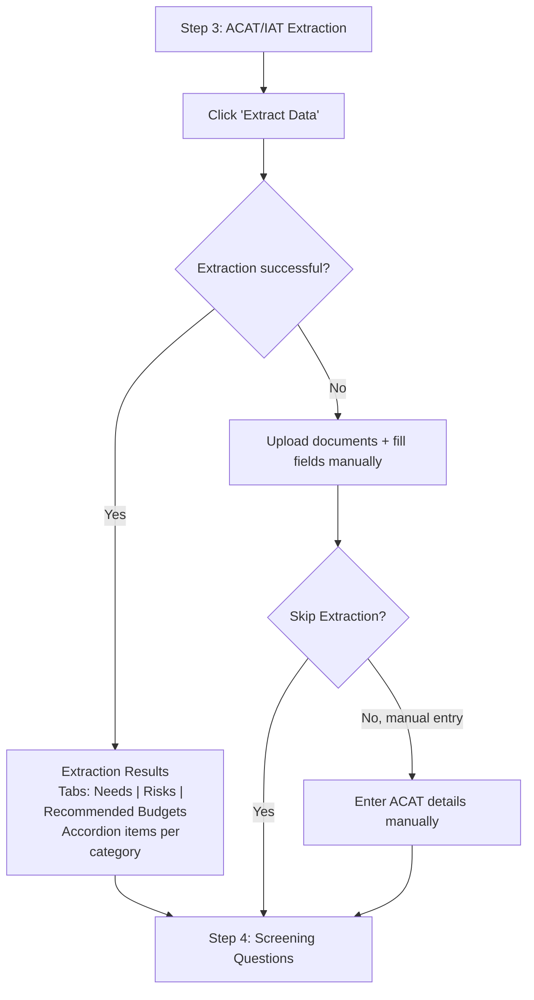
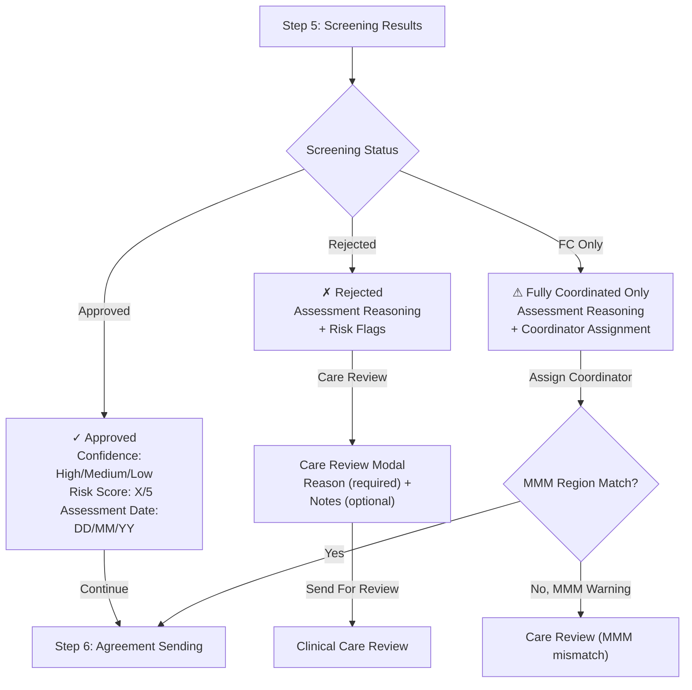
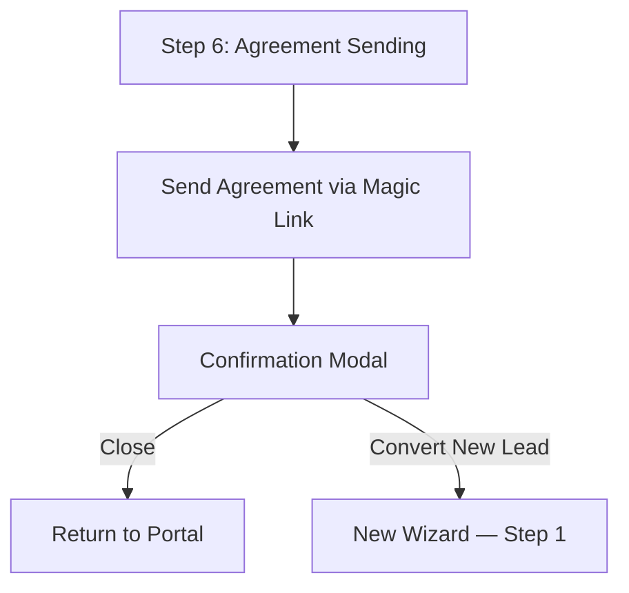
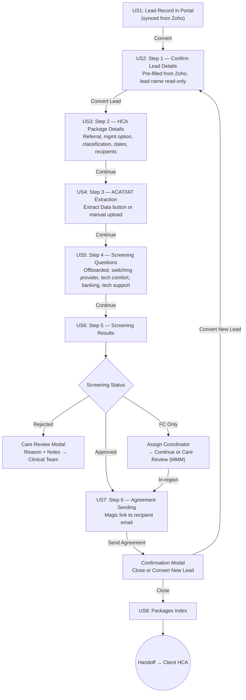
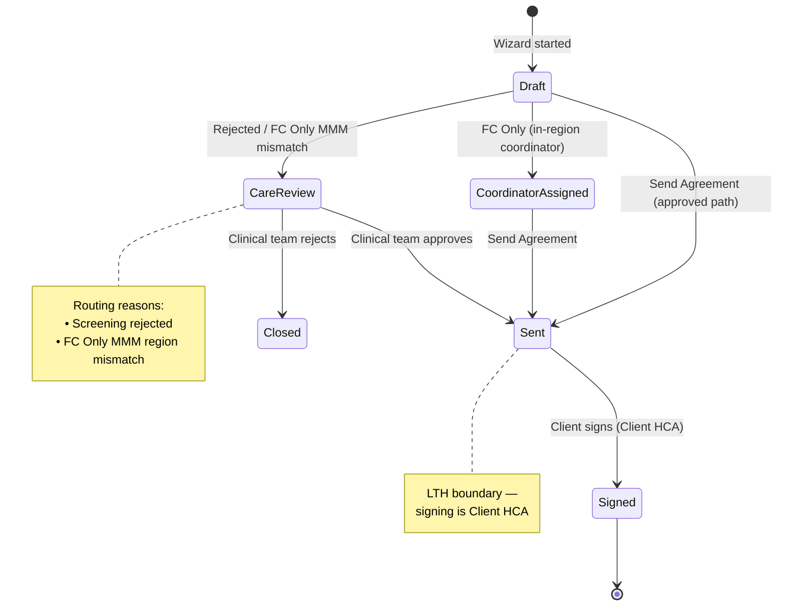

> **[View Mockup](/mockups/lead-to-hca/index.html)**{.mockup-link}

# Feature Specification: Lead to HCA (LTH)

**Feature Branch**: `feat/lth-lead-to-hca`
**Created**: 2026-02-09
**Updated**: 2026-03-25
**Status**: Draft
**Input**: Idea brief + rich context documents from Feb 2026 re-spec + Fast Lane Retrospective (Feb 10, 2026) + Figma design walkthrough (Feb 19, 2026) + Figma Round 2 alignment (Mar 25, 2026)

---

## Overview

Portal takes over lead conversion entirely — replacing BOTH Zoho's convert button AND the PUSH form with a unified 6-step conversion wizard (5 data steps + 1 agreement sending step). After each step, Portal syncs data back to Zoho via API, making Portal the source of truth during conversion.

LTH ends when the agreement is **sent** and the package record is created in Portal. Signature capture (verbal, digital, manual) and all post-send agreement workflows are handled by the **Client HCA** epic.

**Key Actors**:
- **Sales Staff** — View lead records, complete the 6-step conversion wizard, send agreements

**Epic Dependencies**:
- **Lead Essential (LES)** — Future enrichment of the lead record in Portal (builds on US1)
- **Lead Desired (LDS)** — Further lead record enrichment (builds on LES)
- **Client HCA** — Picks up after LTH. Handles agreement signing, SLA reminders, meeting booking, and all post-send agreement lifecycle. See [Handoff to Client HCA](#handoff-to-client-hca).

---

## User Scenarios & Testing

### User Story 1 — Lead Record in Portal (Priority: P1)

As a Sales Staff member, I can view a lead's record in Portal with key information synced from Zoho, so that I have the context I need to action the conversion workflow.

**Why this priority**: The lead record is the foundation of the entire conversion flow. It's the first time a lead is represented in Portal, and its data pre-fills the conversion wizard. Without it, nothing else works.

**Independent Test**: Can be fully tested by verifying that a lead created in Zoho appears in Portal with key fields synced, and that navigating to the lead record displays the correct data.

**Acceptance Scenarios**:

1. **Given** a lead exists in Zoho, **When** the sync runs, **Then** a corresponding lead record is created in Portal with key fields (name, contact details, preferred management option, attribution data).

2. **Given** I navigate to a lead record in Portal, **When** the page loads, **Then** I see the lead's synced information and can action the conversion wizard from this page.

3. **Given** a lead's data is updated in Zoho, **When** the sync runs, **Then** the Portal lead record reflects the updated data.

4. **Given** I am viewing a lead record, **When** I click to start conversion, **Then** the wizard opens with fields pre-filled from the lead record.

> **Note**: This is a stripped-back placeholder record for MVP. The lead object will be enriched by Lead Essential (LES) and then Lead Desired (LDS) in future epics.

---

### User Story 2 — Wizard Step 1: Confirm Lead Details (Priority: P1)

As a Sales Staff member, I can review and confirm the lead's details that have been extracted from Zoho, so that I can verify accuracy before proceeding with the conversion.

**Why this priority**: Step 1 is the entry point — must work correctly for any conversion to proceed. All fields are pre-filled from Zoho and must be confirmed before moving forward.

**Independent Test**: Can be tested by launching the wizard for a Zoho-synced lead and verifying that all fields are pre-populated correctly, the lead name is read-only, and editable fields can be modified before proceeding.

**Acceptance Scenarios**:

1. **Given** I launch the conversion wizard, **When** Step 1 loads, **Then** I see a banner "From Zoho CRM — Converting Lead" with a link back to the Zoho CRM record.

2. **Given** I am on Step 1, **When** I view the lead name field, **Then** it is read-only and cannot be edited.

3. **Given** I am on Step 1, **When** I view the remaining fields (email, contact name, phone number, sales qualifications, sales rep, journey stage, purchase intent, lead attribution, Google status), **Then** they are pre-filled from Zoho and remain editable.

4. **Given** I have confirmed all lead details, **When** I click "Convert Lead", **Then** I proceed to Step 2.

5. **Given** the lead record has pre-filled data, **When** I view Step 1, **Then** available fields are pre-populated from the lead record and I can confirm or edit them.

> **Note — Zoho Banner**: The wizard displays a persistent "From Zoho CRM" banner at the top of Step 1. Clicking the banner navigates back to the lead in Zoho CRM. This provides a clear link back to the source system.

---

### User Story 3 — Wizard Step 2: HCA Package Details (Priority: P1)

As a Sales Staff member, I can capture all package-related information required for conversion (referral code, management option, financial status, classifications, key dates, and HCA recipients), so that the package setup is accurate and complete.

**Why this priority**: Step 2 captures the bulk of the conversion data — management option, classification(s), dates, financial status, and the HCA recipient contacts. This data is required for agreement generation and package setup.

**Independent Test**: Can be tested by completing Step 2 with all fields (including multiple classifications and added contacts) and verifying the data syncs correctly to Zoho.

**Acceptance Scenarios**:

1. **Given** I am on Step 2, **When** I view the package details form, **Then** I see fields for: referral code, preferred management option (self-managed / self-managed plus), financial status (full pensioner / part pensioner / self-funded).

2. **Given** I need to capture classification details, **When** I view the classification section, **Then** I can select a primary classification (level 1, level 2, Support@Home, level 8) and optionally add secondary classifications (the client can have one, two, or three classifications in any combination).

3. **Given** I need to capture key dates, **When** I view the dates section, **Then** I see commencement date and cessation date fields.

4. **Given** I need to specify HCA recipients, **When** I view the HCA Recipient section, **Then** I see the lead (future care recipient) and their contacts pre-filled from Zoho, with the ability to add additional contacts.

5. **Given** I want to add a new contact as an HCA recipient, **When** I click "Add contact", **Then** I can add a new contact (e.g., a family member) to the recipient list.

6. **Given** I have completed all required Step 2 fields, **When** I click "Continue", **Then** the data is synced to Zoho and I proceed to Step 3.

> **Note — Secondary Classification**: The design supports multiple classifications per client. A client can have a primary classification plus up to two secondary classifications in any combination of level 1, level 2, Support@Home, level 8. This replaces the earlier opt-out consent model with explicit selection.

---

### User Story 4 — Wizard Step 3: ACAT/IAT Extraction (Priority: P1)

As a Sales Staff member, I need to extract or manually enter the client's ACAT/IAT assessment data so that eligibility information is captured for the screening steps.

**Why this priority**: The ACAT/IAT data feeds directly into the screening questions and results. Without it, the risk assessment cannot be completed.

**Independent Test**: Can be tested by arriving at Step 3, clicking "Extract Data" to attempt automated extraction, falling back to document upload + manual field entry if extraction fails, and verifying that the extracted/entered data populates correctly.

**Acceptance Scenarios**:

1. **Given** I arrive at Step 3, **When** the page loads, **Then** I see a "Manual Extraction" section with an "Extract Data" button to attempt automated extraction of ACAT/IAT data.

2. **Given** I click "Extract Data", **When** the extraction succeeds, **Then** the assessment detail fields are auto-populated from the extracted data and the Extraction Results section appears.

3. **Given** extraction is successful, **When** I view the Extraction Results section, **Then** I see three tabs — **Needs**, **Risks**, and **Recommended Budgets** — each with a count badge and expandable accordion items showing extracted details.

4. **Given** the Needs tab is active, **When** I expand an item, **Then** I see the need's category, level, frequency, and description.

5. **Given** the Risks tab is active, **When** I expand an item, **Then** I see the risk's category, severity badge (High/Medium/Low colour-coded), description, and mitigation strategy.

6. **Given** the Recommended Budgets tab is active, **When** I expand an item, **Then** I see the budget's category, annual amount (AUD formatted), frequency, and notes.

7. **Given** the automated extraction fails or is unavailable, **When** I need to proceed, **Then** I can upload the ACAT/IAT documents and manually fill in all required assessment fields. A "Skip Extraction" option allows proceeding without extracted data.

8. **Given** all extraction details are populated (either via extraction or manual entry), **When** I click "Continue", **Then** I proceed to Step 4 (Screening Questions).

**Flow:**

> **Note — Extraction**: The initial proposal was for automatic extraction on page load, but this was confirmed as not feasible. Instead, the design uses a manual "Extract Data" button with a fallback to document upload and manual field entry.

> **Note — Extraction Results**: On success, extraction produces three categories of structured data: **Needs** (care needs identified in the assessment), **Risks** (clinical and safety risks), and **Recommended Budgets** (funding allocations recommended by the assessor). Each category is displayed in a tab with expandable accordion items for individual entries.

---

### User Story 5 — Wizard Step 4: Screening Questions (Priority: P1)

As a Sales Staff member, I can answer screening questions about the client's history and capabilities, so that the system can assess eligibility and risk before proceeding.

**Why this priority**: The screening questions provide critical eligibility data that feeds into the automated screening results. This step captures client history and capability information that determines whether the conversion can proceed.

**Independent Test**: Can be tested by completing Steps 1-3, arriving at Step 4, answering all screening questions (including conditional fields), and verifying the answers are captured correctly before proceeding to Step 5.

**Acceptance Scenarios**:

1. **Given** I arrive at Step 4, **When** the page loads, **Then** I see the following screening questions in a single-column stacked layout:
   - "Has the client been previously offboarded by Trilogy Care?" (Yes / No checkboxes)
   - "Is the client switching from a self-managed provider?" (Yes / No checkboxes)
   - "How many previous providers has the client had?" (dropdown: 0, 1, 2, 3, 4, 5+)
   - "Comfort level with technology?" (dropdown: Very comfortable, Somewhat comfortable, Not comfortable, Requires assistance)
   - "Can client/support person use online banking?" (Yes / No checkboxes)
   - "Has support person for technology if needed?" (Yes / No checkboxes)

2. **Given** I select "Yes" for "Is the client switching from a self-managed provider?", **When** the checkbox is checked, **Then** a conditional dropdown appears asking "If Yes, reason for switching?" with options: Cost, Service quality, Moving location, Provider closing, Other.

3. **Given** I select "No" for "Is the client switching from a self-managed provider?", **When** the checkbox is unchecked, **Then** the reason for switching dropdown is hidden.

4. **Given** I need to select the number of previous providers, **When** I view the provider count options, **Then** I can select from a dropdown (0, 1, 2, 3, 4, 5+).

5. **Given** I have answered all required screening questions, **When** I click "Continue", **Then** the answers are submitted and I proceed to Step 5 (Screening Results).

> **Note — Screening Questions Source**: These questions were originally part of the external Assessment Tool. The Figma design moves them into the Portal wizard as an in-Portal step, eliminating the need to switch to an external tool for this data capture.

> **Note — Comfort with Technology**: This is a new field added from the Figma design (Mar 2026). It captures the client's self-assessed technology comfort level, which feeds into the screening algorithm alongside the existing online banking and tech support questions.

---

### User Story 6 — Wizard Step 5: Screening Results (Priority: P1)

As a Sales Staff member, I can see the screening outcome based on the data entered throughout the wizard, so that I know whether the client is approved, rejected, or eligible under the Fully Coordinated scheme only.

**Why this priority**: The screening results gate the rest of the flow — they determine whether the agreement can be sent, needs care review, or requires coordinator assignment under the Fully Coordinated model.

**Independent Test**: Can be tested by completing Steps 1-4 with various screening question combinations and verifying that Step 5 displays the correct screening status, confidence label (High/Medium/Low), risk score (X/5), and assessment date.

**Acceptance Scenarios**:

**Approved (~98% of conversions):**

1. **Given** the screening data indicates approval, **When** I reach Step 5, **Then** I see a centered status card with a green check icon, "Approved" label, and description "This lead is eligible for conversion to a client package."

2. **Given** the screening result is "Approved", **When** I view the metric cards, **Then** I see three cards: Confidence (High/Medium/Low based on data completeness), Risk score (X/5 with risk label), and Assessment date (from ACAT extraction).

3. **Given** the screening result is "Approved", **When** I view the conversion summary, **Then** I see: Lead name, Package level, Management option, Financial status, Referral code, and Commencement date.

4. **Given** the screening result is "Approved", **When** I click "Continue", **Then** I proceed to Step 6 (Agreement Sending).

**Rejected:**

5. **Given** the screening data indicates rejection, **When** I reach Step 5, **Then** I see a centered status card with a red X icon, "Rejected" label, and description "This lead is not eligible for conversion to a client package."

6. **Given** the screening result is "Rejected", **When** I view the assessment reasoning, **Then** I see a red alert with specific risk flags as bullet points.

7. **Given** the screening result is "Rejected", **When** I view the available actions, **Then** the CTAs are "Cancel" (outline) and "Care Review" (primary).

8. **Given** I click "Care Review", **When** the modal opens, **Then** I see a "Send for care review" dialog with a required "Reason" dropdown and an optional "Notes" textarea.

9. **Given** I submit the Care Review modal, **When** the review is sent, **Then** the case is routed for clinical care review with the specified reason and notes.

**Fully Coordinated Only:**

10. **Given** the screening data indicates the client needs additional support coordination, **When** I reach Step 5, **Then** I see a centered status card with an amber people icon, "Fully Coordinated only" label, and description "This lead is eligible for conversion to a client package under the Fully Coordinated scheme only."

11. **Given** the screening result is "Fully Coordinated only", **When** I view the assessment reasoning, **Then** I see an amber alert explaining elevated risk factors.

12. **Given** the screening result is "Fully Coordinated only", **When** I view the Care Coordinator assignment section, **Then** I see a searchable "Coordinator" dropdown (required) and a "Coordination fees (%)" input field.

13. **Given** I select a coordinator who operates outside the client's MMM region, **When** the selection is made, **Then** I see a warning alert about the MMM region mismatch, and the CTA changes to "Care Review".

14. **Given** I have assigned an in-region coordinator for an FC Only result, **When** I click "Continue", **Then** I proceed to Step 6 (Agreement Sending).

**Flow:**

> **Note — Screening Logic**: The screening statuses are: **Approved** (green, ~98%), **Fully Coordinated only** (amber, requires coordinator assignment), and **Rejected** (red, routes to care review). These replace the earlier "Suitable for Everything" / "Needs Clinical Attention" / "Not Suited" / "SM+ Only" terminology. The logic is computed within Portal based on the ACAT/IAT extraction data (Step 3) and screening question answers (Step 4).

> **Note — Care Review Modal**: When a case is rejected or has an MMM region mismatch, the CTA opens a "Send for care review" modal rather than directly routing. This requires the staff member to provide a reason, creating an audit trail. The clinical team receives the case with the reason and notes.

> **Note — Coordinator Assignment on Step 5**: For Fully Coordinated Only outcomes, the coordinator is assigned at Step 5 (not Step 6) because the coordinator choice may affect the outcome (MMM region mismatch). Step 6 focuses solely on agreement confirmation and sending.

---

### User Story 7 — Wizard Step 6: Agreement Sending (Priority: P1)

As a Sales Staff member, I can send the Home Care Agreement as a magic link to the recipient's email, so that the client can complete onboarding electronically.

**Why this priority**: Sending the agreement is the critical conversion milestone. It triggers package creation in Portal, and — once signed via the Client HCA epic — enables the client to be fully onboarded.

**Independent Test**: Can be tested by completing Steps 1-5 with an "Approved" outcome, reaching Step 6, sending the agreement via magic link, and verifying the confirmation modal appears with options to close or convert a new lead.

**Acceptance Scenarios**:

1. **Given** the screening result is "Approved", **When** I reach Step 6, **Then** I see the agreement sending interface with the recipient's email pre-filled and a "Send Agreement" button.

2. **Given** I am ready to send, **When** I click "Send Agreement", **Then** a magic link is sent to the HCA recipient's email allowing them to view and sign the agreement.

3. **Given** the agreement has been sent, **When** the send completes, **Then** a confirmation modal appears with two options: "Close" (returns to the portal) or "Convert New Lead" (starts a new conversion wizard).

4. **Given** I click "Convert New Lead" on the confirmation modal, **When** the new wizard launches, **Then** I am taken to a fresh Step 1 for a different lead.

5. **Given** the agreement has been sent, **When** the wizard completes, **Then** a Package record is created in Portal, a Deal record is created in Zoho, and all data is synced.

**Flow:**

> **Note — Scope Boundary**: Step 6 is the final step of the LTH wizard. Once the agreement is sent, everything that follows (signature capture, SLA reminders, meeting booking) is handled by the **Client HCA** epic. See [Handoff to Client HCA](#handoff-to-client-hca).

> **Note — Lead Conversion Tab (Out of Scope)**: The Figma design includes a "Lead Conversion" table/tab for sales to track all conversions in Portal. This is related to the **Lead Essential (LES)** epic and is shown in the design for context but is not part of the LTH wizard scope.

---

### User Story 8 — Post-Conversion Package Visibility (Priority: P1)

As a Sales Staff member, I can see all converted packages in Portal with their agreement status, and verify that the converted records are reflected in Zoho, so that I can track my pipeline and follow up on unsigned agreements.

**Why this priority**: Sales needs visibility across all their conversions — both the ones progressing through signing and the ones held. This is also the confirmation that Portal-to-Zoho sync is working correctly.

**Independent Test**: Can be tested by completing multiple conversions (both signable and not-signable paths), then verifying that all packages appear in the Portal index with correct statuses, and that corresponding records exist in Zoho.

**Acceptance Scenarios**:

1. **Given** I have completed one or more conversions, **When** I view the packages index in Portal, **Then** I see all converted packages with their current agreement status (Sent, Not Signable, Signed, etc.).

2. **Given** I am viewing the packages index, **When** I filter by agreement status, **Then** I see only packages matching the selected status.

3. **Given** a conversion has completed, **When** I check Zoho, **Then** I see the Consumer record and Deal record with data matching what was entered in the wizard. (Care Plan creation is deferred to the Client HCA epic — created when the HCA is signed, see FR-119b in Client-HCA spec.)

4. **Given** a package has agreement status of "Not Signable", **When** relevant stakeholders (clinical team, coordinator assignment) view the packages index, **Then** they can see the package and its hold reason to action their respective workflows.

5. **Given** an agreement status changes (e.g., from "Sent" to "Signed" via Client HCA), **When** I view the packages index, **Then** the updated status is reflected.

---

### Edge Cases

- **What happens if ACAT/IAT extraction fails?** Sales can upload the documents manually and fill in all required fields by hand. The "Extract Data" button can be retried.

- **What happens if Zoho API sync fails?** Conversion data is saved in Portal. Sync retries automatically. If sync fails permanently, flag for manual intervention.

- **What happens if a client was previously off-boarded by Trilogy Care?** The screening questions capture "Has the client been previously offboarded by Trilogy Care?" (Yes/No). If Yes, this feeds into the screening results which may trigger a "Rejected" outcome requiring care review.

- **What happens if a lead has multiple funding streams?** Primary and secondary classifications are captured in Step 2. A client can have one, two, or three classifications in any combination.

- **What happens if the screening result is "Rejected"?** The "Care Review" button opens a modal requiring a reason and optional notes, then routes the case to the clinical team for review. No agreement is sent.

- **What happens if the screening result is "Fully Coordinated only"?** The staff member must assign a Care Coordinator and set coordination fees. If the coordinator is in-region, the flow proceeds to Step 6. If there is an MMM region mismatch, the case is routed to care review instead.

- **What happens if a "Rejected" outcome is received after Steps 1-2 have already created/updated Zoho records?** The Consumer record remains in Zoho. No Deal is created (conversion doesn't complete Step 6), no Care Plan is created (deferred to HCA signing), and no package is created in Portal.

- **What happens if the switching provider question is Yes?** A conditional text field appears requiring the user to specify the provider name. This is a requirement from the business (Romi's team).

- **What happens after sending the agreement?** A confirmation modal appears with "Close" or "Convert New Lead". The "Convert New Lead" option allows sales to immediately start a new conversion without returning to the portal dashboard.

---

### User Flow Summary

**End-to-End Conversion Flow:**

**Agreement State Transitions:**

---

## Requirements

### Functional Requirements

**Lead Record**

- **FR-001**: System MUST sync lead records from Zoho to Portal with key fields (name, contact details, preferred management option, attribution data).
- **FR-002**: System MUST display a lead record page in Portal showing synced lead data.
- **FR-003**: System MUST pre-fill conversion wizard fields from the lead record.
- **FR-004**: System MUST keep the lead record in sync with Zoho (updates reflected in Portal).

**Step 1 — Confirm Lead Details**

- **FR-005**: System MUST display a "From Zoho CRM — Converting Lead" banner with a link back to the Zoho CRM record.
- **FR-006**: System MUST display the lead name as read-only (not editable).
- **FR-007**: System MUST pre-fill and allow editing of: email, contact name, phone number, sales qualifications, sales rep, journey stage, purchase intent, lead attribution, Google status.
- **FR-008**: System MUST require confirmation of lead details before allowing progression to Step 2 via "Convert Lead" button.

**Step 2 — HCA Package Details**

- **FR-009**: System MUST capture referral code.
- **FR-010**: System MUST capture preferred management option (Self-Managed / Self-Managed Plus).
- **FR-011**: System MUST capture financial status (Full Pensioner / Part Pensioner / Self-Funded).
- **FR-012**: System MUST capture primary classification (Level 1, Level 2, Support@Home, Level 8).
- **FR-013**: System MUST support secondary classification — clients can have one, two, or three classifications in any combination.
- **FR-014**: System MUST capture key dates: commencement date and cessation date.
- **FR-015**: System MUST display HCA recipient contacts pre-filled from Zoho (the lead as future care recipient, plus existing contacts).
- **FR-016**: System MUST allow adding new contacts to the HCA recipient list.
- **FR-017**: System MUST sync package details to Zoho after Step 2 completion.

**Step 3 — ACAT/IAT Extraction**

- **FR-018**: System MUST provide an "Extract Data" button to attempt automated extraction of ACAT/IAT assessment data.
- **FR-019**: System MUST allow document upload as a fallback when automated extraction fails.
- **FR-020**: System MUST allow manual entry of all assessment fields when extraction is not possible.
- **FR-021**: System MUST populate assessment detail fields from extracted data when extraction succeeds, and display Extraction Results in three tabs: **Needs**, **Risks**, and **Recommended Budgets**.
- **FR-021a**: Each extraction results tab MUST show a count badge and expandable accordion items with structured details (category, level/severity, description, etc.).
- **FR-021b**: System MUST allow proceeding without extracted data via a "Skip Extraction" option when extraction fails.
- **FR-022**: System MUST require all assessment fields to be populated (via extraction or manual entry) before allowing progression to Step 4, unless extraction is explicitly skipped.

**Step 4 — Screening Questions**

- **FR-023**: System MUST present the question "Has the client been previously offboarded by Trilogy Care?" with Yes/No checkbox options.
- **FR-024**: System MUST present the question "Is the client switching from a self-managed provider?" with Yes/No checkbox options.
- **FR-025**: When "Is the client switching from a self-managed provider?" = Yes, system MUST display a conditional dropdown "If Yes, reason for switching?" with options: Cost, Service quality, Moving location, Provider closing, Other.
- **FR-026**: When "Is the client switching from a self-managed provider?" = No, system MUST hide the reason for switching dropdown.
- **FR-027**: System MUST present the question "Can client/support person use online banking?" with Yes/No checkbox options.
- **FR-027a**: System MUST present the question "Comfort level with technology?" as a dropdown with options: Very comfortable, Somewhat comfortable, Not comfortable, Requires assistance.
- **FR-027b**: System MUST present the question "Has support person for technology if needed?" with Yes/No checkbox options.
- **FR-028**: System MUST present the question "How many previous providers has the client had?" as a dropdown with options: 0, 1, 2, 3, 4, 5+.
- **FR-029**: System MUST require all screening questions to be answered before allowing progression to Step 5.

**Step 5 — Screening Results**

- **FR-030**: System MUST compute and display one of three screening statuses: **Approved** (green), **Fully Coordinated only** (amber), or **Rejected** (red).
- **FR-031**: For all statuses, system MUST display three metric cards: Confidence (High/Medium/Low), Risk score (X/5 with risk label), and Assessment date (from ACAT extraction).
- **FR-031a**: For all statuses, system MUST display a Conversion summary card with: Lead name, Package level, Management option, Financial status, Referral code, and Commencement date.
- **FR-032**: When status = Approved, system MUST show a "Continue" button to proceed to Step 6.
- **FR-033**: When status = Rejected, system MUST display an assessment reasoning alert (red) with specific risk flags as bullet points.
- **FR-034**: When status = Rejected, system MUST show "Cancel" (outline) and "Care Review" (primary) buttons instead of "Continue".
- **FR-034a**: When "Care Review" is clicked, system MUST open a "Send for care review" modal with a required "Reason" dropdown (High-severity aggressive behaviour, Complex medical needs, Cognitive impairment concerns, Safety risk to staff, Other) and an optional "Notes" textarea.
- **FR-034b**: When the Care Review modal is submitted, system MUST route the case to clinical care review with the specified reason and notes.
- **FR-035**: When status = Fully Coordinated only, system MUST display an assessment reasoning alert (amber) and a "Care Coordinator assignment" section with a searchable Coordinator dropdown (required) and Coordination fees (%) input.
- **FR-035a**: When a selected coordinator operates outside the client's MMM region, system MUST display a warning alert and change the CTA from "Continue" to "Care Review".
- **FR-035b**: When an in-region coordinator is assigned for FC Only, system MUST allow progression to Step 6 via "Continue".

**Step 6 — Agreement Sending**

- **FR-036**: System MUST send the agreement as a magic link to the HCA recipient's email when Sales confirms.
- **FR-037**: System MUST display a confirmation modal after sending with two options: "Close" (return to portal) or "Convert New Lead" (start new wizard).
- **FR-038**: System MUST create a Package record in Portal when the agreement is sent.
- **FR-039**: System MUST create a Deal record in Zoho when the wizard completes.
- **FR-040**: System MUST sync all agreement data and status to Zoho upon wizard completion.

**Post-Conversion Visibility**

- **FR-041**: System MUST display a packages index in Portal showing all converted packages with their current agreement status.
- **FR-042**: System MUST support filtering the packages index by agreement status (Sent, Clinical Review, Signed, etc.).
- **FR-043**: System MUST reflect agreement status changes from Client HCA (e.g., "Sent" → "Signed") in the packages index.
- **FR-044**: System MUST make clinical-review packages visible to relevant stakeholders (clinical team) with routing reasons displayed.

**Sync Requirements**

- **FR-045**: System MUST sync to Zoho API after EACH step completion (continuous sync, not batch).
- **FR-046**: System MUST implement idempotent sync operations (safe to retry).
- **FR-047**: System MUST maintain sync state to prevent duplicate record creation.
- **FR-048**: System MUST sync agreement status changes back to Zoho when status is updated (e.g., via Client HCA signing workflows).

### Key Entities

- **Lead**: Pre-conversion record synced from Zoho. Contains contact details, sales qualifications, attribution data. First-class record in Portal (US1). Enriched by future LES and LDS epics.

- **Consumer**: Post-conversion record. Created in Zoho during conversion. Becomes the client record.

- **Care Plan**: Created in Zoho when the HCA is signed (Client HCA epic, FR-119b). Tracks funding stream, classification, dates. Not created during LTH conversion — deferred to signature event.

- **Package**: Portal record created when the agreement is sent (Step 6). Represents the client's engagement. Tracks agreement status. Visible in the packages index.

- **Agreement**: Associated with the Package. Tracks status (Clinical Review, Sent, Signed — signing handled by Client HCA). Sent as a magic link to the HCA recipient's email.

- **Deal**: Zoho record created when the wizard completes for legacy reporting.

- **Screening Result**: Computed from ACAT/IAT extraction data (Step 3) and screening question answers (Step 4). One of: "Approved", "Rejected", or "Fully Coordinated only". Includes confidence label (High/Medium/Low), risk score (X/5), and assessment date.

- **HCA Recipient**: The contact(s) who will receive the Home Care Agreement. Includes the lead (future care recipient) and optionally additional contacts (e.g., family members). Pre-filled from Zoho, can be extended in Step 2.

---

## Success Criteria

### Measurable Outcomes

- **SC-001**: 100% of agreements sent only when screening result is "Approved" (structural gate).

- **SC-002**: Sales can complete the full 6-step conversion wizard in under 10 minutes.

- **SC-003**: 98% of conversions result in an "Approved" screening outcome, allowing immediate agreement sending.

- **SC-004**: Data syncs to Zoho within 5 seconds of each step completion.

- **SC-005**: 100% of rejected cases and FC Only MMM mismatches are routed to the clinical team via care review with correct reason and assessment reasoning within 1 minute of screening completion.

- **SC-006**: Zero duplicate Consumer, Deal, or Package records created due to sync retry issues.

- **SC-007**: All converted packages visible in both Portal (packages index) and Zoho (Consumer + Deal) with consistent data. Care Plan visibility in Zoho is verified after HCA signing (Client HCA epic).

---

## Handoff to Client HCA

LTH ends when the agreement is **sent** (approved / FC Only with in-region coordinator) or **routed to care review** (rejected / FC Only MMM mismatch) and the Package record exists in Portal.

**Client HCA picks up from here and handles:**

| Capability | HCA Reference |
|-----------|---------------|
| Client receives magic link, accesses agreement | HCA US01 (First-Login Flow) |
| Digital in-portal signature | HCA US02 |
| Uploaded signed PDF | HCA US06 |
| Verbal consent capture (transcript + call ID) | HCA US07 |
| SLA reminders for unsigned agreements | HCA US09 |
| Agreement state management (Draft → Sent → Signed → Terminated) | HCA FR-009 through FR-013 |
| Meeting booking (gated by signed agreement) | TBD |
| Clinical review resolution workflows | Clinical team / respective owners |

**Integration contract between LTH and Client HCA:**

| LTH Creates | HCA Expects |
|-------------|-------------|
| Package record in Portal with agreement status | HCA reads package + agreement status |
| Agreement in "Sent" or "Clinical Review" state | HCA manages state transitions from "Sent" onward |
| Magic link sent to HCA recipient email (approved path only) | HCA handles agreement access and signing |
| All data synced to Zoho | HCA reads/writes to same Zoho records |

> **Note**: Meeting booking (previously planned as a gated step in LTH) is deferred to Client HCA or a subsequent workflow. The business rule is that the assessment meeting cannot be booked until the agreement is signed — this gate is enforced by whoever handles meeting booking, not by LTH.

---

## Clarified Requirements

*From /trilogy-clarify business + design lenses (2026-02-09) and Fast Lane Retrospective (2026-02-10)*

### Business Decisions

| Decision | Value | Rationale |
|----------|-------|-----------|
| Agreement as gate for meeting | Agreement must be signed before assessment meeting can be booked | Prevents wasted assessment resources (~$100K/yr annualised), ensures client commitment |
| Cooling off period as sales tool | 14-day cooling off period communicated at point of sale | Encourages timely signing without forcing clients; ceases once services commence |
| LTH boundary | Ends at agreement sent + package created | Signature capture and post-send lifecycle handled by Client HCA |
| Clinical Review SLA | 24-48 hours | Clinical team owns turnaround for not-signable holds |
| Notifications | Clinical team + original Sales person | Sales stays informed of their lead's status |
| ACAT/IAT Extraction | Manual "Extract Data" button in Step 3 with document upload fallback | Automatic extraction not feasible; manual trigger provides user control |
| Screening in Portal | Screening questions (Step 4) and results (Step 5) are in-Portal steps | Eliminates external Assessment Tool dependency for screening data capture |

### Design Decisions

| Decision | Value | Rationale |
|----------|-------|-----------|
| Form layout | 6-step wizard (5 data steps + agreement sending) | Sequential flow with clear progression |
| Step 1 banner | "From Zoho CRM — Converting Lead" with link back | Provides source context and easy navigation back to Zoho |
| Lead name | Read-only in Step 1 | Prevents accidental modification of the lead identity |
| Secondary classification | Explicit multi-select (1-3 classifications) | Replaces earlier opt-out consent model with direct selection |
| ACAT/IAT extraction | Manual "Extract Data" button with upload fallback | Automatic extraction not feasible; manual trigger + fallback |
| Screening questions | In-Portal step (not external tool) | Keeps screening data capture within the wizard flow |
| Screening results | 3 statuses: Approved / Rejected / Fully Coordinated only | Clear gating with care review routing for rejected, coordinator assignment for FC only |
| Agreement sending | Magic link to recipient email + confirmation modal | Confirmation modal with "Close" or "Convert New Lead" loop |
| Packages index | Filterable by agreement status | Sales and stakeholders need pipeline visibility |

### Additional Functional Requirements

*Added from Figma design walkthrough (2026-02-19):*

- **FR-049**: Step 1 MUST display a "From Zoho CRM" banner with a clickable link back to the Zoho CRM lead record.
- **FR-050**: Step 1 MUST render the lead name field as read-only.
- **FR-051**: Step 2 MUST support adding new contacts to the HCA recipient list beyond those pre-filled from Zoho.
- **FR-052**: Step 4 "Switching from a self-managed provider?" = Yes MUST reveal a conditional "Who is that provider?" text field.
- **FR-053**: Step 5 MUST display confidence percentage, risk score, and assessment date for Approved results.
- **FR-054**: Step 6 MUST display a confirmation modal after agreement sending with "Close" and "Convert New Lead" options.
- **FR-055**: System MUST sync agreement status changes bidirectionally with Zoho (Portal ↔ Zoho).

---

## Out of Scope

The following are explicitly OUT OF SCOPE for LTH:

| Item | Handled By | Reason |
|------|-----------|--------|
| Signature capture (verbal, digital, manual PDF) | Client HCA (US02, US06, US07) | Post-send agreement lifecycle |
| SLA reminders for unsigned agreements | Client HCA (US09) | Post-send follow-up |
| Meeting booking (gated by signed agreement) | Client HCA / TBD | Post-signing workflow |
| Clinical review resolution | Clinical team | LTH routes rejected / FC Only MMM mismatch cases via care review; resolution is separate |
| Exit vs Terminate flows | Client HCA (US10, US15) | Post-conversion lifecycle management |
| Existing Clients: New Funding Streams | Client HCA | Managing active consumers, not new conversions |
| Agreement Amendments / Variations | Client HCA (US08) | Post-onboarding contract changes |
| ACER Lodgement Automation | Client HCA (US14) | Triggered after agreement is signed |
| Lead record enrichment | Lead Essential (LES) / Lead Desired (LDS) | Future epics build on US1 foundation |
| Lead Conversion Tab / Table | Lead Essential (LES) | Figma design shows this for context but it's LES scope |

---

## Related Documents

| Document | Location |
|----------|----------|
| Idea Brief | [idea-brief.md](idea-brief.md) |
| LTH General Context | [context/rich_context/LTH General Context.md](context/rich_context/LTH%20General%20Context.md) |
| Form Fields Specification | [context/rich_context/Consolidated Conversion Form Fields.md](context/rich_context/Consolidated%20Conversion%20Form%20Fields.md) |
| Sync-Back Flow | [context/rich_context/Conversion Sync-Back Flow.md](context/rich_context/Conversion%20Sync-Back%20Flow.md) |
| Risk Score Flow | [context/rich_context/Risk Score First Management Option Flow.md](context/rich_context/Risk%20Score%20First%20Management%20Option%20Flow.md) |
| Agreement Signature Flow | [context/rich_context/Agreement Signature Flow.md](context/rich_context/Agreement%20Signature%20Flow.md) |
| Classification Data Model | [context/rich_context/Classification Data Model.md](context/rich_context/Classification%20Data%20Model.md) |
| Client HCA Spec | [../Client-HCA/spec.md](../Client-HCA/spec.md) |
| Business Specification | [business-spec.md](business-spec.md) |
| Design Specification | [design-spec.md](design-spec.md) |
| Fast Lane Retrospective | [context/raw_context/fastlane meeting/Fast Lane Retrospective Feb 10, 2026.md](context/raw_context/fastlane%20meeting/Fast%20Lane%20Retrospective%20Feb%2010,%202026.md) |

## Clarification Outcomes

### Q1: [Dependency] What is the Zoho API reliability history? What happens if Zoho is down during wizard flow?
**Answer:** The codebase has `app/Http/Controllers/ZohoWebhookController.php` and Zoho sync jobs, confirming active Zoho integration. The spec requires sync after EACH step (FR-045). **If Zoho is down, in-progress wizard data should be preserved locally in Portal.** The spec already states "Conversion data is saved in Portal. Sync retries automatically" (Edge Cases section). **Recommendation:** Implement a `ConversionDraft` model that persists wizard state after each step. Zoho sync should be queued (fire-and-forget) so the wizard does not block on Zoho availability. Failed syncs should retry via Laravel Horizon with exponential backoff.

### Q2: [Scope] Where is the screening algorithm documented?
**Answer:** The spec states screening logic is "computed within Portal based on ACAT/IAT extraction data (Step 3) and screening question answers (Step 4)." The risk score flow is documented in `context/rich_context/Risk Score First Management Option Flow.md` (referenced in Related Documents). **The screening algorithm is NOT the same as the external Assessment Tool** -- it has been simplified to 6 inputs (previously offboarded, switching provider, comfort with technology, online banking capability, tech support availability, provider count) plus ACAT/IAT data. The three outcomes map to: Approved (~98%), Rejected (high risk), Fully Coordinated only (moderate risk requiring coordinator assignment). **The exact scoring weights need to be documented as business rules before development.**

### Q3: [Data] Are the classification models in LTH and MPS the same?
**Answer:** The codebase has `domain/Package/Models/PackageAllocatedClassification.php` which tracks classifications per package. FR-012/FR-013 define classifications as Level 1, Level 2, Support@Home, Level 8 with up to 3 per client. The Classification Data Model is documented in `context/rich_context/Classification Data Model.md`. **These should use the same data model.** MPS tracks classifications per funding stream, while LTH captures the initial classifications at conversion time. **The `PackageAllocatedClassification` model should be the single source of truth, with LTH writing to it during Step 2.**

### Q4: [Edge Case] What happens if a wizard is abandoned mid-flow?
**Answer:** The spec does not explicitly address draft persistence. Given that Zoho sync happens after each step (FR-045), partial data already exists in both Portal and Zoho after each completed step. **Recommendation:** Implement a `ConversionDraft` that auto-saves wizard state. The draft should be resumable by the same or different staff member. Abandoned drafts older than 30 days should be flagged for review. The packages index (US8) should show "In Progress" conversion status for active drafts.

### Q5: [Integration] What is the recovery mechanism if Package creation succeeds but Deal creation fails?
**Answer:** These are cross-system operations (Portal DB + Zoho API) that cannot be wrapped in a single database transaction. **The recommended pattern:** Create the Package record in Portal first (synchronous), then queue the Zoho Deal creation as an asynchronous job. If the Deal creation fails, the Package record persists in Portal with a `zoho_sync_status = 'failed'` flag. A retry mechanism should attempt Deal creation 3 times with exponential backoff. If all retries fail, flag for manual intervention and display in the packages index with a "Zoho sync pending" indicator.

### Q6: [UX] The wizard has 6 steps. What is the expected completion time?
**Answer:** SC-002 targets "under 10 minutes" for the full 6-step wizard. Step 3 (ACAT/IAT extraction) is the most time-variable step -- automated extraction may take 30-60 seconds, while manual entry could take 3-5 minutes. Steps 1, 4, 5, and 6 are quick (30 seconds to 1 minute each). Step 2 requires the most data entry (classifications, dates, contacts). **The 10-minute target is achievable if ACAT extraction succeeds on first attempt.** Manual-only flows may exceed 10 minutes.

### Q7: [Permissions] Who can access the conversion wizard?
**Answer:** The spec defines "Sales Staff" as the sole actor. The current Portal has no "Sales Staff" role in `config/roleList.php` (which uses 37 hardcoded roles per the RAP spec). **A new permission `convert_lead` should be created and assigned to the appropriate role(s).** This should be coordinated with the Roles & Permissions Refactor (RAP) epic to avoid adding yet another role to the bloated list.

## Refined Requirements

1. **Add `ConversionDraft` model** for wizard state persistence across sessions. Drafts must be resumable by any authorised staff member.
2. **Zoho sync should be asynchronous** (queued) and non-blocking. Wizard progression should not depend on Zoho API availability.
3. **Screening algorithm weights must be documented** as business rules in a separate reference document before development begins.
4. **Add `zoho_sync_status` field to the Package model** to track cross-system sync state (synced, pending, failed).
5. **The packages index should show "In Progress" status** for active conversion drafts, not just completed packages.
