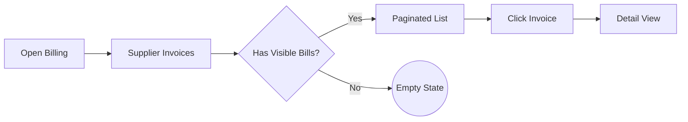
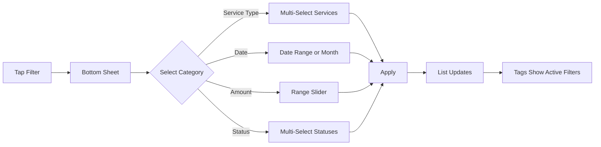
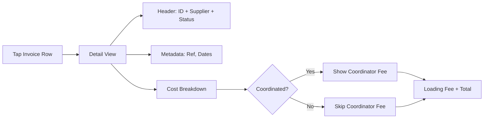
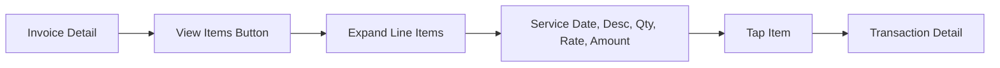

# Feature Specification: Supplier Invoices — Recipient View

**Created**: 2026-03-26
**Status**: Draft
**Epic Code**: MOB-INV
**Input**: Build a simplified, client-facing view of supplier invoices in the mobile app. Removes internal clutter (GST, bank details, PDFs), hides non-actionable stages (Draft, Submitted, Escalated), adds status rationale for On Hold/Rejected, and provides search, filtering, and sorting. Based on Figma designs in [Recipient Mobile App — Web Portal](https://www.figma.com/design/mdBlIwRufILOTX0J0w6eOn/Recipient-Mobile-App---Web-portal?node-id=631-4322).

## User Scenarios & Testing

### User Story 1 — Client Views Supplier Invoice List (Priority: P1)

A client opens the Supplier Invoices section under Billing and sees a paginated list of their invoices. Each row shows the bill ID, invoice date, supplier name, total amount, and a colour-coded status badge. Only client-visible stages appear (In Review, Approved, Paying, On Hold, Rejected, Paid). Bills in Draft, Submitted, or Escalated stages are excluded — these have no mapped line items and would show empty content. When the client has no invoices, a friendly empty state with an illustration is displayed.

**Why this priority**: This is the landing page for the entire feature. Without a visible list, clients cannot interact with their invoices at all. Replaces the existing cluttered table that shows internal fields.

**Independent Test**: Can be fully tested by logging in as a client with active bills across multiple stages and verifying only client-visible bills appear with the correct fields.

**Acceptance Scenarios**:

1. **Given** a client with 10 bills across various stages, **When** they open Supplier Invoices, **Then** only bills in stages In Review, Approved, Paying, On Hold, Rejected, or Paid are displayed.
2. **Given** a client with 3 bills in Draft/Submitted/Escalated, **When** they open Supplier Invoices, **Then** those 3 bills are not shown.
3. **Given** each visible bill, **When** displayed in the list, **Then** it shows: bill ID, invoice date, supplier name, total amount (formatted as currency), and a colour-coded status badge.
4. **Given** a client with no bills (or no bills in visible stages), **When** they open Supplier Invoices, **Then** an empty state with illustration and message is displayed.
5. **Given** a client with more than 20 bills, **When** they scroll the list, **Then** additional results load via pagination.

**Flow:**


---

### User Story 2 — Client Searches Invoices (Priority: P1)

A client uses the search bar at the top of the Supplier Invoices list to find a specific invoice. They can search by bill ID, supplier name, or service type name. Results update as they type (debounced) and the search term is highlighted or reflected in the filtered results.

**Why this priority**: Bill ID is the primary identifier used in support conversations between clients and care partners. Clients need to quickly locate a specific bill without scrolling through their entire history.

**Independent Test**: Can be tested by entering a known bill ID, supplier name, or service type into the search bar and verifying the correct results appear.

**Acceptance Scenarios**:

1. **Given** a client with a bill ID "INV-12345", **When** they type "12345" in the search bar, **Then** that bill appears in the results.
2. **Given** a client with bills from supplier "Sunrise Home Care", **When** they type "Sunrise" in the search bar, **Then** all bills from that supplier appear.
3. **Given** a client with bills containing service type "Domestic Assistance", **When** they type "Domestic" in the search bar, **Then** bills with that service type appear.
4. **Given** a search that matches no bills, **When** results are empty, **Then** a "No invoices found" message is displayed.
5. **Given** the client types quickly, **When** input changes rapidly, **Then** the search is debounced (does not fire on every keystroke).

---

### User Story 3 — Client Filters Invoices (Priority: P1)

A client taps the Filter button to open a bottom sheet (on mobile) with four filter categories: Service Type, Date, Amount, and Status. Each filter can be applied independently or in combination. Active filters display a summary tag on the filter bar (e.g., "2 services", "Jan — Mar", "$0 — $500", "On Hold").

**Why this priority**: Clients with long invoice histories (years of care) need to narrow down results beyond just search. Filters by date range and status are the most common needs identified from Intercom ticket analysis.

**Independent Test**: Can be tested by applying each filter individually and in combination, verifying the invoice list updates correctly.

**Acceptance Scenarios**:

1. **Given** the client taps Filter, **When** the bottom sheet opens, **Then** four filter categories are displayed: Service Type, Date, Amount, Status.
2. **Given** the client selects 2 service types (e.g., "Domestic Assistance", "Personal Care"), **When** they confirm the selection, **Then** the list shows only bills containing those service types, and the filter tag shows "2 services".
3. **Given** the client selects a date range from 15 Jan 2026 to 24 May 2026, **When** applied, **Then** only bills with invoice dates in that range appear, and the filter tag shows "15 Jan — 24 May".
4. **Given** the client selects a specific month (e.g., March) from the month quick-select, **When** applied, **Then** only bills from March appear.
5. **Given** the client adjusts the amount range slider to $0 — $500, **When** applied, **Then** only bills with total amounts in that range appear, and the filter tag shows "$0 — $500".
6. **Given** the client selects statuses "On Hold" and "Rejected", **When** applied, **Then** only bills in those stages appear.
7. **Given** multiple filters are active, **When** the client clears one filter, **Then** the remaining filters stay active and the list updates accordingly.

**Flow:**


---

### User Story 4 — Client Sorts Invoices (Priority: P2)

A client taps the Sort button to open a bottom sheet with sort options. They can sort by Most Recent (default), Oldest First, Amount High to Low, or Amount Low to High. The selected sort persists for the session.

**Why this priority**: Sorting complements search and filters. Clients reviewing recent activity want newest-first; clients investigating a specific high-value bill want amount-based sorting.

**Independent Test**: Can be tested by selecting each sort option and verifying the list reorders correctly.

**Acceptance Scenarios**:

1. **Given** the client opens Supplier Invoices without changing sort, **When** the list loads, **Then** bills are sorted by Most Recent (newest invoice date first).
2. **Given** the client selects "Oldest First", **When** applied, **Then** the list reorders with the oldest invoice date at the top.
3. **Given** the client selects "Amount High to Low", **When** applied, **Then** the list reorders with the highest total amount at the top.
4. **Given** the client selects "Amount Low to High", **When** applied, **Then** the list reorders with the lowest total amount at the top.
5. **Given** filters are also active, **When** a sort is applied, **Then** the filtered results are re-sorted without clearing filters.

---

### User Story 5 — Client Views Invoice Detail (Priority: P1)

A client taps an invoice in the list to open the detail view. The detail view shows the bill ID, supplier name, status badge, invoice reference, invoice date, due date, and a transparent cost breakdown. The cost breakdown shows: service amount, discount (only if applicable), coordinator fee (only if the package is fully coordinated), loading fee, and total inclusive of fees. The detail view explicitly excludes GST, GST status, bank details, care recipient info, and raw supplier PDFs.

**Why this priority**: The detail view is where clients understand what they're being charged. The current view is cluttered with irrelevant internal data. The clean breakdown builds trust and reduces confusion.

**Independent Test**: Can be tested by opening a bill detail and verifying all expected fields are present and all excluded fields are absent.

**Acceptance Scenarios**:

1. **Given** a client taps a bill in the list, **When** the detail view opens, **Then** it displays: bill ID, supplier name, status badge, invoice reference, invoice date, due date, and cost breakdown.
2. **Given** a bill for a fully coordinated package, **When** viewing the detail, **Then** the coordinator fee line appears in the cost breakdown.
3. **Given** a bill for a non-coordinated package, **When** viewing the detail, **Then** the coordinator fee line is not displayed.
4. **Given** a bill with a discount, **When** viewing the detail, **Then** the discount line appears in the cost breakdown.
5. **Given** a bill with no discount, **When** viewing the detail, **Then** no discount line is displayed.
6. **Given** any bill detail view, **When** the client inspects the page, **Then** GST, GST status, bank details, care recipient info, and raw supplier PDFs are not present.
7. **Given** a bill detail view, **When** displayed, **Then** the loading fee line is always shown (it applies to all bills).

**Flow:**


---

### User Story 6 — Client Sees Status Rationale for On Hold / Rejected (Priority: P1)

When a client views an invoice that is On Hold or Rejected, a prominent callout block appears below the status badge explaining why. For On Hold bills, the callout uses an amber/warning style with the hold reason in client-friendly language and any additional description. For Rejected bills, the callout uses a red/error style with the rejection reason and notes. If the specific reason has not been mapped to a client-safe message, a generic fallback is shown (e.g., "This invoice is being reviewed by our team").

**Why this priority**: This directly addresses the top category of Intercom support tickets — clients asking "Why is my invoice on hold?" or "Why was my invoice rejected?". Self-service clarity here has immediate operational impact.

**Independent Test**: Can be tested by viewing a bill in On Hold status with a mapped reason and verifying the callout displays correctly, then testing with an unmapped reason to verify the fallback.

**Acceptance Scenarios**:

1. **Given** a bill in On Hold status with reason "CONSUMER_APPROVAL", **When** the client views the detail, **Then** a callout block appears with an amber left-border, header "This invoice is on hold", and client-friendly description "This invoice requires your approval before it can be processed."
2. **Given** a bill in On Hold status with reason "INSUFFICIENT_BALANCE", **When** the client views the detail, **Then** a callout appears with description "There are currently insufficient funds in your budget to process this invoice. Your care partner has been notified."
3. **Given** a bill in On Hold status with an unmapped internal reason (e.g., "ABN_GST"), **When** the client views the detail, **Then** a callout appears with a generic message: "This invoice is being reviewed by our team. If you have questions, please contact your care partner."
4. **Given** a bill in Rejected status with reason and notes, **When** the client views the detail, **Then** a callout block appears with a red left-border, header "This invoice has been rejected", the rejection reason in client-friendly language, and any notes.
5. **Given** a bill in Approved, Paying, In Review, or Paid status, **When** the client views the detail, **Then** no rationale callout is displayed.

---

### User Story 7 — Client Views Line Items and Navigates to Transactions (Priority: P2)

On the invoice detail view, a collapsible "View Items In This Invoice" section allows the client to expand and see all line items. Each line item shows the service date, description, quantity/hours, rate, and amount. Each line item is tappable and navigates to the individual transaction detail view.

**Why this priority**: Clients need to understand what specific services were charged. The line item breakdown connects invoices to the transactions area, creating a cohesive billing experience.

**Independent Test**: Can be tested by expanding the line items section on a bill with multiple items, verifying all items display correctly, and tapping one to navigate to the transaction detail.

**Acceptance Scenarios**:

1. **Given** a bill with 5 line items, **When** the client taps "View Items In This Invoice", **Then** an expandable section opens showing all 5 items.
2. **Given** a visible line item, **When** displayed, **Then** it shows: service date, service description, quantity/hours, unit rate, and line amount.
3. **Given** a visible line item, **When** the client taps it, **Then** they navigate to the transaction detail view for that specific item.
4. **Given** the line items section is expanded, **When** the client taps the header again, **Then** the section collapses.
5. **Given** a bill with no line items (edge case — bill was mapped with zero items), **When** the client taps "View Items In This Invoice", **Then** a message indicates "No items have been recorded for this invoice."

**Flow:**


---

### Edge Cases

- What happens when a bill transitions from On Hold back to In Review? — The status badge updates and the On Hold rationale callout is removed.
- What happens when a bill has a very long supplier name? — Truncate with ellipsis in the list view; show full name in detail view.
- What happens when a client's package has been terminated but historic bills exist? — All historic bills in client-visible stages remain accessible in the list.
- What happens when the amount range filter's max value is $0 (client has no paid bills)? — The range slider defaults to $0-$0 with a note "No invoices in this range".
- What happens when a bill has line items across multiple service types? — The bill appears when filtering by any of its contained service types.
- What happens when the same bill has both an On Hold reason and a Rejected reason (sequential transitions)? — The current status dictates which callout is shown; historical reasons are not surfaced.

## Requirements

### Functional Requirements

- **FR-001**: System MUST display a paginated list of supplier invoices for the authenticated client, showing: bill ID, invoice date, supplier name, total amount, and status badge.
- **FR-002**: System MUST exclude bills in stages Draft, Submitted, and Escalated from the client-visible invoice list.
- **FR-003**: System MUST display only client-visible status badges: In Review, Approved, Paying, On Hold, Rejected, Paid.
- **FR-004**: System MUST provide full-text search across bill ID, supplier name, and service type names, with debounced input.
- **FR-005**: System MUST support filtering by service type (multi-select), date range (specific from/to or month quick-select), amount range (slider with dynamic min/max), and status (multi-select).
- **FR-006**: System MUST support sorting by: Most Recent (default), Oldest First, Amount High to Low, Amount Low to High.
- **FR-007**: System MUST display an invoice detail view showing: bill ID, supplier name, status badge, invoice reference, invoice date, due date, and cost breakdown (service amount, discount if applicable, coordinator fee if fully coordinated, loading fee, and total inclusive of fees).
- **FR-008**: System MUST NOT display to clients: GST, GST status, bank details, care recipient info, or raw supplier PDF documents.
- **FR-009**: System MUST display a client-friendly rationale callout on On Hold bills, using a mapping from internal `BillOnHoldReasonsEnum` values to client-safe descriptions. Unmapped reasons MUST fall back to a generic message.
- **FR-010**: System MUST display a client-friendly rationale callout on Rejected bills, showing the rejection reason in plain language and any associated notes.
- **FR-011**: System MUST provide an expandable "View Items In This Invoice" section on the detail view, showing each line item's service date, description, quantity/hours, rate, and amount.
- **FR-012**: Each line item MUST be navigable to the individual transaction detail view.
- **FR-013**: System MUST display a meaningful empty state with illustration when the client has no invoices in visible stages.
- **FR-014**: Filters MUST display active filter summary tags on the filter bar (e.g., "2 services", "Jan — Mar 2026", "$0 — $500").
- **FR-015**: Filters and sorting MUST be composable — any combination of active filters with any sort order MUST work correctly.
- **FR-016**: System MUST scope all invoice queries to the authenticated client's package(s) — a client MUST NOT see another client's invoices.
- **FR-017**: The month quick-select date filter MUST display the last 12 months and allow backward scrolling for older months.
- **FR-018**: The amount range filter slider MUST set its min and max bounds dynamically based on the client's actual invoice range.

### Key Entities

- **Bill** (existing): The core invoice record. Key attributes used in client view: id, bill_number (displayed as bill ID), invoice_date, due_date, total_amount, stage (filtered to client-visible stages), supplier relationship, package relationship.
- **BillItem** (existing): Individual line items within a bill. Key attributes: service_date, description, quantity, unit_rate, amount, service_type relationship.
- **Supplier** (existing): The service provider. Key attributes used: name.
- **BillOnHoldReasonsEnum** (existing): Internal hold reasons. New requirement: a client-safe label mapping for each reason, with a fallback for unmapped values.
- **BillRejectedReasonsEnum** (existing): Internal rejection reasons. New requirement: a client-safe label mapping for each reason.
- **On Hold Reason Client Mapping** (new): A configuration mapping internal `BillOnHoldReasonsEnum` values to client-facing titles and descriptions. Must support a generic fallback.

## Current Implementation Status

The `tc-consumer-app` (Expo/React Native) already has a working Supplier Invoices implementation. The following table maps spec stories to what exists and what's needed.

| Story | Status | What Exists | What's Needed |
|-------|--------|-------------|---------------|
| S1 — Invoice List | **Partial** | List view with bill ref, date, supplier, amount, stage badge. Pagination via "Load more". Search bar (debounced). Empty/error/loading states. | Stage filtering (exclude DRAFT/SUBMITTED/ESCALATED server-side). Currently shows all stages. |
| S2 — Search | **Done** | Debounced search via `filter[search]` param. Works on mobile + desktop. | Search by service type name (currently only bill ref + supplier). |
| S3 — Filters | **Stub** | Filter button exists in UI (`onPress={() => {}}` — no-op). `BillFilters` type defined with `stages[]`. Desktop hook supports stage filter. | Bottom sheet UI. Service type, date range, amount range, status multi-select. `filter-options` endpoint. |
| S4 — Sorting | **Partial** | Desktop supports sort by submitted_at and total_amount. Mobile has no sort UI. | Sort bottom sheet on mobile. Add sort params to mobile hook. |
| S5 — Invoice Detail | **Done** | Full detail screen: ref, supplier, status badge, invoice ref, dates, legal entity/ABN, cost breakdown (service amount, discount, total, coordinator fee, loading fee, total inc. fees). Expandable line items. | Conditionally hide coordinator fee when not coordinated (currently always shown). Conditionally hide discount when zero. |
| S6 — Status Rationale | **Partial** | On Hold callout (yellow bar) shows `on_hold_comment`. Rejected callout (red bar) shows `rejected_comment`. | Client-safe reason mapping (currently shows raw internal comments). Generic fallback for unmapped reasons. Client-friendly titles from `BillOnHoldReasonsEnum`/`BillRejectedReasonsEnum`. |
| S7 — Line Items → Transactions | **Done** | `BillItemsModal` expandable section. Each item shows service type, hours, rate, amount. Tappable → navigates to `/finances/supplier-bills/bill-item/{id}`. | — |

### Key Codebase References (tc-consumer-app)

| Area | Files |
|------|-------|
| **Routes** | `app/finances/supplier-bills/index.tsx`, `[billId].tsx`, `bill-item/[billItemId].tsx` |
| **Screens** | `components/screens/SupplierBills/SupplierBillsScreenMobile.tsx`, `BillDetail/BillDetailScreen.tsx`, `BillItemDetail/BillItemDetailScreen.tsx` |
| **Hooks** | `useSupplierBillsScreenMobile.ts`, `useSupplierBillsScreen.ts`, `lib/hooks/useBillsQuery.ts`, `lib/hooks/useBills.ts` |
| **Service** | `services/bill.ts` → `BillService.getBills()`, `getBillById()` |
| **Types** | `lib/types/bill.ts`, `components/screens/SupplierBills/types/index.ts` |
| **Constants** | `components/screens/SupplierBills/constants.ts` |

## API Endpoints

All endpoints use the existing `tc-portal` Laravel API, authenticated via Sanctum Bearer token, scoped to the client's package.

### `GET /recipient/packages/{packageId}/bills` — Invoice List *(existing, needs enhancement)*

Currently used by `BillService.getBills()`. Returns paginated bills for a package.

**Existing Query Parameters**:

| Param | Type | Status | Description |
|-------|------|--------|-------------|
| `page` | integer | Exists | Page number (default: 1) |
| `per_page` | integer | Exists | Items per page (default: 10) |
| `filter[search]` | string | Exists | Search across bill ref, supplier name |
| `filter[stage]` | string (csv) | Exists | Filter by stage(s), comma-separated |
| `sort` | string | Exists | Sort field with `-` prefix for desc (e.g., `-submitted_at`) |

**New Parameters Needed**:

| Param | Type | Description |
|-------|------|-------------|
| `filter[service_types]` | string (csv) | Filter by service type slugs |
| `filter[date_from]` | date (Y-m-d) | Invoice date from (inclusive) |
| `filter[date_to]` | date (Y-m-d) | Invoice date to (inclusive) |
| `filter[date_month]` | string (Y-m) | Filter by specific month |
| `filter[amount_min]` | numeric | Minimum total amount |
| `filter[amount_max]` | numeric | Maximum total amount |

**Server-side changes needed**:
- Default stage filter to exclude DRAFT, SUBMITTED, ESCALATED when called from recipient context
- Add service type, date range, amount range filter support
- Add search by service type name (currently only ref + supplier)

**Response** — existing Laravel paginated format (unchanged):
```json
{
  "data": [BillData, ...],
  "links": [...],
  "meta": {
    "total": 98,
    "current_page": 1,
    "per_page": 10,
    "last_page": 10,
    "from": 1,
    "to": 10,
    "first_page_url": "...",
    "last_page_url": "...",
    "next_page_url": "...",
    "prev_page_url": "..."
  }
}
```

---

### `GET /recipient/packages/{packageId}/bills/{billId}` — Invoice Detail *(existing, needs enhancement)*

Currently used by `BillService.getBillById()`. Returns full `BillData` for a single bill.

**Server-side changes needed**:
- Add `status_rationale` object to response: `{ title, description, severity }` mapped from `BillOnHoldReasonsEnum` / `BillRejectedReasonsEnum` to client-safe wording
- Unmapped reasons return generic fallback: `"This invoice is being reviewed by our team."`
- `status_rationale` is `null` for stages other than ON_HOLD and REJECTED
- `severity` is `"warning"` for On Hold, `"error"` for Rejected

**Existing response** already includes: `ref`, `invoice_ref`, `invoice_date`, `due_date`, `stage`, `supplier` (with `legal_entity_name`, `business_name`, `abn`), `total_amount`, `total_service_amount`, `total_discount_amount`, `total_cc_fees`, `total_loading_fees`, `bill_items[]`, `approval` (with `bill_on_hold_reason`, `on_hold_comment`, `bill_rejected_reason`, `rejected_comment`).

---

### `GET /recipient/packages/{packageId}/bills/filter-options` — Filter Metadata *(new endpoint)*

Returns dynamic filter options scoped to the client's package invoice history.

**Response** (200):
```json
{
  "service_types": [
    { "value": "domestic_assistance", "label": "Domestic Assistance" }
  ],
  "statuses": [
    { "value": "IN_REVIEW", "label": "In Review" },
    { "value": "APPROVED", "label": "Approved" },
    { "value": "PAYING", "label": "Paying" },
    { "value": "ON_HOLD", "label": "On Hold" },
    { "value": "REJECTED", "label": "Rejected" },
    { "value": "PAID", "label": "Paid" }
  ],
  "amount_range": {
    "min": 0.00,
    "max": 2450.00
  }
}
```

**Server-side logic**:
- `service_types` derived from distinct service types across the package's bill items
- `amount_range` derived from the package's min/max bill totals
- `statuses` is the fixed set of client-visible statuses (excludes DRAFT, SUBMITTED, ESCALATED)
- Called once when the filter bottom sheet is opened

### Client-Side Changes Needed (tc-consumer-app)

| Area | Change |
|------|--------|
| `BillService` | Add `getFilterOptions(packageId)` method. Add new filter params to `getBills()`. |
| `BillFilters` type | Extend from `{ stages[] }` to include `serviceTypes[]`, `dateFrom`, `dateTo`, `dateMonth`, `amountMin`, `amountMax` |
| `useSupplierBillsScreenMobile` | Add filter state, sort state. Wire filter bottom sheet. Wire sort bottom sheet. |
| `SupplierBillsScreenMobile` | Replace filter button no-op with bottom sheet trigger. Add sort button + bottom sheet. |
| `BillDetailScreen` | Conditionally render coordinator fee (only when `total_cc_fees > 0`). Conditionally render discount (only when non-zero). Display `status_rationale` with client-friendly title/description instead of raw `on_hold_comment`/`rejected_comment`. |
| New components | `BillFilterBottomSheet`, `BillSortBottomSheet`, `BillDatePicker`, `BillAmountSlider` |

## Success Criteria

### Measurable Outcomes

- **SC-001**: Clients can locate a specific invoice via search in under 10 seconds.
- **SC-002**: Intercom tickets categorised as "invoice status enquiry" reduce by 30%+ within the first quarter after launch.
- **SC-003**: 100% of On Hold and Rejected bills display either a specific or generic rationale — no unexplained status badges.
- **SC-004**: Zero instances of GST, bank details, care recipient info, or raw supplier PDFs visible in the client invoice views.
- **SC-005**: Invoice list loads within 2 seconds for clients with up to 500 historic bills.
- **SC-006**: All four filter types (service, date, amount, status) function independently and in combination without errors.

## Open Decisions

| Item | Owner | Status |
|------|-------|--------|
| Which On Hold reasons are safe to show clients + client-friendly wording | Product / Business | Pending |
| Is legal entity name legally required on client-facing invoices? | Compliance | Pending |
| Is invoice reference needed for clients? | Product | Pending — included in design, needs confirmation |
| Final client-facing status label terminology (e.g., "In Review" vs "Processing") | Product / Design | Pending |

## Out of Scope (Future Epics)

- **Invoice submission by clients** — clients submitting invoices on behalf of suppliers
- **Approval/rejection workflows** — clients opting in to approve or reject each invoice before processing
- **Bulk review / swipe-to-approve** — Tinder-style swipe interface for batch invoice approvals
- **Dashboard alerts** — dashboard notification when invoices need client attention
