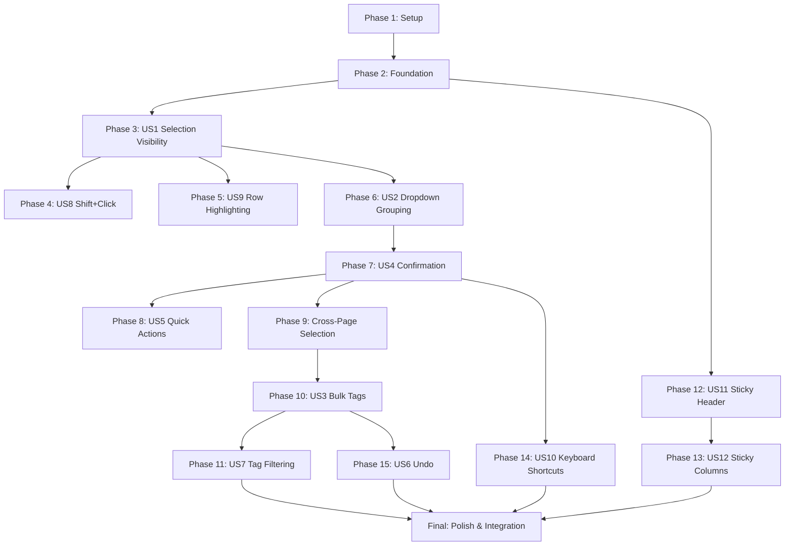

**Spec**: [spec.md](./spec.md)
**Plan**: [plan.md](./plan.md)
**Test Plan**: [test-plan.md](./test-plan.md)
**Created**: 2025-12-21

---

## Phase 1: Setup

- [x] T001 Create feature branch `001-enhanced-bulk-actions` from `dev` (using existing `table-filters` branch)
- [x] T002 [P] Create `resources/js/composables/useBulkActions.ts` skeleton with TypeScript interfaces
- [x] T003 [P] Convert `resources/js/Components/Common/table/actions.js` to `actions.ts` with proper TypeScript types

## Phase 2: Foundation

- [x] T004 Create `domain/Shared/Data/BulkTagData.php` DTO for tag operations
- [x] T005 [P] Create `domain/Shared/Data/BulkActionResultData.php` DTO for action responses
- [x] T006 [P] Extend `app/Extends/Table/Action.php` with `category()`, `quickAction()`, `confirmable()`, `undoable()` fluent methods
- [x] T007 Create `ActionCategory` enum in `app/Extends/Table/ActionCategory.php`

## Phase 3: User Story 1 - Selection Visibility (P1)

**Goal**: Staff users need clear visibility of how many items they have selected when working with table data
**Test Criteria**: Selection count displays prominently without requiring any clicks when items are selected

### Test Tasks (TDD - Write First)
- [ ] T008 [US1-TEST] Write unit tests for selection state logic in `tests/Unit/BulkActions/SelectionStateTest.php`
- [ ] T009 [US1-TEST] Write browser tests for selection visibility in `tests/Browser/BulkActions/SelectionVisibilityTest.php`

### Code Tasks
- [x] T010 [US1] Implement selection state interface in `resources/js/composables/useBulkActions.ts`
- [x] T011 [US1] Create `resources/js/Components/Common/table/BulkActionBar.vue` skeleton with selection count display
- [x] T012 [US1] Add selection count visibility to `BulkActionBar.vue` (FR-001, FR-002, FR-003)
- [x] T013 [US1] Integrate `BulkActionBar.vue` with `CommonTable.vue` - show bar when items selected

### Verification
- [ ] T014 [US1-TEST] Run US1 tests: `php artisan test --filter=SelectionState`
- [ ] T015 [US1-TEST] Run browser tests: `php artisan dusk tests/Browser/BulkActions/SelectionVisibilityTest.php`

## Phase 4: User Story 8 - Shift+Click Range Selection (P2)

**Goal**: Users can select a range of rows by shift+clicking
**Test Criteria**: Clicking first row, then shift+clicking last row selects all rows between

### Test Tasks (TDD - Write First)
- [ ] T016 [US8-TEST] Write unit tests for range selection in `tests/Unit/BulkActions/ShiftClickSelectionTest.php`
- [ ] T017 [US8-TEST] Write browser tests for shift+click in `tests/Browser/BulkActions/ShiftClickSelectionTest.php`

### Code Tasks
- [x] T018 [US8] Add shift+click range selection logic to `useBulkActions.ts` (FR-021, FR-022)
- [x] T019 [US8] Implement shift+click handler in `CommonTable.vue`
- [x] T020 [US8] Track last clicked row index for range calculation

### Verification
- [ ] T021 [US8-TEST] Run US8 tests: `php artisan test --filter=ShiftClick`
- [ ] T022 [US8-TEST] Run browser tests: `php artisan dusk tests/Browser/BulkActions/ShiftClickSelectionTest.php`

## Phase 5: User Story 9 - Enhanced Row Highlighting (P2)

**Goal**: Selected rows are visually prominent with teal background tint
**Test Criteria**: Selected rows display distinct background that persists during scroll

### Test Tasks (TDD - Write First)
- [ ] T023 [US9-TEST] Write browser tests for row highlighting in `tests/Browser/BulkActions/RowHighlightingTest.php`

### Code Tasks
- [x] T024 [US9] Add selected row CSS classes to `CommonTable.vue` (FR-023, FR-024)
- [x] T025 [US9] Implement `bg-teal-50 dark:bg-teal-900/20` styling for selected rows
- [x] T026 [US9] Ensure highlighting distinct from hover state

### Verification
- [ ] T027 [US9-TEST] Run browser tests: `php artisan dusk tests/Browser/BulkActions/RowHighlightingTest.php`

## Phase 6: User Story 2 - Enhanced Dropdown with Grouping (P2)

**Goal**: Bulk actions dropdown groups related actions with clear visual hierarchy
**Test Criteria**: Actions grouped by category with icons, destructive actions at bottom with red styling

### Test Tasks (TDD - Write First)
- [ ] T028 [US2-TEST] Write browser tests for dropdown grouping in `tests/Browser/BulkActions/DropdownGroupingTest.php`

### Code Tasks
- [x] T029 [US2] Update `CommonTableAction.vue` to group actions by category (FR-004)
- [x] T030 [US2] Add icons to action items in dropdown (FR-005)
- [x] T031 [US2] Add danger styling for destructive actions (FR-006, FR-007)
- [x] T032 [US2] Disable dropdown when no items selected (FR-008)
- [x] T033 [US2] Serialize action metadata (category, icon) from PHP to frontend

### Verification
- [ ] T034 [US2-TEST] Run browser tests: `php artisan dusk tests/Browser/BulkActions/DropdownGroupingTest.php`

## Phase 7: User Story 4 - Action Confirmation (P2)

**Goal**: Confirmation dialogs before executing bulk actions to prevent accidental operations
**Test Criteria**: 100% of destructive actions require explicit confirmation with clear details

### Test Tasks (TDD - Write First)
- [ ] T035 [US4-TEST] Write feature tests for confirmation flow in `tests/Feature/BulkActions/ActionConfirmationTest.php`
- [ ] T036 [US4-TEST] Write browser tests for confirmation dialogs in `tests/Browser/BulkActions/ActionConfirmationTest.php`

### Code Tasks
- [x] T037 [US4] Integrate `useConfirmDialog` with bulk action execution (FR-015)
- [x] T038 [US4] Display action name, item count, consequences in confirmation dialog (FR-016)
- [x] T039 [US4] Add danger styling to destructive action confirmations
- [x] T040 [US4] Show success/failure toast after action completion (FR-017)

### Verification
- [ ] T041 [US4-TEST] Run feature tests: `php artisan test --filter=ActionConfirmation`
- [ ] T042 [US4-TEST] Run browser tests: `php artisan dusk tests/Browser/BulkActions/ActionConfirmationTest.php`

## Phase 8: User Story 5 - Quick Access Actions (P2→P3)

**Goal**: Common bulk actions appear as direct buttons without opening dropdown
**Test Criteria**: Most common actions visible as buttons, same confirmation flow applies

### Test Tasks (TDD - Write First)
- [ ] T043 [US5-TEST] Write browser tests for quick actions in `tests/Browser/BulkActions/QuickActionsTest.php`

### Code Tasks
- [x] T044 [US5] Add quick action buttons to `BulkActionBar.vue`
- [x] T045 [US5] Filter actions by `quickAction()` flag from backend
- [x] T046 [US5] Apply same confirmation flow to quick actions

### Verification
- [ ] T047 [US5-TEST] Run browser tests: `php artisan dusk tests/Browser/BulkActions/QuickActionsTest.php`

## Phase 9: Cross-Page Selection (P2)

**Goal**: Enable selecting all items across pages (up to 1000 items)
**Test Criteria**: "Select all X items" option appears when all page items selected

### Test Tasks (TDD - Write First)
- [ ] T048 [CP-TEST] Write feature tests for cross-page selection API in `tests/Feature/BulkActions/CrossPageSelectionTest.php`
- [ ] T049 [CP-TEST] Write browser tests for cross-page UI in `tests/Browser/BulkActions/CrossPageSelectionTest.php`

### Code Tasks
- [x] T050 [CP] Add cross-page selection state to `useBulkActions.ts` (FR-003a)
- [ ] T051 [CP] Create API endpoint to get all IDs for current filter
- [x] T052 [CP] Add "Select all X items" link to `BulkActionBar.vue`
- [x] T053 [CP] Implement 1000 item limit with warning (FR-003b)
- [ ] T054 [CP] Pass `cross_page` and `query_params` to bulk action endpoints

### Verification
- [ ] T055 [CP-TEST] Run feature tests: `php artisan test --filter=CrossPageSelection`
- [ ] T056 [CP-TEST] Run browser tests: `php artisan dusk tests/Browser/BulkActions/CrossPageSelectionTest.php`

## Phase 10: User Story 3 - Bulk Tag Management (P2)

**Goal**: Add or remove tags from multiple items at once
**Test Criteria**: Users can bulk-add tags to 100 items in under 5 seconds

### Test Tasks (TDD - Write First)
- [ ] T057 [US3-TEST] Write unit tests for `BulkAddTagsAction` in `tests/Unit/BulkActions/BulkAddTagsActionTest.php`
- [ ] T058 [US3-TEST] Write unit tests for `BulkRemoveTagsAction` in `tests/Unit/BulkActions/BulkRemoveTagsActionTest.php`
- [ ] T059 [US3-TEST] Write unit tests for `GetTagsForSelectionAction` in `tests/Unit/BulkActions/GetTagsForSelectionActionTest.php`
- [ ] T060 [US3-TEST] Write feature tests for bulk tag API in `tests/Feature/BulkActions/BulkTagApiTest.php`
- [ ] T061 [US3-TEST] Write browser tests for tag management UI in `tests/Browser/BulkActions/BulkTagManagementTest.php`

### Code Tasks
- [x] T062 [US3] Create `domain/Shared/Actions/BulkAddTagsAction.php`
- [x] T063 [US3] Create `domain/Shared/Actions/BulkRemoveTagsAction.php`
- [x] T064 [US3] Create `domain/Shared/Actions/GetTagsForSelectionAction.php`
- [ ] T065 [US3] Create `app/Http/Controllers/Api/V1/BulkTagController.php` with add/remove/present methods
- [ ] T066 [US3] Create `BulkTagRequest` validation class
- [ ] T067 [US3] Create `resources/js/Components/Common/table/BulkActionTagSelector.vue`
- [ ] T068 [US3] Implement upward-expanding dropdown with multi-select checkboxes
- [ ] T069 [US3] Show tag colors/icons in selector (FR-011)
- [ ] T070 [US3] For Remove Tags: show item counts per tag (FR-012, FR-013)
- [ ] T071 [US3] Auto-add tag actions for models with `HasTags` trait (FR-009, FR-010)
- [ ] T072 [US3] Handle mixed tag states across selected items (FR-014)

### Verification
- [ ] T073 [US3-TEST] Run unit tests: `php artisan test --filter=BulkAddTags`
- [ ] T074 [US3-TEST] Run unit tests: `php artisan test --filter=BulkRemoveTags`
- [ ] T075 [US3-TEST] Run feature tests: `php artisan test --filter=BulkTagApi`
- [ ] T076 [US3-TEST] Run browser tests: `php artisan dusk tests/Browser/BulkActions/BulkTagManagementTest.php`

## Phase 11: User Story 7 - Tag Filtering in Tables (P3)

**Goal**: Filter table data by tags on taggable tables
**Test Criteria**: Tag filter returns results in under 1 second for tables with 10,000+ rows

### Test Tasks (TDD - Write First)
- [ ] T077 [US7-TEST] Write feature tests for tag filter in `tests/Feature/BulkActions/TagFilterTest.php`
- [ ] T078 [US7-TEST] Write browser tests for tag filtering UI in `tests/Browser/BulkActions/TagFilteringTest.php`

### Code Tasks
- [ ] T079 [US7] Add Tags filter option to taggable tables (FR-019)
- [ ] T080 [US7] Implement multi-select tag filter with OR logic (FR-020)
- [ ] T081 [US7] Optimize tag filter queries for performance

### Verification
- [ ] T082 [US7-TEST] Run feature tests: `php artisan test --filter=TagFilter`
- [ ] T083 [US7-TEST] Run browser tests: `php artisan dusk tests/Browser/BulkActions/TagFilteringTest.php`

## Phase 12: User Story 11 - Sticky Table Header (P2)

**Goal**: Table header remains visible when scrolling vertically
**Test Criteria**: "Select all" checkbox always accessible during scroll

### Test Tasks (TDD - Write First)
- [ ] T084 [US11-TEST] Write browser tests for sticky header in `tests/Browser/BulkActions/StickyHeaderTest.php`

### Code Tasks
- [ ] T085 [US11] Enable `$stickyHeader = true` in `BaseTable.php` (FR-027)
- [ ] T086 [US11] Verify CSS compatibility with existing table styles
- [ ] T087 [US11] Test sticky header with floating bar visibility
- [ ] T088 [US11] Add z-index adjustments for proper layering

### Verification
- [ ] T089 [US11-TEST] Run browser tests: `php artisan dusk tests/Browser/BulkActions/StickyHeaderTest.php`

## Phase 13: User Story 12 - Sticky Key Columns (P3)

**Goal**: First column (Name/ID) stays visible during horizontal scroll
**Test Criteria**: Key identifier columns remain visible during horizontal scroll

### Test Tasks (TDD - Write First)
- [ ] T090 [US12-TEST] Write browser tests for sticky columns in `tests/Browser/BulkActions/StickyColumnsTest.php`

### Code Tasks
- [ ] T091 [US12] Add `stickable()` method to key columns (FR-028, FR-029)
- [ ] T092 [US12] Add shadow/border on sticky column edge
- [ ] T093 [US12] Test horizontal scroll behavior

### Verification
- [ ] T094 [US12-TEST] Run browser tests: `php artisan dusk tests/Browser/BulkActions/StickyColumnsTest.php`

## Phase 14: User Story 10 - Keyboard Shortcuts (P3)

**Goal**: Keyboard shortcuts for common selection operations
**Test Criteria**: Cmd/Ctrl+A selects all, Escape clears selection

### Test Tasks (TDD - Write First)
- [ ] T095 [US10-TEST] Write unit tests for keyboard handling in `tests/Unit/BulkActions/KeyboardShortcutsTest.php`
- [ ] T096 [US10-TEST] Write browser tests for keyboard shortcuts in `tests/Browser/BulkActions/KeyboardShortcutsTest.php`

### Code Tasks
- [ ] T097 [US10] Add keyboard event listeners to `CommonTable.vue`
- [ ] T098 [US10] Implement Cmd/Ctrl+A to select all visible rows (FR-025)
- [ ] T099 [US10] Implement Escape to clear selection and dismiss bar (FR-026)
- [ ] T100 [US10] Ensure keyboard shortcuts don't conflict with browser defaults

### Verification
- [ ] T101 [US10-TEST] Run unit tests: `php artisan test --filter=KeyboardShortcuts`
- [ ] T102 [US10-TEST] Run browser tests: `php artisan dusk tests/Browser/BulkActions/KeyboardShortcutsTest.php`

## Phase 15: User Story 6 - Undo Capability (P3)

**Goal**: Undo bulk actions immediately after execution
**Test Criteria**: Undo option available for at least 10 seconds after reversible action

### Test Tasks (TDD - Write First)
- [ ] T103 [US6-TEST] Write unit tests for `UndoBulkActionAction` in `tests/Unit/BulkActions/UndoBulkActionActionTest.php`
- [ ] T104 [US6-TEST] Write feature tests for undo API in `tests/Feature/BulkActions/BulkActionUndoTest.php`
- [ ] T105 [US6-TEST] Write browser tests for undo flow in `tests/Browser/BulkActions/UndoCapabilityTest.php`

### Code Tasks
- [ ] T106 [US6] Create `domain/Shared/Models/BulkActionUndo.php` model with migration
- [ ] T107 [US6] Create `domain/Shared/Actions/UndoBulkActionAction.php`
- [ ] T108 [US6] Add undo endpoint to `BulkTagController.php`
- [ ] T109 [US6] Generate `undo_token` in action responses (FR-018)
- [ ] T110 [US6] Add "Undo" button to success toasts
- [ ] T111 [US6] Implement 10-second timeout for undo availability
- [ ] T112 [US6] Create cleanup job for expired undo records

### Verification
- [ ] T113 [US6-TEST] Run unit tests: `php artisan test --filter=UndoBulkAction`
- [ ] T114 [US6-TEST] Run feature tests: `php artisan test --filter=BulkActionUndo`
- [ ] T115 [US6-TEST] Run browser tests: `php artisan dusk tests/Browser/BulkActions/UndoCapabilityTest.php`

## Final Phase: Polish & Integration

- [ ] T116 Run Laravel Pint for code style: `vendor/bin/pint --dirty`
- [ ] T117 Run FULL unit test suite: `php artisan test tests/Unit/BulkActions/`
- [ ] T118 Run FULL feature test suite: `php artisan test tests/Feature/BulkActions/`
- [ ] T119 Run FULL browser test suite: `php artisan dusk tests/Browser/BulkActions/`
- [ ] T120 Fix any failing tests
- [ ] T121 Performance optimization for large selections (1000 items)
- [ ] T122 Animation refinements for floating bar (200ms ease-out)
- [ ] T123 Accessibility audit (keyboard navigation, focus management, ARIA labels)
- [ ] T124 Dark mode testing for all new components
- [ ] T125 Update documentation in context/CONTEXT.md

---

## Dependencies

## Parallel Execution

Tasks marked [P] can run in parallel within their phase.

**Parallel opportunities by phase:**
- Phase 1: T002, T003 (TypeScript conversions)
- Phase 2: T004, T005, T006 (DTOs and Action extension)
- Phase 3-15: Test writing can run in parallel with prior phase code completion
- Each user story phase: Test tasks can start immediately while prior phase verification runs

---

## Summary

| Category | Count |
|----------|-------|
| Total Tasks | 125 |
| Setup Tasks | 3 |
| Foundation Tasks | 4 |
| User Story Tasks | 108 |
| Polish Tasks | 10 |
| Test Tasks | ~50 (TDD) |
| Parallel Opportunities | 12 |

**MVP Scope**: Phases 1-7 (User Stories 1, 8, 9, 2, 4) provide core selection visibility and dropdown improvements.

**Full Scope**: All 15 phases deliver complete feature set with bulk tags, undo, sticky table, and keyboard shortcuts.
