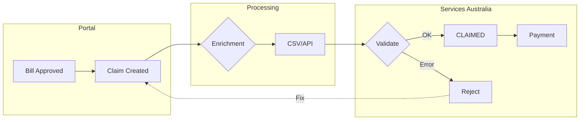
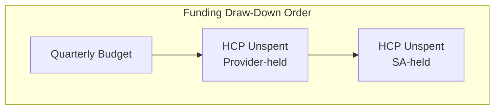
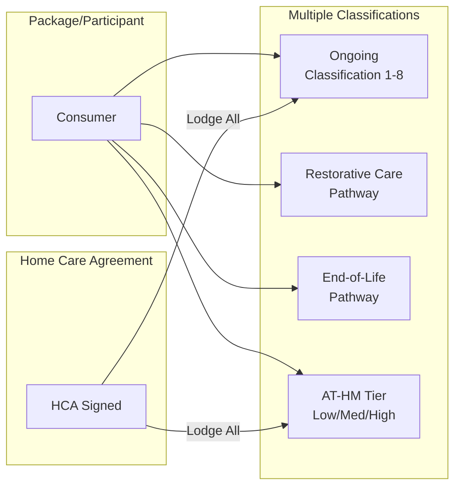
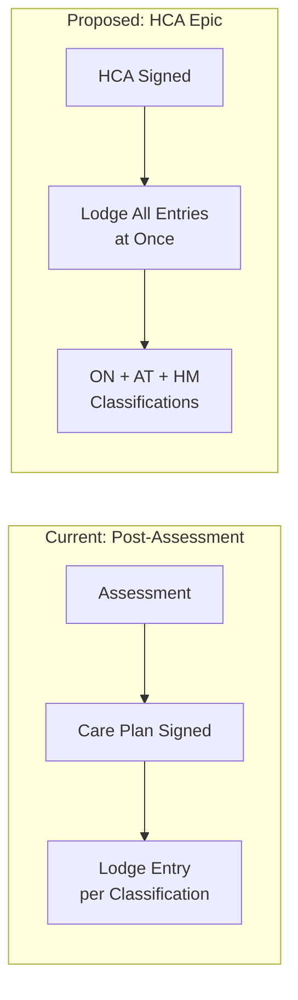
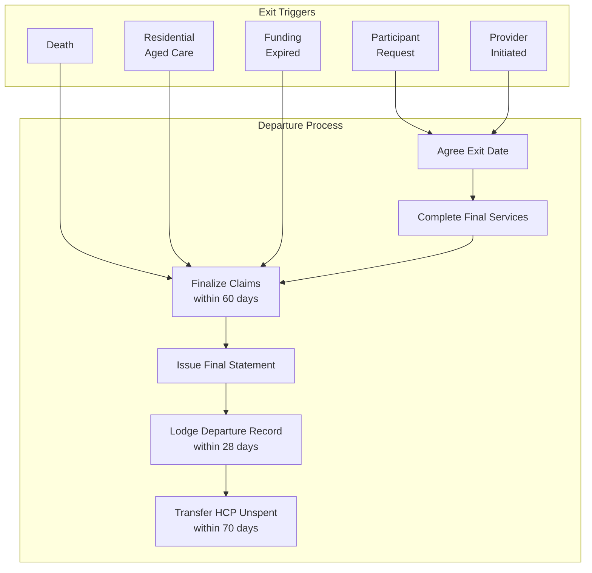
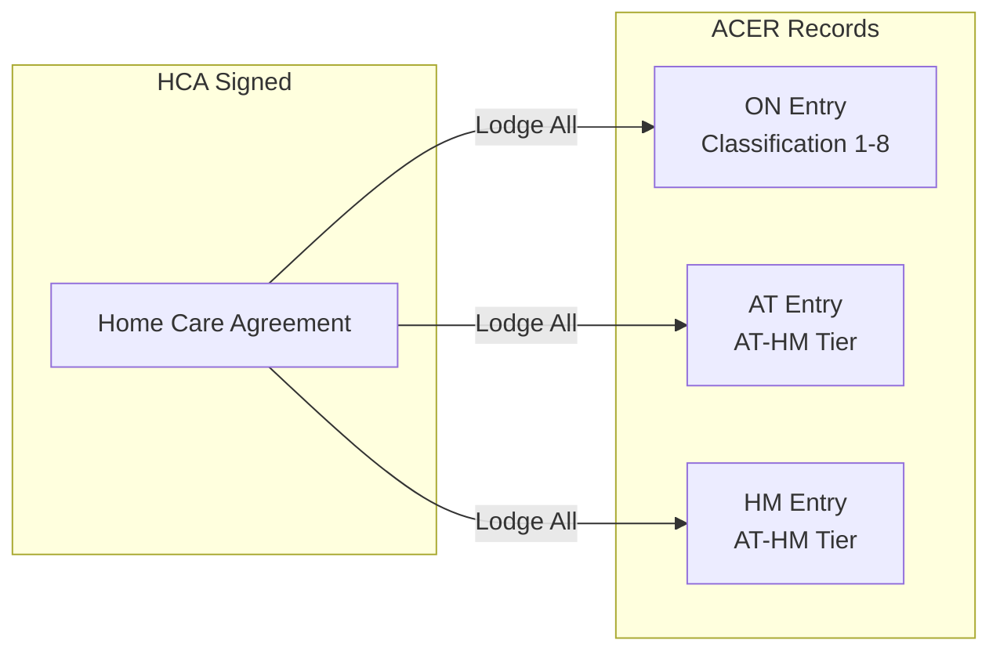
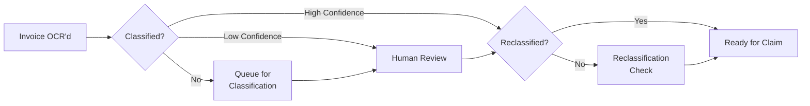

# Support at Home Claims Research

## Executive Summary

This document consolidates claiming requirements under the **Support at Home (SaH)** program effective July 2025. It combines government program rules from the SaH Manual v4.2 with existing TC Portal documentation and API specifications.

**Key Changes from HCP:**
- Payment in arrears (not upfront subsidies)
- 60-day claim window after quarter end
- Multiple funding sources with automatic draw-down order
- 15-minute claim increments supported
- Zero-value claims still required for compliance
- Care management claims have special FY-end deadline

### Claims Flow Overview





### Entry/Departure & Classification Flow

```mermaid
flowchart TD
    subgraph Current["Current State"]
        A1[Assessment Meeting] --> A2[Care Plan Signed]
        A2 --> A3[Lodge ACER<br/>Entry Record]
        A3 --> A4[Services Begin]
    end

    subgraph Proposed["Proposed: HCA Epic"]
        B1[Lead Conversion] --> B2[Send HCA<br/>for Signing]
        B2 --> B3[HCA Signed]
        B3 --> B4[Lodge ACER +<br/>All Classifications]
        B4 --> B5[Assessment Meeting]
        B5 --> B6[Services Begin]
    end

    subgraph Exit["Departure Flow"]
        C1[Exit Initiated] --> C2[Final Claims<br/>within 60 days]
        C2 --> C3[Lodge Departure<br/>Record]
        C3 --> C4[Transfer HCP<br/>Unspent to SA]
    end
```



### Multi-Classification Model (SaH)



> **Key Change:** Under SaH, a participant can have **multiple classifications simultaneously** (e.g., Ongoing + AT-HM + Restorative). The HCA signing should lodge all agreed classifications in one go.

---

## 1. Claiming Rules Summary

### Timeframes

| Claim Type | Deadline |
|------------|----------|
| **Ongoing services** | 60 days after quarter end |
| **Care management** | 60 days from end of financial year |
| **Short-term (RC/EoL)** | 60 days after episode completion |
| **Exit claims** | 60 days from participant exit date |
| **AT-HM** | 60 days after AT-HM funding period ends |

### Claim Frequency

- Up to **daily** submissions allowed
- Can submit individual or bulk claims
- Part-hour claims in **15-minute increments** (0.25, 0.50, 0.75 hours)

### Budget Exceeded Rules

| Scenario | Rule |
|----------|------|
| Claim exceeds budget | Must still claim full amount |
| Insufficient funds | Provider absorbs difference OR invoices participant (with prior agreement) |
| Outstanding amounts | Cannot add to future claims (unless system error) |
| Zero funds remaining | Still submit zero-value claim for compliance |

---

## 2. Funding Sources & Draw-Down Order

### Available Funding Sources

| Code | Name | Used For |
|------|------|----------|
| **ON** | Ongoing Quarterly Budget | Regular services |
| **CM** | Care Management Account | 10% pooled from quarterly budget |
| **RC** | Restorative Care Pathway Payments | Short-term rehab |
| **EL** | End-of-Life Budget | Palliative services |
| **AT** | Assistive Technology Fund | AT purchases/loans |
| **HM** | Home Modifications Fund | Home mods |
| **AS** | HCP Commonwealth Unspent Funds | Legacy HCP balance |

### Automatic Draw-Down Order

**For ongoing/short-term services:**
1. Participant quarterly budget (or RC/EL budget)
2. Provider-held HCP Commonwealth unspent funds
3. Services Australia-held HCP Commonwealth unspent funds

**For AT-HM:**
1. HCP Commonwealth unspent funds (if available) - **always first**
2. Provider-held HCP unspent funds
3. AT/HM budget tiers

> **Important:** Claims must specify the correct funding source. Services Australia auto-draws from HCP unspent when available.

---

## 3. Evidence Requirements

### At Time of Claiming

| Tier | Evidence Required |
|------|-------------------|
| **Low & Medium AT-HM** | Retain only (don't upload) |
| **High Tier AT-HM** | Must upload: prescription + invoice/quote |
| **Regular services** | Retain for audit |
| **Late submissions (>60 days)** | Must upload PDF justification |

### Record-Keeping Requirements

Providers must retain evidence of:
- Price agreement for services (documented in care plan)
- Confirmation of service delivery
- Price agreement for AT-HM items
- Confirmation of AT-HM delivery

---

## 4. Care Management Claiming

### Key Rules

| Rule | Details |
|------|---------|
| **Funding source** | Care Management Account (pooled 10%) |
| **Deadline** | 60 days from end of financial year |
| **Not for short-term** | Don't use CM account for RC/EoL - claim from those budgets |
| **No cap for short-term** | RC/EoL care management has no cap |

### Claimable Activities

From SaH Manual Section 8.10:
- Care planning and review
- Needs assessment
- Service coordination
- Budget management
- Quality and safety oversight
- Monthly contact activities

### Not Claimable

- Submitting claims (administrative)
- Internal overhead activities
- Activities not directly supporting participant care

---

## 5. Special Claiming Scenarios

### Transitioned HCP Care Recipients

- HCP unspent funds retained at SaH commencement
- Services Australia automatically draws from HCP unspent
- Provider-held vs SA-held distinction matters for draw-down order

### Provider Exit Claims

| Step | Timeframe |
|------|-----------|
| Notify SA of participant exit | 28 days from exit date |
| Finalize all claims | 60 days from exit date |
| Share budget info with incoming provider | 28 days from exit date |
| Transfer Commonwealth HCP unspent to SA | Required |
| Refund participant-portion HCP unspent | Direct to participant |

### Late Submission Exceptions

Approved reasons for claiming after 60 days:
- Staff leave/shortages
- IT/software issues, cybersecurity events
- Subcontractor late invoicing
- Natural disasters
- Aboriginal/Torres Strait Islander cultural leave (no evidence required)
- Administrative error by Commonwealth
- Complex home modifications with unexpected circumstances

---

## 6. Entry, Departure & Termination

### Entry Record (ACER) Requirements

Entry records must be lodged via the Entry/Departure API when a participant starts receiving services.

**Entry Category Codes:**

| Code | Classification | Notes |
|------|----------------|-------|
| `ON` | Home Support Ongoing | Classifications 1-8 |
| `AT` | Assistive Technology | AT-HM scheme |
| `HM` | Home Modifications | AT-HM scheme |
| `RC` | Restorative Care Pathway | Short-term |
| `EL` | End-of-Life Pathway | Short-term |

**Required Fields for Entry:**
- `careRecipientId` - SA-issued ID (immutable after creation)
- `serviceNapsId` - NAPS provider identifier
- `entryDate` - Must be on or before current date
- `entryCategoryCode` - One of ON, AT, HM, RC, EL
- `address` - Participant's address (streetLine, suburb, state, postcode)

**Key Rules:**
- Multiple entry records needed for multiple classifications (e.g., one for ON, one for AT)
- Entry date is inclusive for payment
- Cannot claim for services before entry date
- `temp-access-key` required when entering a new care recipient not previously in your service

### Current vs Proposed Entry Flow



> **HCA Epic Proposal:** When the Home Care Agreement is signed at conversion, lodge all applicable entry records simultaneously rather than waiting for assessment.

---

### Departure/Termination Flow



### Departure Reason Codes

| Code | Reason | Notes |
|------|--------|-------|
| `TERMS` | Care recipient terminated service | Participant-initiated |
| `DECEA` | Deceased | Exit date = date of death |
| `TORES` | To residential aged care | Exit date = RAC entry date |
| `MOVED` | Moved out of service area | |
| `CEASE` | Provider ceased providing service | Provider-initiated, 14 days notice required |
| `THOSP` | To hospital | |
| `FNDEX` | Funding classification expired | Auto when no claims for 4 quarters |
| `OTHER` | Other | |
| `AUTO` | Auto departure (read-only) | Triggered by another action |

### Provider Obligations on Exit

| Step | Action | Timeframe |
|------|--------|-----------|
| 1 | Agree exit date with participant | Before exit |
| 2 | Complete delivery of services | Up to exit date |
| 3 | Lodge departure record to SA | **28 days** from exit |
| 4 | Finalize ALL claims | **60 days** from exit |
| 5 | Issue final invoice & statement | After final claims |
| 6 | Share budget info with incoming provider | **28 days** from exit |
| 7 | Refund participant-portion HCP unspent | To participant/estate |
| 8 | Transfer Commonwealth HCP unspent to SA | **70 days** from exit |

### Provider-Initiated Cessation

Provider can cease services only if:
- Participant can no longer be cared for at home with available resources
- Participant no longer needs services
- Needs better met by other funded aged care
- Participant intentionally caused serious injury to worker
- Participant didn't comply with worker safety rights
- Non-payment of contributions (without negotiated arrangement)
- Participant moved to location not serviced

**Requirements:**
- 14 days written notice before services end
- Notice must include: reason, end date, complaint rights, advocacy info
- Must ensure continuity of care arrangements

### Death of Participant

| Action | Detail |
|--------|--------|
| Exit date | Date of death |
| Update My Aged Care | Portal + phone call to prevent communications |
| Claims deadline | 60 days from date after death |
| HCP unspent | Refund to estate |

### Entry to Residential Aged Care

| Action | Detail |
|--------|--------|
| Exit date | Same as RAC entry date |
| Auto-exit | Participant auto-exited from SaH on RAC entry |
| Claims on exit day | Can claim SaH services on the transition day |
| AT-HM | Outgoing provider should coordinate with incoming on in-progress AT-HM |

### Departure API Details

**Endpoint:** `POST /departure/v1`

**Required Fields:**
- `careRecipientId` - Must match entry
- `serviceNapsId` - Must match entry
- `entryCategoryCode` - Must match entry being departed
- `departureDate` - Must be in the past
- `departureReasonCode` - One of the valid codes

**Response Status:**
- `Held` - Awaiting manual action
- `Rejected` - Departure rejected
- `Deleted` - Departure deleted
- `Accepted` - Will be processed for payment

### Funding Reallocation Rules

If no services delivered for **4 consecutive quarters** (1 year):
- Funding reduced to zero
- Funding reallocated to Priority System
- Participant must contact My Aged Care to reactivate

> **Care management exception:** Monthly care management should continue even if services temporarily stopped (unless participant declines).

---

## 7. Services Australia API Integration

### API Priority (from Will's Analysis)

| API | Priority | Notes |
|-----|----------|-------|
| **Invoice API** | 10/10 | Most important - 1000+ per day. Real-time cadence |
| **Claim API** | 10/10 | Essential for payment flow. Daily submissions |
| **Budget API** | 10/10 | Real-time balances. Daily sync |
| **Care Recipient Summary API** | 10/10 | Client info, classification, approved services |
| **Entry/Departure API** | 10/10 | Client registration. Submit when HCA signed |
| **Payment Statement API** | 10/10 | Financial reconciliation. Daily cadence |
| **Individual Contribution API** | 6/10 | Contribution percentages |
| **Service List API** | 2/10 | Only when service categories change |

### Invoice vs Claim Model

```
Invoice → (many) Items → Claim → (many) Claim Items → Payment
```

- **Invoice**: Container for line items being submitted
- **Claim**: Grouped invoices for payment processing
- **Payment Item**: What actually gets paid after validation

### Invoice Status Flow

```
OPEN → SUBMITTED → HELD → CLAIMED → COMPLETED
  ↓         ↓
DELETED   DELETED
```

### Key API Fields

**Item Mandatory Fields:**
- `careRecipientId` - SA-issued ID (immutable)
- `serviceId` - Tier 3 service type (immutable)
- `deliveryDate` - Service date (immutable)
- `quantity` - Hours in 0.25 increments
- `pricePerUnit` - Supplier rate (excl. TC fees)
- `fundingSource` - ON, AT, CM, EL, HM, RC, AS

**Conditional Fields:**
- `itemDescriptionCode` / `itemDescription` - for AT items
- `wraparoundDescriptionCode` - for wraparound services
- `lateSubmissionReasonCode` - if >60 days
- `purchaseMethodType` - PURCHASED/LOANED for AT
- `itemFirstPayment` - for home modifications

---

## 7. PRODA Authentication

### Environment Variables Required

```
PRODA_BASE_URL
PRODA_CLIENT_ID
PRODA_ORGANISATION_ID
IBM_CLIENT_ID
```

### Required Headers for SA API

```http
Authorization: Basic {base64(email:api_token)}
dhs-auditId: {audit_identifier}
dhs-auditIdType: {identifier_type}
dhs-subjectId: {subject_identifier}
dhs-subjectIdType: {subject_type}
dhs-productId: {product_identifier}
dhs-messageId: {unique_message_id}
dhs-correlationId: {correlation_identifier}
X-IBM-Client-Id: {client_id}
x-requested-with: XMLHttpRequest
```

---

## 8. Fireflies Meeting Insights

### Claiming Process Meeting (Nov 5, 2025)

**Attendees:** Mathew Philip, Katja Panova, Adam Pooler

**Key Decisions:**
- First claim file target: **Dec 2-3, 2025** (covering Nov 1-30 services)
- Two-step submission: CSV via Databricks → API integration by Feb-Mar 2026
- Classification requires **5-tier hierarchy** (Tiers 3 & 5 critical for AT-HM)

**Data Requirements Confirmed:**
- Line item descriptions from `bill_items` table (OCR-generated)
- Client-level HCP unspent funds (cash + accrual)
- Care recipient data from Services Australia for validation

**Error Handling Strategy:**
- Pre-submission CSV validation to catch errors before SA submission
- Common errors: invalid recipient IDs, wrong service codes, incorrect funding sources
- Error feedback loop to portal databases still TBD

**Workflow:**
```
Portal Bills → Databricks Enrichment → CSV Generation → SA Submission → Error Feedback
```

> **Quote:** "CSV submission is a temporary solution due to unstable APIs, with a shift planned by February-March to direct API claims" - Mathew Philip

---

### SaH Training: Fees & Practice (Jan 27, 2026)

**Key Points on Fee Structure:**
- **10% care management fee**: Pooled, covers oversight not coordination
- **10% platform loading**: Operational costs coverage
- Trilogy pricing avg **$66/hour** vs competitors **$140/hour**
- ~1,500 clients yet to sign new agreements (compliance risk)

**Invoice Processing Challenges:**
- Processing delays affecting client communication
- Statement delivery timing critical for client understanding

---

### GST Training (Jan 27, 2026)

**Key Decisions:**
- New platform fee model: **12.5% flat rate including GST** (effective Dec 8)
- Aged care and NDIS services are GST-free
- Backend must report net revenue excluding GST separately from platform fees

---

## 9. API Quirks & Lessons Learned

From `app-modules/aged-care-api/QUIRKS.md`:

### ETag Gotchas

1. **Invoice GET validation messages**: Can return validation errors not shown in failed requests - useful for debugging "Service Temporarily Unavailable" errors

2. **ETag mismatch between entities**: The etag from an invoice GET is NOT the same as the etag from an invoice item GET. Always use the etag from the closest related entity.

   ```
   ❌ Wrong: Use invoice etag when updating invoice item
   ✅ Right: Use invoice item etag when updating invoice item
   ```

### Known Issues

- APIs were unstable during initial rollout (reason for CSV fallback)
- "Service Temporarily Unavailable" errors may hide actual validation issues
- Check invoice GET response for hidden validation messages

---

## 10. TC Portal Integration Status

### Current State (as of Jan 2026)

| Component | Status |
|-----------|--------|
| Integration progress | 17% |
| Soft launch | Successful |
| Manual uploads | Still required for some claims |
| Care Recipient IDs | Pending full integration |

### Key Files

| Purpose | Path |
|---------|------|
| API Module | `app-modules/aged-care-api/` |
| PRODA Auth | `app-modules/aged-care-api/src/Http/Integrations/AttachFreshProdaHeaders.php` |
| Claim OpenAPI | `app-modules/aged-care-api/OpenAPI/Aged_Care_API_-_Support_at_Home_claim-1.0.0.yaml` |
| Invoice OpenAPI | `app-modules/aged-care-api/OpenAPI/Aged_Care_API_-_Support_at_Home_Invoices-1.0.0.yaml` |
| SA Claims Migration | `database/migrations/2026_01_12_152606_create_sa_claims_table.php` |

---

## 11. HCA Epic Integration (TP-1865)

### ACER Lodgement Tied to HCA Signing

The [HCA Client Epic](../../initiatives/Consumer-Lifecycle/Client-HCA/spec.md) proposes tying ACER lodgement to HCA signing:

| Current State | Proposed (HCA Epic) |
|--------------|---------------------|
| ACER lodged after care plan signed | ACER lodged when HCA signed at conversion |
| Single classification per entry | **Multiple ACERs** lodged simultaneously |
| Entry after assessment meeting | Entry can occur at point of conversion |

**Key User Story:** [PLA-1118: ACER Status Tracking](https://linear.app/trilogycare/issue/PLA-1118)
- HCA detail view shows ACER status (Pending, Lodged, Confirmed, Failed, Manual Override)
- Background job lodges via ACI after HCA reaches "Signed" state
- Retry logic with exponential backoff for transient failures

### Multi-ACER Pattern

Under SaH, a participant can have **multiple classifications simultaneously**. Each requires its own entry record:



**Implementation Note:** The HCA signing flow should trigger multiple Entry API calls, one per agreed classification.

---

## 12. Classification & Reclassification Risk

### ⚠️ HIGH RISK: Invoice Misclassification

> **Context:** Khoa (classification lead) is away. Risk of pushing invoices to claim with incorrect classification.

**Problem Statement:**
- Invoices must be classified to the correct **5-tier service hierarchy** before claiming
- Misclassified invoices will be rejected by SA or claim against wrong funding source
- Current AI classification in Databricks - accuracy unknown for new SaH categories

### Classification Requirements for Claiming

| Tier | What it is | Required for |
|------|------------|--------------|
| Tier 1 | Service Group (e.g., "Direct Care") | Reporting |
| Tier 2 | Service Category (e.g., "Personal Care") | Reporting |
| **Tier 3** | Service Type (e.g., "Bathing Assistance") | **Invoice API - serviceId** |
| Tier 4 | Delivery Method | Internal |
| **Tier 5** | AT-HM Classification | **Required for AT-HM claims** |

### Pre-Claim Validation Gate

**Recommendation:** Do NOT push invoices for claim until:

1. ✅ Classification has been verified (human review or high-confidence AI)
2. ✅ "Reclassification" workflow has been run
3. ✅ Tier 3 service code matches SA service list



### Reclassification Workflow (TBD)

With Khoa away, need to define:

1. **Who can reclassify?** Care Partners? Dedicated team? AI with human approval?
2. **When to reclassify?** Before claim? On SA rejection?
3. **Audit trail?** Track original vs reclassified for accuracy metrics

### Related Issues

- [PLA-1216: Invoice Classification AI Initiative](https://linear.app/trilogycare/issue/PLA-1216)
- [PLA-1185: Invoice Classification - Define scope](https://linear.app/trilogycare/issue/PLA-1185)
- [PLA-1179: YAML-based extraction modules](https://linear.app/trilogycare/issue/PLA-1179)

---

## 13. Open Questions & Areas to Investigate

### Classification Risk (Urgent - Khoa Away)
1. **Reclassification workflow**: Who reviews and approves classification before claim?
2. **Confidence threshold**: What AI confidence level triggers human review?
3. **SA rejection handling**: How do we feed classification errors back for model training?
4. **Tier 3/5 mapping**: Complete mapping of internal categories to SA service codes?

### From Will's API Analysis
1. **DELETE behaviour**: What happens if invoice already Claimed?
2. **Claim vs Payment Item**: If invoice exceeds claimable amount, is the net the Payment Item or Claim Item?
3. **Real-time vs Daily**: Which APIs need real-time sync vs daily batch?

### From Current Implementation
1. 61-day reconciliation wait - how to handle final budget disclosure timing?
2. Pricing discrepancies between internal systems and SA - reconciliation approach?
3. Equipment claims requiring OT reports as medical certificates - workflow?

### From Fireflies Meetings
1. **Error feedback loop**: How do SA claim errors get fed back into portal databases?
2. **AI classification models**: Where will they run once Databricks removed from claim path?
3. **Unspent funds data**: Currently visible in portal but SA API response lacks this - when available?
4. **1,500 unsigned agreements**: Compliance risk for claiming - escalation path?

---

## 14. Related Documentation

### Internal Docs
- [Claims Domain](/features/domains/claims) - Current claims domain doc
- [Termination Domain](/features/domains/termination) - Exit and departure workflows
- [Services Australia API Domain](/features/domains/services-australia-api) - Integration overview
- [Services Australia Developer Docs](/developer-docs/reference/services-australia-api) - Full API reference
- [PRODA Integration](/features/integrations/proda) - Authentication setup
- [HCA Epic Spec](../../initiatives/Consumer-Lifecycle/Client-HCA/spec.md) - ACER integration stories

### Government Resources
- Support at Home Program Manual v4.2 (Chapter 16 - Claiming)
- Services Australia Aged Care Provider Portal
- Claims and Payments Business Rules Guidance

---

## Changelog

| Date | Author | Changes |
|------|--------|---------|
| 2026-02-02 | Claude | Initial research document created |
| 2026-02-02 | Claude | Added Fireflies meeting insights and API quirks |
| 2026-02-02 | Claude | Added Section 11: HCA Epic integration (multi-ACER pattern) |
| 2026-02-02 | Claude | Added Section 12: Classification/reclassification risk (Khoa away) |
