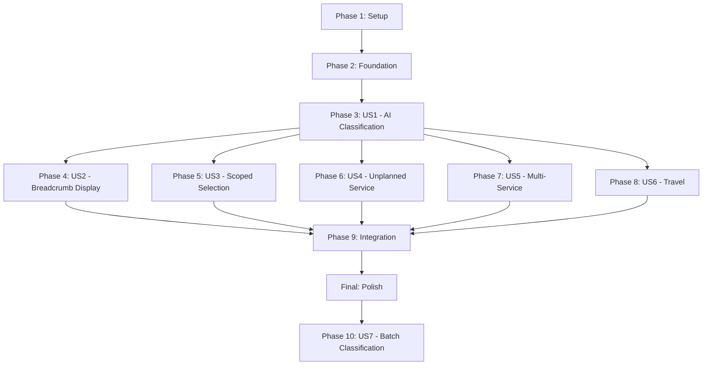

**Spec**: [spec.md](./spec.md)
**Plan**: [plan.md](./plan.md)
**Design**: [design.md](./design.md)
**Created**: 2025-12-23
**Epic**: TP-3301-AIC

---

## Phase 1: Setup & Configuration

- [ ] T001 Add feature flag `ai_invoice_classification` to config/features.php
- [ ] T002 [P] Create config/classification-rubric.php with service_types, confidence_weights, multi_service_triggers, travel_threshold
- [ ] T003 [P] Add FEATURE_AI_INVOICE_CLASSIFICATION to .env.example

---

## Phase 2: Foundation - DTOs & Services

- [ ] T004 Create AiClassificationData DTO in domain/Billing/Data/AiClassificationData.php
- [ ] T005 [P] Create ClassificationReasoningData DTO in domain/Billing/Data/ClassificationReasoningData.php
- [ ] T006 [P] Create MultiServiceDetectionData DTO in domain/Billing/Data/MultiServiceDetectionData.php
- [ ] T007 [P] Create TravelDetectionData DTO in domain/Billing/Data/TravelDetectionData.php
- [ ] T008 [P] Create ClassificationAlternativeData DTO in domain/Billing/Data/ClassificationAlternativeData.php
- [ ] T009 [P] Create ClassificationRequestData DTO in domain/Billing/Data/ClassificationRequestData.php
- [ ] T010 Create ClassificationRubricService in domain/Billing/Services/ClassificationRubricService.php (load/cache keywords from config)
- [ ] T011 [P] Create ConfidenceCalculatorService in domain/Billing/Services/ConfidenceCalculatorService.php (weighted score calculation)
- [ ] T012 Extend BillItem model with ai_extraction classification accessors in app/Models/Bill/BillItem.php

---

## Phase 3: User Story 1 - AI-Assisted Category Classification (P1)

**Goal**: Coordinator can view AI classification suggestion and confirm or override it for any line item
**Test Criteria**: Given line item with "physio" description, AI suggests Allied Health → Physiotherapy with confidence score; user can confirm or override

### Classification Engine Actions

- [ ] T013 [US1] Create MatchKeywordsAction in domain/Billing/Actions/MatchKeywordsAction.php (exclusive vs possible keyword matching)
- [ ] T014 [P] [US1] Create MatchSupplierServicesAction in domain/Billing/Actions/MatchSupplierServicesAction.php (check supplier verified services)
- [ ] T015 [P] [US1] Create MatchRateAction in domain/Billing/Actions/MatchRateAction.php (rate disambiguation)
- [ ] T016 [P] [US1] Create MatchClientBudgetAction in domain/Billing/Actions/MatchClientBudgetAction.php (client budget validation)
- [ ] T017 [US1] Create ClassifyBillItemAction in domain/Billing/Actions/ClassifyBillItemAction.php (orchestrator combining all signals)

### User Actions

- [ ] T018 [US1] Create ConfirmClassificationAction in domain/Billing/Actions/ConfirmClassificationAction.php
- [ ] T019 [P] [US1] Create OverrideClassificationAction in domain/Billing/Actions/OverrideClassificationAction.php
- [ ] T020 [P] [US1] Create LogClassificationAction in domain/Billing/Actions/LogClassificationAction.php (audit trail)

### Events

- [ ] T021 [US1] Create BillItemClassified event in domain/Billing/Events/BillItemClassified.php
- [ ] T022 [P] [US1] Create ClassificationOverridden event in domain/Billing/Events/ClassificationOverridden.php
- [ ] T023 [US1] Create LogClassificationListener in domain/Billing/Listeners/LogClassificationListener.php

### API Endpoints

- [ ] T024 [US1] Create BillItemClassificationController in app/Http/Controllers/Api/V1/BillItemClassificationController.php
- [ ] T025 [US1] Add API routes for classification endpoints in routes/api.php (GET show, POST confirm, POST override)
- [ ] T026 [US1] Create ConfirmClassificationRequest form request in app/Http/Requests/Api/V1/ConfirmClassificationRequest.php
- [ ] T027 [P] [US1] Create OverrideClassificationRequest form request in app/Http/Requests/Api/V1/OverrideClassificationRequest.php

---

## Phase 4: User Story 2 - Breadcrumb Hierarchy Display (P1)

**Goal**: User can visually identify category hierarchy for all line items at a glance
**Test Criteria**: Classified line item shows breadcrumb "Tier 1 → Tier 2 → Tier 3" with icons and Tier 1 colors

### Frontend Components

- [ ] T028 [US2] Create TypeScript interfaces in resources/js/types/classification.ts (AiClassification, ClassificationReasoning, etc.)
- [ ] T029 [US2] Create ConfidenceBadge.vue component in resources/js/Components/Common/ConfidenceBadge.vue (green/yellow/orange)
- [ ] T030 [US2] Create AiClassificationBreadcrumb.vue component in resources/js/Components/Bill/AiClassificationBreadcrumb.vue (Option D: Two-Line Compact)
- [ ] T031 [US2] Create AiReasoningPanel.vue component in resources/js/Components/Bill/AiReasoningPanel.vue (Option B: Signal Strength Bars)

---

## Phase 5: User Story 3 - Scoped Service Selection (P1)

**Goal**: User sees scoped service items by default and must explicitly expand to see other categories
**Test Criteria**: AI suggested Tier 2 category scopes picker; step-back buttons widen scope; contribution category warning on change

### API Endpoints

- [ ] T032 [US3] Create ScopedServiceController in app/Http/Controllers/Api/V1/ScopedServiceController.php
- [ ] T033 [US3] Add scoped service API routes in routes/api.php (GET service-items, service-types, service-categories)

### Frontend Components

- [ ] T034 [US3] Create ScopedServicePicker.vue component in resources/js/Components/Bill/ScopedServicePicker.vue (Option B: Breadcrumb at Top)
- [ ] T035 [US3] Create ServicesTableHeader.vue component in resources/js/Components/Bill/ServicesTableHeader.vue (Option C: Horizontal Tags with Dropdown)
- [ ] T036 [US3] Create ContributionCategoryWarning.vue component in resources/js/Components/Bill/ContributionCategoryWarning.vue

---

## Phase 6: User Story 4 - Promote Unplanned Service Creation (P2)

**Goal**: User is prompted to create unplanned service when no budget match exists, with AI pre-fill
**Test Criteria**: "Create Unplanned Service" prominently displayed; AI pre-fills Tier 2 category and suggested Tier 3 items

### Backend

- [ ] T037 [US4] Create SuggestUnplannedServiceAction in domain/Billing/Actions/SuggestUnplannedServiceAction.php (generate pre-fill data)

### Frontend Components

- [ ] T038 [US4] Create UnplannedServicePrompt.vue component in resources/js/Components/Bill/UnplannedServicePrompt.vue (Option A: Prominent CTA)

---

## Phase 7: User Story 5 - Multi-Service Line Item Detection (P2)

**Goal**: User is warned when line item contains multiple primary keywords and can split or proceed
**Test Criteria**: "personal care and cleaning" triggers warning; user can split or pay as-is with supplier notification

### Backend

- [ ] T039 [US5] Create DetectMultiServiceAction in domain/Billing/Actions/DetectMultiServiceAction.php
- [ ] T040 [US5] Create SplitBillItemAction in domain/Billing/Actions/SplitBillItemAction.php
- [ ] T041 [US5] Add split endpoint to BillItemClassificationController (POST split)
- [ ] T042 [US5] Create SplitBillItemRequest form request in app/Http/Requests/Api/V1/SplitBillItemRequest.php
- [ ] T043 [US5] Create MultiServiceDetected event in domain/Billing/Events/MultiServiceDetected.php
- [ ] T044 [P] [US5] Create SupplierEducationRequired event in domain/Billing/Events/SupplierEducationRequired.php
- [ ] T045 [P] [US5] Create SendSupplierEducationEmailListener in domain/Billing/Listeners/SendSupplierEducationEmailListener.php

### Frontend Components

- [ ] T046 [US5] Create MultiServiceWarning.vue component in resources/js/Components/Bill/MultiServiceWarning.vue (Option B: Compact with Popover)

---

## Phase 8: User Story 6 - Travel/Transport Classification (P2)

**Goal**: User is guided to correctly classify travel charges based on amount and context
**Test Criteria**: Line item under $10 with travel keyword suggests adding to related service; standalone transport options available

### Backend

- [ ] T047 [US6] Create DetectTravelAction in domain/Billing/Actions/DetectTravelAction.php

### Frontend Components

- [ ] T048 [US6] Create TravelWarning.vue component in resources/js/Components/Bill/TravelWarning.vue

---

## Phase 9: Integration - Bill Edit Page

- [ ] T049 Integrate AiClassificationBreadcrumb into Bill Edit line items table in resources/js/Pages/Bills/Edit.vue
- [ ] T050 Integrate ServicesTableHeader into services selection panel in resources/js/Pages/Bills/Edit.vue
- [ ] T051 Replace/wrap existing service picker with ScopedServicePicker in resources/js/Pages/Bills/Edit.vue
- [ ] T052 Integrate warning components (MultiServiceWarning, TravelWarning, UnplannedServicePrompt) in resources/js/Pages/Bills/Edit.vue
- [ ] T053 Add feature flag conditional rendering for all AI classification components in resources/js/Pages/Bills/Edit.vue

---

## Phase 10: User Story 7 - Retrospective Batch Classification (P3 - February)

**Goal**: User can batch-process historical bills through AI classification and apply corrections
**Test Criteria**: Export paid/unclaimed bills; AI processes with suggestions; batch apply with audit trail

### Backend

- [ ] T054 [US7] Create ExportBillItemsForClassificationAction in domain/Billing/Actions/ExportBillItemsForClassificationAction.php
- [ ] T055 [US7] Create BatchApplyClassificationAction in domain/Billing/Actions/BatchApplyClassificationAction.php
- [ ] T056 [US7] Create BatchClassificationController in app/Http/Controllers/Api/V1/BatchClassificationController.php
- [ ] T057 [US7] Add batch classification API routes in routes/api.php

---

## Final Phase: Polish & Cross-Cutting Concerns

- [ ] T058 Create ClassificationFailsafeService in domain/Billing/Services/ClassificationFailsafeService.php (local PHP fallback)
- [ ] T059 Add classification logging channel to config/logging.php
- [ ] T060 Create UpdateFeedbackListener for model feedback loop in domain/Billing/Listeners/UpdateFeedbackListener.php
- [ ] T061 Run Laravel Pint for code style: `vendor/bin/pint --dirty`
- [ ] T062 Manual QA: Test full classification workflow on staging
- [ ] T063 Configure staged rollout: 10% → 50% → 100%

---

## Dependencies

---

## Parallel Execution

Tasks marked `[P]` can run in parallel within their phase:

| Phase | Parallel Tasks |
|-------|---------------|
| Phase 1 | T002, T003 |
| Phase 2 | T005, T006, T007, T008, T009, T011 |
| Phase 3 | T014, T015, T016, T019, T020, T022, T027 |
| Phase 7 | T044, T045 |

---

## Summary

| Metric | Count |
|--------|-------|
| **Total Tasks** | 63 |
| **Phase 1 (Setup)** | 3 |
| **Phase 2 (Foundation)** | 9 |
| **Phase 3 (US1 - AI Classification)** | 15 |
| **Phase 4 (US2 - Breadcrumb)** | 4 |
| **Phase 5 (US3 - Scoped Selection)** | 5 |
| **Phase 6 (US4 - Unplanned Service)** | 2 |
| **Phase 7 (US5 - Multi-Service)** | 8 |
| **Phase 8 (US6 - Travel)** | 2 |
| **Phase 9 (Integration)** | 5 |
| **Phase 10 (US7 - Batch)** | 4 |
| **Final (Polish)** | 6 |
| **Parallel Opportunities** | 18 tasks |

---

## MVP Scope (Recommended)

For fastest delivery, complete Phases 1-5 + 9:

- **Phase 1-2**: Setup & Foundation (12 tasks)
- **Phase 3**: US1 - Core AI classification engine (15 tasks)
- **Phase 4**: US2 - Breadcrumb display (4 tasks)
- **Phase 5**: US3 - Scoped selection (5 tasks)
- **Phase 9**: Integration into Bill Edit page (5 tasks)

**MVP Total**: 41 tasks

P2 user stories (US4-US6) and P3 (US7) can be added incrementally after MVP launch.
