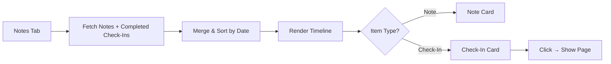

# Feature Specification v2: Care Partner Check-Ins — Refinements

**Created**: 2026-03-04
**Status**: Draft
**Epic Code**: CHK
**Parent**: [spec.md](spec.md) (v1 — approved Gate 1)
**Scope**: Targeted improvements to due date logic, UI time indicators, and data transparency identified during implementation review.

---

## Changes from v1

### Change 1 — Due Date Normalised to End of Month

**Problem**: v1 generates due dates by adding cadence months to a specific date (e.g., commencement date of March 15 → due June 15). This creates inconsistent due dates across clients and doesn't align with how the coordination team thinks about check-in cycles ("Q2 check-ins", "March batch").

**Change**: Due dates MUST be normalised to the **last calendar day** of the target month. If the cadence calculation lands on June 15, the due date becomes June 30. If it lands on February 12, the due date becomes February 28 (or 29 in leap years).

**Impact**: `GenerateCheckInsAction` — change `$dueDate` calculation to use `->endOfMonth()`.

**Acceptance Scenarios**:

1. **Given** a client whose last check-in was completed on 2026-03-10 with a 3-month cadence, **When** the next check-in is generated, **Then** the due date is 2026-06-30 (not 2026-06-10).
2. **Given** a new client with commencement date 2026-01-20 and default 3-month cadence, **When** the first check-in is generated, **Then** the due date is 2026-04-30.
3. **Given** a client with monthly cadence whose last check-in completed on 2026-02-05, **When** the next check-in is generated, **Then** the due date is 2026-03-31.

---

### Change 2 — Relative Time Indicators in UI

**Problem**: The Show page displays "X days overdue" for past-due check-ins, but shows nothing for upcoming ones. The Index table only shows raw due dates. Users need at-a-glance context for both overdue and upcoming check-ins.

**Change**: Add relative time indicators throughout the check-in UI:

- **Overdue**: `X days overdue` (red badge) — already implemented
- **Due today**: `Due today` (amber badge) — new
- **Upcoming**: `Due in X days` (gray/neutral badge) — new

These indicators should appear on:
- **Show page** header (next to the title)
- **Index table** as an additional visual alongside the due date column
- **Dashboard activity cards** (already shows overdue — add "due today" and "due in X days")

**Acceptance Scenarios**:

1. **Given** a check-in due in 12 days, **When** viewed on the Show page, **Then** a neutral badge shows "Due in 12 days".
2. **Given** a check-in due today, **When** viewed on the Show page, **Then** an amber badge shows "Due today".
3. **Given** a check-in 5 days overdue, **When** viewed on the Show page, **Then** a red badge shows "5 days overdue" (existing behaviour — unchanged).
4. **Given** the Index table, **When** a user scans the list, **Then** each row shows a relative time indicator alongside the due date.

---

### Change 3 — Show Created Date on Check-In

**Problem**: The check-in Show page does not display when the check-in record was created. Care partners and team leads need to see when the system generated the check-in to understand the timeline — especially for overdue items where the gap between creation and action is relevant for compliance.

**Change**: Add `created_at` to the check-in data passed to the frontend. Display it in the check-in detail view as a metadata field (e.g., "Created: 4 Mar 2026").

**Impact**:
- `Domain\CheckIn\Data\CheckInData` — add `createdAt` property
- Show page — display in the header or client summary section
- TypeScript type — add `created_at` to `CheckIn` interface

**Acceptance Scenarios**:

1. **Given** a check-in created by the daily job on 2026-03-01, **When** viewed on the Show page, **Then** the creation date "1 Mar 2026" is visible.
2. **Given** an ad-hoc check-in created manually today, **When** viewed on the Show page, **Then** today's date is shown as the creation date.

---

### Change 4 — Check-In Cards in Package Notes Timeline

**Problem**: Completed check-ins and notes live in separate views. Care partners and coordinators reviewing a client's engagement history on the Notes tab have no visibility of check-ins that occurred during the same period. To understand the full picture, they need to switch between tabs. This fragments the client's interaction timeline.

**Change**: Completed check-ins MUST appear as cards interleaved in the package Notes tab timeline, sorted chronologically alongside notes. Each check-in card shows a summary preview (client name, completion date, wellbeing rating, summary excerpt, type badge). Clicking the card navigates to the full check-in record (Show page).

The check-in cards should be visually distinct from note cards (e.g., different left-border colour or icon) so users can scan and distinguish them at a glance.

**Acceptance Scenarios**:

1. **Given** a package with 3 notes and 2 completed check-ins in the last month, **When** a user views the Notes tab, **Then** all 5 items appear in a single chronological timeline sorted by date descending.
2. **Given** a completed check-in card in the Notes timeline, **When** the user views it, **Then** they see: completion date, check-in type badge (Internal/External/Ad-hoc), wellbeing rating (1-5), a truncated summary (first ~120 characters), and the care partner name.
3. **Given** a check-in card in the Notes timeline, **When** the user clicks it, **Then** they navigate to the full check-in Show page (`/staff/check-ins/{id}`).
4. **Given** a package with no completed check-ins, **When** the user views the Notes tab, **Then** only notes appear — no empty check-in placeholders.
5. **Given** a pending or cancelled check-in, **When** the Notes tab is rendered, **Then** that check-in does NOT appear in the timeline (only completed check-ins are shown).

**Flow:**


---

## Updated Functional Requirements

- **FR-027**: Due dates MUST be normalised to the last calendar day of the calculated month.
- **FR-028**: Check-in UI MUST display relative time indicators: "X days overdue" (red), "Due today" (amber), "Due in X days" (neutral) across the Show page, Index table, and Dashboard activity cards.
- **FR-029**: Check-in records MUST display their creation date (`created_at`) on the detail view.
- **FR-030**: Completed check-ins MUST appear as cards in the package Notes tab timeline, interleaved chronologically with notes, showing a summary preview. Clicking a check-in card MUST navigate to the full check-in record.

---

## Implementation Notes

### Due date normalisation
```php
// In GenerateCheckInsAction::calculateDueDate()
// Before: return $baseDate->addMonths($cadenceMonths);
// After:  return $baseDate->addMonths($cadenceMonths)->endOfMonth();
```

### Relative time badge logic (frontend)
```typescript
function getDueBadge(dueDate: string, status: string) {
    if (status === 'completed' || status === 'missed' || status === 'cancelled') return null;
    const days = dayjs(dueDate).diff(dayjs(), 'day');
    if (days < 0) return { label: `${Math.abs(days)} days overdue`, colour: 'red' };
    if (days === 0) return { label: 'Due today', colour: 'amber' };
    return { label: `Due in ${days} days`, colour: 'gray' };
}
```

### Created date
- Already stored in DB (`created_at` column)
- Add to `CheckInData::fromModel()` and TypeScript `CheckIn` interface
