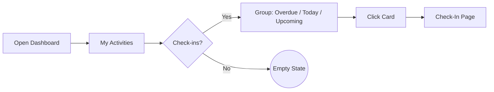
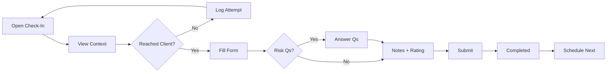
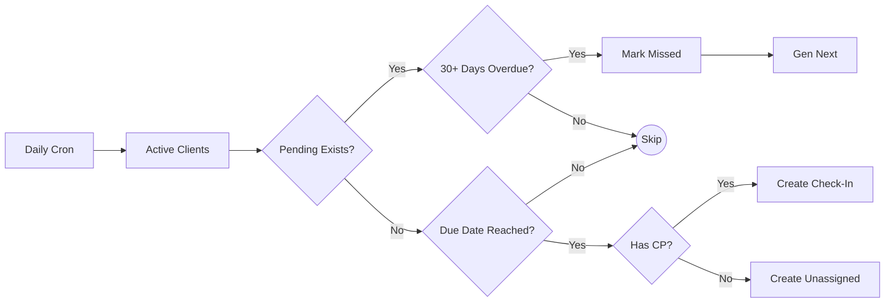
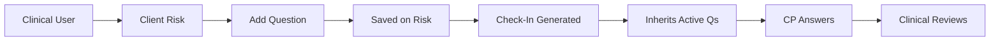
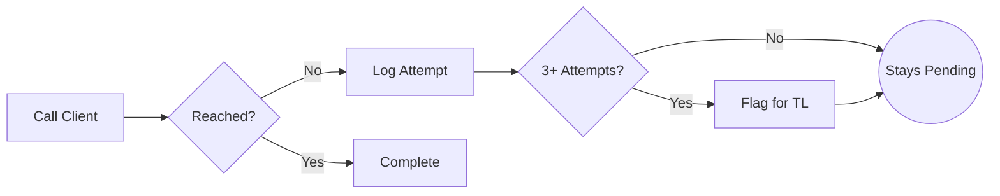
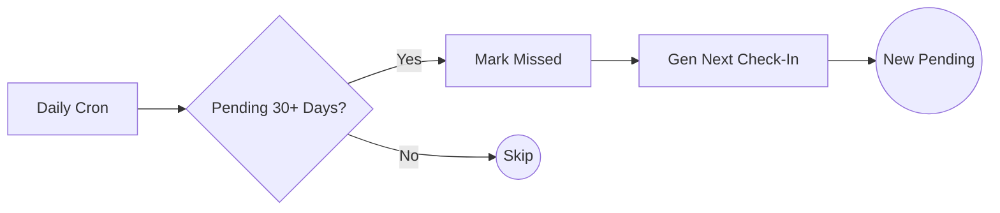
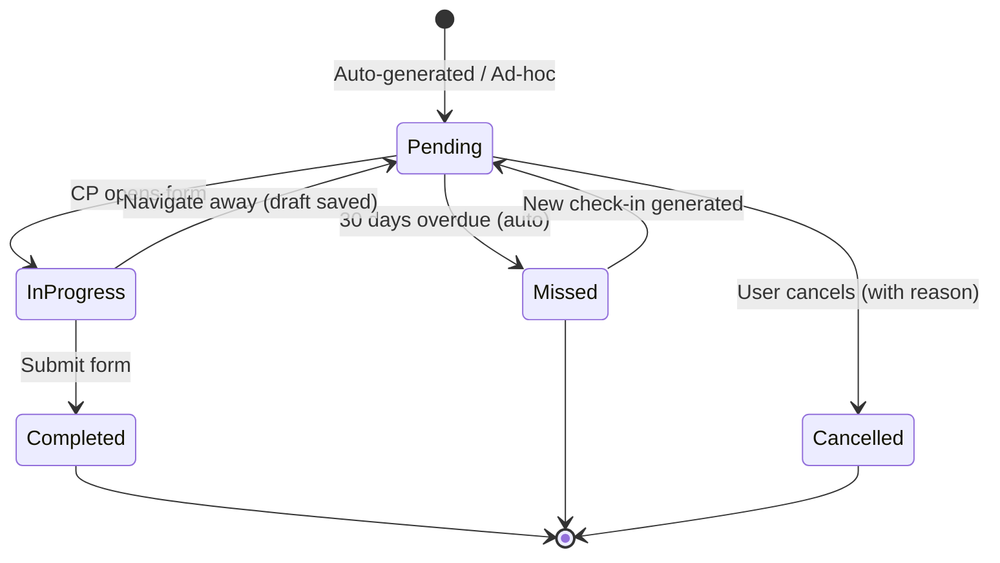

> **[View Mockup](/mockups/001-chk-care-partner-check-ins/index.html)**{.mockup-link}

# Feature Specification: Care Partner Check-Ins

**Created**: 2026-03-03
**Status**: Approved (Gate 1 passed 2026-03-03)
**Epic Code**: CHK
**Input**: Re-enable structured quarterly check-in calls between care partners/coordinators and their clients, replacing Excel-based tracking with a system-managed process featuring clinical team question assignment and structured completion.

## User Scenarios & Testing

### User Story 1 — Care Partner Views Check-Ins on Dashboard (Priority: P1)

A care partner logs into the portal and sees their upcoming, overdue, and today's check-ins in the "My Activities" panel on the Care Partner Dashboard. Each check-in card shows the client's name, due date, check-in type, and whether clinical questions are attached. Overdue check-ins appear prominently so the care partner knows who to call first.

**Why this priority**: This is the entry point for the entire feature. Without visibility of what's due, care partners can't action check-ins. Replaces the coordination team's Excel spreadsheet as the source of truth.

**Independent Test**: Can be fully tested by logging in as a care partner with active clients and verifying check-ins appear grouped by overdue/today/upcoming.

**Acceptance Scenarios**:

1. **Given** a care partner with 5 clients who have overdue check-ins, **When** they open the Care Partner Dashboard, **Then** those 5 check-ins appear in the "Overdue" group of the My Activities panel with client name, due date, and days overdue.
2. **Given** a care partner with a check-in due today, **When** they view My Activities, **Then** it appears in the "Today" group.
3. **Given** a care partner with check-ins due in the next 30 days, **When** they view My Activities, **Then** those appear in the "Upcoming" group sorted by nearest due date.
4. **Given** a check-in with 2 clinical questions attached, **When** the care partner views the check-in card, **Then** a question indicator shows "2 questions" on the card.
5. **Given** a care partner with no check-ins due, **When** they view My Activities, **Then** a meaningful empty state displays (e.g., "No check-ins due — all caught up").

**Flow:**

---

### User Story 2 — Care Partner Completes a Check-In (Priority: P1)

A care partner clicks on a check-in from their dashboard to open the check-in detail view. They see the client's information, the last check-in summary (if any), and any clinical questions inherited from the client's active risks. After calling the client, the care partner fills in a structured completion form: summary notes, client wellbeing rating (1-5 scale), answers to risk-based clinical questions, and any follow-up actions. They mark the check-in as complete, and the next check-in is automatically scheduled.

**Why this priority**: This is the core interaction — without a completion flow, the feature has no value. Replaces the unstructured "record a note with Check-In category" workflow.

**Independent Test**: Can be tested by opening a pending check-in, filling in all fields, submitting, and verifying the check-in moves to "Completed" and a new one is scheduled.

**Acceptance Scenarios**:

1. **Given** a pending check-in for a client, **When** the care partner opens it, **Then** they see the client's name, package details, last check-in summary, and clinical questions inherited from the client's active risks.
2. **Given** a client with 2 active risks each having a clinical question, **When** the care partner opens the check-in form, **Then** both risk-based questions appear and must be answered before submitting.
3. **Given** a completed check-in, **When** submitted, **Then** the check-in status changes to "Completed", the completion date is recorded, the wellbeing rating (1-5) is saved, and a new check-in is scheduled based on the configured cadence (default: 3 months from completion).
4. **Given** a client whose care partner has never completed a check-in before, **When** the care partner opens the check-in, **Then** the "Previous check-in" section shows "First check-in for this client" instead of a blank space.
5. **Given** a care partner mid-call who needs to pause, **When** they partially fill in the form and navigate away, **Then** their progress is not lost (draft state preserved).
6. **Given** a client with no active risks, **When** the care partner opens the check-in form, **Then** no clinical questions appear but the check-in can still be completed with summary notes and wellbeing rating.

**Flow:**

---

### User Story 3 — System Auto-Generates Quarterly Check-Ins (Priority: P1)

The system runs a daily scheduled job that creates check-in records for clients whose next due date has arrived. Each check-in is assigned to the client's designated care partner (internal) or care coordinator (external). The first check-in for a new client is generated based on their package commencement date. The same daily job also handles marking overdue check-ins as Missed (30 days past due) and generating replacement check-ins.

**Why this priority**: Without automatic generation, someone would need to manually create ~5,000 check-ins per quarter across 15,000 clients. This is the engine that drives the feature.

**Independent Test**: Can be verified by running the daily job and confirming check-in records exist for all active clients with correct due dates and assignments.

**Acceptance Scenarios**:

1. **Given** an active client with a care partner assigned, **When** the quarterly generation runs, **Then** a check-in record is created with the due date 3 months from the client's last completed check-in (or commencement date if no prior check-in).
2. **Given** a client whose cadence has been configured to monthly, **When** generation runs, **Then** the check-in is due 1 month from the last completed check-in, not 3 months.
3. **Given** a client whose package has ended or been cancelled, **When** generation runs, **Then** no new check-in is created for that client.
4. **Given** a client who already has a pending check-in, **When** generation runs, **Then** no duplicate check-in is created.
5. **Given** a new client who commenced this week, **When** generation runs, **Then** their first check-in is created with a due date 3 months from their commencement date.

**Flow:**

---

### User Story 4 — Care Coordinator Views and Completes External Check-Ins (Priority: P1)

Care coordinators see their external check-ins on their own dashboard, following the same overdue/today/upcoming grouping. The completion form for coordinators may include different default fields (e.g., service satisfaction, provider feedback, budget discussion) while sharing the same core structure as care partner check-ins.

**Why this priority**: Both internal and external check-in types are required from day one. Coordinators need the same visibility and workflow as care partners. Third-party coordinators involved in client relationships need a formal touchpoint.

**Independent Test**: Can be tested by logging in as a coordinator, viewing check-ins, and completing one with coordinator-specific fields.

**Acceptance Scenarios**:

1. **Given** a care coordinator with clients assigned, **When** they view their dashboard, **Then** external check-ins appear in their activities panel with the same grouping as care partners.
2. **Given** a coordinator completing an external check-in, **When** they open the form, **Then** coordinator-relevant fields are available (service satisfaction, provider feedback).
3. **Given** a client with both a care partner and a coordinator, **When** each views their dashboard, **Then** they see their own check-in type only (internal or external).

---

### User Story 5 — Clinical Team Defines Questions on Client Risks (Priority: P2)

The clinical team defines check-in questions on a client's risk records. When a check-in is generated or opened, it automatically inherits questions from the client's primary package's active risks. This means clinical questions are persistent and reusable — they apply to every future check-in for that client as long as the risk is active, rather than being one-off attachments to individual check-ins.

**Why this priority**: Closes the feedback loop between clinical team and care partners — the key differentiator from the old note-based system. Risk-based questions ensure clinically relevant information is gathered consistently across check-ins.

**Independent Test**: Can be tested by a clinical user adding a question to a client's risk record, then verifying a care partner sees it when they open that client's next check-in.

**Acceptance Scenarios**:

1. **Given** a client with an active risk record, **When** a clinical team member opens the risk, **Then** they can add one or more check-in questions to that risk.
2. **Given** a client with 3 active risks, 2 of which have check-in questions, **When** a check-in is generated for that client, **Then** the check-in inherits questions from both risks.
3. **Given** a risk with a check-in question that is subsequently resolved (risk closed), **When** the next check-in is generated, **Then** the question from the closed risk is no longer included.
4. **Given** a check-in with no risk-based questions (client has no active risks with questions), **When** the care partner opens the form, **Then** the questions section is empty but the check-in can still be completed.

**Flow:**

---

### User Story 6 — Clinical Team Reviews Check-In Responses (Priority: P2)

Clinical team members can browse completed check-ins and read responses to their risk-based questions. This is a self-serve review — no push notifications. Clinical users can access responses via the client's profile, where completed check-ins show the questions and answers grouped by risk.

**Why this priority**: Without review capability, the feedback loop is broken. Clinical team needs to see the information gathered against each risk.

**Independent Test**: Can be tested by completing a check-in with risk-based questions answered, then verifying a clinical user can find and read the responses on the client's profile.

**Acceptance Scenarios**:

1. **Given** a completed check-in with 2 risk-based questions answered, **When** a clinical team member views the client's check-in history, **Then** they see each question with its response, grouped by the risk it belongs to.
2. **Given** a client with multiple completed check-ins, **When** a clinical user views the check-in history, **Then** they can see how responses to the same risk question have changed over time.
3. **Given** a clinical user, **When** they filter completed check-ins by date range, **Then** results match the filter criteria.

---

### User Story 7 — Care Partner Records a Failed Attempt (Priority: P2)

When a care partner calls a client and doesn't reach them (no answer, voicemail, client unavailable), they can record the attempt without completing the check-in. The check-in stays in "Pending" but the attempt is logged with a reason and date. After 3 failed attempts, the check-in is visually flagged on the dashboard for team lead attention.

**Why this priority**: Not every call connects. Without attempt tracking, care partners have no way to show they tried, and overdue check-ins look like inaction.

**Independent Test**: Can be tested by recording a failed attempt on a pending check-in and verifying the attempt is logged while the check-in remains pending.

**Acceptance Scenarios**:

1. **Given** a pending check-in, **When** the care partner records a failed attempt with reason "No answer", **Then** the attempt is logged with timestamp and reason, and the check-in stays "Pending".
2. **Given** a check-in with 3 failed attempts, **When** viewed on the dashboard, **Then** the card shows the attempt count (e.g., "3 attempts").
3. **Given** a check-in with failed attempts, **When** the care partner eventually reaches the client and completes the check-in, **Then** both the attempts and the completion are preserved in the record.

**Flow:**

---

### User Story 8 — Check-In Completion Report (Priority: P2)

Team leads and managers can view a report showing check-in completion rates across care partners, teams, and time periods. The report highlights which care partners are on track, which have overdue check-ins, and the overall completion rate — the primary success metric for this feature.

**Why this priority**: Without reporting, there's no way to measure whether check-ins are actually happening. Provides the compliance audit trail and operational visibility the coordination team currently lacks.

**Independent Test**: Can be tested by generating a report and verifying it accurately reflects check-in completion data.

**Acceptance Scenarios**:

1. **Given** a team lead viewing the report, **When** they select a time period (e.g., last quarter), **Then** they see the overall completion rate (% of due check-ins completed on time).
2. **Given** 3 care partners with varying completion rates, **When** the report is viewed, **Then** each care partner's individual rate is shown with client count and overdue count.
3. **Given** a request for compliance export, **When** the team lead exports the report, **Then** a downloadable file is produced with per-client check-in history.

---

### User Story 9 — Ad-Hoc Check-In Creation (Priority: P2)

Care partners and coordinators can manually create an ad-hoc check-in for a client outside the scheduled cadence. This covers situations where a client calls in, a concern is raised, or a care partner wants to document an unscheduled touchpoint. Ad-hoc check-ins follow the same completion flow but do not affect the scheduled cadence — the next auto-generated check-in still follows the regular schedule.

**Why this priority**: Scheduled check-ins cover the standard cadence, but real-world care relationships produce unplanned contact. Capturing these ensures a complete engagement record.

**Independent Test**: Can be tested by manually creating a check-in for a client who already has a scheduled check-in, completing it, and verifying the scheduled check-in is unaffected.

**Acceptance Scenarios**:

1. **Given** a care partner viewing a client's profile, **When** they create an ad-hoc check-in, **Then** a new check-in record is created with today's date and type "Ad-hoc".
2. **Given** a client with an existing pending scheduled check-in, **When** an ad-hoc check-in is created and completed, **Then** the scheduled check-in remains pending and its due date is unchanged.
3. **Given** a completed ad-hoc check-in, **When** viewing the client's check-in history, **Then** it is clearly distinguished from scheduled check-ins (e.g., labelled "Ad-hoc").

---

### User Story 10 — System Auto-Marks Missed Check-Ins (Priority: P2)

When a check-in remains pending for more than 30 days past its due date, the system automatically transitions it to "Missed" status. A new check-in is then generated with a due date based on the original cadence from the missed check-in's due date, ensuring the schedule resets rather than accumulating overdue items.

**Why this priority**: Prevents indefinitely-pending check-ins from cluttering dashboards. Creates a clean audit trail distinguishing between completed and missed engagements.

**Independent Test**: Can be tested by creating a check-in with a due date 31+ days in the past and running the auto-mark process.

**Acceptance Scenarios**:

1. **Given** a pending check-in that is 31 days past its due date, **When** the auto-mark process runs, **Then** the check-in status changes to "Missed" and a new check-in is generated with the next due date based on cadence.
2. **Given** a pending check-in that is 29 days past its due date, **When** the auto-mark process runs, **Then** the check-in remains "Pending" (not yet Missed).
3. **Given** a check-in marked as Missed, **When** viewed on the dashboard and in reports, **Then** it is clearly distinguishable from completed check-ins.

**Flow:**

---

### User Story 11 — Transition from Current System (Priority: P3)

The system transitions from the existing package-date-driven check-in tracking to the new standalone records. During the transition period, both systems run in parallel behind a feature flag. Existing check-in dates on packages are used to seed initial check-in records. Once the new system is validated, the old date-based tracking is deprecated.

**Why this priority**: The existing system is still partially functional (dashboard shows computed check-ins). A clean transition ensures no data loss and allows rollback if issues arise.

**Independent Test**: Can be tested by enabling the feature flag for a subset of users and verifying they see check-in records instead of computed dates.

**Acceptance Scenarios**:

1. **Given** the feature flag is enabled for a care partner, **When** they view My Activities, **Then** check-ins come from the new records, not the package date computation.
2. **Given** a client with an existing check-in date of 2026-01-15, **When** the migration runs, **Then** a check-in record is created with the next due date based on that historical date.
3. **Given** the feature flag is disabled, **When** a care partner views My Activities, **Then** the existing package-date behaviour is unchanged.
4. **Given** the new system has been running for one full quarter without issues, **When** the team decides to deprecate the old system, **Then** the package date fields are no longer updated by new check-in completions.

---

### User Story 12 — Configurable Cadence per Client (Priority: P3)

Coordinators or team leads can override the default 3-month check-in cadence for individual clients. High-needs clients may be set to monthly, while stable long-term clients may be set to 6-monthly. The cadence setting persists and applies to all future auto-generated check-ins.

**Why this priority**: Most clients follow the quarterly default, but edge cases exist. This is a refinement on the core scheduling logic.

**Independent Test**: Can be tested by setting a client to monthly cadence and verifying the next auto-generated check-in is due in 1 month.

**Acceptance Scenarios**:

1. **Given** a client on the default 3-month cadence, **When** a coordinator changes it to monthly, **Then** the next generated check-in is due 1 month from the last completion.
2. **Given** a client with a custom cadence, **When** the auto-generation runs, **Then** it respects the custom cadence, not the system default.
3. **Given** a coordinator viewing client settings, **When** they see the cadence field, **Then** the current setting is displayed with the option to change it.

---

### Check-In Lifecycle (State Diagram)

### Edge Cases

- What happens when a care partner leaves and their clients are reassigned? — Pending check-ins should be reassigned to the new care partner.
- What happens when a client has multiple active packages? — One check-in per client, not per package. The check-in covers the client relationship, not individual services.
- What happens when the auto-generation job finds a client with no assigned care partner? — The check-in is created as "Unassigned" and flagged for the coordination team to resolve.
- What happens when a coordinator and care partner both have check-ins due for the same client in the same period? — Both proceed independently (internal and external are separate check-in types).
- What happens when a client's package is suspended temporarily? — Existing pending check-ins remain; no new ones are generated until the package is reactivated.

## Requirements

### Functional Requirements

- **FR-001**: System MUST support two check-in types: Internal (care partner) and External (care coordinator), each with their own completion fields.
- **FR-002**: System MUST automatically generate check-in records for all active clients based on their configured cadence (default: every 3 months).
- **FR-003**: System MUST enforce a check-in lifecycle: Pending → In Progress → Completed, with additional terminal states of Missed and Cancelled. Check-ins are auto-marked as Missed after 30 days past due date. Any user can cancel a check-in with a reason, and the cancelled record is preserved for audit.
- **FR-004**: Care partners and coordinators MUST be able to complete check-ins through a structured form including summary notes, client wellbeing rating (1-5 scale: 1=Poor, 5=Excellent), risk-based clinical question responses, and follow-up actions (free-text field).
- **FR-005**: Clinical team members MUST be able to define check-in questions on client risk records. When a check-in is generated, it inherits questions from the client's primary package's active risks.
- **FR-006**: System MUST display check-ins on the Care Partner and Coordinator Dashboards grouped as Overdue, Today, and Upcoming.
- **FR-007**: System MUST preserve previous check-in summaries so the current check-in form shows context from the last interaction.
- **FR-008**: Care partners MUST be able to record failed contact attempts without completing the check-in.
- **FR-009**: System MUST allow cadence configuration per client, overriding the default quarterly schedule.
- **FR-010**: System MUST generate one check-in per client (not per package), assigned to their designated care partner or coordinator.
- **FR-011**: System MUST prevent duplicate check-ins — if a pending check-in already exists for a client, no new one is generated until the existing one is completed, missed, or cancelled.
- **FR-012**: System MUST support a feature flag to run the new check-in system in parallel with the existing package-date tracking during transition.
- **FR-013**: System MUST reassign pending check-ins when a client's care partner changes.
- **FR-014**: Clinical team MUST be able to browse and filter completed check-ins to review question responses without receiving push notifications.
- **FR-015**: System MUST support exporting check-in completion data for compliance reporting.
- **FR-016**: System MUST schedule the next check-in based on the completion date of the current one (not a fixed calendar schedule), so timing naturally adjusts.
- **FR-017**: Care partners and coordinators MUST be able to manually create ad-hoc check-ins outside the scheduled cadence. Ad-hoc check-ins do not affect the scheduled cadence.
- **FR-018**: System MUST automatically transition pending check-ins to "Missed" after 30 days past due date and generate the next scheduled check-in.
- **FR-019**: System MUST use a single configurable cadence per client, removing the current pod-based differentiation (Pod E vs others). Default cadence is 3 months.
- **FR-020**: Existing check-in note categories (DIRECT_CARE_CHECK_IN, EOL_PATHWAY_CHECKIN, RESTORATIVE_PATHWAY_CHECKIN) MUST remain active alongside the new check-in records, as they serve a different purpose (direct care documentation vs scheduled check-ins).
- **FR-021**: System MUST run a daily scheduled job that: (a) generates check-ins for clients whose next due date has arrived, (b) auto-marks check-ins as Missed after 30 days overdue, and (c) generates the next check-in after a Missed transition.
- **FR-022**: After 3 failed contact attempts, a check-in MUST be visually flagged on the dashboard for team lead attention. No automated notification — team lead identifies flagged items during review.
- **FR-023**: Any user MUST be able to cancel a pending check-in with a mandatory cancellation reason. The cancelled record is preserved in check-in history for audit purposes.
- **FR-024**: The existing check-in notification job MUST be replaced with a new notification system aligned with check-in records (not package dates). Notifications inform care partners of upcoming and overdue check-ins.
- **FR-025**: Check-in completion MUST open as a dedicated page (not a modal), providing full client context, previous check-in summary, risk-based questions, and the completion form.
- **FR-026**: Risk-based check-in questions MUST be sourced from the client's primary package's risks only (not aggregated across all packages).

### Key Entities

- **Check-In**: A standalone record representing a scheduled or completed client engagement. Key attributes: type (internal/external/ad-hoc), status (pending/in-progress/completed/missed/cancelled), due date, completion date, assigned user, linked client, summary notes, wellbeing rating (1-5), follow-up actions.
- **Risk Check-In Question**: A question defined by the clinical team on a client's risk record. Automatically inherited by check-ins for that client while the risk is active. Key attributes: question text, assigning user, linked risk, creation date.
- **Check-In Response**: An answer to a risk-based question provided during check-in completion. Key attributes: response text, responding user, response date, linked question, linked risk.
- **Check-In Attempt**: A record of a failed contact attempt. Key attributes: attempt date, reason (no answer, voicemail, rescheduled, other), notes.
- **Client Cadence Setting**: A per-client override of the default check-in frequency. Key attributes: client, cadence period (in months), set by user, effective date.

## Success Criteria

### Measurable Outcomes

- **SC-001**: Check-in completion rate reaches 80%+ within the first quarter of rollout (baseline: unknown/0% — currently tracked via Excel).
- **SC-002**: Coordination team fully migrates off Excel-based check-in tracking within 4 weeks of launch.
- **SC-003**: 100% of active clients have a scheduled check-in within 2 weeks of the system going live.
- **SC-004**: Care partners can complete a check-in in under 5 minutes (from opening the form to submission).
- **SC-005**: Clinical team attaches questions to at least 20% of check-ins within the first quarter.
- **SC-006**: Compliance export can produce a per-client engagement report covering the previous 12 months.
- **SC-007**: The system handles ~5,000 check-in records per quarter across ~15,000 active clients and ~150 care partners without performance issues.

## Clarifications

### Session 2026-03-03

- Q: What is "client wellbeing" on the completion form? → A: Rating scale 1-5 (1=Poor, 5=Excellent). Structured, reportable, trendable over time.
- Q: When does a check-in transition to "Missed"? → A: Auto after 30 days overdue. System marks as Missed and generates the next scheduled check-in.
- Q: How does the clinical team define questions for check-ins? → A: Questions are defined on client risk records, not attached to individual check-ins. Each check-in automatically inherits questions from the client's active risks.
- Q: What happens to existing note categories (CHECK_IN, DIRECT_CARE_CHECK_IN, etc.)? → A: Keep active categories (DIRECT_CARE_CHECK_IN, EOL_PATHWAY_CHECKIN, RESTORATIVE_PATHWAY_CHECKIN) alongside new system — they serve a different purpose (direct care documentation).
- Q: Can care partners manually create ad-hoc check-ins? → A: Yes. Ad-hoc check-ins are allowed but do not affect the scheduled cadence.
- Q: Should the new system keep pod-based differentiation for overdue thresholds? → A: No. Single configurable cadence per client (default 3 months), removing Pod E vs others differentiation.
- Q: How many days overdue before auto-Missed? → A: 30 days past due date.
- Q: How does the clinical team access check-ins to attach questions? → A: Questions live on risks, not on check-ins directly. Clinical team manages questions via the client's risk records.
- Q: What are "follow-up actions" on the completion form? → A: Free-text field. Simple text area for care partner notes. Lowest complexity for V1.
- Q: Who can cancel a check-in? → A: Anyone can cancel with a reason. The cancelled record is preserved for audit purposes.
- Q: How often does the auto-generation job run? → A: Daily cron. Handles new clients, completed check-in follow-ups, and missed transitions in one pass.
- Q: What happens after 3 failed contact attempts? → A: Check-in is visually flagged on the dashboard for team lead attention. No automated notification — team lead notices during review.
- Q: How do risk-based questions scope to clients with multiple packages? → A: Primary package only. Questions come from the primary package's active risks, not aggregated across all packages.
- Q: What happens to the existing check-in notification job? → A: Replace with new job aligned with check-in records. Old package-date-based notifications are deprecated.
- Q: Where does the check-in completion form open? → A: Dedicated page (not modal). Full client context, previous check-in, risk questions, and completion form.
- Q: Is the correct cadence 3 or 4 months? (Code uses 4, spec says 3) → A: 3 months is correct. The 4-month value in existing code is the overdue threshold, not the cadence. New system uses configurable cadence (default 3 months).
