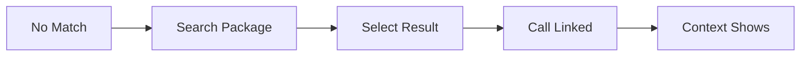
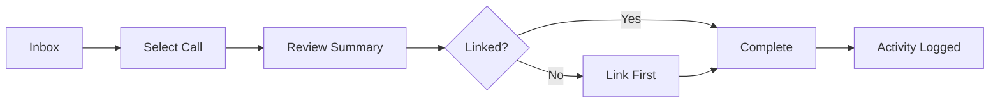
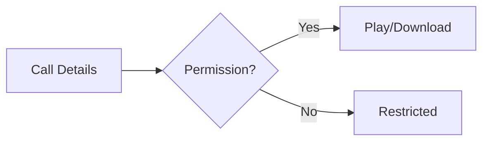

> **[View Mockup](/mockups/calls-uplift/index.html)**{.mockup-link}

# Feature Specification: Calls Uplift - Call Bridge UI

**Epic Code**: CALLS-UPLIFT
**Created**: 2026-02-05
**Status**: Draft
**Input**: Idea Brief + Research Document

## Overview

Care partners at Trilogy Care make hundreds of calls daily to recipients, care circle contacts, and suppliers. Currently, **66% of these calls are not linked to packages**, resulting in lost revenue from unattributed care management time.

This specification defines a **Call Bridge UI** - an in-app interface that provides coordinators with package context during calls, enables easy call-to-package linking, and automatically captures call time as care management activity.

---

## User Types

| User Type                               | Aircall Account | Capabilities                                                                                      |
| --------------------------------------- | --------------- | ------------------------------------------------------------------------------------------------- |
| **Internal Care Partner**               | Yes             | Make/receive calls, Call Bridge UI, Calls Inbox, complete Call Reviews, log activities, add notes |
| **Internal Coordinator**                | Yes             | Same as Care Partner                                                                              |
| **External Coordinator (no Aircall)**   | No              | View-only call history on packages they coordinate                                                |
| **External Coordinator (with Aircall)** | Yes             | Full capabilities - same as Internal Coordinator                                                  |
| **Team Leader**                         | Yes             | All coordinator capabilities + view team's calls + complete reviews on behalf + access call recordings for QA/training |

**Key Distinction:**

- Coordinator capabilities are tied to **Aircall account**, not internal/external status
- Team leader inbox access is **role-based** (team leader permission), regardless of Aircall account
- If an external coordinator has an Aircall line → they get full Call Reviews, notes, activity logging
- This creates **stickiness** - bring provider coordinators onto the system for better oversight

**Strategic Value:**

- External coordinators with Aircall lines = full visibility into their communication
- Oversight of provider organisation activity on packages
- Encourages adoption of Trilogy's telephony infrastructure

---

## User Scenarios & Testing

### User Story 1 - View Package Context During Call (Priority: P2 - Phase 2)

As a care coordinator, when I receive or make a call that matches a known phone number, I want to immediately see the associated package details so I can provide informed care without searching.

**Why this priority**: This is the core value proposition - reducing the 66% untagged call rate by automatically showing context. Coordinators currently waste time searching for package information while on calls.

**Independent Test**: Can be tested by triggering a call to a known package phone number and verifying the context panel appears with correct recipient information.

**Acceptance Scenarios**:

1. **Given** a coordinator is logged into the Portal, **When** they receive an inbound call from a phone number matching a package's care circle contact, **Then** a call notification banner appears showing the recipient's name, package number, and key details within 3 seconds.
2. **Given** a coordinator initiates an outbound call to a number matching a package contact, **When** the call connects, **Then** the call context panel displays the package overview including recent notes and open tasks.
3. **Given** a call is matched to multiple packages (shared phone number), **When** the context panel loads, **Then** the coordinator sees a list of matching packages and can select the correct one.
4. **Given** no package match is found for the caller's phone number, **When** the call begins, **Then** the panel shows "No package match found" with a search option.

---

### User Story 2 - Manually Link Unmatched Calls (Priority: P1 - Phase 1)

As a care coordinator or care partner, when a call doesn't automatically match a package, I want to quickly search and link it so the call is properly attributed for billing and activity tracking.

**Why this priority**: Fallback mechanism when auto-matching fails. Critical for achieving the 95%+ attribution target since not all phone numbers will be in the system.

**Independent Test**: Can be tested by making a call from an unknown number and using the search feature to find and link the correct package.

**Acceptance Scenarios**:

1. **Given** a call with no automatic package match, **When** the coordinator clicks "Link to Package", **Then** a search interface appears allowing search by recipient name, package number, or TC customer number.
2. **Given** the coordinator searches for a package, **When** they select the correct package from results, **Then** the call is immediately linked and the context panel updates to show package details.
3. **Given** a coordinator links a call to a package, **When** a future call arrives from the same phone number, **Then** the previously-linked entity appears at the top of the match list (highlighted as suggested) but the coordinator must still explicitly select it.

**Flow:**

---

### User Story 3 - Complete Call Reviews from Inbox (Priority: P1 - Phase 1)

As a care coordinator, I want to review my calls in an inbox after transcriptions are available, so I can complete "Call Reviews" efficiently and ensure all my call time is properly attributed.

**Why this priority**: Directly addresses revenue loss from unattributed time. The inbox workflow allows coordinators to review calls with transcriptions, either immediately via flash alerts or in batches at their convenience.

**Independent Test**: Can be tested by completing a call, waiting for transcription, viewing it in the Calls Inbox, and completing a Call Review.

**Acceptance Scenarios**:

1. **Given** a call has ended and transcription is available, **When** the coordinator opens their Calls Inbox, **Then** the call appears with transcription text, duration, caller info, and linked package (if matched).
2. **Given** a coordinator views a call in the inbox, **When** they click "Complete Call Review", **Then** the call duration (adjustable, defaults to full Aircall duration + 15 min wrap-up time) is logged as a care management activity and the call is marked as reviewed.
3. **Given** a coordinator has multiple unreviewed calls, **When** they open the Calls Inbox, **Then** they can review calls one-by-one from the list, or select multiple linked calls and use "Complete All" to mark them as reviewed in one action.
4. **Given** a call is NOT linked to any package, **When** the coordinator completes a Call Review, **Then** they are prompted to link it to a package first, or mark as "Non-package call".
5. **Given** a coordinator prefers immediate review, **When** a new call transcription arrives, **Then** they receive a flash alert with option to review immediately.

**Flow:**

---

### User Story 4 - Add Call Notes (Priority: P2)

As a care coordinator, I want to add a summary note during or after a call so important information is captured while fresh in my memory.

**Why this priority**: Enhances existing notes functionality by integrating with calls. Notes are already core to coordinator workflow, this reduces context switching.

**Independent Test**: Can be tested by making a call, adding a note, and verifying it appears in the package notes section.

**Acceptance Scenarios**:

1. **Given** a coordinator is on an active call linked to a package, **When** they enter text in the "Call notes" field, **Then** the text is auto-saved every 30 seconds.
2. **Given** a call ends with notes entered, **When** the call context panel closes, **Then** the notes are saved as a package note tagged with "Phone Call" and the call timestamp.
3. **Given** a coordinator is viewing a package's notes, **When** they see a call-related note, **Then** it shows the call duration, direction (inbound/outbound), and linked recording if available.

---

### User Story 5 - Access Call Recordings (Priority: P3)

As a care coordinator or team leader, I want to access call recordings for training, dispute resolution, or quality assurance purposes.

**Why this priority**: Recordings are already stored (7-year compliance requirement). This exposes existing functionality through a better interface.

**Independent Test**: Can be tested by navigating to a past call and successfully playing the recording.

**Acceptance Scenarios**:

1. **Given** a coordinator views a past call in the package timeline, **When** they click "Play recording", **Then** an audio player loads and plays the call recording.
2. **Given** a call recording is available, **When** the coordinator views call details, **Then** they see the recording duration and can download the audio file.
3. **Given** a user without recording access permission views a call, **When** they attempt to play the recording, **Then** they see "Recording access restricted" message.

**Flow:**

---

### User Story 6 - View Call History (External Coordinators) (Priority: P2)

As an external coordinator, I want to view call history on packages I coordinate so I can see what communication has occurred even though I don't have an Aircall account.

**Why this priority**: External coordinators need visibility into package communication for continuity of care, but they cannot make/receive calls through the system.

**Independent Test**: Can be tested by logging in as an external coordinator and viewing the call history section on an assigned package.

**Acceptance Scenarios**:

1. **Given** an external coordinator views a package they coordinate, **When** they navigate to the call history section, **Then** they see a list of past calls with date, duration, direction, and caller/recipient info.
2. **Given** an external coordinator views call history, **When** they click on a call record, **Then** they see call details but NOT the Calls Inbox or Call Review options.
3. **Given** an external coordinator without recording permissions views a call, **When** they attempt to access the recording, **Then** they see "Recording access restricted" message.

---

### Edge Cases

- **User without Aircall account accesses Calls Inbox**: Show friendly error state prompting user to link/attach their Aircall account. Not a hard block — the page loads but shows an empty state with CTA to connect Aircall.
- **Multiple packages sharing the same phone number**: Display a selection list; remember the coordinator's most recent choice for that number.
- **Coordinator receives calls while already on a call**: Queue additional call notifications; show "2 active calls" indicator.
- **Network interruption during call**: Persist call context locally; sync notes and activity when connection resumes.
- **Call transferred between coordinators**: Original coordinator's time is logged; receiving coordinator sees fresh context panel.
- **Very short calls (under 30 seconds)**: Still log as activity but flag for review if unusually high frequency.
- **Coordinator declines to link a call**: Call remains in unlinked history; can be linked later from call log.
- **Transcription never arrives (Graph timeout)**: After 24 hours in `pending_transcription`, auto-transition to `pending_review`. Coordinator can review and link the call without a transcript. Show "Transcription unavailable" indicator.

---

## Requirements

### Functional Requirements

**Call Detection & Context**

- **FR-001**: System MUST detect when a coordinator is on an active call within 5 seconds of the call starting.
- **FR-002**: System MUST display package context for calls matching a known phone number in the recipient's care circle.
- **FR-003**: System MUST allow coordinators to manually search and link calls to packages when no automatic match exists.
- **FR-004**: System MUST handle calls matching multiple packages by presenting a selection interface.

**Activity Capture**

- **FR-005**: System MUST automatically log call duration as care management activity when a call is linked to a package.
- **FR-006**: System MUST attribute call activities to the coordinator who handled the call.
- **FR-007**: System MUST track both inbound and outbound call direction in activity records.
- **FR-008**: System MUST NOT create duplicate activities for the same call.

**Notes Integration**

- **FR-009**: System MUST allow coordinators to add notes during an active call.
- **FR-010**: System MUST auto-save call notes to prevent data loss.
- **FR-011**: System MUST tag call-generated notes with the associated call metadata (date, duration, direction).

**Recordings**

- **FR-012**: System MUST provide access to call recordings for authorised users.
- **FR-013**: System MUST respect recording access permissions based on user roles.
- **FR-014**: System MUST retain call recordings for 7 years per aged care compliance requirements.

**Call Review Workflow**

- **FR-015**: System MUST record activity duration as Aircall call duration (fixed, not editable) + wrap-up time (defaults to 15 minutes, adjustable by coordinator before completing review).
- **FR-016**: System MUST support 6 review statuses: pending_transcription → pending_review → in_review → reviewed | archived | escalated.
- **FR-017**: System MUST auto-transition calls from pending_transcription to pending_review after 24 hours if no transcription arrives. Fallback: poll Graph/Aircall API.
- **FR-018**: System MUST prevent concurrent reviews by tracking in_review status (lock to reviewing coordinator).
- **FR-019**: System MUST support escalation to a specific team leader with a required note. Escalated TL receives toast + browser push notification.
- **FR-020**: System MUST pre-populate AI-suggested case note (from Graph) in an editable field during review. Nothing saved until explicit confirm.
- **FR-037**: System MUST display AI-suggested tasks (from Graph) in the call review drawer below the AI summary section.
- **FR-038**: System MUST allow Care Partners to instantly create a task from a suggested task by clicking the add (+) button. Task is created immediately linked to the call's package.
- **FR-039**: System MUST support regenerating AI content (summary, case note, and suggested tasks) via a "Regenerate" button. Regeneration calls Graph to re-process the transcription.
- **FR-040**: System MUST store AI-suggested tasks as JSON on the call_transcriptions table so suggestions persist across page loads.

**Team Leader Capabilities**

- **FR-021**: Team leaders MUST be able to view all their team members' calls in the inbox, filterable by coordinator.
- **FR-022**: Team leaders MUST be able to complete reviews on behalf of coordinators. Review attributed to TL as `reviewed_by`.
- **FR-023**: Team leader inbox access MUST be role-based (team leader permission), not requiring Aircall account.

**Entity Linking**

- **FR-024**: System MUST support linking calls to Packages, Coordinator profiles, and Provider profiles via polymorphic `aircall_aircallables` pivot.
- **FR-025**: System MUST provide unified search across all linkable entity types, with results grouped by type.
- **FR-026**: System MUST show previously-linked entity at top of match list for repeat phone numbers (suggested, not auto-linked).

**Navigation & Notifications**

- **FR-027**: System MUST display a badge with total pending_review count in the top navigation bar.
- **FR-028**: System MUST provide a sidebar menu item for the full Calls Inbox page.
- **FR-029**: System MUST deliver flash alerts via in-app toast AND browser push notification when transcriptions arrive.

**Integration**

- **FR-030**: System MUST receive transcription data from Trilogy Graph webhook (Graph owns the API contract).
- **FR-031**: System MUST display call history in the package timeline alongside other activities.
- **FR-032**: System MUST show missed calls in the inbox with follow-up indicators (exact UX deferred to design).

**Inbox Filtering**

- **FR-033**: System MUST support filtering by: review status, date range, direction (in/out), linked/unlinked.
- **FR-034**: System MUST support sorting by: date (default newest first), duration.
- **FR-035**: System MUST support search by phone number or package/entity name.
- **FR-036**: System MUST allow batch "Complete All" for multiple linked calls (no individual review in batch mode).

### Key Entities

- **Call Record**: Represents a phone call with direction (inbound/outbound), duration, timestamps, participants, and optional recording reference.
- **Call-Entity Link**: Association between a call and one or more entities (packages, coordinator profiles, or provider profiles) via polymorphic `aircall_aircallables` pivot, including confidence level (auto-matched vs manual) and timestamp.
- **Call Activity**: Care management activity generated from a linked call, including duration, coordinator attribution, and billing eligibility.
- **Call Note**: Package note generated from call context, tagged with call metadata for traceability.

---

## Success Criteria

### Measurable Outcomes

- **SC-001**: Call attribution rate increases from 34% to 95%+ within 3 months of launch.
- **SC-002**: Coordinators can view package context within 3 seconds of a call connecting.
- **SC-003**: Coordinators can link an unmatched call to a package in under 10 seconds using search.
- **SC-004**: 100% of linked calls automatically generate care management activities.
- **SC-005**: Call notes are successfully saved (no data loss) in 99.9% of attempts.
- **SC-006**: Coordinator time spent context-switching between Aircall and Portal reduces by 80%.
- **SC-007**: Care management revenue attributed to phone calls increases proportionally with improved attribution rate.

---

## Out of Scope

The following items are explicitly excluded from this specification:

- AI-powered call transcription and sentiment analysis *on Portal side* (future phase). Note: displaying Graph-provided AI summaries, suggested case notes, and suggested tasks IS in scope
- Real-time call coaching or prompts
- Outbound call initiation from within Portal (coordinators continue using Aircall)
- Changes to Aircall configuration or phone system setup
- Reporting dashboards for call metrics (separate initiative)
- Mobile app call integration (desktop Portal only for MVP)

---

## Dependencies

| Dependency                        | Owner              | Status   | Notes                         |
| --------------------------------- | ------------------ | -------- | ----------------------------- |
| Trilogy Graph phone matching API  | Graph Team         | Ready    | Required for auto-matching    |
| Care Management Activities module | CM Activities Epic | Complete | Activity creation hooks exist |
| Package Notes functionality       | Work Management    | Complete | Notes infrastructure ready    |
| Call recording S3 storage         | Infrastructure     | Complete | 7-year retention in place     |
| Aircall account provisioning      | Operations         | Not started | External coordinators/providers don't have Aircall accounts yet — need provisioning workflow |

---

## Clarifications

### Session 2026-02-05

- Q: When a call matches multiple packages (shared phone number), how should the coordinator choose? -> A: **Show list, always ask** - Display all matching packages every time, never auto-suggest based on history.
- Q: When should care management activity be logged for a call? -> A: **Post-call review workflow** - After calls end, a transcription event arrives. Calls appear in a "Calls Inbox" where coordinators review them (with transcription) and complete a "Call Review" to log the activity. Some may do this immediately (flash alert), others batch review.
- Q: Should the Call Bridge UI show context during the call, or is this primarily a post-call review workflow? -> A: **Both** - Show package context during the call AND have an inbox for post-call review with transcription.
- Q: What's the primary name for when a coordinator reviews a call and logs it? -> A: **Call Review** - The action of reviewing a call and logging it as activity.
- Q: What can external coordinators (without Aircall accounts) do with calls? -> A: **View-only call history** - They can see call records on packages they coordinate, but no Calls Inbox, no Call Reviews, no activity logging.
- Q: What if an external coordinator gets an Aircall line? -> A: **Full capabilities** - Capabilities are tied to Aircall account, not internal/external status. If they have an Aircall line, they get full Call Reviews, notes, activity logging. This creates stickiness and gives TC oversight of provider communication.

### Session 2026-02-25

- Q: What happens when Graph is down or a transcription never arrives? How long should a call stay in 'pending_transcription'? -> A: **24 hours** - After 24h with no transcription, auto-transition to pending_review so coordinators can still review and link the call without a transcript. Backup strategy: poll Graph for transcription status as fallback when webhook delivery fails.
- Q: How should call duration map to care management activity? -> A: **Fixed call duration + adjustable wrap-up** - Call duration comes from Aircall and is fixed (not editable). Wrap-up time defaults to 15 minutes and is the only adjustable component. Total activity time = Aircall duration + wrap-up time. Map to existing 'Phone Call' activity type.
- Q: What's the Graph dependency status for Phase 1? -> A: **Graph ready now** - Transcription webhook and phone matching API are available. No dependency blocker for Phase 1.
- Q: What are the event sources for call data? -> A: **Two sources** - (1) Aircall webhooks for call events (already integrated, existing `app/Jobs/Aircall/Webhooks/Call/`), and (2) Graph webhooks for transcriptions. Aircall webhooks can also be used as a fallback/trigger source alongside Graph.
- Q: Does Graph provide AI summaries, or is that a future feature? -> A: **Graph provides them** - Graph's transcription webhook includes AI-generated summary and suggested case note. We display them in the review UI. We should also retain the ability to re-run/regenerate summaries ourselves if needed (e.g. different prompt, updated model). Update: AI transcription/sentiment is out of scope for *Portal-side processing*, but *displaying* Graph-provided AI output is in scope.
- Q: Can team leaders see and act on their team's calls, or only their own? -> A: **Team view + act on behalf** - Team leaders can see all their team members' calls in the inbox (filter by coordinator). They can also complete reviews on behalf of coordinators. The review is attributed to the team leader as `reviewed_by`.
- Q: How does the transcription flow work between Aircall and Graph? -> A: **Aircall notifies, Graph delivers** - Aircall fires a webhook when transcription is *ready* (notification only — you then need to fetch it). Graph handles the collection and inserts the transcription directly into our system via its own webhook. Primary flow: Graph webhook delivers transcription payload. Fallback: if Graph misses it, we can poll Aircall's API to fetch the transcription ourselves.
- Q: Should team leader inbox access require an Aircall account? -> A: **Role-based for TLs** - Team leaders get Calls Inbox access via their team leader role/permission, regardless of whether they have an Aircall account. Coordinators still require an Aircall account. This means TLs without Aircall can view team calls AND complete reviews on behalf.
- Q: What notification channel for flash alerts? -> A: **In-app toast + browser push** - Toast notification within Portal UI AND browser push notification (even when Portal tab is in background). Requires notification permission grant from user.
- Q: How should access control work overall? -> A: **Permissions-based** - Most features gated by permissions, not Aircall account check. Users without an Aircall account see a friendly error state prompting them to link/attach their Aircall account (not a hard block on the page itself).
- Q: How should AI case note creation work during Call Review? -> A: **Auto-populate, edit before save** - AI suggested case note pre-fills in an editable text field during the review flow. Coordinator can edit freely. Nothing is saved until they explicitly confirm. They can also clear it entirely if no case note is needed.
- Q: How should batch review work? -> A: **Quick mark reviewed** - Select multiple calls → one-click 'Complete All'. All calls get activity auto-logged with their respective durations (+15 min wrap-up). No individual transcription review in batch mode. Calls must already be linked to packages to batch-complete (unlinked calls require individual review).
- Q: Where does the Calls Inbox live in Portal navigation? -> A: **Both** - Badge icon with unreviewed count in the top navigation bar (like a notification bell) for quick access + a sidebar menu item under an existing section for the full page. Badge links to the same inbox page.
- Q: What can calls be linked to beyond packages? -> A: **Extensible linking (future)** - MVP links calls to packages only. Future: calls could be linked to Threads (future concept) or Tasks when those features exist. Design the linking mechanism to be extensible (polymorphic or suggested actions pattern) so new link targets can be added later. Note: "Suggested Actions" concept — after a call, the system could suggest actions like "Create task", "Link to thread", "Follow up" based on the transcription content.
- Q: How should missed calls be handled in the Calls Inbox? -> A: **In inbox, exact UX deferred to design** - Missed calls are in scope for Phase 1. They should appear in the Calls Inbox with a missed indicator and follow-up tracking. Whether they appear as flagged items in the main list or in a separate tab is a UX decision for the design phase. FR-017 stays.
- Q: What happens when a call is marked 'Non-package'? -> A: **Multi-modal linking + archive** - Calls are multi-modal: they can be linked to Packages, Coordinator profiles, or Provider profiles (not just packages). Providers have users/contacts that coordinators speak to regularly. The existing `aircall_aircallables` polymorphic pivot already supports this multi-entity linking. If a call doesn't relate to any entity, the coordinator can **archive** it (removes from inbox, marked as archived). No reason/category required for archive — just a clean dismiss.
- Q: What filtering/sorting should the Calls Inbox have in Phase 1? -> A: **Standard filters** - Filter by: review status (pending/reviewed/archived), date range, direction (inbound/outbound), linked/unlinked. Sort by: date (newest first default), duration. Search by phone number or package name. Team leaders additionally filter by coordinator.
- Q: Should future calls auto-match based on previous manual links? -> A: **Suggest but don't auto-link** - Show the previously-linked entity at the top of the match list (highlighted as suggested) but still require explicit selection. Resolves contradiction between US02 (suggested matching) and clarification #1 (always show list). Updates: US02-AC3 updated to "suggested at top" rather than "auto-match".
- Q: What UI component for the Calls Inbox? -> A: **CommonTable** - Use the existing `CommonTable` component for the inbox list view. Standard table UI with columns, sorting, filtering — already established in the Portal.
- Q: What does the Calls Inbox badge count represent? -> A: **Total pending** - Badge shows total count of all calls in `pending_review` status. Simple number. No distinction between new/unseen and pending. Clicking goes to the inbox page.
- Q: What review statuses should exist? -> A: **6 states** - `pending_transcription` → `pending_review` → `in_review` → `reviewed` | `archived` | `escalated`. The `in_review` state tracks when a coordinator has opened/started reviewing a call (prevents two people reviewing same call). `escalated` is for calls that need team leader attention (e.g. complex cases, complaints, sensitive content). Replaces old `non_package` with `archived`. If coordinator closes without completing, reverts to `pending_review`.
- Q: How does the escalation flow work? -> A: **Escalate + assign to TL** - Coordinator selects a specific team leader from a dropdown, adds a note explaining why (required). Call moves to `escalated` status with `escalated_to` (user FK) and `escalation_note`. The assigned TL receives a notification (toast + browser push). Call appears in the TL's personal queue. TL can then review, complete, or reassign.
- Q: What should the entity linking search look like? -> A: **Unified search with note** - Single search box that searches across Packages, Coordinators, and Providers. Results grouped by type with type badges. When selecting an entity to link, coordinator can also add a note (optional) explaining the link context. Could potentially reuse the existing global search infrastructure. If unified search has performance issues, can fall back to package-only search for MVP.
- Q: Who owns the Graph webhook contract? -> A: **Graph owns the contract** - Graph team defines the webhook payload schema. Portal adapts to whatever they send. Add a reference/link to Graph API docs in the spec rather than defining the payload ourselves.
- Q: What's the feature flag rollout strategy? -> A: **By user, then by team** - Start with `calls-inbox-v1` flag scoped to individual users (beta testers). Eventually use the Team construct to roll out by team/pod. PostHog flag targeting: user-level first, team-level when the Team entity is available for flag targeting.

### Session 2026-02-27

- Q: The spec title/overview references "Call Bridge UI" but design pivoted to Calls Index only. Should we narrow the spec scope? -> A: **Leave as-is** - Keep the full spec including Call Bridge UI content for future phases. Design can narrow to MVP but spec stays comprehensive.
- Q: Where are transcriptions stored? Graph provides them via webhook. -> A: **Store locally in Portal DB** - Save transcription text + AI case note to Portal's database when received from Graph webhook. Ensures availability even if Graph is down. Enables search/indexing.
- Q: Can coordinators adjust call duration in the review? -> A: **Only wrap-up time** - Call duration from Aircall is fixed and not editable. Wrap-up time (default 15 min) is the only adjustable component. Distinct difference: call time vs wrap-up time. Total activity = Aircall duration + wrap-up.

### Session 2026-03-05 (Task Integration)

- Q: Can tasks be generated from calls? → A: **Yes** — Graph provides AI-suggested tasks alongside summary and case note in the transcription webhook payload. Tasks appear in the call review drawer as actionable items.
- Q: Where do the AI-suggested tasks come from? → A: **Graph provides them** — Graph's transcription webhook includes suggested tasks alongside summary and case note. Portal just displays and allows adding them.
- Q: What happens when a Care Partner clicks + on a suggested task? → A: **Instant create** — Task is immediately created in the Tasks system, linked to the call's package. No modal, no extra fields.
- Q: Should REGENERATE also regenerate suggested tasks? → A: **Everything** — Regenerate refreshes summary + case note + suggested tasks together.

### Key Terminology Update

| Term            | Definition                                                                                                     |
| --------------- | -------------------------------------------------------------------------------------------------------------- |
| **Call Review** | The action a coordinator performs to review a call (with transcription) and log it as care management activity |
| **Calls Inbox** | A queue where pending calls await review after transcription is available (CommonTable-based UI)               |
| **Escalation**  | Coordinator assigns a call to a specific team leader for review, with a required note                         |
| **Archive**     | Dismiss a call that doesn't relate to any entity (package, coordinator, or provider)                          |
| **Wrap-up Time** | 15 minutes added by default to call duration to account for post-call admin work                             |

---

## User Flow Diagram

See [`user-flows.md`](./user-flows) for visual flow diagrams covering all user stories.

**Quick Reference:**

- **Phase 1 MVP**: Call Ends → Transcription → Inbox → Review → Link → Activity
- **Phase 2 Full**: Call Starts → Context Panel → Notes → Call Ends → Review → Activity

---

## Related Documents

- [Idea Brief](IDEA-BRIEF)
- [Research Document](context/raw_context/RESEARCH-2026-02-05)
- [User Flows](user-flows)
- [Domain Doc: Telephony](/context/domains/calls)

## Clarification Outcomes

### Q1: [Scope] What is a "Call Bridge UI" in TC Portal context?
**Answer:** Per the extensive clarification sessions documented in this spec, the Call Bridge UI has two phases: **Phase 1 (MVP):** A Calls Inbox (CommonTable-based) where coordinators review calls post-transcription, complete "Call Reviews" to log activity, and link calls to packages. **Phase 2:** A real-time call context panel that shows package information during active calls. It is NOT click-to-call or an embedded softphone -- coordinators continue using Aircall for calling. The Portal provides context display and post-call review workflows.

### Q2: [Dependency] How does Aircall integration here relate to other epics?
**Answer:** The codebase already has significant Aircall integration: `app-modules/aircall/src/Models/AircallCall.php`, `app-modules/aircall/src/Providers/AircallServiceProvider.php`, `config/aircall.php`, and webhook jobs at `app/Jobs/Aircall/Webhooks/Call/`. **Aircall webhooks are already integrated.** This epic extends that foundation with: transcription display (from Graph), call review workflow, and activity logging. The spec is well-clarified through 4 sessions (2026-02-05, 02-25, 02-27, 03-05). **No coordination with DOC needed** -- call recordings are already stored with 7-year retention.

### Q3: [Data] What metadata is captured? Does it match CAP contact tracking?
**Answer:** Per the spec, call metadata includes: direction (inbound/outbound), duration (from Aircall, fixed), wrap-up time (15 min default, adjustable), participants, recording reference, transcription text, AI summary, AI suggested case note, AI suggested tasks, linked entity (package/coordinator/provider via `aircall_aircallables` polymorphic pivot), review status (6 states), and reviewer attribution. **This is significantly richer than CAP's contact attempt tracking.** CAP tracks contact attempts (method, outcome, notes) for compliance. Calls Uplift tracks the full call lifecycle. **CAP should consume Calls Uplift data** for its contact tracking requirements rather than maintaining a separate logging mechanism.

### Q4: [Edge Case] What happens when Aircall is down?
**Answer:** The clarification sessions address Graph downtime (24-hour timeout for transcription, auto-transition to `pending_review`) but do not address Aircall service outage. If Aircall is down, calls simply don't happen through the system. Existing calls already in the inbox continue to be reviewable. **The only gap is new call events not arriving.** The `pending_transcription` -> `pending_review` auto-transition after 24 hours handles delayed transcription gracefully. **Manual call logging is not in scope** -- that would be CAP's territory.

### Q5: [UX] Who uses the system -- Care Partners, Coordinators, or both?
**Answer:** The spec's User Types table clearly defines this: Internal Care Partners (Yes Aircall = full access), Internal Coordinators (Yes Aircall = full access), External Coordinators without Aircall (view-only call history), External Coordinators with Aircall (full access), Team Leaders (full + team view + QA). **Both Care Partners and Coordinators use the system.** The Calls Inbox lives in both the top navigation (badge count) and sidebar navigation. The spec is thoroughly clarified on this point.

### Q6: [Integration] What is the Graph dependency and contract?
**Answer:** Per clarification: "Graph owns the contract" -- Graph team defines the webhook payload schema for transcriptions, AI summaries, suggested case notes, and suggested tasks. Portal adapts to whatever Graph sends. Primary flow: Graph webhook delivers transcription payload. Fallback: poll Aircall API if Graph misses it. **Portal stores transcriptions locally in the `call_transcriptions` table** for availability even if Graph is down.

## Refined Requirements

This spec is among the most thoroughly clarified in the portfolio (4 sessions documented). The key requirements to highlight:

1. **The existing `app-modules/aircall/` module provides a solid foundation** -- this is an extension, not a greenfield build.
2. **CAP should consume Calls Uplift call data** for its contact tracking requirements rather than building a separate logging mechanism.
3. **Activity logging must use the shared CMA activity infrastructure** -- `Phone Call` activity type with Aircall duration + wrap-up time.
4. **Feature flag rollout strategy is defined:** `calls-inbox-v1` flag, user-level first, then team-level via PostHog targeting.
5. **Task integration is confirmed:** Graph provides AI-suggested tasks in the transcription webhook; instant-create with + button, linked to call's package.
