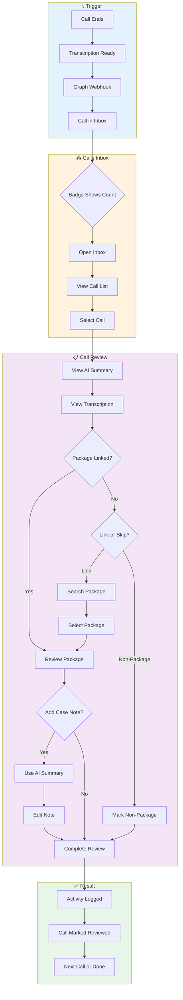
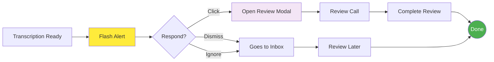
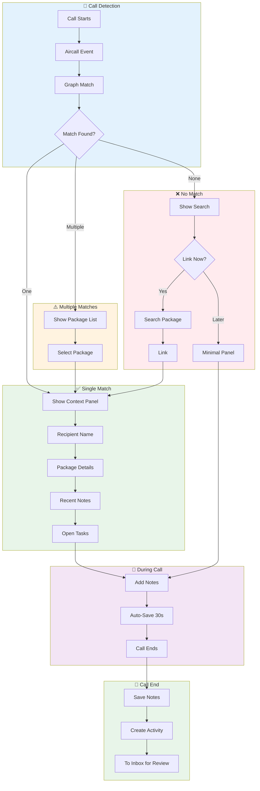
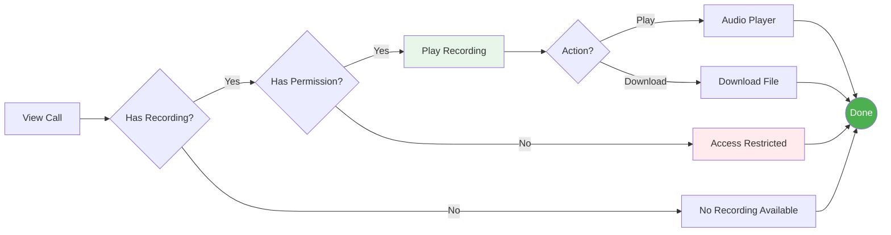
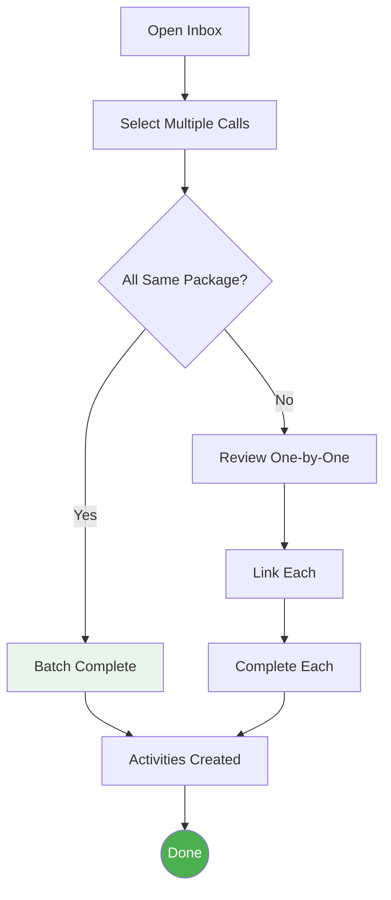
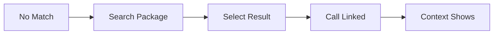
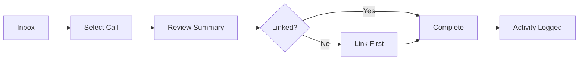
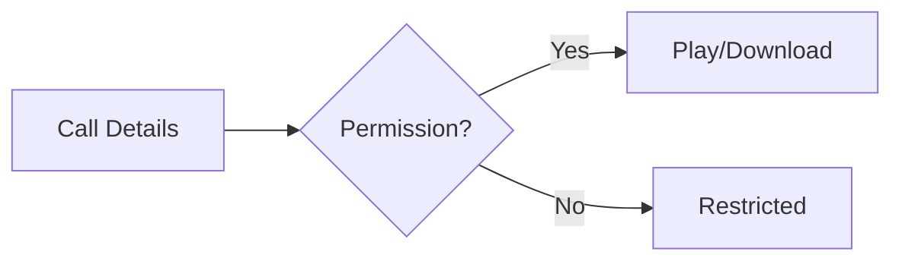
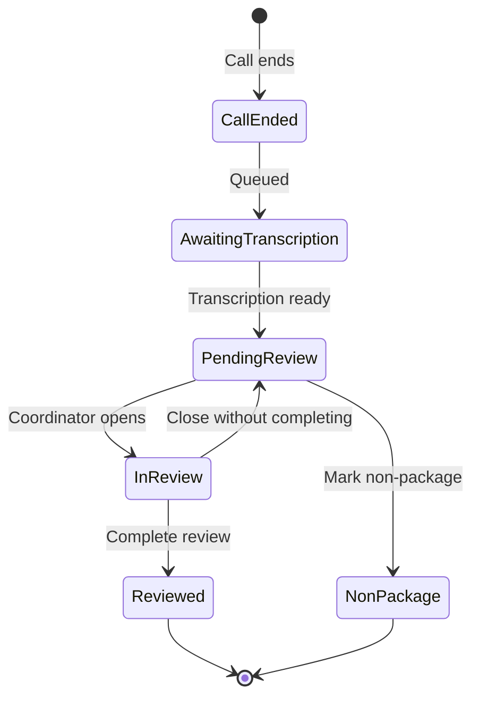

# User Flow Diagrams: Calls Uplift

## Flow Overview

| Flow | Phase | Stories Covered | Primary Actor |
|------|-------|-----------------|---------------|
| [Call Review Flow](#flow-1-call-review-inbox-phase-1) | Phase 1 | US02, US03 | Care Coordinator |
| [Flash Alert Flow](#flow-2-flash-alert-immediate-review) | Phase 1 | US03 | Care Coordinator |
| [Call Bridge Flow](#flow-3-call-bridge-context-phase-2) | Phase 2 | US01, US04 | Care Coordinator |
| [Recording Access Flow](#flow-4-recording-access) | Phase 2 | US05 | Coordinator / Team Lead |

---

## Flow 1: Call Review Inbox (Phase 1)

**Primary Path**: Coordinator reviews calls from inbox after transcription arrives



**Decision Points:**

| Point | Options | Default |
|-------|---------|---------|
| Package Linked? | Yes → Review | Depends on auto-match |
| Link or Skip? | Link / Non-Package | Link (prompted) |
| Add Case Note? | Yes / No | Optional |

---

## Flow 2: Flash Alert (Immediate Review)

**Alternate Path**: Coordinator reviews immediately via flash notification



---

## Flow 3: Call Bridge Context (Phase 2)

**During-Call Path**: Coordinator sees context while on active call



**Decision Points:**

| Point | Options | Behavior |
|-------|---------|----------|
| Match Found? | One / Multiple / None | Always show list for multiple |
| Link Now? | Yes / Later | Can defer to inbox review |

---

## Flow 4: Recording Access

**Playback Path**: User accesses call recording



---

## Flow 5: Batch Review

**Efficiency Path**: Review multiple calls at once



---

## Story Coverage

| Story | Description | Flow(s) | Phase |
|-------|-------------|---------|-------|
| **US01** | View Package Context During Call | [Call Bridge Flow](#flow-3-call-bridge-context-phase-2) | P2 |
| **US02** | Manually Link Unmatched Calls | [Call Review Flow](#flow-1-call-review-inbox-phase-1), [Call Bridge Flow](#flow-3-call-bridge-context-phase-2) | P1 |
| **US03** | Complete Call Reviews from Inbox | [Call Review Flow](#flow-1-call-review-inbox-phase-1), [Flash Alert Flow](#flow-2-flash-alert-immediate-review), [Batch Review](#flow-5-batch-review) | P1 |
| **US04** | Add Call Notes | [Call Bridge Flow](#flow-3-call-bridge-context-phase-2) | P2 |
| **US05** | Access Call Recordings | [Recording Access Flow](#flow-4-recording-access) | P3 |

---

## Inline Flow Snippets (Per Story)

### US02: Manually Link Unmatched Calls



### US03: Complete Call Reviews from Inbox



### US05: Access Call Recordings



---

## State Transitions



---

## Error Paths

| Error | Flow Point | Handling |
|-------|------------|----------|
| Transcription fails | After call ends | Retry 3x, then manual entry option |
| Package search returns nothing | Link step | Suggest "Non-package" or create new contact |
| Activity creation fails | Complete review | Queue for retry, show warning |
| Recording unavailable | Playback | Show "Recording not available" message |
| Network offline | Any | Cache locally, sync when online |

---

## Path Summary

| Path Type | Count | Description |
|-----------|-------|-------------|
| Happy paths | 5 | Auto-match → Review → Activity logged |
| Alternate paths | 3 | Manual link, batch review, flash alert |
| Error paths | 5 | See error table above |
| Decision points | 8 | Match status, link choice, note addition |

---

## Quick Reference

**Phase 1 MVP Flow:**
```
Call Ends → Transcription → Inbox → Review → Link (if needed) → Complete → Activity
```

**Phase 2 Full Flow:**
```
Call Starts → Context Panel → Notes → Call Ends → Inbox → Review → Activity
```
