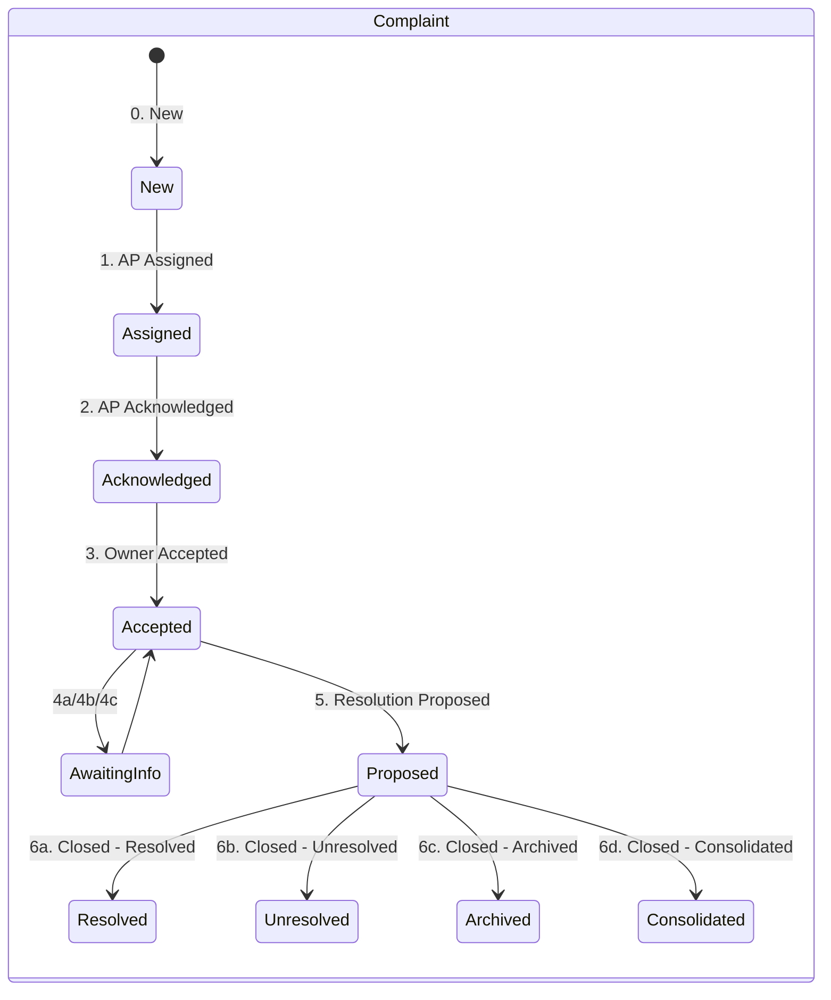
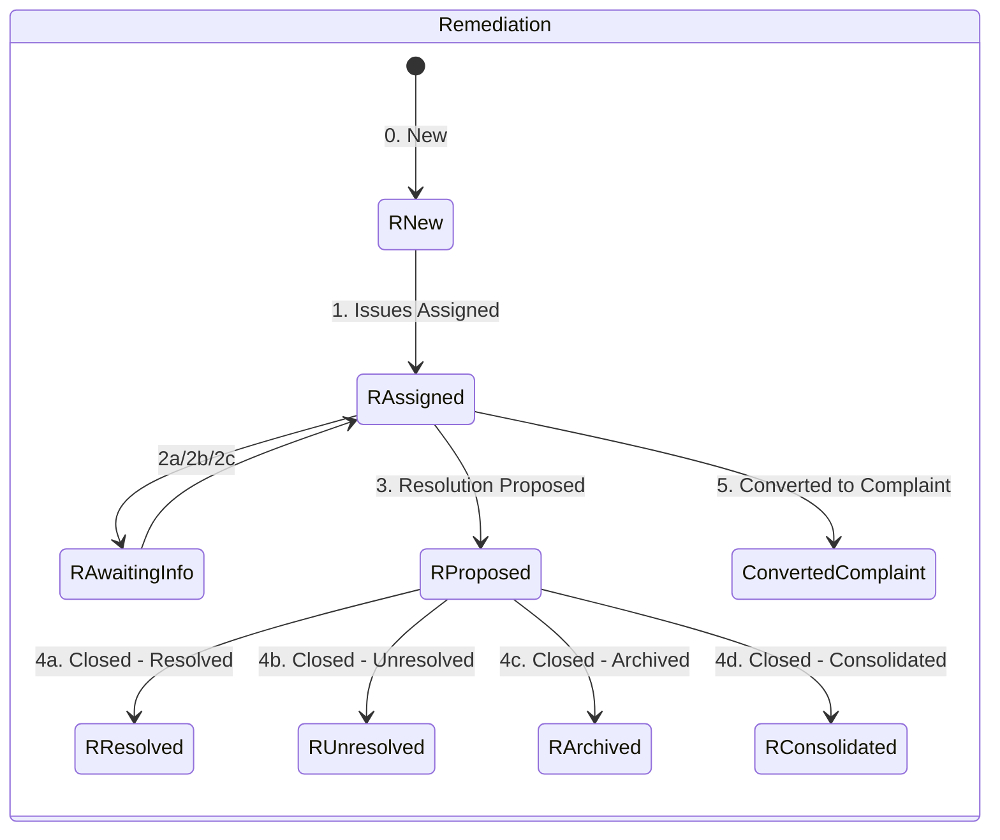
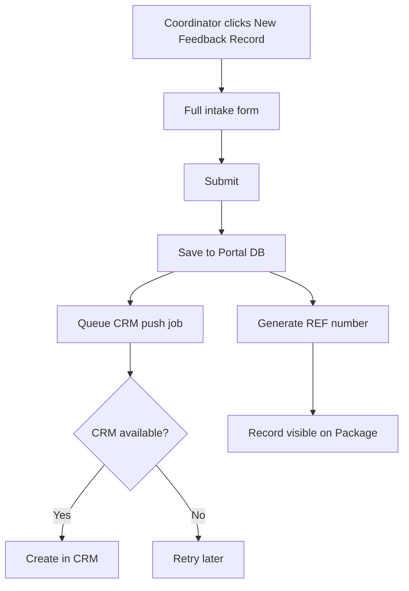
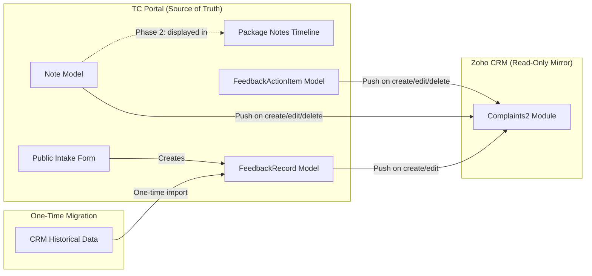
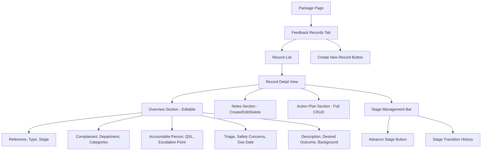

> **[View Mockup](/mockups/complaints-management/index.html)**{.mockup-link}

# Feature Specification: Feedback Records Management

**Feature Branch**: `feature/tri-100`
**Created**: 2026-02-26
**Status**: Approved (Gate 1 passed 2026-03-10)
**Linear**: [TRI-99](https://linear.app/trilogycare/issue/TRI-99/sync-notes-between-crm-complaints-and-portal), [TRI-100](https://linear.app/trilogycare/issue/TRI-100/joining-notes-sync-portal-notes-to-crm-complaints)

## Architecture Decision

**Portal is the source of truth for all feedback records.** The CRM (`Complaints2` module) becomes a read-only mirror. All creation, editing, stage management, and note writing happens on the Portal. Changes are pushed to the CRM in the background (non-blocking). There is no CRM→Portal sync, no webhooks, and no conflict resolution.

A one-time migration imports existing CRM records into the Portal. After migration, the CRM is never read from again.

## Phasing Strategy

### Phase 1 — Core Feedback Records Management (P1)

Build the full feedback records system on the Portal: create, view, edit, manage stages, write notes, manage action plans. Migrate existing CRM data. Push all changes to CRM as a read-only mirror.

**Includes**: User Stories 1, 2, 3, 4, 5, 6

### Phase 2 — Package Notes Integration (P2)

Integrate feedback record notes into the existing Package Notes timeline so that complaint activity is visible alongside regular client notes.

**Includes**: User Story 7

### Phase 3 — Public-Facing Intake Form (P2)

Build a public-facing form on the Portal for external complainants to submit feedback. Replaces the existing CRM-based public form.

**Includes**: User Story 8

### Why this phasing

Phase 1 delivers the full internal workflow — staff stop using the CRM for complaints entirely. Phase 2 embeds complaint context into the existing notes workflow. Phase 3 moves the public intake form to the Portal, completing the CRM exit.

## Terminology

The Portal uses **"Feedback Record"** as the generic term for all records in this domain. Each feedback record has a specific **Type** value:

| Term | Meaning |
|------|---------|
| **Feedback Record** | Generic Portal term — covers all types |
| **Complaint** | Specific Type — formal complaint with triage, Action Plan, and full lifecycle |
| **Remediation** | Specific Type — lighter-weight issue resolved at care partner level |
| **Feedback** | Specific Type — general feedback (future Phase) |
| **Compliment** | Specific Type — positive feedback (future Phase) |

## CRM Reference — Fields for Migration & Push

The CRM `Complaints2` module (CustomModule99) has 103 fields across 4 record types. Only Complaint and Remediation types are in scope. The field mapping below documents the fields that are actively used and should be migrated to the Portal and pushed back to CRM.

### Core Identity

| CRM Field | Type | Portal Field | Notes |
|-----------|------|--------------|-------|
| `Name` | autonumber | `reference` | REF-XXXXX format. Portal continues this sequence. |
| `Type` | picklist | `type` | Complaint, Remediation (in scope) |
| `Created_Date` | date | `date_received` | When the record was created |
| `Due` | date | `due_date` | Resolution due date (complaints only) |

### People & Ownership

| CRM Field | Type | Portal Field | Notes |
|-----------|------|--------------|-------|
| `Client` | lookup | `package_id` | Matched to Portal Package via Consumer zoho_id |
| `Complainant_Name` | text | `complainant_name` | Free text, may differ from Client name |
| `Complainant_Type` | picklist | `complainant_type` | Client (Self), Anonymous, Supporter, Coordinator, Supplier, Other, Registered Representative |
| `Accountable_Person` | userlookup | `accountable_person_id` | Portal User responsible for resolution |
| `Quality_Support_Lead` | userlookup | `quality_support_lead_id` | QA oversight person |
| `Escalation_Point` | userlookup | `escalation_point_id` | Escalation contact |

### Status & Classification

| CRM Field | Type | Portal Field | Notes |
|-----------|------|--------------|-------|
| `Stage` | picklist | `stage` | Complaint lifecycle: 0. New → 6d. Closed |
| `Remediation_Stages` | picklist | `stage` | Remediation lifecycle: 0. New → 5. Converted |
| `Triage_Category` | picklist | `triage_category` | Urgent, Medium, Standard (complaints only) |
| `Primary_Department` | picklist | `primary_department` | Care - Self-Managed, Accounts Payable, etc. |
| `Category_of_Concern_s` | multiselect | `categories` | Complaint categories |
| `Remediation_Issues_Categories` | multiselect | `categories` | Remediation categories (same values) |
| `Safety_Concerns` | picklist | `safety_concerns` | Yes/No |
| `Confidential_Complaint` | picklist | `confidential` | Yes/No |
| `Incident` | picklist | `linked_to_incident` | Yes/No/Unsure |
| `Source` | picklist | `source` | Verbal Report, Email Report, ORM Report, External Escalation Trigger, ACQSC |
| `Priority_Resolution` | boolean | `priority_resolution` | Fast-track flag |

### Content

| CRM Field | Type | Portal Field | Notes |
|-----------|------|--------------|-------|
| `Description_of_Concerns` / `Remediation_Issue_s_Description` | textarea | `description` | Single Portal field, CRM field varies by type |
| `Desired_Outcome` | textarea | `desired_outcome` | What complainant wants |
| `Background_Events_1` | textarea | `background` | Context/history |
| `Specific_Language_Used_1` | textarea | `specific_language` | Exact words used by complainant |

### Resolution

| CRM Field | Type | Portal Field | Notes |
|-----------|------|--------------|-------|
| `What_Caused_the_Issue` | picklist | `root_cause` | Root cause category |
| `Actions_Taken_to_Address_the_Concerns` | picklist | `resolution_action` | How it was addressed |
| `Actions_to_Prevent_Recurrence` | picklist | `prevention_action` | Future prevention |
| `Contributing_Details` | picklist | `contributing_details` | Contributing factors (41 values) |

### Stage Transition Timestamps

| CRM Field | Type | Portal Field |
|-----------|------|--------------|
| `Accountable_Person_Assigned` | datetime | `accountable_person_assigned_at` |
| `Accountable_Person_Acknowledged` | datetime | `accountable_person_acknowledged_at` |
| `Complaint_Owner_Accepted` | datetime | `complaint_owner_accepted_at` |
| `a_Closed_Resolved` | datetime | `closed_at` |

### Related Entities

| CRM Field | Type | Portal Model | Notes |
|-----------|------|--------------|-------|
| `Action_Plan` | subform | `FeedbackActionItem` | Fully managed on Portal |
| `Incident_Details` | lookup | `incident_id` | Link to Portal Incident if exists |
| `Consolidated_Complaint` | lookup | `parent_feedback_record_id` | If consolidated into another record |

### Stage Lifecycles

## User Scenarios & Testing

### User Story 1 — Create a Feedback Record (Priority: P1)

As a coordinator or operations staff member, I want to create a new complaint or remediation on the Portal so that all feedback is captured in one system.

**Why this priority**: Portal is source of truth. If staff can't create records here, they'll keep using the CRM.

**Independent Test**: Create a feedback record on the Portal and verify it appears on the package with all fields populated.

**Acceptance Scenarios**:

1. **Given** a coordinator is viewing a client's package, **When** they click "New Feedback Record", **Then** a creation form is presented with fields for: type (Complaint/Remediation), complainant details, description, categories, triage level, department, safety concerns, source, desired outcome, and background.

2. **Given** a coordinator fills out the creation form and submits, **When** the record is saved, **Then** a unique reference number (REF-XXXXX) is generated, the record is linked to the package, the stage is set to "New", the due date is auto-calculated based on the triage level, and the record appears in the feedback records list.

3. **Given** a coordinator creates a feedback record, **When** the record is saved, **Then** a background job pushes the record to the CRM. The CRM push is non-blocking — the Portal record is immediately usable regardless of CRM availability.

4. **Given** the CRM push fails (API unavailable), **When** the job retries, **Then** it retries up to 3 times over 24 hours. A "CRM sync pending" indicator is shown on the record but no Portal functionality is blocked.

---

### User Story 2 — View Feedback Records on a Package (Priority: P1)

As a coordinator reviewing a client's package, I want to see all feedback records so that I have full visibility of active and past complaints and remediations.

**Why this priority**: Foundation for everything else — staff need to see what exists.

**Independent Test**: View a package with feedback records and confirm the list displays correctly.

**Acceptance Scenarios**:

1. **Given** a client has one or more feedback records, **When** a coordinator views the client's package, **Then** they can see a list showing: reference number (REF-XXXXX), type (Complaint or Remediation), current stage, triage level (complaints only), accountable person, and date received.

2. **Given** a coordinator clicks on a feedback record in the list, **Then** the full detail view opens showing: description, desired outcome, background events, complainant details, department, categories of concern, safety concerns flag, source, and whether it is linked to an incident.

3. **Given** a package has no feedback records, **When** a coordinator views the package, **Then** an empty state is shown with a prompt to create a new record.

4. **Given** a feedback record has a "CRM sync pending" status, **Then** a small indicator shows this but the record is fully functional on the Portal.

---

### User Story 3 — Edit Feedback Record Fields (Priority: P1)

As a coordinator or accountable person, I want to edit feedback record details on the Portal so that records stay accurate as information becomes available.

**Why this priority**: Complaints evolve — triage may change, categories get refined, accountable person gets reassigned. Portal must support editing since it's the source of truth.

**Independent Test**: Edit a field on a feedback record and verify the change is saved and pushed to CRM.

**Acceptance Scenarios**:

1. **Given** a coordinator views a feedback record, **When** they edit a field (e.g., triage category, accountable person, categories, description), **Then** the change is saved immediately on the Portal and a background job pushes the update to the CRM.

2. **Given** a feedback record is edited, **When** the CRM push succeeds, **Then** the CRM record reflects the updated field values.

3. **Given** a feedback record is in a closed stage (6a-6d), **When** a coordinator attempts to edit it, **Then** editing is blocked unless the user has `manage-complaint-stages` permission (to reopen first).

---

### User Story 4 — Manage Feedback Record Stages (Priority: P1)

As a coordinator or accountable person, I want to advance a feedback record through its stage lifecycle on the Portal so that complaint resolution progresses without switching to the CRM.

**Why this priority**: Stage progression drives the complaint resolution workflow. If it only works in CRM, staff will keep using CRM.

**Independent Test**: Advance a feedback record through each stage and verify transitions, timestamps, and CRM push.

**Acceptance Scenarios**:

1. **Given** a feedback record is at stage "0. New", **When** a user with `manage-complaint-stages` permission advances it, **Then** the stage moves to the next valid stage and the transition timestamp is recorded automatically.

2. **Given** a complaint record is advanced to stage "1. Accountable Person Assigned", **Then** the `accountable_person_assigned_at` timestamp is set to the current time.

3. **Given** a feedback record is at a closed stage, **When** a user with `manage-complaint-stages` permission reopens it, **Then** the stage is reset to the appropriate active stage and the resolution timestamp is cleared.

4. **Given** a remediation is at stage "5. Converted to Complaint", **When** the conversion is confirmed, **Then** the record's type changes to "Complaint" and the stage workflow switches to the complaint lifecycle. Historical remediation data is preserved.

5. **Given** any stage change, **Then** a background job pushes the updated stage and timestamp to the CRM.

---

### User Story 5 — Write and Manage Notes on Feedback Records (Priority: P1)

As a coordinator, I want to write notes on feedback records so that investigation context is captured in one place.

**Why this priority**: Notes are the core communication tool for complaint resolution. This replaces the CRM note-writing workflow.

**Independent Test**: Create, edit, and delete a note on a feedback record and verify CRM push.

**Acceptance Scenarios**:

1. **Given** a coordinator views a feedback record, **When** they write a new note, **Then** the note is saved to the Portal and a background job pushes it to the CRM complaint record.

2. **Given** a feedback record has notes, **When** a coordinator views the record, **Then** all notes appear in chronological order showing: author, timestamp, content, and any attachments.

3. **Given** a coordinator edits a note they originally wrote, **When** the edit is saved, **Then** the updated content is pushed to the CRM.

4. **Given** a coordinator deletes a note they originally wrote, **When** the deletion is confirmed, **Then** the note is deleted from the Portal and from the CRM complaint record.

5. **Given** a note has file attachments, **When** the note is saved, **Then** attachments are stored on the Portal and pushed to the CRM.

---

### User Story 6 — Manage Action Plan (Priority: P1)

As a complaint owner or coordinator, I want to create and manage action plan items on a feedback record so that resolution tasks are tracked in one place.

**Why this priority**: The Action Plan drives complaint resolution. Fully managed on Portal since Portal is source of truth.

**Independent Test**: Create, edit, complete, and delete action plan items on a feedback record and verify CRM push.

**Acceptance Scenarios**:

1. **Given** a coordinator views a feedback record, **When** they add an action plan item, **Then** the item is saved with: description, assigned person/department, due date, and status (Open/Complete).

2. **Given** an action plan item exists, **When** a coordinator marks it as complete, **Then** the completion status and date are recorded and pushed to the CRM.

3. **Given** an action plan item exists, **When** a coordinator edits or deletes it, **Then** the change is saved on the Portal and pushed to the CRM.

4. **Given** a feedback record has no action plan items, **Then** the Action Plan section shows an empty state with a prompt to add the first item.

---

### User Story 7 — Feedback Record Notes in Package Notes Timeline (Priority: P2)

As a coordinator reviewing a client's overall history, I want feedback record notes to also appear in the Package Notes tab so that the full picture of client interactions is visible in one timeline.

**Acceptance Scenarios**:

1. **Given** a client has feedback record notes, **When** a coordinator views the Package Notes tab, **Then** feedback record notes appear in the timeline tagged with "Feedback/Complaint" category.

2. **Given** a coordinator filters the Package Notes tab by "Feedback/Complaint" category, **Then** only feedback-record-related notes are shown.

3. **Given** a note exists in both the feedback record view and the Package Notes timeline, **Then** it is the same record — not a duplicate.

---

### User Story 8 — Public-Facing Intake Form (Priority: P2)

As an external complainant (client, family member, advocate), I want to submit a complaint or feedback via a public form so that my concern is captured without needing Portal access.

**Acceptance Scenarios**:

1. **Given** a public user navigates to the complaint intake URL, **When** they fill out the form, **Then** a new feedback record is created on the Portal linked to the relevant package (matched via client details provided).

2. **Given** a public form submission cannot be matched to a package, **Then** the record is created as unmatched and flagged for manual review by operations staff.

3. **Given** a public form is submitted, **Then** the submitter receives a confirmation with a reference number and expected next steps.

---

### Edge Cases

1. **CRM push fails permanently**: After 3 retries over 24 hours, the record is flagged as "CRM sync failed". Portal functionality is unaffected. An admin can trigger a manual re-push.

2. **Remediation converted to Complaint**: Type changes to "Complaint", stage workflow switches. Historical remediation data (stages, timestamps) is preserved in an audit trail.

3. **Confidential feedback records**: Records with `confidential = true` are only visible to users with `view-confidential-complaints` permission. They do not appear in the Package Notes timeline (Story 7).

4. **Client with no active packages** (public form): Record is created as unmatched and flagged for manual review. Operations staff can manually link it to a package.

5. **Feedback record deleted on Portal**: Soft-delete on Portal. A CRM push marks the CRM record as archived/closed. Records are never hard-deleted for audit trail.

6. **Migrated records from CRM**: Retain their original REF-XXXXX reference number and all historical data. Marked with a `migrated_from_crm` flag and `zoho_id` for traceability.

7. **Concurrent edits by two Portal users**: Last-write-wins with no conflict detection or notification. Low concurrent edit risk given complaint volume.

---

## User Flow Summary

### Data Flow Architecture

### Portal Feedback Record View — Information Architecture

---

## Out of Scope

- **Feedback and Compliment record types** — only Complaint and Remediation are in Phase 1. Feedback and Compliment types can be added later using the same infrastructure.
- **DVA Complaints module** — `DVA_Complaints` is a separate CRM module, out of scope.
- **Commission Complaints module** — `Commission_Complaints` is a separate CRM module, out of scope.
- **Automated notifications** — alerting staff when a complaint is assigned, overdue, or escalated is a separate initiative.
- **Complaint analytics/reporting** — dashboards, trend analysis, and metrics are out of scope. This feature provides the data foundation.
- **CRM→Portal sync** — there is no inbound sync from CRM. Portal is source of truth. One-time migration only.
- **Modifying CRM workflows** — CRM automation, blueprints, and email templates are untouched. The CRM mirror receives data but doesn't act on it.

## Requirements

### Functional Requirements

#### Phase 1 — Core Feedback Records Management

**Creation & Editing**

- **FR-001**: Portal MUST allow creation of feedback records with type Complaint or Remediation, including all fields listed in the CRM Reference section.
- **FR-002**: Portal MUST generate unique reference numbers (REF-XXXXX) using its own sequence table, seeded with the max REF number from migrated CRM records. No runtime CRM dependency for number generation.
- **FR-003**: Portal MUST allow editing of all feedback record fields. Editing is blocked on closed records unless the user has `manage-complaint-stages` permission to reopen first.
- **FR-004**: Portal MUST restrict access to confidential records (`confidential = true`) to users with `view-confidential-complaints` permission.
- **FR-004a**: Portal MUST provide a top-level feedback records index page (global, accessible from main navigation) with standard search, filter, and sort capabilities. Specific filter set to be determined in design phase.
- **FR-004b**: Portal MUST also display a package-scoped feedback records list as a menu item within the package page, showing only that package's records.

**Stage Management**

- **FR-005**: Portal MUST enforce the correct stage lifecycle per type (`Stage` values for complaints, `Remediation_Stages` values for remediations).
- **FR-006**: Portal MUST automatically record stage transition timestamps when stages are advanced.
- **FR-007**: Portal MUST support remediation-to-complaint conversion, switching the type and stage lifecycle while preserving historical data.

**Notes**

- **FR-008**: Portal MUST support creating, editing, and deleting notes on feedback records.
- **FR-009**: Portal MUST support file attachments on notes.
- **FR-010**: Only the original author can edit or delete their own notes.

**Action Plan**

- **FR-011**: Portal MUST support creating, editing, completing, and deleting action plan items on feedback records.
- **FR-012**: Each action plan item MUST include: description, assigned person/department, due date, completed checkbox (quick-complete toggle), `completed_at` timestamp (auto-set when completed), and notes (free text).

**CRM Mirror Push**

- **FR-013**: Portal MUST push all creates, edits, stage changes, notes, and action plan changes to the CRM `Complaints2` module via background jobs.
- **FR-014**: CRM push MUST be non-blocking — Portal operations are never delayed or blocked by CRM availability.
- **FR-015**: Failed CRM pushes MUST retry up to 3 times over 24 hours. After exhausting retries, the record is flagged as "CRM sync failed" for admin review.
- **FR-016**: CRM push MUST respect the `zoho.update_to_crm` config flag — disabled in non-production environments.
- **FR-017**: Note deletions on Portal MUST also delete the corresponding note on the CRM.

**Migration**

- **FR-018**: System MUST support a one-time bulk import of existing CRM feedback records (all active + closed within last 12 months) into the Portal.
- **FR-019**: Migrated records MUST retain their original REF-XXXXX reference numbers, all field data, notes, action plan items, and `zoho_id` for traceability.
- **FR-020**: Migrated records MUST be flagged with `migrated_from_crm = true`.

**SLA & Due Date Management**

- **FR-028**: Portal MUST auto-calculate `due_date` on creation based on triage category and record type:

| Type | Triage | Due Date Rule |
|------|--------|---------------|
| Complaint | High (Urgent) | +1 business day (initial response), +28 calendar days (resolution) |
| Complaint | Medium | +5 business days (initial response), +28 calendar days (resolution) |
| Complaint | Standard | +10 business days (initial response), +28 calendar days (resolution) |
| Remediation | N/A | +2 calendar days |

- **FR-029**: Portal MUST allow manual override of `due_date` by users with `manage-complaint-stages` permission. Manual overrides are flagged with `due_date_manually_set = true`.
- **FR-030**: Portal MUST display an overdue indicator (red banner on detail view, red text in list view) when the current date exceeds `due_date` and the record is not in a closed stage.
- **FR-031**: Portal MUST recalculate `due_date` when triage category changes on a complaint, unless the due date was manually overridden.
- **FR-032**: When a remediation is converted to a complaint (FR-007), the `due_date` MUST be recalculated using complaint SLA rules based on the assigned triage category.

#### Phase 2 — Package Notes Integration

- **FR-021**: Feedback record notes MUST appear in the Package Notes timeline tagged with `FEEDBACK_COMPLAINT_DIRECT` or `FEEDBACK_COMPLAINT_INDIRECT` category.
- **FR-022**: Package Notes timeline MUST support filtering by complaint category.
- **FR-023**: Notes MUST be the same record in both views — not duplicates.

#### Phase 3 — Public Intake Form

- **FR-024**: Portal MUST provide a public-facing form for external complainants to submit feedback without Portal authentication.
- **FR-025**: Public form submissions MUST create a feedback record linked to the relevant package (matched via client details).
- **FR-026**: Unmatched submissions MUST be flagged for manual review by operations staff.
- **FR-027**: Submitters MUST receive a confirmation with a reference number.

### Key Entities

- **Feedback Record** (model: `FeedbackRecord`): Core entity with type (Complaint/Remediation), stage lifecycle, all complaint fields. Linked to a Package. Source of truth is Portal; pushed to CRM as mirror.
- **Feedback Record Note**: Uses existing `Note` model with `noteable_type = FeedbackRecord`. Author, timestamp, content, attachments. Pushed to CRM.
- **Feedback Action Item** (model: `FeedbackActionItem`): Action plan task with description, assigned person, due date, completion status. Fully managed on Portal.
- **Package**: Feedback records are linked to packages. Notes also appear in Package Notes timeline (Phase 2).

## Permissions & Access Control

### Who Can Do What

| Role | View | View Confidential | Create | Edit | Manage Stages | Write Notes |
|------|------|-------------------|--------|------|---------------|-------------|
| Admin | Yes | Yes | Yes | Yes | Yes | Yes |
| Compliance Manager | Yes | Yes | Yes | Yes | Yes | Yes |
| Compliance Team Member | Yes | Yes | No | No | No | No |
| Senior Care Partner | Yes | No | Yes | Yes | Yes | Yes |
| Care Partner | Yes | No | Yes | Yes | Yes | Yes |
| Care Coordinator | Yes | No | Yes | Yes | Yes | Yes |
| Clinical Manager | Yes | No | No | No | No | No |
| Operations | Yes | No | Yes | Yes | Yes | No |
| Recipient / Representative | No | No | No | No | No | No |
| Supplier | No | No | No | No | No | No |

### Permission Keys

- `view-complaints` — view feedback record list and detail
- `view-confidential-complaints` — view records marked confidential
- `create-complaints` — create new feedback records
- `manage-complaint-stages` — advance stages, reopen closed records
- `manage-complaint-notes` — write, edit, delete notes
- `manage-complaint-action-plan` — create, edit, complete, delete action items

### Access Rules

- Feedback records are **not** package-scoped. Any user with the relevant permission key (e.g. `view-complaints`) can see all feedback records across all packages and departments. This supports the multi-departmental nature of complaints.
- Confidential records are hidden unless user has `view-confidential-complaints`.
- Notes inherit feedback record visibility.

---

## Success Criteria

### Phase 1 Measurable Outcomes

- **SC-001**: Staff can create, view, edit, and manage feedback records entirely on the Portal without using the CRM.
- **SC-002**: All feedback record changes are pushed to the CRM within 5 minutes (non-blocking).
- **SC-003**: Existing CRM data is migrated to the Portal with zero data loss (all active + 12 months closed).
- **SC-004**: Action plan items are fully manageable on the Portal.
- **SC-005**: Stage transitions are recorded with accurate timestamps.
- **SC-006**: Confidential records are only visible to authorised users.
- **SC-007**: Time spent on complaint management reduced by at least 50% (no more dual-system workflow).
- **SC-008**: CRM push failures are flagged within 24 hours for admin review.

### Phase 2 Measurable Outcomes

- **SC-009**: Feedback record notes appear in Package Notes timeline with correct category tagging.
- **SC-010**: No duplicate note records between feedback record view and Package Notes timeline.

### Phase 3 Measurable Outcomes

- **SC-011**: Public form submissions create Portal feedback records.
- **SC-012**: Unmatched submissions are flagged for review within 24 hours.

---

## Non-Functional Requirements

- **NFR-001**: CRM push latency MUST be under 5 minutes for background jobs (P95).
- **NFR-002**: One-time migration MUST complete within 2 hours without impacting Portal performance.
- **NFR-003**: CRM push jobs MUST be rate-limited to avoid Zoho API throttling.
- **NFR-004**: Failed CRM push jobs MUST retry up to 3 times over 24 hours before flagging.
- **NFR-005**: Feedback record data MUST be stored with the same encryption and access controls as existing package data.
- **NFR-006**: Feedback record list MUST load within 2 seconds for packages with up to 20 records.
- **NFR-007**: CRM push MUST respect `zoho.update_to_crm` config flag — disabled in non-production environments.
- **NFR-008**: Public intake form MUST load within 3 seconds and work on mobile devices.

---

## Clarifications

### Session: 2026-02-26 (Spec Clarification)

- Q: Note deletion — when a Portal note is deleted, what happens on CRM? → A: Delete from CRM too.
- Q: Generic naming for records? → A: "Feedback Record" — neutral term covering all types.
- Q: Cut-over strategy? → A: One-time migration from CRM. Portal becomes source of truth. CRM is read-only mirror.
- Q: CRM's role after cut-over? → A: Read-only mirror. Portal pushes all changes to CRM.
- Q: Complaint creation scope? → A: Full intake form replicating all CRM fields.
- Q: Who can advance stages? → A: Anyone with `manage-complaint-stages` permission. Broad initially, tightenable later.
- Q: Action Plan management? → A: Fully Portal-managed. Create, edit, complete, delete on Portal. Push to CRM.
- Q: CRM push failure behaviour? → A: Non-blocking. Portal is never blocked by CRM availability.
- Q: Migration scope? → A: Active + closed within last 12 months. Option to import full history if needed.
- Q: Public intake form? → A: Build on Portal. No CRM integration needed for intake.
- Q: CRM integration needed? → A: No inbound sync. One-way Portal→CRM push only. No webhooks, no conflict resolution.

### Session: 2026-02-26 (Zoho CRM Analysis)

1. Q: CRM module API name? → A: `Complaints2` (CustomModule99, "Remediation/Complaints").
2. Q: How CRM links complaints to packages? → A: `Client` lookup + `Client_Profile_Link` URL.
3. Q: Remediations in scope? → A: Yes. Complaint and Remediation types in Phase 1.
4. Q: How many CRM fields? → A: 103 total. Only actively-used fields mapped above.
5. Q: CRM layouts? → A: "Remediation" and "Remediation and Complaints".
6. Q: Action Plan structure? → A: Subform on complaint record, not a separate module.
7. Q: Public form? → A: Exists on CRM, will be rebuilt on Portal (Phase 3).
8. Q: CRM note storage? → A: Standard Zoho Notes on `Complaints2` module records.

### Open Items — Questions for Stakeholders

#### Must-answer (blocks design)

1. ~~**Action Plan subform fields**~~: Resolved — see FR-012. Schema: description, assigned person/department, due date, completed checkbox, `completed_at` timestamp, notes.
2. ~~**Direct vs Indirect classification**~~: Resolved. Direct = complainant is the client (consumer) or their family. Indirect = anyone else (coordinator, supplier, anonymous, etc.). Derived from `complainant_type` field. Maps to `FEEDBACK_COMPLAINT_DIRECT` / `FEEDBACK_COMPLAINT_INDIRECT` in `NoteCategoryEnum`.
3. ~~**Old Complaints module**~~: Resolved. `Complaints2` has fully superseded `Complaints` (CustomModule14). Ignore CustomModule14 entirely.

#### Should-answer (affects design)

4. ~~**Remediation depth**~~: Resolved. Same full detail view as complaints — shared page layout with different stage lifecycle and fewer fields (no triage, no QSL).
5. ~~**Feedback Records tab placement**~~: Resolved. Both — top-level index in main nav + menu item inside each package page.
6. ~~**People fields priority**~~: Resolved. All three (Accountable Person, Quality Support Lead, Escalation Point) are important and should be shown prominently on the detail view.

### Session: 2026-03-10 (Spec Clarification)

- Q: How is feedback record access scoped — package-level, department-level, or permission-based? → A: Permission-based only. Complaints are multi-departmental, so any user with the relevant permission key (e.g. `view-complaints`) sees all feedback records across all packages and departments. No package scoping.
- Q: What are the Action Plan subform fields? → A: Description, assigned person/department, due date, completed checkbox (quick-complete toggle), `completed_at` timestamp (auto-set on completion), and notes (free text per item).
- Q: What makes a complaint "direct" vs "indirect"? → A: Direct = complainant is the client (consumer) or their family. Indirect = anyone else (worker, coordinator, supplier, anonymous, etc.). Derived from `complainant_type` field.
- Q: What search/filter/sort capabilities should the feedback records list have? → A: Standard index-type UI — search, filters, sort. Specific filter set deferred to design phase.
- Q: Where does the feedback records list live in the UI? → A: Both. Top-level index page in main navigation (global, all records) AND a menu item inside each package page (filtered to that package's records).
- Q: Is `Complaints` (CustomModule14) still in active use? → A: No. `Complaints2` has fully superseded it. Ignore CustomModule14.
- Q: Should remediations get the full detail view or a lighter summary? → A: Same full detail view as complaints. Shared page layout, different stage lifecycle, fewer fields (no triage, no QSL).
- Q: Are all three people fields (AP, QSL, Escalation Point) important? → A: Yes. All three are important and should be shown prominently on the detail view.
- Q: Concurrent edit handling — optimistic locking or last-write-wins? → A: Last-write-wins, no notification. Low concurrent edit risk given complaint volume.
- Q: How should the Portal generate REF-XXXXX numbers after migration? → A: Portal maintains its own sequence table, seeded with the max REF number from migrated records. No runtime CRM dependency.

#### Nice-to-know

7. **Volume**: How many records exist in Complaints2 total?
8. **Contributing Details usage**: 41 picklist values — is this field actively used?
