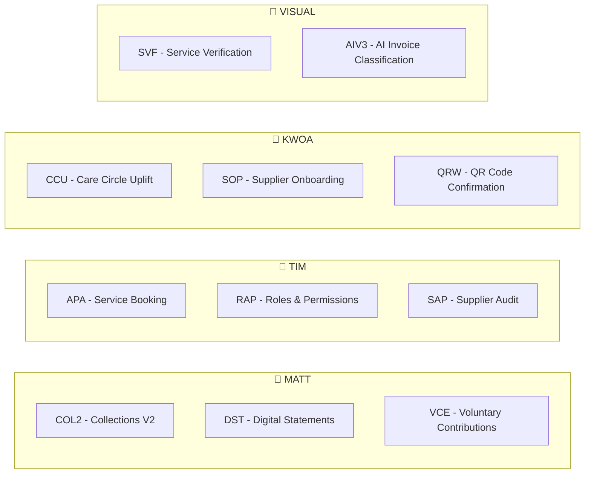

## Prioritization Board

```mermaid
flowchart TB
    subgraph P1["🔴 P1 - Priority 1"]
        direction TB

        subgraph P1_BudgetsFinance["💰 Budgets & Finance"]
            IRC["IRC<br/>Invoice Reclassification"]
            OHB["OHB<br/>On Hold Bills"]
            DST["DST<br/>Digital Statements"]
            DTX["DTX<br/>Digital Transactions"]
            BUR["BUR<br/>Budget Reloaded"]
        end

        subgraph P1_SupplierMgmt["🏪 Supplier Management"]
            IV2["IV2<br/>Invoices V2"]
        end

        subgraph P1_Clinical["🏥 Clinical & Care Plan"]
            CCU["CCU<br/>Care Circle Uplift"]
            DOC["DOC<br/>Documents"]
        end

        subgraph P1_WorkMgmt["📋 Work Management"]
            CMA["CMA<br/>CM Activities ✅"]
        end

        subgraph P1_ConsumerLifecycle["👥 Consumer Lifecycle"]
            HCA["HCA<br/>Home Care Agreement"]
            LTH["LTH<br/>Lead to HCA"]
        end

        subgraph P1_ConsumerMobile["📱 Consumer Mobile"]
            MOB1["MOB1<br/>Mobile V1 (View Only)"]
        end
    end

    subgraph P2["🟡 P2 - Priority 2"]
        direction TB

        subgraph P2_BudgetsFinance["💰 Budgets & Finance"]
            COL2["COL2<br/>Collections V2"]
            VCE["VCE<br/>Voluntary Contributions"]
            PBS["PBS<br/>Portal Bill Submission"]
        end

        subgraph P2_SupplierMgmt["🏪 Supplier Management"]
            SOP["SOP<br/>Supplier Onboarding"]
            AIV3["AIV3<br/>AI Invoice V3"]
        end

        subgraph P2_Clinical["🏥 Clinical & Care Plan"]
            ASS1["ASS1<br/>Assessment Prescriptions"]
            SDOC["SDOC<br/>Supplier Docs AI"]
        end

        subgraph P2_ConsumerLifecycle["👥 Consumer Lifecycle"]
            RCU["RCU<br/>Recipient Uplift"]
            MPS["MPS<br/>Multi-Package Support"]
        end
    end

    subgraph NTH["🟢 P3 - Nice To Have"]
        direction TB

        subgraph NTH_Clinical["🏥 Clinical & Care Plan"]
            ASS2["ASS2<br/>Inclusion Integration"]
            RNC2["RNC2<br/>Future State Care Planning"]
        end

        subgraph NTH_ConsumerLifecycle["👥 Consumer Lifecycle"]
            LES["LES<br/>Lead Essential"]
            LDS["LDS<br/>Lead Desirable"]
        end

        subgraph NTH_SupplierMgmt["🏪 Supplier Management"]
            HMF["HMF<br/>Home Modifications Flow"]
            CVI["CVI<br/>CV Integration"]
            EXP["EXP<br/>Express Pay"]
            PRI["PRI<br/>Supplier Pricing"]
        end

        subgraph NTH_Infrastructure["⚙️ Infrastructure"]
            RAP["RAP<br/>Roles & Permissions"]
        end
    end

    style P1 fill:#ffcccc,stroke:#cc0000
    style P2 fill:#fff3cd,stroke:#cc9900
    style NTH fill:#d4edda,stroke:#28a745
```

---

## Feb 2 Priority Update

Based on roadmap sync meeting (Feb 2, 2026), the following clarifications and changes were made:

### Key Clarifications

| Item | Clarification |
|------|---------------|
| **Digital Statements ≠ Digital Transactions** | DST = PDF exports mailed/emailed. DTX = Real-time transaction logs in portal. Two separate initiatives. |
| **Invoice Reclassification (IRC)** | AI classification at entry (~50% confidence currently). Bruce on modal design, KWA on IT/budget alignment. |
| **Home Mods (HMF)** | Deprioritized to P3. Low volume, full requirements review underway. |
| **CM Activities** | Shipped ✅ (Beth) |

### Priority Moves

| Initiative | From | To | Reason |
|------------|------|-----|--------|
| HCA | NTH | P1 | Core consumer journey, 19 stories ready |
| Lead-to-HCA | NTH | P1 | Prerequisite for HCA, full pipeline needed |
| Mobile V1 | Planning | P1 | View-only screens first (home, profile, Care Circle) |
| Home Mods | P2 | P3 | Low volume, not blocking |
| Collections V2 | P1 | P2 | Easy Collect workaround exists |
| VCE | P1 | P2 | Needs business alignment meeting first |

### Action Items (Feb 2)

- [ ] Tim + Will: HCA kick-off meeting Wednesday
- [ ] Rachel: Share VC dossier with accounts team
- [ ] Vishal: Divide mobile app into epics by end of week
- [ ] Bruce: Continue invoice classification modal + on hold bills flow
- [ ] Will: Video walkthrough of spec-to-dev workflow

---

## Pod Leader Assignments

---

## BRP Meeting Summary (30 Jan 2026)

**Duration:** ~2 hours | **Attendees:** 40 participants | **Location:** Room 302 + Remote

### Portal Mission & Stakeholders

The portal serves as an all-in-one platform for care management activities:
- **350+ staff** — Power users who need complex tooling
- **250+ coordinators** — Daily users (not power users), expected to shift to mobile
- **314,000+ recipients** — Simple, accessible, mobile-first experience needed
- **15,000+ service providers** (with ~30,000 workers)

> "Internal staff are power users requiring complex tooling, while recipients need a simple, mobile-first experience."

### Industry Context

- **1.4 million** people in aged care receiving services
- **380,000** in Support at Home sector
- **1,300 new clients onboarded per month** — major commercial growth driver
- **Utilization rate** has huge commercial impact — coordinators earn 20% of package amounts

### Previous BRP (August 2025) Outcomes

✅ **Released:**
- Budget V2
- Supplier onboarding and contracting (60% of suppliers now contracted with rates in portal)
- Funding stream matching
- Lightweight utilization tracking
- Collections V1 (viewing AR invoices)
- Needs/risks updates

❌ **Deferred:**
- Client contracting (HCA in portal)
- Service confirmation
- Package onboarding

### Development Investment & Cost Discipline

- **$3M+ investment** in dev team this year (not including data team)
- **~$30k per sprint per squad** (4 squads active)
- Goal: Spend development dollars to reduce future operational costs
- **50 people in Philippines** processing ~100 bills/day — AI can improve efficiency

> "Everybody in the room, including engineers, needs to think about cost benefit with everything you do."

### Four Squad Domain Ownership

| Squad Lead | Domain | Focus Areas |
|------------|--------|-------------|
| **Tim M** | Consumer Journey | HCA, Lead-to-Agreement conversion, Assessment booking, Care planning |
| **Matt A** | Budgets & Services | Budget Reloaded, Collections, Care Management Activities, then Work Management |
| **Khoa D** | Supplier Management & Invoicing | Supplier portal, QR code confirmation, Invoice processing, On-hold bills |
| **Vishal A** | Consumer Mobile | Mobile V1/V2, Moonmart marketplace (6+ months out) |

### This Quarter's Must-Haves

1. **Digital Statements** — Must go live within 1-2 weeks of second claims lodgement
2. **On-Hold Bills & Classifications** — "90% of care team looking forward to this" — stop the ping-pong of on-hold reasons
3. **Mobile V1** — Recipients can view care circle, contacts, and potentially sign HCA
4. **Faster Budgeting** — 3,000+ budgets iterated since mass migration
5. **Contact Data Quality** — Prerequisite for all comms (emails, CMA, care plans)

### Nice-to-Haves

- Package onboarding (separate dirty data from Zoho)
- QR code service confirmation (SAH compliance requirement)
- Document library uplift
- Assistive tech features
- Composable workday tracking

### Key Discussions by Domain

#### Budgets & Finance
- **Budget Reloaded (BUR)** — Already in post-design, going to dev
- **Collections V1** — Shows AR invoices, done
- **Collections V2** — Direct debit via Easy Collect/Nav Connect, aging receivables with "pay" button
- **Digital Statements** — Paper version is "bloody beautiful", digital version needs to match
- **VCE** — Voluntary contributions solution in place but needs work

#### Clinical & Care Plan
- **Assessment Prescriptions (ASS1)** — OT reports need AI to read and map to categories, risks, prescribed items, TF5 values. Currently 26+ documents manually attached per claim, growing monthly
- **ASS2 (Inclusions)** — Still in discovery, cross-department session held
- **Future State Care Planning** — Assessments link to needs, risks, with source citations
- **Care Circle Uplift (CCU)** — Critical prerequisite for HCA and mobile. Contact data issues blocking many features

#### Consumer Lifecycle
- **Home Care Agreement (HCA)** — De-scoped from last quarter, now priority. In-portal agreement with signatures
- **Lead-to-HCA conversion** — Multi-step form with referral code, screening tool
- **Lead Essentials** — CRM functionality, happy to stay in Zoho for now
- **Package Architecture** — New IA for profile (Care Circle, Agreements, Fees), Care Plan (Needs, Risks, Services), Billing, Timeline

#### Supplier Management
- **Supplier Onboarding** — 60% contracted, goal is 100% with rates
- **Service Bookings (APA)** — Connect supplier to budget, TPC agreement
- **Home Modifications Flow (HMF)** — Complex compliance wrapper with tripartite agreements, progress claims, 12-month funding validity extensions. "Big ticket items" that need funding quarantined
- **QR Code Confirmation** — Low priority until mobile V2, requires discovery
- **Express Pay** — Future monetization — instant payment for small fee (e.g., $100 → $97 now)
- **Supplier Pricing (PRI)** — 100% pricing accuracy by end of March, annual verification, max 10% change without approval, 3% inflation cap

#### Work Management
- **Care Management Activities (CMA)** — Regulatory requirement: 15 min direct care activity per client per month. Currently tracking via 5-click Outlook extension — "not good at all". Claiming $4-5M/month in care management, need to justify it
- **Notes Uplift** — Some notes areas underdone
- **Calls/Telephony** — Phone bridge could enable summaries and linking to portal objects

#### Infrastructure
- **Roles & Permissions (RAP)** — Currently 38 roles, need to simplify by hierarchy. Pod leaders can't see their teams. May need to mirror in Zoho CRM
- **Service Australia APIs** — Still need to push invoices and claims through APIs

### Prioritization Decisions Made

The team prioritized **CMA ahead of Collections V2** because:
- Easy Collect is a working solution for collections
- CMA has no good workaround
- CMA is blocked by Care Circle/contact data fixes

**AI Invoice Classification** ranked high because:
- Philippines team enters every bill with no information
- Target 95% accuracy
- Reduces on-hold bills
- Same logic applies to budgets (natural language category search)

**QR Code Confirmation** deprioritized:
- Requires mobile V2
- Needs significant discovery
- Backend work only for now

### Tools & Process Changes

- **Jira → Linear migration** — Cleaner initiative/project/milestone tracking
- **Idea Briefs** — One-page documents with problem, benefit, solution, RACI, estimates
- **Spec-driven development** — Required for complex features
- **AI-assisted development** — Business stakeholders can push small bug fixes via Claude/Codex
- **Fireflies** — Meeting transcription for BA work
- **Cowork** — Claude desktop app (Mac only)

### Estimates (AI-generated, velocity unknown)

| Size | Duration |
|------|----------|
| Large (Yellow) | 4-8 weeks |
| Medium | ~1 month |
| Small | ~2 weeks |

> "We have such a new dev team, new faces. We have no idea what velocity is."

### Key Quotes

On care management activities:
> "We're claiming four to five million dollars worth of care management each month and need to be able to justify that. If we were a business with billings that were $5 million worth of random bills that we couldn't explain or show anyone what that was actually for, we'd be in fair bit of trouble."

On supplier monetization:
> "Rather than wait a week to get paid, if you wanted to get paid as soon as you finish mowing the lawn or providing the nursing or the physio, you can, but you have to lose a small percentage of your bill."

On home modifications:
> "Home mods can take such a long time, up to two years. We don't want the client to be chipping away and offshore to be processing unplanned services that's driving down that ATHM funding stream."

---

## Q1 2026 Planning

**Meeting Date:** January 2026
**Planning Period:** Sprint 27 (6th Jan) - Sprint 38 (22nd Jun 2026)
**Focus:** Post-SAH stabilisation, feature enhancements, and operational improvements

---

## Overview

This Big Room Planning session focuses on the first half of 2026, following the successful Support at Home (SAH) program launch in November 2025. The roadmap prioritises operational stability, feature refinements based on real-world usage, and new capability development.

---

## Sprint Timeline

| Sprint | Dates | Key Focus Areas |
|--------|-------|-----------------|
| Sprint 27 | 6th Jan | Post-launch stabilisation, Collections V2 |
| Sprint 28 | 20th Jan | Budget refinements, Invoice improvements |
| Sprint 29 | 3rd Feb | Client experience enhancements |
| Sprint 30 | 17th Feb | Supplier portal improvements |
| Sprint 31 | 3rd Mar | Reporting & analytics |
| Sprint 32 | 17th Mar | Mobile experience |
| Sprint 33 | 31st Mar | Q1 review & Q2 planning |
| Sprint 34 | 14th Apr | TBD |
| Sprint 35 | 28th Apr | TBD |
| Sprint 36 | 12th May | TBD |
| Sprint 37 | 26th May | TBD |
| Sprint 38 | 9th Jun | Q2 review |

---

## Priority Themes for Q1-Q2 2026

### Theme 1: Operational Excellence
- Stabilise SAH billing and claims processes
- Optimise Collections V2 workflows
- Enhance monitoring and alerting

### Theme 2: Client Experience
- Mobile app improvements
- Self-service capabilities expansion
- Communication preferences

### Theme 3: Supplier Ecosystem
- Supplier portal enhancements
- Automated onboarding improvements
- Contract management

### Theme 4: Data & Insights
- Enhanced reporting dashboards
- Care plan analytics
- Budget utilisation insights

---

## Feature Backlog

### Collections V2 Enhancements
**Sprint:** 27-28
**Purpose:** Advanced collections functionality based on November-December learnings
**Details:**
- Payment plan automation
- Enhanced dunning sequences
- Direct debit improvements
- Debt recovery workflows

### Budget Analytics Dashboard
**Sprint:** 29-30
**Purpose:** Better visibility into budget utilisation across all clients
**Details:**
- Real-time utilisation tracking
- Trend analysis
- Predictive alerts for under/over utilisation
- Care partner workload balancing

### Mobile Experience V2
**Sprint:** 31-32
**Purpose:** Enhanced mobile experience for clients and care partners
**Details:**
- Native app improvements
- Offline capability for key features
- Push notification preferences
- Quick actions from home screen

### Supplier Portal V2
**Sprint:** 33-34
**Purpose:** Self-service capabilities for suppliers
**Details:**
- Invoice submission portal
- Contract status visibility
- Service category management
- Communication hub

### AI Care Plan V2
**Sprint:** 35-36
**Purpose:** Enhanced AI-assisted care planning
**Details:**
- Improved draft generation
- Goal tracking automation
- Risk assessment integration
- Care team recommendations

---

## Key Metrics to Track

| Metric | Target | Current |
|--------|--------|---------|
| Budget utilisation rate | 90-100% | TBD |
| Claims processing time | <48 hours | TBD |
| Client satisfaction score | >4.5/5 | TBD |
| Supplier onboarding time | <2 days | TBD |
| Collections success rate | >95% | TBD |

---

## Dependencies & Risks

### Dependencies
1. **SAH stabilisation** - Must be stable before major new features
2. **API performance** - Government API must handle increased load
3. **Data quality** - Clean data required for analytics features

### Risks
1. **Post-launch issues** - May need to prioritise bug fixes over new features
2. **Resource allocation** - Balance between support and development
3. **Policy changes** - Government may introduce new requirements

---

## Team Focus Areas

| Team | Q1 Focus | Q2 Focus |
|------|----------|----------|
| **Product** | Collections V2, Client UX | Supplier Portal, Analytics |
| **Engineering** | Stabilisation, Performance | New features, Mobile |
| **Data** | Reporting, Migrations | Insights, ML pipeline |
| **Operations** | Training, Support | Process optimisation |

---

## Success Criteria for H1 2026

- [ ] Collections V2 fully operational
- [ ] Budget utilisation >90% across client base
- [ ] Mobile experience improvements shipped
- [ ] Supplier portal self-service live
- [ ] AI care plan enhancements in production
- [ ] All SAH compliance requirements met
- [ ] Client satisfaction maintained or improved

---

## Action Items

| Action | Owner | Due Date |
|--------|-------|----------|
| Finalise Q1 roadmap | Product | Week 1 |
| Collections V2 kickoff | Engineering | Sprint 27 |
| Post-launch retrospective | All teams | Week 2 |
| Q1 OKRs finalised | Leadership | Week 2 |

---

*This BRP document will be updated as planning progresses. All dates and priorities subject to adjustment based on SAH program performance and operational needs.*
