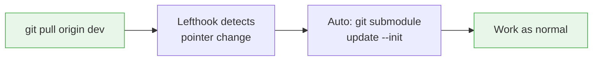
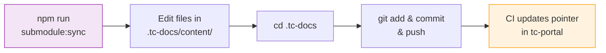
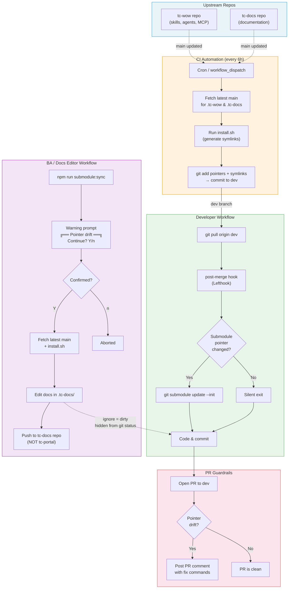

## Workflow: Developer (tc-portal)

Developers don't manage submodules at all. Everything is automatic.



1. `git pull origin dev` — CI has already committed fresh pointers
2. Lefthook post-merge hook fires automatically
3. If pointers changed, submodules update silently
4. You're on the latest version — keep coding

::callout{type="info"}
**On a feature branch?** Switch to `dev`, run `git pull`, then rebase your feature branch: `git rebase dev`. This picks up the latest submodule pointers without manual sync.
::

::callout{type="warning"}
**Prerequisite**: Make sure you've run `npm install` at least once — this installs the Lefthook dependency and injects the git hooks automatically. No need to manually run `submodule:sync`.
::

### Need updates before the next 6-hour sync?

If you've just pushed a new skill or change to tc-wow (or tc-docs) and need it immediately:

1. Go to **tc-portal → Actions → "Sync submodule pointers"** and click **Run workflow**
2. Once it finishes, run `git pull` — Lefthook will auto-update your submodules

**If you accidentally get pointer drift in a PR**, the CI guardrail will post a comment with fix commands:

```bash
git checkout origin/dev -- .tc-docs .tc-wow
git commit -m "fix: reset submodule pointers"
```

---

## Workflow: Docs Editor / BA

Docs editors work directly in the `.tc-docs/` submodule and push to the tc-docs repo.



1. **Get latest submodules**: `npm run submodule:sync` syncs both tc-docs and tc-wow to latest `main`. If you only need one, use `submodule:sync:docs` or `submodule:sync:wow` instead
2. **Edit content**: Modify files in `.tc-docs/content/`
3. **Preview locally**: `npm run docs:dev` (from tc-portal root)
4. **Push changes**: Ask Claude Code to commit and push changes, or do it manually:

```bash
cd .tc-docs
git add .
git commit -m "docs: your change description"
git push
```

5. **Do NOT commit the pointer change in tc-portal** — the CI sync workflow will pick it up within 6 hours (or trigger it manually from GitHub Actions)

::callout{type="warning"}
Your edits inside `.tc-docs/` are hidden from tc-portal's `git status` thanks to `ignore = dirty`. This means you won't accidentally include submodule file changes in a tc-portal commit.
::

---

## Architecture Overview

The submodule system solves a core tension: **BAs need tc-docs as a submodule for in-place editing**, while **developers only need tc-wow and find submodule management noisy**. The automation handles the full lifecycle so neither group has to think about pointers.



---

## How Each Piece Works

### 1. CI Sync Workflow (`.github/workflows/ci-submodule-sync.yml`)

A cron job runs every 6 hours (and on manual dispatch) to:

1. Fetch the latest `main` SHA for `.tc-wow` and `.tc-docs`
2. Run `install.sh` to regenerate skill/agent symlinks
3. Commit both pointer changes and symlinks to `dev` — only if pointers are actually stale

This means `dev` always has fresh submodule pointers. No developer action needed.

### 2. Lefthook Post-Merge Hook (`.hooks/post-merge`)

After every `git pull`, the hook:

1. Compares the submodule tree before and after the merge using `git ls-tree`
2. If any submodule pointer changed → runs `git submodule update --init`
3. If nothing changed → exits silently (no noise)

Installed automatically via `npm install` (Lefthook's postinstall script). Skipped in CI where `CI=true`.

### 3. `.gitmodules` — `ignore = dirty`

The `ignore = dirty` setting hides submodule **internal file changes** from `git status`. This means:

- BAs can edit files inside `.tc-docs/` without seeing noise in tc-portal's working tree
- Pointer (SHA) changes are still tracked — only file-level modifications are hidden
- This is critical for the docs editing workflow

### 4. Warning Prompt (`.hooks/warn-submodule-sync.sh`)

All `submodule:sync` commands show an interactive confirmation:


### 5. PR Guardrails (`.github/workflows/ci-coverage.yml`)

When a PR targets `dev`, a job checks for submodule pointer drift:

1. Compares PR submodule pointers against `dev` using `git ls-tree`
2. If drift detected → posts a PR comment with a table showing which submodules drifted and copy-paste fix commands
3. Updates the existing comment on re-run (no duplicates)
4. Currently non-blocking (`continue-on-error: true`)

---

## Available Scripts

| Script                        | Purpose                                          | Audience |
| ----------------------------- | ------------------------------------------------ | -------- |
| `npm run submodule:update`    | Checkout submodules to **recorded SHA** (safe)   | Everyone |
| `npm run submodule:sync`      | Sync all submodules to **latest main** (warning) | BAs      |
| `npm run submodule:sync:wow`  | Sync tc-wow only + install.sh (warning)          | BAs      |
| `npm run submodule:sync:docs` | Sync tc-docs only + npm install (warning)        | BAs      |

---

## Related

- [Local Docs & Tools](/ways-of-working/claude-code/environment-setup/01-local-docs) — Initial setup and Quick Start
- [Ready to Go](/ways-of-working/claude-code/environment-setup/00-ready-to-go) — IDE setup
