Quality gates are checkpoints between workflow phases. Each gate validates that the previous phase's artifact meets quality standards before proceeding. Every gate transitions the Linear epic to the next status.

---

## The Journey

```mermaid
flowchart LR
    I[Idea] --> G0(("0"))
    G0 --> S>spec.md]
    S --> G1(("1"))
    G1 --> D>design.md]
    D --> G2(("2"))
    G2 --> P>plan.md]
    P --> G3(("3"))
    G3 --> C[Code]
    C --> G4(("4"))
    G4 --> QA[QA Testing]
    QA --> G5(("5"))
    G5 --> R>release-notes.md]
    R --> G6(("6"))
    G6 --> PR[Production]

    click G0 "#gate-0-idea" "Idea Gate"
    click G1 "#gate-1-spec" "Spec Gate"
    click G2 "#gate-2-design" "Design Gate"
    click G3 "#gate-3-architecture" "Architecture Gate"
    click G4 "#gate-4-code-quality" "Code Quality Gate"
    click G5 "#gate-5-qa" "QA Gate"
    click G6 "#gate-6-release" "Release Gate"

    style G0 fill:#D5F1F0,stroke:#007F7E
    style G1 fill:#D5F1F0,stroke:#007F7E
    style G2 fill:#D5F1F0,stroke:#007F7E
    style G3 fill:#D5F1F0,stroke:#007F7E
    style G4 fill:#D5F1F0,stroke:#007F7E
    style G5 fill:#D5F1F0,stroke:#007F7E
    style G6 fill:#D5F1F0,stroke:#007F7E
```



| # | Gate | Validates | Skill | Linear Transition |
|---|------|-----------|-------|-------------------|
| 0 | **Idea** | Problem clarity, HOD sign-off, brevity | `/trilogy-idea-handover` | Create epic → **Planned** |
| 1 | **Spec** | Spec quality & business alignment | `/trilogy-spec-handover` | *(stays in Planned)* |
| — | **Design Kickoff** | Ready to start design? | `/trilogy-design-kickoff` | Planned → **Design** |
| 2 | **Design** | Design completeness & feasibility | `/trilogy-design-handover` | Design → **Dev** |
| 3 | **Architecture** | Technical plan is sound | `/speckit-plan` | *(stays in Dev)* |
| 4 | **Code Quality** | Tests pass, AC implemented, PR ready | `/trilogy-dev-handover` | Dev → **QA** |
| 5 | **QA** | Functional, cross-browser, accessibility | `/trilogy-qa-handover` | QA → **Release** |
| 6 | **Release** | Product + business stakeholder approval | `/trilogy-ship` | Release → **Completed** |

---

## Gate 0: Idea

**Question**: "Is this idea clear enough to invest in?"

**Linear**: Create epic → **Planned** | **meta.yaml**: `planned`

Validates the idea brief has a clear problem statement, HOD acknowledgement, and fits within 1-2 pages. The RACI must identify an Accountable person at HOD/executive level.

### Problem Statement Clarity

| What's Checked | Why |
|----------------|-----|
| Problem articulated without solution | Focus on the pain, not the fix |
| Specific affected users identified | Who suffers from this? |
| Current workaround described | How are they coping today? |
| Business impact stated | Why should we invest? |
| Single sentence summary possible | If you can't say it simply, it's not clear |

### Brief Quality

| What's Checked | Why |
|----------------|-----|
| 1-2 pages maximum | Brevity forces clarity |
| No technical jargon | Business stakeholders must understand it |
| No implementation details | That's for later phases |
| Problem/solution ratio favours problem | Understand before solving |

### RACI & HOD Acknowledgement

| What's Checked | Why |
|----------------|-----|
| RACI table complete | Clear ownership |
| HOD is Accountable (A) | Executive sponsorship |
| HOD has acknowledged the brief | Not just listed — engaged |

**Owner**: Product Owner

**Skill**: `/trilogy-idea-handover`

**Failed?** Sharpen the problem statement. Get HOD alignment. Cut the brief down.

---

## Gate 1: Spec

**Question**: "Is this spec ready for design?"

**Linear**: *(stays in Planned)* | **meta.yaml**: `planned`

Validates the specification follows product best practices and is ready for design.

### Product Best Practices

| What's Checked | Why |
|----------------|-----|
| Problem statement clear | Specific pain point identified |
| User personas defined | Who are we building for? |
| Jobs-to-be-done articulated | What are users trying to accomplish? |
| Success metrics defined | How will we measure success? |
| Constraints documented | What limits our options? |
| Assumptions explicit | What are we taking for granted? |

### Content Quality

| What's Checked | Why |
|----------------|-----|
| No implementation details | Stories focus on outcomes, not solutions |
| Business language throughout | Avoid technical jargon |
| User value clearly stated | Each story explains "why" |
| Measurable success criteria | Specific, testable targets |

### Requirement Completeness

| What's Checked | Why |
|----------------|-----|
| All requirements testable | Given/When/Then format |
| Edge cases documented | What could go wrong? |
| Dependencies listed | What blocks us? |
| Out of scope defined | What are we NOT building? |

### Mobile (Consumer Mobile Epics)

| What's Checked | Why |
|----------------|-----|
| API endpoints listed per story | Mobile consumes APIs — every screen needs defined endpoints |
| Offline behaviour specified per feature | What works without network? What shows a placeholder? |
| Push notification triggers defined | Which events send notifications? What's the payload? |
| Deep link URLs mapped to screens | Which links open the app and where do they land? |
| Platform differences called out | Any iOS-only or Android-only behaviour? |
| Accessibility requirements for elderly users | Large text, high contrast, simple navigation, VoiceOver/TalkBack |

### INVEST Criteria (per story)

| Criteria | Question |
|----------|----------|
| **I**ndependent | Can this be delivered standalone? |
| **N**egotiable | Are details flexible? |
| **V**aluable | Is user/business value clear? |
| **E**stimable | Is scope well-defined? |
| **S**mall | Is this a single user flow? |
| **T**estable | Are acceptance scenarios defined? |

**Owner**: PM / Product

**Skill**: `/trilogy-spec-handover`

**Failed?** Refine the spec. Add missing sections. Clarify requirements.

---

## Gate 2: Design

**Question**: "Is the design complete and ready to hand off to Dev?"

**Linear**: Design → **Dev** | **meta.yaml**: `in progress`

Validates that the design matches what users expect before planning implementation.

| What's Checked | Why |
|----------------|-----|
| UI mockups exist | Show, don't tell |
| User flows documented | Walk through the experience |
| Component decisions made | Reusing or creating? |
| Responsive approach defined | What about mobile? |
| Accessibility considered | Can everyone use this? |
| Edge cases visualized | Error states, empty states, loading |
| Stakeholder sign-off | Has anyone approved this? |

### Mobile (Consumer Mobile Epics)

| What's Checked | Why |
|----------------|-----|
| Native mobile mockups provided (not just responsive web) | Mobile is a different form factor, not a shrunk website |
| Tab navigation and gesture flows documented | Mobile relies on tabs, swipes, pull-to-refresh — not sidebar/breadcrumb |
| Offline/degraded state designs exist | Mobile users lose signal — what do they see? |
| Push notification UI designed | What do alerts look like in-app and on lock screen? |
| Platform differences noted (iOS vs Android) | Gesture patterns, back navigation, safe areas differ |
| Touch target sizes ≥ 44pt | Elderly users need large, easy-to-tap targets |
| Accessibility: VoiceOver/TalkBack flows tested | Screen reader experience on native differs from web |

**Owner**: Designer / Product

**Skill**: `/trilogy-design-handover`

**Failed?** Rework the design. Run `/trilogy-mockup` to explore alternatives.

---

## Gate 3: Architecture

**Question**: "Will the structure hold?"

**Linear**: *(stays in Dev)* | **meta.yaml**: *(no change)*

Validates that the technical plan is sound before writing code.

| What's Checked | Why |
|----------------|-----|
| Architecture approach clear | How will you actually build this? |
| Existing patterns leveraged | Why reinvent what already works? |
| No impossible requirements | Is this technically feasible? |
| Data model understood | Where does the data live? |
| Integration points mapped | What else does this touch? |
| Risk areas noted | What could go wrong? |

### Mobile (Consumer Mobile Epics)

| What's Checked | Why |
|----------------|-----|
| API contract defined (`/api/v1/recipient/...`) | Mobile consumes Laravel APIs — endpoints must be versioned and documented |
| API wraps existing domain actions (no mobile-specific business logic) | Single source of truth — portal and mobile share the same logic |
| Authentication flow mapped (Sanctum token + Expo SecureStore) | Token lifecycle: issue, persist, refresh, revoke |
| Offline strategy defined | What's cached locally? What requires network? Graceful degradation plan |
| Push notification architecture (FCM/APNS) | Token registration, refresh handling, payload format |
| Deep link routing mapped | Which URLs open which screens? Universal links vs app scheme |
| App update/versioning strategy | API version mismatch handling, forced update thresholds |
| Expo/EAS build pipeline understood | OTA updates vs native builds, environment configs (dev/staging/prod) |
| Third-party SDK compatibility confirmed | Intercom, Google Places, signature canvas — all verified on React Native |

**Owner**: Architect / Developer

**Skill**: `/speckit-plan`

**Failed?** The technical plan needs rethinking, or the design has impossible requirements.

---

## Gate 4: Code Quality

**Question**: "Is it ready to inspect?"

**Linear**: Dev → **QA** | **meta.yaml**: *(updated)*

Validates that code quality is sufficient before QA testing. Creates PR with structured QA notes.

### Automated Checks

| What's Checked | How | Pass Criteria |
|----------------|-----|---------------|
| Tests pass | `php artisan test --compact` | All green |
| Coverage >80% | `php artisan test --coverage --min=80` | New code covered |
| Linting clean | `vendor/bin/pint --test` | No violations |
| Static analysis | `vendor/bin/phpstan analyse` | No errors |
| No console errors | Browser DevTools | Clean console |

### Acceptance Criteria

| What's Checked | Why |
|----------------|-----|
| All AC from spec.md implemented | Did you build what was asked? |
| Edge cases handled | Error states, empty states work |
| Design followed | UI matches specification |

### Best Practices

| What's Checked | Why |
|----------------|-----|
| Laravel conventions followed | No magic numbers, proper validation, policies |
| Vue TypeScript standards met | `lang="ts"`, no `any`, explicit return types |
| Dev notes for QA | Help the next person |

### Mobile (Consumer Mobile Epics)

| What's Checked | How | Pass Criteria |
|----------------|-----|---------------|
| TypeScript strict mode | `tsconfig.json` strict: true | No `any` types, no `@ts-ignore` |
| Expo lint clean | `npx expo lint` | No violations |
| Jest/Testing Library tests pass | `npx jest --ci` | All green, coverage on new code |
| No direct API URL hardcoding | Grep for `http://` or `https://` in app code | All URLs from environment config |
| Sanctum token handled correctly | Code review | Token stored in SecureStore, refresh on 401, cleared on logout |
| Pull-to-refresh works on list screens | Manual check | Loading indicator, data refreshes, no duplicate fetches |
| Platform-specific code isolated | Check `Platform.OS` usage | Platform switches in dedicated files, not scattered |
| No console.log in production code | Grep | Clean — use structured logging or remove |

**Owner**: Developer

**Skills**:
- `/trilogy-dev-pr` — Lint, format, simplify, type-check, test, run `/trilogy-dev-review`, and create PR targeting `dev`
- `/trilogy-dev-handover` — Full Gate 4 validation with Linear transition (Dev → QA)

**Failed?** Fix the failing tests. Clean up the code. Write proper handover notes.

---

## Gate 5: QA

**Question**: "Does it actually work?"

**Linear**: QA → **Release** | **meta.yaml**: `release`

Validates that the feature functions correctly before stakeholder review.

| What's Checked | Why |
|----------------|-----|
| Feature works as described | Does it do what the spec says? |
| UI matches design | Does it look right? |
| Cross-browser tested | Chrome, Safari, Firefox (desktop + mobile) |
| Responsive tested | Desktop (1920), Tablet (768), Mobile (375) |
| Accessibility passed | WCAG 2.1 AA |
| No Sev 1-3 bugs | Are there showstoppers? |
| Performance acceptable | Is it fast enough? |
| Test report complete | Show the evidence |

### Mobile (Consumer Mobile Epics)

| What's Checked | Why |
|----------------|-----|
| Tested on physical iOS device (iPhone) | Simulators miss gesture quirks, performance, and permissions |
| Tested on physical Android device | Android fragmentation means real-device testing is essential |
| Tested on iOS simulator (latest + iOS 16 minimum) | Coverage for older OS versions still in the wild |
| Tested on Android emulator (API 28+) | Minimum Android version for Expo |
| Pull-to-refresh works on all list screens | Core mobile UX pattern for aged care users |
| Push notifications received and route correctly | Tap notification → lands on correct screen |
| Deep links open correct screens | Universal links / app scheme tested |
| Offline mode: app doesn't crash without network | Graceful degradation, cached data still shows |
| App startup time < 3 seconds | Cold start performance on mid-range devices |
| Touch targets ≥ 44pt verified | Elderly users — no tiny tappable areas |
| Font sizes respect system accessibility settings | Dynamic Type (iOS) / font scale (Android) |
| VoiceOver (iOS) and TalkBack (Android) basic pass | Screen reader announces key elements correctly |
| No sensitive data visible in app switcher screenshot | SecureStore, not AsyncStorage for tokens |
| Keyboard doesn't obscure inputs | KeyboardAvoidingView works on all form screens |

**Output**: `test-report.md`

**Owner**: QA Tester

**Skill**: `/trilogy-qa`

**Failed?** Back to development. Fix the bugs. Update the test report.

---

## Gate 6: Release

**Question**: "May this enter the city?"

**Linear**: Release → **Completed** | **meta.yaml**: `completed`

Final approval before deployment to production.

### Product Review

| What's Checked | Why |
|----------------|-----|
| Delivers business value | Does this serve users? |
| User story and AC confirmed complete | All acceptance criteria verified |
| Documentation reviewed | Is knowledge preserved? |
| Analytics verified | Can we measure impact? |
| Product Owner approved | PO sign-off |

### Business Stakeholder Review (UAT)

| What's Checked | Why |
|----------------|-----|
| Aligns with business goals | Meets objectives and compliance |
| Content accuracy validated | Copy, links, policies correct |
| Business Stakeholder approved | Stakeholder sign-off |

### Pre-Release

| What's Checked | Why |
|----------------|-----|
| Feature flags configured | Pennant flags set for production |
| Environment variables ready | All production env vars configured |
| Rollback plan exists | Can we undo this if needed? |
| Release notes prepared | How will we announce this? |

### Mobile (Consumer Mobile Epics)

| What's Checked | Why |
|----------------|-----|
| EAS build submitted to TestFlight (iOS) | Apple review can take 24-48h — submit early |
| EAS build submitted to Google Play internal testing | Verify on real distribution channel |
| OTA update vs native build decision documented | Does this change require a store submission or can it go OTA? |
| App version bumped correctly | semver: patch for fixes, minor for features, major for breaking |
| API backwards compatibility confirmed | Older app versions still in the wild must not break |
| App Store / Play Store listing updated | Screenshots, description, what's new |
| Forced update threshold set (if applicable) | Minimum app version the API will accept |
| Crash-free rate baseline captured | Know the before so you can measure the after |

**Owner**: Product Owner + Stakeholders

**Skill**: `/trilogy-ship`

**Failed?** Address concerns. Gather missing approvals. Update release notes.

---

## Gate Owners

| # | Gate | Owner | Question | Linear Transition |
|---|------|-------|----------|-------------------|
| 0 | Idea | Product Owner | Is this clear enough to invest in? | Create → Planned |
| 1 | Spec | PM / Product | Is this spec ready for design? | *(stays in Planned)* |
| — | Design Kickoff | Designer / Product | Ready to start design? | Planned → Design |
| 2 | Design | Designer / Product | Is the design ready for Dev? | Design → Dev |
| 3 | Architecture | Architect / Developer | Will the structure hold? | *(stays in Dev)* |
| 4 | Code Quality | Developer | Is it ready to inspect? | Dev → QA |
| 5 | QA | QA Tester | Does it actually work? | QA → Release |
| 6 | Release | PO + Stakeholders | May this enter the city? | Release → Completed |

---

## Invoking Gates

Gates are invoked through handover skills:

```bash
/trilogy-idea-handover     # Gate 0: Idea → creates epic in Planned
/trilogy-spec-handover     # Gate 1: Spec → stays in Planned
/trilogy-design-kickoff    # Design Kickoff → Planned to Design
/trilogy-design-handover   # Gate 2: Design → Design to Dev
/speckit-plan              # Gate 3: Architecture (stays in Dev)
/trilogy-dev-pr            # Gate 4: Lint, test, review, create PR (→ dev)
/trilogy-dev-handover      # Gate 4: Full validation + Linear Dev to QA
/trilogy-qa-handover       # Gate 5: QA → QA to Release
/trilogy-ship              # Gate 6: Release → Release to Completed
```

---

## Skipping Gates

Features that skip gates tend to:
- Have poorly defined requirements (skipped Spec)
- Look nothing like users expected (skipped Design)
- Collapse under load (skipped Architecture)
- Break in production (skipped Code Quality)
- Frustrate users (skipped QA)
- Get rolled back (skipped Release)

### When Gates Can Be Simplified

| Scenario | Simplified Gates |
|----------|------------------|
| Bug fixes | Idea (pre-committed), Spec, Design (if no UI) |
| Hotfixes | Minimal gates, documented exception |
| Spikes/POCs | Reduced gates, marked experimental |
| Copy changes | Simplified QA |
| Backend-only | Design (no UI changes) |

Always document why a gate was simplified.

---

## Customizing Gates

Gates live in `.tc-wow/gates/` and can be customized:

```
.tc-wow/gates/
├── 00-idea.md            # Idea Gate
├── 01-spec.md            # Spec Gate
├── 02-design.md          # Design Gate
├── 03-architecture.md    # Architecture Gate
├── 04-code-quality.md    # Code Quality Gate
├── 05-qa.md              # QA Gate
└── 06-release.md         # Release Gate
```

---

## Summary

| # | Gate | Validates | Skill | Linear |
|---|------|-----------|-------|--------|
| 0 | **Idea** | Problem clarity, HOD sign-off | `/trilogy-idea-handover` | → Planned |
| 1 | **Spec** | Spec quality & business alignment | `/trilogy-spec-handover` | *(stays)* |
| — | **Design Kickoff** | Ready to start design? | `/trilogy-design-kickoff` | → Design |
| 2 | **Design** | Design completeness & feasibility | `/trilogy-design-handover` | → Dev |
| 3 | **Architecture** | Technical plan is sound | `/speckit-plan` | *(stays)* |
| 4 | **Code Quality** | Tests, coverage, AC, PR | `/trilogy-dev-handover` | → QA |
| 5 | **QA** | Functional, cross-browser, a11y | `/trilogy-qa-handover` | → Release |
| 6 | **Release** | Approvals, UAT, readiness | `/trilogy-ship` | → Completed |

**Gates validate completed work.** Each gate confirms the artifact meets quality standards and transitions Linear to the next status before proceeding.
